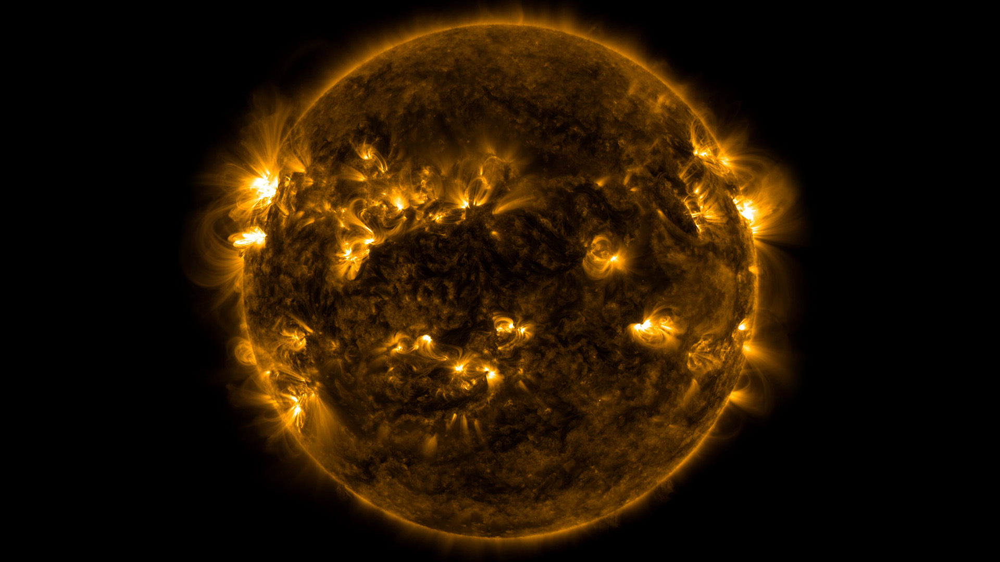
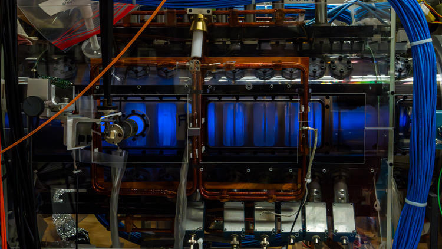

# MAC-E-спектрометр {#sec-mac-e-spectrometer}

::: {.book-lead}
MAC-E-фильтр сочетает магнитную адиабатическую коллимацию с электростатическим анализом энергии. Магнитное поле поворачивает импульс электрона почти вдоль оси прибора, а задерживающий потенциал проверяет его продольную энергию. За этим инженерным решением стоят два общих физических понятия: адиабатический инвариант и магнитное зеркало.
:::

## Что значит «поле меняется медленно»

Пусть $\mathbf R(t)$ --- положение направляющего центра, а $\mathbf b=\mathbf B/B$ --- единичный вектор вдоль поля. Длину дуги вдоль силовой линии обозначим $\ell$:

$$
\frac{d\mathbf R}{d\ell}=\mathbf b,
\qquad
\frac{\partial B}{\partial\ell}=\mathbf b\cdot\nabla B.
$$ {#eq-field-line-arc-coordinate}

За один циклотронный период частица успевает исследовать поле в двух направлениях. Поперёк силовой линии размер орбиты равен ларморовскому радиусу $\rho_L$; вдоль неё направляющий центр проходит шаг $h$:

$$
\rho_L=\frac{p_\perp}{|q|B},
\qquad
h=v_\parallel T_c,
\qquad
T_c=\frac{2\pi}{\omega_c}.
$$ {#eq-orbit-spatial-scales}

Определим масштабы неоднородности

$$
L_\perp\equiv\frac{B}{|\nabla_\perp B|},
\qquad
L_\parallel\equiv\frac{B}{|\partial B/\partial\ell|}.
$$ {#eq-magnetic-inhomogeneity-scales}

Поле меняется медленно для циклотронного движения, если

$$
\frac{\rho_L}{L_\perp}\ll1,
\qquad
\frac{h}{L_\parallel}\ll1.
$$ {#eq-spatial-adiabatic-conditions}

Буква $h$ здесь обозначает путь за один оборот, а $\ell$ --- непрерывную координату вдоль всей силовой линии. Смешивать их нельзя: первое является малым шагом, второе нумерует положение электрона на траектории.

::: {.marginnote title="Координата вдоль поля"}
$\ell$ --- длина дуги вдоль силовой линии; $h=v_\parallel T_c$ --- лишь путь,
пройденный за один циклотронный оборот.
:::

Ту же мысль можно записать во временной форме. В стационарной установке $\partial\mathbf B/\partial t=0$, однако направляющий центр движется через неоднородное поле, поэтому

$$
\frac{dB}{dt}=\dot{\mathbf R}\cdot\nabla B,
\qquad
\tau_B\equiv\frac{B}{|dB/dt|},
\qquad
T_c\ll\tau_B.
$$ {#eq-field-variation-along-trajectory}

::: {.physical-comment title="Неоднородное не означает нестационарное"}
Магнит в лаборатории может не меняться со временем, хотя электрон встречает разные значения $B$ по мере движения. Полная кинетическая энергия в таком магнитном поле сохраняется. Если же ток в магните изменяют во времени, возникает вихревое электрическое поле; оно может совершать работу над частицей, и кинетическая энергия уже не обязана быть постоянной.
:::

## Почему сохраняется действие

На одном обороте поле можно считать постоянным. Поперечное движение тогда эквивалентно гармоническому осциллятору, частота которого медленно меняется от оборота к обороту:

$$
H_\perp(Q,P;t)=\frac{P^2}{2m}+\frac{m\omega_c^2(t)Q^2}{2}=E_\perp.
$$ {#eq-slow-cyclotron-oscillator}

По уравнениям Гамильтона члены с $\dot Q$ и $\dot P$ сокращаются, и остаётся явная производная гамильтониана:

$$
\dot E_\perp=\frac{\partial H_\perp}{\partial t}=m\omega_c\dot\omega_c Q^2.
$$ {#eq-transverse-energy-rate}

За один оборот $E_\perp$ и $\omega_c$ почти постоянны. Для $Q=A\cos(\omega_ct+\varphi)$ имеем

$$
\langle Q^2\rangle=\frac{A^2}{2}=\frac{E_\perp}{m\omega_c^2}.
$$ {#eq-cyclotron-coordinate-average}

После усреднения уравнения [-@eq-transverse-energy-rate] по быстрому движению получаем

$$
\langle\dot E_\perp\rangle=\frac{E_\perp\dot\omega_c}{\omega_c},
\qquad
\left\langle\frac{d}{dt}\frac{E_\perp}{\omega_c}\right\rangle=0.
$$ {#eq-adiabatic-action-derivation}

Следовательно, с точностью до малых поправок за оборот сохраняется действие

$$
J_c=\frac{E_\perp}{\omega_c}\simeq\mathrm{const}.
$$ {#eq-cyclotron-adiabatic-action}

В нерелятивистском выводе $\omega_c=|q|B/m$. Первый адиабатический инвариант можно записать как

$$
\mu=\frac{|q|}{m}J_c=\frac{E_\perp}{B}=\frac{p_\perp^2}{2mB}\simeq\mathrm{const}.
$$ {#eq-first-adiabatic-invariant}

Для релятивистской частицы сохраняется та же комбинация $p_\perp^2/(2mB)$. При резком изменении поля, столкновении или прохождении области, где $B$ почти обращается в нуль, адиабатическое приближение может нарушиться.

### Простая механическая модель обмена энергией

Рассмотрим классическую точечную частицу в двумерном стационарном потенциале

$$
H=\frac{p_x^2+p_y^2}{2m}+\frac{m\omega^2(x)y^2}{2}.
$$ {#eq-static-trough-hamiltonian}

Координата $x$ идёт вдоль желоба, $y$ --- поперёк него. Частице сообщают начальный импульс $p_x>0$ и небольшое поперечное отклонение. Гравитация в этой модели не нужна: возвращающую силу создаёт потенциальная энергия $m\omega^2(x)y^2/2$. При меньшей $\omega(x)$ поперечный профиль шире, а при том же отклонении возвращающая сила слабее.

Если $\omega(x)$ медленно убывает, поперечное действие сохраняется и $E_y=\omega J_y$ уменьшается. Продольный импульс при этом растёт, потому что

$$
\dot p_x=-\frac{\partial H}{\partial x}=-m\omega(x)\omega'(x)y^2>0
\qquad\text{при}\qquad \omega'(x)<0.
$$ {#eq-static-trough-longitudinal-force}

Полная энергия постоянна: стационарные стенки желоба лишь перераспределяют её между двумя движениями. Это механический образ магнитной коллимации. Если же менять $\omega(t)$ внешней рукой во времени, то

$$
\frac{dH}{dt}=\frac{\partial H}{\partial t}=m\omega\dot\omega y^2,
$$ {#eq-driven-oscillator-energy-change}

и работа внешнего устройства меняет полную энергию. Эти две задачи похожи формулой для осциллятора, но физически различны.

::: {#interactive-adiabatic-trough .interactive title="Частица в медленно меняющемся желобе" embed="../../applets/adiabatic-trough.html" height="38rem" url="https://neutrinohit.github.io/neutrinophysics/introduction/ru/applets/adiabatic-trough.html" qr="../assets/chapters/06_mac_e_spectrometer/qr/adiabatic_trough.png" repo="https://github.com/NeutrinoHit/neutrinophysics/blob/main/introduction/ru/applets/adiabatic-trough.qmd" repo-label="код апплета"}
Запустите плавное изменение профиля. Апплет одновременно показывает движение
частицы, фазовую орбиту и обмен между продольной и поперечной энергиями.
:::

## Коллимация и магнитное зеркало

В стационарном магнитном поле сила Лоренца не совершает работы. Поэтому $p^2=p_\parallel^2+p_\perp^2$ постоянно, а из уравнения [-@eq-first-adiabatic-invariant] следует

$$
p_\perp(\ell)=p_{\perp,0}\sqrt{\frac{B(\ell)}{B_0}},
\qquad
\sin^2\alpha(\ell)=\sin^2\alpha_0\frac{B(\ell)}{B_0},
$$ {#eq-pitch-angle-invariant}

где $\alpha$ --- угол между импульсом и локальным полем.

- При уменьшении $B$ поперечный импульс убывает, а продольный растёт: пучок коллимируется.
- При увеличении $B$ поперечный импульс растёт за счёт продольного.
- Когда $p_\parallel$ обращается в нуль, направляющий центр останавливается и движется обратно: возникает магнитное зеркало.

Для медленного движения вдоль поля удобно записать

$$
E_\perp(\ell)=\mu B(\ell),
\qquad
E_\parallel(\ell)=E-\mu B(\ell),
$$ {#eq-guiding-center-energies}

и гамильтониан направляющего центра

$$
\mathcal H_{\mathrm{gc}}=\frac{p_\parallel^2}{2m}+\mu B(\ell)=E.
$$ {#eq-guiding-center-hamiltonian}

Таким образом, $\mu B(\ell)$ играет роль эффективной потенциальной энергии, а продольная сила равна

$$
\dot p_\parallel=-\mu\frac{\partial B}{\partial\ell}.
$$ {#eq-mirror-force}

Пусть электрон стартует в поле $B_0$ под углом $\alpha_0$. В зеркальной точке $\alpha=90^\circ$, поэтому

$$
B_{\mathrm m}=\frac{B_0}{\sin^2\alpha_0}.
$$ {#eq-mirror-field}

Если максимальное поле на пути равно $B_{\max}$, частица проходит систему при

$$
\sin^2\alpha_0<\frac{B_0}{B_{\max}},
\qquad
\alpha_{\mathrm{acc}}=\arcsin\sqrt{\frac{B_0}{B_{\max}}}.
$$ {#eq-magnetic-mirror-acceptance}

## Как устроен MAC-E-фильтр

В KATRIN три значения поля выполняют разные функции:

| Обозначение | Место | Физическая роль |
|:---|:---|:---|
| $B_{\mathrm{src}}\simeq3.6~\mathrm{Тл}$ | источник | задаёт исходную магнитную трубку |
| $B_{\mathrm A}\simeq0.30\text{--}0.35~\mathrm{мТл}$ | анализирующая плоскость | коллимирует импульс |
| $B_{\max}\simeq6.0~\mathrm{Тл}$ | максимум на пути | задаёт магнитный акцептанс |

: Три характерных магнитных поля MAC-E-спектрометра KATRIN. {#tbl-mace-fields}

Индекс $\mathrm{src}$ означает *source*, источник; индекс $\mathrm A$ --- анализирующую плоскость. Эти индексы называют место, в котором измерено поле, а не новый вид физической величины.

### Сначала магнитная коллимация

Из сохранения $p_\perp^2/B$ между источником и анализирующей плоскостью

$$
\frac{p_{\perp,\mathrm A}}{p_{\perp,\mathrm{src}}}=\sqrt{\frac{B_{\mathrm A}}{B_{\mathrm{src}}}}\simeq9\cdot10^{-3}.
$$ {#eq-katrin-collimation-factor}

Поперечный импульс уменьшается примерно в сто раз. Поскольку магнитная система стационарна, полная кинетическая энергия не меняется: освободившаяся поперечная энергия переходит в продольную.

::: {#anim-magnetic-collimation .animation title="Адиабатическая магнитная коллимация" src="../assets/chapters/04_direct_neutrino_mass/katrin_magnetic_collimation.mp4" poster="../assets/chapters/04_direct_neutrino_mass/katrin_magnetic_collimation.jpg" url="https://neutrinohit.github.io/neutrinophysics/introduction/ru/slides/assets/04_direct_neutrino_mass/katrin_magnetic_collimation.mp4" qr="../assets/chapters/04_direct_neutrino_mass/qr/magnetic_collimation.png" repo="https://github.com/NeutrinoHit/dvnanima/tree/main/mac-e-filter" repo-label="dvnanima/mac-e-filter"}
При входе в главный спектрометр $p_\perp$ уменьшается, после анализирующей плоскости снова растёт. Электрическое поле здесь отключено, чтобы было видно действие одной магнитной коллимации.
:::

### Затем электрический порог

Пусть $e=|q_e|$, а $U$ --- задерживающая разность потенциалов. При включении электростатического поля кинетическая энергия $E$ меняется, но в стационарных полях сохраняется сумма кинетической и потенциальной энергий. В нерелятивистской записи направляющего центра

$$
\mathcal E=\frac{p_\parallel^2}{2m}+\mu B(\ell)+q\Phi(\ell)=\mathrm{const}.
$$ {#eq-guiding-center-total-energy}

В анализирующей плоскости для электрона

$$
E_{\parallel,\mathrm A}\simeq E-e|U|-E_{\perp,\mathrm A}.
$$ {#eq-mace-transmission-condition}

- Если $E_{\parallel,\mathrm A}>0$, электрон проходит.
- При $E_{\parallel,\mathrm A}=0$ он находится на пороге.
- Если $E_{\parallel,\mathrm A}<0$, электрон отражается.

Магнитная часть делает $E_{\perp,\mathrm A}$ малой, поэтому электрический барьер сравнивает с $e|U|$ почти всю кинетическую энергию электрона.

::: {#anim-mac-e-filter .animation title="Электростатическая фильтрация в MAC-E-спектрометре" src="../assets/chapters/04_direct_neutrino_mass/katrin_mac_e_electric.mp4" poster="../assets/chapters/04_direct_neutrino_mass/katrin_mac_e_electric.jpg" url="https://neutrinohit.github.io/neutrinophysics/introduction/ru/slides/assets/04_direct_neutrino_mass/katrin_mac_e_electric.mp4" qr="../assets/chapters/04_direct_neutrino_mass/qr/mac_e_filter.png" repo="https://github.com/NeutrinoHit/dvnanima/tree/main/mac-e-filter" repo-label="dvnanima/mac-e-filter"}
Электроны с энергией выше задерживающего порога проходят к детектору, а остальные отражаются. Изменяя потенциал, измеряют интегральный спектр.
:::

### Откуда берётся разрешение

Рассмотрим электрон, который не был отражён максимальным полем. В источнике

$$
\frac{p_{\perp,\mathrm{src}}^2}{p^2}=\sin^2\alpha_{\mathrm{src}}\leq\frac{B_{\mathrm{src}}}{B_{\max}}.
$$ {#eq-source-mirror-acceptance}

Между источником и анализирующей плоскостью адиабатический инвариант даёт

$$
\frac{p_{\perp,\mathrm A}^2}{p_{\perp,\mathrm{src}}^2}=\frac{B_{\mathrm A}}{B_{\mathrm{src}}}.
$$ {#eq-source-analyzing-adiabatic-ratio}

Теперь вставим промежуточную величину $p_{\perp,\mathrm{src}}^2$ и перемножим два отношения:

$$
\begin{aligned}
\frac{p_{\perp,\mathrm A}^2}{p^2}
&=\frac{p_{\perp,\mathrm A}^2}{p_{\perp,\mathrm{src}}^2}
\frac{p_{\perp,\mathrm{src}}^2}{p^2}\\
&\leq\frac{B_{\mathrm A}}{B_{\mathrm{src}}}
\frac{B_{\mathrm{src}}}{B_{\max}}
=\frac{B_{\mathrm A}}{B_{\max}}.
\end{aligned}
$$ {#eq-analyzing-plane-transverse-bound}

В левой части $p_{\perp,\mathrm{src}}^2$ один раз стоит в знаменателе, другой раз --- в числителе. Поэтому оно сокращается. Справа тем же способом сокращается $B_{\mathrm{src}}$. Поле источника определяет, какие начальные углы будут приняты, но после отбора ширину идеального порога задаёт отношение $B_{\mathrm A}/B_{\max}$.

Максимальная поперечная энергия в анализирующей плоскости равна

$$
E_{\perp,\mathrm A}^{\max}\simeq\frac{(p_{\perp,\mathrm A}^{\max})^2}{2m_e}=\frac{p^2}{2m_e}\frac{B_{\mathrm A}}{B_{\max}}.
$$ {#eq-mace-maximum-transverse-energy}

Здесь $E$ по-прежнему обозначает кинетическую энергию электрона, как в предыдущих главах. Из релятивистской связи энергии и импульса

$$
E=\sqrt{p^2c^2+m_e^2c^4}-m_ec^2,
\qquad
\frac{p^2}{2m_e}=E\left(1+\frac{E}{2m_ec^2}\right)=E\frac{\gamma+1}{2}
$$ {#eq-relativistic-momentum-correction}

получаем ширину идеального края пропускания

$$
\boxed{\Delta E=E\frac{B_{\mathrm A}}{B_{\max}}\frac{\gamma+1}{2}}.
$$ {#eq-mace-resolution}

Для $E=18.6~\mathrm{кэВ}$, $\gamma\simeq1.036$ и $B_{\mathrm A}/B_{\max}\simeq5.0\cdot10^{-5}$ получается $\Delta E\simeq0.95~\mathrm{эВ}$.

### Почему спектрометр такой большой

Электроны занимают не одну силовую линию, а магнитную трубку конечного потока. При медленном изменении поля её поток приблизительно сохраняется:

$$
\Phi_{\mathrm{tube}}=B\mathcal A\simeq\mathrm{const},
\qquad
d=2\sqrt{\frac{\Phi_{\mathrm{tube}}}{\pi B}}\propto B^{-1/2}.
$$ {#eq-flux-tube-expansion}

Малое $B_{\mathrm A}$ необходимо для хорошего разрешения, но при этом площадь трубки растёт как $1/B_{\mathrm A}$. Для потока KATRIN около $191~\mathrm{Тл\,см^2}$ диаметр трубки в анализирующей плоскости близок к $9~\mathrm{м}$; внутренний диаметр главного сосуда равен $9.8~\mathrm{м}$. Большой размер --- геометрическая цена малого отношения $B_{\mathrm A}/B_{\max}$.

### Функция пропускания и реальный источник

Для моноэнергетических электронов, изотропно испущенных в принятом конусе, нерелятивистское приближение даёт

$$
T(E,U)=
\begin{cases}
0, & E<e|U|,\\[3pt]
\dfrac{1-\cos\alpha_T}{1-\cos\alpha_{\mathrm{acc}}},& e|U|\le E\le e|U|+\Delta E,\\[9pt]
1, & E>e|U|+\Delta E,
\end{cases}
$$ {#eq-ideal-mace-transmission}

где до насыщения

$$
\sin^2\alpha_T\simeq\frac{E-e|U|}{E}\frac{B_{\mathrm{src}}}{B_{\mathrm A}},
\qquad
\sin^2\alpha_{\mathrm{acc}}=\frac{B_{\mathrm{src}}}{B_{\max}}.
$$ {#eq-mace-transmission-angles}

В точной функции пропускания учитывают релятивистскую кинематику и профиль электрического потенциала. Кроме того, в газовом источнике электрон может $n$ раз неупруго рассеяться и потерять суммарную энергию $\varepsilon$. Тогда

$$
f(E,U)=P_0T(E,U)+\sum_{n\ge1}P_n\int d\varepsilon\,g_n(\varepsilon)T(E-\varepsilon,U),
$$ {#eq-mace-response-scattering}

где $P_n$ --- вероятность $n$ рассеяний, а $g_n$ --- распределение суммарных потерь энергии. Эта функция связывает β-спектр в источнике со скоростью счёта на детекторе.

## Магнитное зеркало вокруг Земли

Поле Земли в первом приближении является дипольным. Поэтому оно слабее у экватора данной силовой линии и усиливается по мере приближения к полярным областям. Частица, для которой выполняется адиабатическое приближение, вращается вокруг линии, движется между северной и южной зеркальными точками и медленно дрейфует вокруг Земли.

::: {#anim-radiation-belts .animation title="Частицы в радиационных поясах Земли" src="../assets/chapters/06_mac_e_spectrometer/nasa_radiation_belts_plasmapause_particles.mp4" poster="../assets/chapters/06_mac_e_spectrometer/nasa_radiation_belts_particles.jpg" url="https://svs.gsfc.nasa.gov/4241/"}
Жёлтым показаны электроны, синим --- положительные ионы, голубовато-зелёная поверхность отмечает плазмопаузу. Радиусы частиц и шаг спирали сильно увеличены: в масштабе магнитосферы отдельные витки не были бы видны. Визуализация NASA/GSFC Scientific Visualization Studio.
:::

### Как была обнаружена магнитная ловушка

::: {.biography name="Джеймс Ван Аллен" years="1914–2006" source="https://www.nasa.gov/solar-system/studying-the-van-allen-belts-60-years-after-americas-first-spacecraft/" source-label="NASA: история радиационных поясов"}
Джеймс Ван Аллен руководил созданием детектора космических лучей для первого американского спутника Explorer 1. Когда аппарат поднимался выше примерно $900$ миль, счётчик переставал регистрировать события. Данные Explorer 3 показали, что прибор не молчал, а захлёбывался от слишком большого потока частиц. Так неисправность на вид привела к открытию внутреннего радиационного пояса. Последующие американские и советские спутники восстановили картину внутреннего и внешнего поясов.
:::

Explorer 1 стартовал 31 января 1958 года. Его счётчик Гейгера ожидал обычный поток космических лучей, но обнаружил область излучения, удерживаемого магнитным полем Земли. Вскоре Explorer 3 подтвердил результат. Данные Explorer 4, Pioneer 3 и советского «Спутника-3» показали, что структура не сводится к одной области.

Рисунок с двумя аккуратными торами полезен, но слишком неподвижен. Реальные пояса зависят от сорта и энергии частиц и заметно перестраиваются во время магнитных бурь.

- Внутренний пояс начинается примерно с высоты $10^3~\mathrm{км}$ и может простираться до $10^4~\mathrm{км}$. В нём много протонов с энергиями в десятки мегаэлектронвольт; хвост спектра достигает сотен мегаэлектронвольт. Значительная часть этих протонов возникает по механизму CRAND: космические лучи рождают в атмосфере нейтроны, а их распад даёт захватываемые магнитным полем протоны.
- Внешний пояс занимает грубо высоты от $1.3\cdot10^4$ до $6\cdot10^4~\mathrm{км}$ и состоит преимущественно из электронов с энергиями от сотен килоэлектронвольт до нескольких мегаэлектронвольт. Его форма и интенсивность быстро меняются под действием солнечного ветра и волн в магнитосфере.
- Между двумя максимумами находится щель с пониженной плотностью электронов. Волны рассеивают частицы по углам и переводят часть из них в конус потерь.

Магнитное зеркало объясняет удержание одной частицы, но само по себе не объясняет два пояса. Два максимума возникают из-за разных источников, переноса, ускорения и потерь частиц разных энергий.

### Геометрия силовой линии

В дипольной модели силовые линии удобно обозначать непрерывным параметром $L$. Это не номер из дискретного списка. В магнитном экваторе линия пересекает плоскость на расстоянии $r_{\mathrm{eq}}=LR_\oplus$ от центра Земли, поэтому

$$
L=\frac{r_{\mathrm{eq}}}{R_\oplus},
\qquad
h_{\mathrm{eq}}=(L-1)R_\oplus.
$$ {#eq-dipole-l-shell-altitude}

В магнитной широте $\lambda$ та же линия имеет радиус

$$
r(\lambda)=LR_\oplus\cos^2\lambda,
$$ {#eq-dipole-field-line-shape}

а модуль дипольного поля равен

$$
B(L,\lambda)=\frac{B_{\mathrm{eq},\oplus}}{L^3}
\frac{\sqrt{1+3\sin^2\lambda}}{\cos^6\lambda},
\qquad
B_{\mathrm{eq}}(L)=\frac{B_{\mathrm{eq},\oplus}}{L^3}.
$$ {#eq-dipole-field-strength}

Условную верхнюю границу плотной атмосферы выберем на высоте $h_{\mathrm{atm}}$. Точка пересечения с той же линией определяется уравнением

$$
R_\oplus+h_{\mathrm{atm}}=LR_\oplus\cos^2\lambda_{\mathrm{atm}},
$$ {#eq-field-line-atmosphere-intersection}

после чего из уравнения [-@eq-dipole-field-strength] находится $B_{\mathrm{atm}}(L)$. Так зависимость от высоты и выбранной силовой линии входит в расчёт явно.

### Почему конус потерь является конусом

Зададим частицу в магнитном экваторе: там известны $B_{\mathrm{eq}}(L)$ и угол $\alpha_{\mathrm{eq}}$ между скоростью и полем. Сохранение $\mu$ даёт поле зеркальной точки

$$
B_{\mathrm m}=\frac{B_{\mathrm{eq}}(L)}{\sin^2\alpha_{\mathrm{eq}}}.
$$ {#eq-earth-mirror-field}

Если $B_{\mathrm m}<B_{\mathrm{atm}}(L)$, нужное для отражения поле встречается выше атмосферы: частица остаётся в ловушке. Если $B_{\mathrm m}\ge B_{\mathrm{atm}}(L)$, частица успевает войти в атмосферу до зеркальной точки. Граница двух режимов задаёт угол

$$
\boxed{\sin^2\alpha_{\mathrm{loss}}(L)=\frac{B_{\mathrm{eq}}(L)}{B_{\mathrm{atm}}(L)}}.
$$ {#eq-earth-loss-cone-angle}

Поле на экваторе входит в эту формулу потому, что в экваторе задан начальный угол и тем самым магнитный момент частицы. Обе величины --- $B_{\mathrm{eq}}(L)$ и $B_{\mathrm{atm}}(L)$ --- относятся к одной линии с одним и тем же значением $L$.

Теперь зафиксируем модуль скорости. Концы всех возможных векторов скорости лежат на сфере. Направления с углом $\alpha_{\mathrm{loss}}$ образуют на ней окружность вокруг оси $\mathbf B$; меньшие углы заполняют конус. Поскольку частица может двигаться в обе стороны вдоль поля, таких конусов два. Волны и столкновения медленно меняют угол: попав внутрь одного из конусов, частица осаждается в атмосферу, сталкивается с её молекулами и теряет энергию.

::: {#interactive-loss-cone .interactive title="Силовая линия, зеркальная точка и конус потерь" embed="../../applets/radiation-belts.html" height="54rem" url="https://neutrinohit.github.io/neutrinophysics/introduction/ru/applets/radiation-belts.html" qr="../assets/chapters/06_mac_e_spectrometer/qr/radiation_belts.png" repo="https://github.com/NeutrinoHit/neutrinophysics/blob/main/introduction/ru/applets/radiation-belts.qmd" repo-label="код апплета"}
Выберите силовую линию $L$ и экваториальный угол. Апплет показывает соответствующую высоту, движение направляющего центра и место, где частица отражается или входит в атмосферу. Быстрая циклотронная спираль не рисуется.
:::

## Где ещё встречается магнитное зеркало

### Солнечная корона

{#fig-solar-coronal-magnetic-loops width="86%"}

Во вспышечной петле зеркальное удержание увеличивает время пребывания быстрых частиц в короне. Частицы из конуса потерь уходят к основаниям петли и создают там яркие рентгеновские источники. Магнитное зеркало связывает геометрию поля с тем, где плазма отдаёт энергию.

### Токамак

{#fig-tokamak-toroidal-surface width="72%"}

{#fig-tokamak-banana-orbit width="72%"}

Тороидальное поле примерно меняется как

$$
B(R)\propto\frac{1}{R}.
$$ {#eq-tokamak-toroidal-field}

На внешней стороне тора оно слабее, на внутренней --- сильнее. Частицы с малой долей продольной скорости могут отражаться, не доходя до внутренней стороны. Вместе с медленным дрейфом это создаёт банановые орбиты, влияющие на неоклассический перенос плазмы.

### Зеркальная ловушка

{#fig-magnetic-mirror-experiment width="82%"}

В открытой зеркальной ловушке поле мало в центральной камере и усиливается у двух концов. Частицы вне конуса потерь многократно проходят через центральную плазму; частицы внутри конуса уходят через торцы. Такие установки используют в исследованиях управляемого синтеза, нагрева плазмы и взаимодействия плазменных потоков с материалами.

### Ускорение Ферми

::: {#anim-fermi-acceleration .animation title="Ускорение частицы на ударном фронте" src="../assets/chapters/06_mac_e_spectrometer/nasa_fermi_shock_acceleration.mp4" poster="../assets/chapters/06_mac_e_spectrometer/nasa_fermi_shock_acceleration_poster.jpg" url="https://svs.gsfc.nasa.gov/10975/"}
Частица многократно пересекает движущийся ударный фронт остатка сверхновой и набирает энергию. Визуализация NASA/GSFC.
:::

В хорошо проводящей плазме магнитное поле приблизительно вморожено в вещество. Движущаяся магнитная неоднородность может отразить частицу. В системе отсчёта неоднородности это обычное магнитное зеркало: энергия частицы до и после отражения одинакова. Но сама неоднородность движется относительно наблюдателя, поэтому после преобразования обратно энергия меняется. При многократных встречах с движущимися облаками или ударным фронтом возникает ускорение Ферми.

Разница с MAC-E принципиальна. В стационарном спектрометре зеркало только перераспределяет компоненты импульса. В ускорении Ферми магнитная структура движется и передаёт частице часть энергии потока плазмы.

## Итоги главы

- Медленность изменения поля означает, что за один циклотронный оборот оно почти постоянно и поперёк орбиты, и вдоль шага направляющего центра.
- В стационарном плавном поле сохраняется первый адиабатический инвариант $\mu=p_\perp^2/(2mB)$; при уменьшении $B$ поперечная энергия переходит в продольную.
- Рост поля создаёт магнитное зеркало. В MAC-E-спектрометре максимальное поле задаёт угловой акцептанс, минимальное --- коллимацию, а электростатический потенциал --- энергетический порог.
- Ширина идеального порога равна $\Delta E=E(B_{\mathrm A}/B_{\max})(\gamma+1)/2$; большое поперечное сечение спектрометра является ценой малого $B_{\mathrm A}$.
- Та же физика удерживает частицы в магнитосфере, корональных петлях, токамаках и зеркальных ловушках. Конус потерь отделяет направления скорости, ведущие к зеркальному отражению, от направлений, ведущих в поглощающую атмосферу или к открытому торцу установки.

## Задачи



## Литература {.unnumbered}

::: {.chapter-literature}
1. P. Kruit, F. H. Read. Magnetic field paralleliser for $2\pi$ electron spectrometer and electron-image magnifier. *Journal of Physics E* **16**, 313 (1983). [doi:10.1088/0022-3735/16/4/016](https://doi.org/10.1088/0022-3735/16/4/016).
2. V. M. Lobashev, P. E. Spivak. A method for measuring the electron antineutrino rest mass. *Nuclear Instruments and Methods A* **240**, 305–310 (1985). [doi:10.1016/0168-9002(85)90640-0](https://doi.org/10.1016/0168-9002(85)90640-0).
3. KATRIN Collaboration. *KATRIN Design Report 2004*. [FZKA 7090](https://publikationen.bibliothek.kit.edu/270060419).
4. KATRIN Collaboration. The KATRIN pre-spectrometer at reduced filter energy. *New Journal of Physics* **10**, 025018 (2008). [doi:10.1088/1367-2630/10/2/025018](https://doi.org/10.1088/1367-2630/10/2/025018).
5. T. G. Northrop. *The Adiabatic Motion of Charged Particles*. Interscience, 1963.
6. NASA. [Studying the Van Allen Belts 60 Years After America’s First Spacecraft](https://www.nasa.gov/solar-system/studying-the-van-allen-belts-60-years-after-americas-first-spacecraft/), 2018.
7. NASA Scientific Visualization Studio. [Radiation Belts & Plasmapause](https://svs.gsfc.nasa.gov/4241/), 2014.
8. M. Schulz, L. J. Lanzerotti. *Particle Diffusion in the Radiation Belts*. Springer, 1974.
:::
