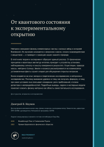

# Введение в физику нейтрино {.unnumbered}

::: {.content-visible when-format="html"}
```{=html}
<details class="book-cover-back">
  <summary>Задняя обложка · о книге и авторе</summary>
  <a href="assets/covers/back.svg" aria-label="Открыть заднюю обложку крупно">
    
  </a>
</details>
```
:::
