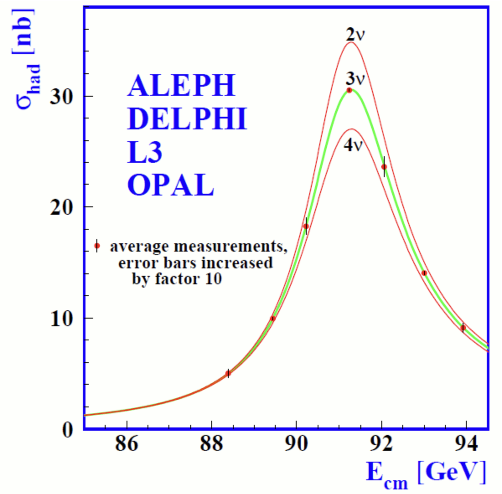

# Перед началом

## Базовые курсы

Для этой лекции понадобятся основные идеи из трёх разделов физики:

- специальная теория относительности;
- квантовая механика;
- классическая теория поля.

Материалы соответствующих курсов доступны на [teach-in.ru](https://teach-in.ru/).

## Естественная система единиц

Полагаем

$$
\hbar=c=1.
$$

:::: {.columns}

::: {.column width="58%"}

Тогда

$$
[E]=[m]=[L]^{-1}=[t]^{-1},
$$

$$
E^2=\mathbf p^2+m^2,
\qquad
E=\omega,
\qquad
\bar\lambda=\frac{1}{p},
\qquad
t\sim\frac{1}{E}.
$$

:::

::: {.column width="42%"}

Полезные переводы:

$$
\hbar c=197.327~\mathrm{MeV\,fm},
$$

$$
1~\mathrm{GeV}^{-1}=0.197~\mathrm{fm},
$$

$$
1~\mathrm{fm}=5.07~\mathrm{GeV}^{-1},
$$

$$
1~\mathrm{s}=1.52\cdot10^{24}~\mathrm{GeV}^{-1}.
$$

:::

::::

# 1. Материя

## Из чего состоит обычная материя?



# 2. Взаимодействия

## Как взаимодействуют частицы? {#interaction-gallery}



## Переносчики взаимодействий

Фундаментальные взаимодействия описываются обменом квантами полей —
**бозонами**.

| Взаимодействие | Переносчик | Спин |
|---|---:|---:|
| электромагнитное | фотон $\gamma$ | $1$ |
| слабое | $W^\pm$, $Z$ | $1$ |
| сильное | глюоны $g$ | $1$ |

Гравитация не входит в Стандартную модель частиц.

# 3. Классификация частиц

## Фермионы и бозоны



# 4. Стандартная модель

## Частицы и три опоры модели



## Частицы и поля

Фундаментальными объектами являются **квантовые поля**:

- лептонные и кварковые поля — фермионные;
- поля переносчиков взаимодействий и поле Хиггса — бозонные.

Частица — это квант возбуждения соответствующего поля.

$$
\text{реальная частица:}\quad E^2=\mathbf p^2+m^2.
$$

Внутренние линии диаграмм описывают виртуальные состояния, для которых в общем
случае

$$
E^2\ne\mathbf p^2+m^2.
$$

## Поле как система осцилляторов

::: {.neutrino101-statement}

Поле можно представить как бесконечную систему связанных квантовых
осцилляторов — по одному в каждой точке пространства.

:::

## Частица как возбуждение поля

::: {.neutrino101-statement}

Частица — локализованное возбуждение поля, способное переносить энергию,
импульс и квантовые числа.

:::

## Аналогия: связанные осцилляторы

<video class="slide-video media-height-lg" data-autoplay muted loop controls preload="metadata" playsinline poster="assets/01_neutrino_101/coupled_oscillators_baikal.jpg" src="assets/01_neutrino_101/coupled_oscillators_baikal.mp4"></video>

# 5. Что мы знаем о нейтрино

## Электрический заряд

Теоретически в минимальной Стандартной модели

$$
q_\nu=0.
$$

Но эксперимент должен проверить, не имеет ли нейтрино очень малого заряда.

:::: {.columns}

::: {.column width="50%"}

Рассеяние на электронах:

$$
\frac{d\sigma}{dT}\propto\frac{q_\nu^2}{T^2}
\quad\Longrightarrow\quad
|q_\nu|\lesssim10^{-12}e.
$$

:::

::: {.column width="50%"}

Электрическая нейтральность вещества:

$$
n\to p+e^-+\bar\nu_e
$$

даёт ограничения вплоть до

$$
|q_\nu|\lesssim10^{-21}e.
$$

:::

::::

## Спин

:::: {.columns}

::: {.column width="45%"}

Нейтрино — фермион со спином

$$
s=\frac12.
$$

Проекция спина на выбранную ось принимает два значения:

$$
S_z=\pm\frac{\hbar}{2}.
$$

Спиральность и поляризацию нейтрино мы разберём в лекции 03.

:::

::: {.column width="55%"}

<video class="slide-video media-height-md" data-autoplay muted loop controls preload="metadata" playsinline poster="assets/01_neutrino_101/spin.jpg" src="assets/01_neutrino_101/spin.mp4"></video>

:::

::::

## Флэйворы

:::: {.columns}

::: {.column width="58%"}

Флэйвор (то же, что аромат) — квантовое число, различающее три типа нейтрино:

- $\nu_e$ — электронное нейтрино, 1956;
- $\nu_\mu$ — мюонное нейтрино, 1962;
- $\nu_\tau$ — тау-нейтрино, 2000.

В слабом заряженном токе флэйвор нейтрино связан с заряженным лептоном:

$$
\nu_e+n\to p+e^-,
\qquad
\nu_\mu+n\not\to p+e^-.
$$

:::

::: {.column width="42%"}

{.slide-media .media-height-md fig-alt="Ширина Z-бозона допускает три лёгких активных нейтрино"}

Из измерения ширины $Z$-бозона следует: лёгких **активных** нейтрино — три.

:::

::::

## Массовые состояния

Флэйворные состояния не имеют определённой массы:

$$
|\nu_\alpha\rangle
=
\sum_{i=1}^{3}U_{\alpha i}^*|\nu_i\rangle,
\qquad
\alpha=e,\mu,\tau.
$$

- $\nu_e,\nu_\mu,\nu_\tau$ рождаются и детектируются в слабом взаимодействии;
- $\nu_1,\nu_2,\nu_3$ распространяются с определёнными массами
  $m_1,m_2,m_3$;
- антинейтрино образуют соответствующие сопряжённые состояния.

Именно несовпадение флэйворного и массового базисов приводит к осцилляциям.

## Взаимодействия нейтрино



Нейтрино участвуют в слабом и гравитационном взаимодействиях. При доступных
энергиях гравитационное взаимодействие отдельного нейтрино пренебрежимо мало.

## Сечение и длина взаимодействия

Вероятность пройти расстояние $x$ без взаимодействия равна

$$
P_0(x)=e^{-x/\lambda}.
$$

Средняя длина взаимодействия:

$$
\lambda=\frac{1}{n\sigma},
$$

где $\sigma$ — сечение, а $n$ — концентрация мишеней. Для атомов

$$
n_{\rm atom}=\frac{\rho N_A}{A},
\qquad
n_e=Z\frac{\rho N_A}{A}.
$$

$\rho$ — плотность среды, $A$ — молярная масса, $Z$ — число электронов в атоме.

## Пример: солнечное нейтрино

Для $E_\nu\sim1~\mathrm{МэВ}$ оценим рассеяние на электронах Солнца:

$$
\sigma(\nu_e e\to\nu_e e)\sim10^{-44}~\mathrm{см}^2,
$$

$$
n_e\sim
\rho N_A\frac{Z}{A}
\sim7\cdot10^{23}~\mathrm{см}^{-3}.
$$

Отсюда

$$
\lambda_\nu
\sim\frac{1}{n_e\sigma}
\sim10^{20}~\mathrm{см}
\sim10^9R_\odot.
$$

Солнце практически прозрачно для нейтрино с энергией порядка МэВ.

## Пример: нейтрино с энергией 1 ПэВ

Для прохождения через Землю:

$$
\sigma(\nu N)\sim10^{-33}~\mathrm{см}^2,
$$

$$
n_N\sim\rho N_A
\sim
5.5~\frac{\mathrm{г}}{\mathrm{см}^3},
6.02\cdot10^{23}~\mathrm{г}^{-1}
\sim3.3\cdot10^{24}~\mathrm{см}^{-3}.
$$

$$
\lambda_\nu
\sim\frac{1}{n_N\sigma}
\sim3\cdot10^8~\mathrm{см}
\sim3000~\mathrm{км}.
$$

При энергиях порядка ПэВ Земля уже непрозрачна для значительной части нейтрино.

## Пространственная чётность

Преобразование чётности отражает пространство:

$$
P:\quad \mathbf r\to-\mathbf r.
$$

Слабое взаимодействие не сохраняет чётность: оно выделяет левые киральные
фермионы,

$$
J_L^\mu
=
\bar\psi\gamma^\mu\frac{1-\gamma^5}{2}\psi.
$$

Это отражено непосредственно в калибровочной группе

$$
SU(2)_L\times U(1)_Y.
$$

Экспериментальное открытие нарушения чётности — тема лекции 02.

## Нейтрино в слабом взаимодействии

В слабом заряженном токе три нейтрино образуют пары с заряженными лептонами:

$$
\begin{pmatrix}\nu_e\\e\end{pmatrix}_L,
\qquad
\begin{pmatrix}\nu_\mu\\\mu\end{pmatrix}_L,
\qquad
\begin{pmatrix}\nu_\tau\\\tau\end{pmatrix}_L.
$$

Если считать нейтрино безмассовыми, эти три флэйворных состояния можно было бы
рассматривать независимо.

Но осцилляции показывают:

$$
\Delta m_{ij}^2\ne0.
$$

## Стандартная модель с массами нейтрино



## Смешивание поколений лептонов

Заряженный слабый ток содержит матрицу Понтекорво — Маки — Накагавы — Сакаты:

$$
\mathcal L_{\rm CC}
=
-\frac{g}{\sqrt2}
\sum_{\alpha,i}
\bar\ell_{\alpha L}\gamma^\mu
U_{\alpha i}\nu_{iL}W^-_\mu
+\mathrm{h.c.}
$$

$$
U_{\rm PMNS}
=
\begin{pmatrix}
U_{e1}&U_{e2}&U_{e3}\\
U_{\mu1}&U_{\mu2}&U_{\mu3}\\
U_{\tau1}&U_{\tau2}&U_{\tau3}
\end{pmatrix},
\qquad
U^\dagger U=1.
$$

Недиагональность $U_{\rm PMNS}$ означает, что флэйвор меняется при
распространении нейтрино.

# Осцилляции нейтрино

## Два флэйвора и два массовых состояния

В простейшей модели

$$
\begin{pmatrix}
|\nu_e\rangle\\
|\nu_\mu\rangle
\end{pmatrix}
=
\begin{pmatrix}
\cos\theta&-\sin\theta\\
\sin\theta&\cos\theta
\end{pmatrix}
\begin{pmatrix}
|\nu_1\rangle\\
|\nu_2\rangle
\end{pmatrix}.
$$

Каждое массовое состояние при распространении набирает собственную фазу:

$$
|\nu_i(L)\rangle
=
e^{-i\phi_i(L)}|\nu_i(0)\rangle.
$$

Наблюдаемая осцилляция — результат интерференции этих фаз.

## Вероятности в вакууме

Для двух флэйворов

$$
P(\nu_e\to\nu_e)
=
1-\sin^2 2\theta\,
\sin^2\!\left(\frac{\Delta m^2L}{4E}\right),
$$

$$
P(\nu_e\to\nu_\mu)
=
\sin^2 2\theta\,
\sin^2\!\left(\frac{\Delta m^2L}{4E}\right).
$$

Практическая форма фазы:

$$
\frac{\Delta m^2L}{4E}
=
1.267\,
\frac{\Delta m^2[\mathrm{эВ}^2]L[\mathrm{км}]}{E[\mathrm{ГэВ}]}.
$$

## Нейтрино как квантовый хамелеон

<video class="slide-video media-height-lg" data-autoplay muted loop controls preload="metadata" playsinline poster="assets/01_neutrino_101/oscillation_chameleon.jpg" src="assets/01_neutrino_101/oscillation_chameleon.mp4"></video>

## Экспериментальные свидетельства

Осцилляции проявились в независимых классах экспериментов:

- дефицит солнечных электронных нейтрино;
- аномалия отношения атмосферных $\nu_\mu/\nu_e$;
- исчезновение реакторных антинейтрино;
- исчезновение и появление флэйворов в ускорительных пучках;
- зависимость вероятностей от отношения $L/E$.

Совместное описание всех этих данных требует ненулевых

$$
\Delta m_{ij}^2.
$$

## Солнечные нейтрино: оценка потока

Основная цепочка превращает четыре протона в ядро гелия:

$$
4p\to{}^4\mathrm{He}+2e^++2\nu_e,
\qquad
Q\simeq26.7~\mathrm{МэВ}.
$$

Из светимости Солнца следует

$$
\dot N_\nu\simeq\frac{2L_\odot}{Q},
\qquad
\Phi_\nu(r)=\frac{\dot N_\nu}{4\pi r^2}.
$$

На орбите Земли:

$$
\Phi_\nu(1~\mathrm{а.е.})
\sim6.5\cdot10^{10}~\mathrm{см}^{-2}\mathrm{с}^{-1}.
$$

Историческая загадка состояла в дефиците именно **электронных** нейтрино;
часть потока по дороге превращалась в $\nu_\mu$ и $\nu_\tau$.

## Эксперименты с солнечными нейтрино



## Атмосферные нейтрино {#atmospheric-neutrino-ratio}

:::: {.columns}

::: {.column width="45%"}

Космические лучи рождают в атмосфере пионы:

$$
p+A\to\text{адроны}\supset\pi^\pm,
$$

$$
\pi^+\to\mu^++\nu_\mu,
\qquad
\mu^+\to e^++\nu_e+\bar\nu_\mu.
$$

Без осцилляций при невысоких энергиях ожидается примерно

$$
\frac{\nu_\mu+\bar\nu_\mu}{\nu_e+\bar\nu_e}\simeq2.
$$

Эксперимент показал, что отношение зависит от пройденного расстояния и энергии.

:::

::: {.column width="55%"}



:::

::::

# 6. Чего мы пока не знаем

# Нарушается ли CP-симметрия?

## Что означает CP-нарушение

Зарядовое сопряжение заменяет частицу античастицей:

$$
C:\quad \text{частица}\to\text{античастица}.
$$

Пространственная чётность отражает координаты:

$$
P:\quad\mathbf r\to-\mathbf r.
$$

CP-нарушение в осцилляциях означало бы

$$
P(\nu_\alpha\to\nu_\beta)
\ne
P(\bar\nu_\alpha\to\bar\nu_\beta).
$$

Например,

$$
P(\nu_\mu\to\nu_e)
\ne
P(\bar\nu_\mu\to\bar\nu_e).
$$

## CP-фаза в матрице смешивания

::: {.pmns-factorization}

$$
U_{\rm PMNS}
=
\underbrace{
\begin{pmatrix}
1&0&0\\0&c_{23}&s_{23}\\0&-s_{23}&c_{23}
\end{pmatrix}}_{\text{атмосферное смешивание}}
\underbrace{
\begin{pmatrix}
c_{13}&0&s_{13}e^{-i\delta_{\rm CP}}\\
0&1&0\\
-s_{13}e^{i\delta_{\rm CP}}&0&c_{13}
\end{pmatrix}}_{\text{реакторное смешивание и }\delta_{\rm CP}}
\underbrace{
\begin{pmatrix}
c_{12}&s_{12}&0\\-s_{12}&c_{12}&0\\0&0&1
\end{pmatrix}}_{\text{солнечное смешивание}}.
$$

:::

Здесь

$$
s_{ij}=\sin\theta_{ij},
\qquad
c_{ij}=\cos\theta_{ij}.
$$

Фаза $\delta_{\rm CP}$ отвечает за CP-нечётные эффекты в осцилляциях.

## Порядок масс

Из солнечных данных известно

$$
m_2>m_1,
\qquad
\Delta m_{21}^2>0.
$$

Но знак атмосферной разности квадратов масс пока требуется определить:

:::: {.columns}

::: {.column width="50%"}

**Нормальный порядок**

$$
m_1<m_2<m_3.
$$

:::

::: {.column width="50%"}

**Обратный порядок**

$$
m_3<m_1<m_2.
$$

:::

::::

<video class="slide-video" style="--media-max-height: 300px;" data-autoplay muted loop controls preload="metadata" playsinline poster="assets/01_neutrino_101/mass_ordering.jpg" src="assets/01_neutrino_101/mass_ordering.mp4"></video>

## Дираковское или майорановское?

| | Дираковский фермион | Майорановский фермион |
|---|---|---|
| Частица и античастица | различны | совпадают |
| Пример | $e^-\ne e^+$ | нейтрино — возможно |
| Сохраняется лептонное число | да | не обязательно |

Для электрически нейтрального нейтрино возможны оба варианта:

$$
\nu\ne\bar\nu
\quad\text{или}\quad
\nu=\bar\nu.
$$

Наблюдение безнейтринного двойного бета-распада

$$
(A,Z)\to(A,Z+2)+2e^-
$$

стало бы свидетельством майорановской природы массы нейтрино.

# Абсолютный масштаб масс

## Масса самого лёгкого нейтрино

Осцилляции измеряют разности квадратов масс:

$$
\Delta m_{ij}^2=m_i^2-m_j^2.
$$

Они не определяют общий сдвиг спектра масс.

```{=html}
<div class="absolute-mass-question">
  <div class="question-mark">?</div>
  <div>
    <p><strong>Мы пока не знаем массу самого лёгкого нейтрино.</strong></p>
    <p class="muted">Для абсолютного масштаба нужны кинематические измерения,
    космологические наблюдения или процессы с нарушением лептонного числа.</p>
  </div>
</div>
```

# Нейтрино как инструмент

## Что можно исследовать с помощью нейтрино

:::: {.instrument-grid}

::: {.instrument-card}
**Новую физику**  
редкие взаимодействия и неизвестные частицы
:::

::: {.instrument-card}
**Структуру протона**  
упругое, неупругое и глубоко-неупругое рассеяние
:::

::: {.instrument-card}
**Солнце и звёзды**  
реакции в недоступных для фотонов областях
:::

::: {.instrument-card}
**Сверхновые и экстремальную Вселенную**  
нейтринные телескопы
:::

::: {.instrument-card}
**Ядерные реакторы**  
дистанционный мониторинг
:::

::: {.instrument-card}
**Землю и Вселенную**  
томография, геонейтрино и космология
:::

::::

# 7. Карта курса

## Теория нейтрино

:::: {.roadmap-grid}

::: {.roadmap-card}
Чётность, спин и поляризация
:::

::: {.roadmap-card}
Прямое определение массы
:::

::: {.roadmap-card}
Осцилляции в вакууме и веществе
:::

::: {.roadmap-card}
Нейтрино в Стандартной модели
:::

::: {.roadmap-card}
Электромагнитные свойства и стерильные нейтрино
:::

::: {.roadmap-card}
Майорановская масса, смешивание и новая физика
:::

::::

## Источники, взаимодействия и детекторы

:::: {.roadmap-grid}

::: {.roadmap-card}
Взаимодействия и методы детектирования
:::

::: {.roadmap-card}
Солнечные, атмосферные, ускорительные, реакторные и геонейтрино
:::

::: {.roadmap-card}
Реликтовые, сверхвысокоэнергичные нейтрино и сверхновые
:::

::: {.roadmap-card}
Глобальный анализ данных
:::

::: {.roadmap-card}
Нейтринная томография Земли
:::

::: {.roadmap-card}
Мониторинг ядерных реакторов
:::

::::
