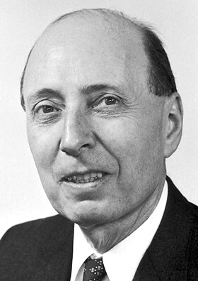
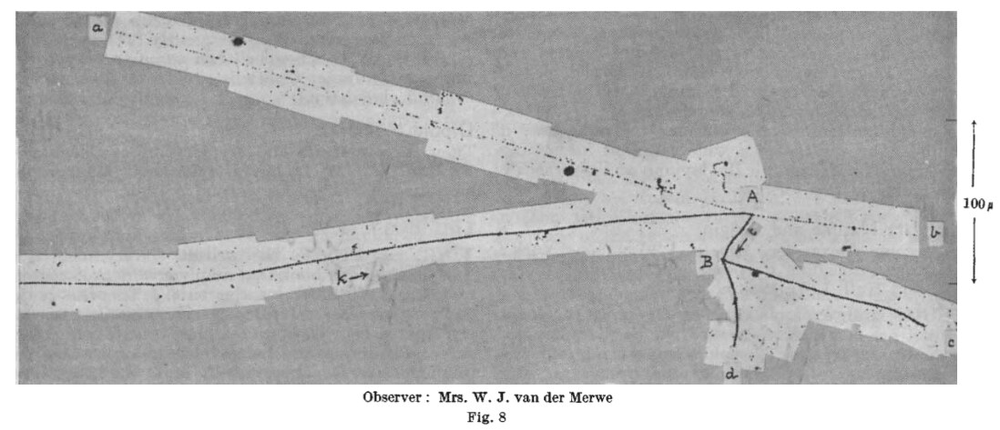
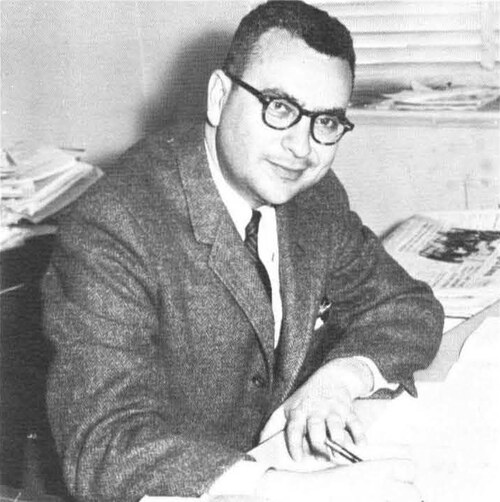
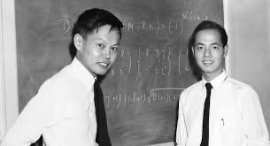
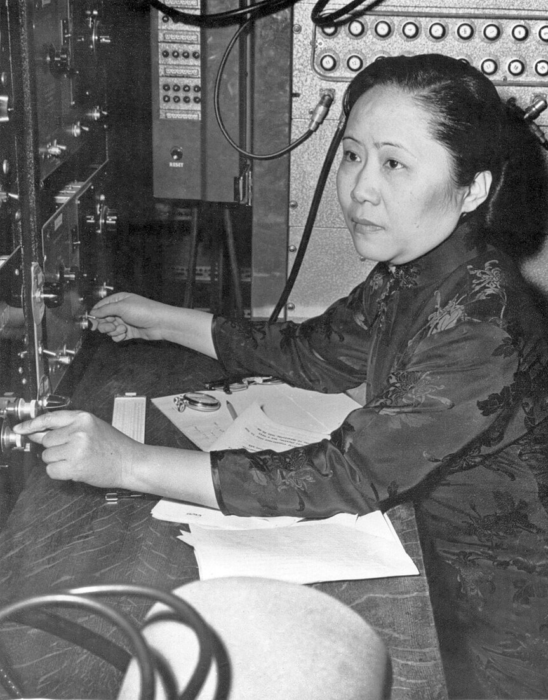
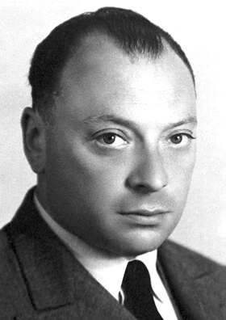
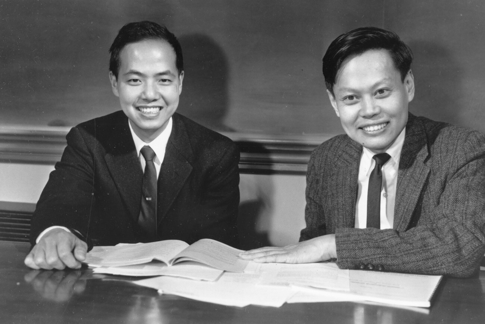

# 1. Чётность как симметрия

## Отражение пространства {#parity-transform}



## Полярные и аксиальные векторы

При пространственном отражении

$$
P:\qquad \mathbf r\to-\mathbf r,
\qquad
\mathbf p\to-\mathbf p.
$$

Но момент импульса и спин — **аксиальные** векторы:

$$
\mathbf L=\mathbf r\times\mathbf p\to\mathbf L,
\qquad
\mathbf S\to\mathbf S.
$$

Поэтому скалярное произведение

$$
\mathbf S\cdot\mathbf p
\xrightarrow{P}
-\mathbf S\cdot\mathbf p
$$

нечётно относительно $P$. Это наблюдение станет ключом к опыту Ву.

## Чётность квантового состояния

Если гамильтониан инвариантен относительно отражения,

$$
[H,P]=0,
$$

состояния можно выбрать собственными состояниями оператора чётности:

$$
P\psi(\mathbf r)=\psi(-\mathbf r)=\eta_P\psi(\mathbf r),
\qquad
\eta_P=\pm1.
$$

:::: {.columns}

::: {.column width="50%"}

**Чётное состояние**

$$
\psi(-\mathbf r)=+\psi(\mathbf r).
$$

:::

::: {.column width="50%"}

**Нечётное состояние**

$$
\psi(-\mathbf r)=-\psi(\mathbf r).
$$

:::

::::

## Почему ожидали сохранения чётности

:::: {.columns}

::: {.column width="67%"}

- В атомной спектроскопии действует правило Лапорта: электрические дипольные
  переходы меняют чётность.
- В 1927 году Вигнер связал симметрию $\mathbf r\to-\mathbf r$ с квантовым
  числом чётности.
- Электромагнитные и сильные процессы подтверждали сохранение $P$.

::: {.nh-box tone="accent" size="md"}

К середине 1950-х сохранение чётности воспринималось почти как само собой
разумеющийся закон природы.

:::

:::

::: {.column width="33%"}

{.portrait .media-height-md fig-alt="Юджин Вигнер"}

Юджин Вигнер

:::

::::

# 2. $\tau$–$\theta$-загадка

## Одна масса — два распада

В начале 1950-х наблюдали положительно заряженную частицу с массой около
$494~\mathrm{МэВ}$ и двумя каналами распада:

:::: {.columns}

::: {.column width="50%"}

$$
\theta^+\to\pi^++\pi^0.
$$

:::

::: {.column width="50%"}

$$
\tau^+\to\pi^++\pi^++\pi^-.
$$

:::

::::

Массы и времена жизни $\theta^+$ и $\tau^+$ совпадали — всё указывало на одну
и ту же частицу, современный $K^+$.

{.slide-media style="--media-max-height: 520px; --media-margin-top: 0.9rem;" fig-alt="Фотография события с распадом странной частицы в пузырьковой камере"}

## Противоречие чётностей

Пион имеет отрицательную внутреннюю чётность:

$$
\eta_\pi=-1.
$$

Для распадов в $S$-волне:

:::: {.columns}

::: {.column width="50%"}

$$
\theta^+\to2\pi,
\qquad
\eta_f=(-1)^2=+1.
$$

:::

::: {.column width="50%"}

$$
\tau^+\to3\pi,
\qquad
\eta_f=(-1)^3=-1.
$$

:::

::::

Одна частица не может иметь одновременно $\eta_P=+1$ и $\eta_P=-1$, если
чётность сохраняется.

::: {.nh-box tone="warning" size="md" weight="bold"}

Либо это две почти неразличимые частицы, либо слабое взаимодействие нарушает
пространственную чётность.

:::

# 3. От загадки к проверяемой гипотезе

## Идея, которую считали почти немыслимой {.history-story-slide}

:::: {.history-story-grid}

::: {.history-story-person .history-story-gellmann}

{.history-story-photo fig-alt="Мюррей Гелл-Манн"}

**Мюррей Гелл-Манн**

Не сумев «доказать» сохранение $P$, рано понял: это не геометрическая
необходимость, а свойство конкретной теории.

:::

::: {.history-story-person .history-story-feynman}

{.history-story-photo fig-alt="Ричард Фейнман"}

**Ричард Фейнман**

Обсуждал гипотезу с Гелл-Манном и вынес вопрос на Рочестерскую конференцию.

:::

::: {.history-story-moment .history-story-feshbach}

[**Неделя над невозможным доказательством**]{.history-story-title}

Профессор Герман Фешбах предложил студентам доказать сохранение чётности
заменой координат. Гелл-Манн потратил около недели и обнаружил: такого
доказательства нет — преобразование координат само по себе не диктует законы
природы.

:::

::: {.history-story-moment .history-story-rochester}

[**1955 → Рочестер, 1956**]{.history-story-title}

Гелл-Манн и Фейнман обсуждали нарушение $P$, но не связали его с
$\tau$–$\theta$-загадкой. На конференции Фейнман передал идею своего соседа
Марти Блока; Янг ответил, что они с Ли уже рассматривали её — без результата.

:::

::: {.history-story-moment .history-story-moscow}

[**Москва, май 1956: зал отвечает враждебно**]{.history-story-title}

Гелл-Манн назвал нарушение $P$ возможным решением $\tau$–$\theta$-загадки.
Из переполненного зала возражали: «Это нарушение лоренц-инвариантности!» и
«Законы зависят от поворотов?»

**Ответ Гелл-Манна:** сохранение $P$ — эмпирический факт; фундаментальной
причины для него нет.

:::

::::

::: {.nh-box tone="warning" size="md"}

**Главный барьер был не математическим.** Пространственное отражение ошибочно
воспринимали как простую замену координат — и потому как обязательную симметрию
любого закона природы.

:::

## Ли и Янг: проверить слабое взаимодействие

Летом 1956 года Цзундао Ли и Чжэньнин Янг систематически изучили имеющиеся
эксперименты и заметили:

::: {.nh-box tone="accent" size="lg"}

сохранение чётности было хорошо проверено для электромагнитных и сильных
процессов, но не для слабых.

:::

Они предложили конкретные проверки в $\beta$-распаде, распадах пионов и
мюонов. Для проверки $\beta$-распада Ли обратился к Ву Цзяньсюн.

{.slide-media .lee-yang-1956 fig-alt="Цзундао Ли и Чжэньнин Янг"}

# 4. Опыт Ву

## Ву Цзяньсюн

:::: {.columns}

::: {.column width="58%"}

Ву Цзяньсюн была одним из ведущих специалистов по $\beta$-распаду.

В конце 1956 года её группа совместно со специалистами Национального бюро
стандартов поставила эксперимент с поляризованными ядрами ${}^{60}\mathrm{Co}$.

Эксперимент должен был ответить на простой вопрос:

::: {.nh-box tone="danger" size="lg" weight="bold"}

одинаково ли часто электроны вылетают вдоль и против спина ядра?

:::

:::

::: {.column width="42%"}

{.portrait .wu-portrait fig-alt="Ву Цзяньсюн у экспериментальной установки"}

:::

::::

## Идея опыта



## Почему ${}^{60}\mathrm{Co}$

Основной $\beta^-$-распад:

$$
{}^{60}_{27}\mathrm{Co}(5^+)
\to
{}^{60}_{28}\mathrm{Ni}^{*}(4^+)+e^-+\bar\nu_e.
$$

После него ядро никеля испускает два $\gamma$-кванта:

$$
{}^{60}\mathrm{Ni}^{*}(4^+)
\to
{}^{60}\mathrm{Ni}^{*}(2^+)+\gamma
\to
{}^{60}\mathrm{Ni}(0^+)+2\gamma.
$$

- угловое распределение электронов проверяет чётность;
- анизотропия $\gamma$-излучения независимо показывает степень поляризации
  ядер.

## Почему нужны милликельвины

Магнитный момент в поле имеет энергию

$$
E=-\boldsymbol\mu\cdot\mathbf B,
\qquad
\frac{n_\uparrow}{n_\downarrow}
=
\exp\!\left(\frac{2\mu B}{k_BT}\right).
$$

:::: {.columns}

::: {.column width="50%"}

$$
\mu_B=\frac{e\hbar}{2m_e}
=5.79\cdot10^{-5}\ \mathrm{эВ/Тл},
$$

$$
\frac{\mu_B B}{k_BT}\simeq0.67
\quad (B=1~\mathrm{Тл},\ T=1~\mathrm K).
$$

Электронные спины поляризовать сравнительно легко.

:::

::: {.column width="50%"}

$$
\mu_N=\frac{e\hbar}{2m_p}
=3.15\cdot10^{-8}\ \mathrm{эВ/Тл},
$$

$$
\frac{\mu_N B}{k_BT}\simeq3.7\cdot10^{-4}
\quad (B=1~\mathrm{Тл},\ T=1~\mathrm K).
$$

Для ядер нужна температура порядка $10^{-2}~\mathrm K$.

:::

::::

## Адиабатическое размагничивание



## Экспериментальная установка



## Ожидаемое угловое распределение

Для электронов $\beta$-распада

$$
W(\theta)
=
1+A\,\mathcal P\,\frac{v}{c}\,f_{\rm bs}\cos\theta,
$$

где

$$
\mathcal P=\frac{\langle I_z\rangle}{I}
$$

— поляризация ядер, $f_{\rm bs}$ — поправка на обратное рассеяние, а $A$ —
коэффициент асимметрии.

Если чётность сохраняется, направления $\mathbf I$ и $-\mathbf I$ физически
эквивалентны, поэтому

$$
A=0.
$$

## Что делает отражение

Угол задаётся корреляцией

$$
\cos\theta
=
\frac{\mathbf I\cdot\mathbf p_e}{I\,p_e}.
$$

При пространственном отражении

$$
\mathbf I\to\mathbf I,
\qquad
\mathbf p_e\to-\mathbf p_e,
\qquad
\cos\theta\to-\cos\theta.
$$

Следовательно,

$$
W(\theta)\xrightarrow{P}W(\pi-\theta).
$$

Ненулевой член, пропорциональный $\cos\theta$, означает, что зеркальный процесс
имеет другую вероятность.

## Результат {#wu-result}



## Мир и его зеркальное отражение



::: {.nh-box tone="danger" size="md" align="center" weight="bold"}

Слабое взаимодействие различает эти два мира: пространственная чётность
нарушается.

:::

# 5. Проверка и физический смысл

## «Эксперимент надо повторить»

:::: {.columns}

::: {.column width="32%"}

{.portrait .media-height-md fig-alt="Вольфганг Паули"}

Вольфганг Паули

:::

::: {.column width="68%"}

Результат был настолько неожиданным, что многие теоретики сначала отнеслись к
нему скептически.

Паули настаивал: опыт необходимо повторить и проверить независимым способом.

Именно это и произошло почти немедленно.

:::

::::

## Независимая проверка на мюонах

В распаде

$$
\pi^+\to\mu^++\nu_\mu
$$

мюоны рождаются поляризованными. Их поляризацию можно измерить по асимметрии
позитронов в последующем распаде

$$
\mu^+\to e^++\nu_e+\bar\nu_\mu.
$$

Леон Ледерман, Ричард Гарвин и Марсель Вайнрих подготовили опыт менее чем за
неделю и в начале 1957 года подтвердили нарушение чётности.

::: {.nh-box tone="accent" size="md"}

Два разных слабых процесса дали один и тот же ответ.

:::

## Что осталось от чётности

| Взаимодействие | Пространственная чётность |
|---|---:|
| сильное | сохраняется |
| электромагнитное | сохраняется |
| слабое | нарушается максимально |

В современной теории заряженный слабый ток содержит левый проектор:

$$
J_L^\mu
=
\bar\psi\gamma^\mu\frac{1-\gamma^5}{2}\psi.
$$

Индекс $L$ в калибровочной группе

$$
SU(2)_L\times U(1)_Y
$$

напоминает: слабое взаимодействие фундаментально различает левое и правое.

## Как объяснить инопланетянам, где лево?



::: {.nh-box tone="accent" size="sm"}

**Общий ориентир:** поляризуйте ядра ${}^{60}\mathrm{Co}$ и назовите «левым»
направление, в котором вылетает больше электронов.

:::

## Нобелевская премия 1957 года

:::: {.columns}

::: {.column width="56%"}

{.slide-media style="--media-max-height: 510px;" fig-alt="Цзундао Ли и Чжэньнин Янг"}

:::

::: {.column width="44%"}

Цзундао Ли и Чжэньнин Янг получили Нобелевскую премию по физике
«за глубокое исследование так называемых законов чётности, приведшее к важным
открытиям в области элементарных частиц».

Открытие произошло через год после их теоретической работы.

::: {.nh-box tone="success" size="md" weight="bold"}

Зеркальная симметрия — не универсальный закон природы.

:::

:::

::::
