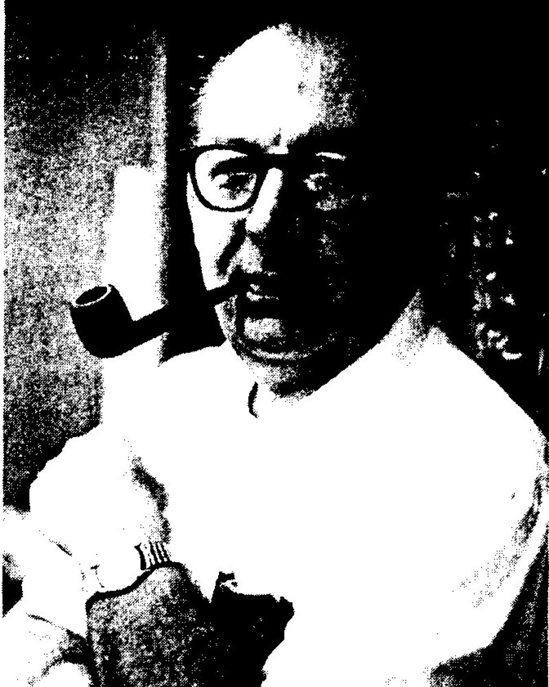
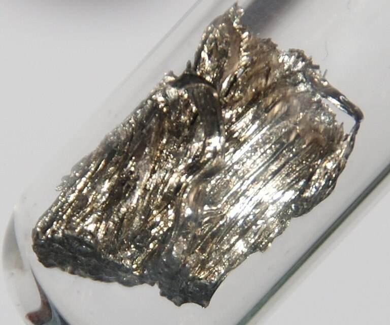
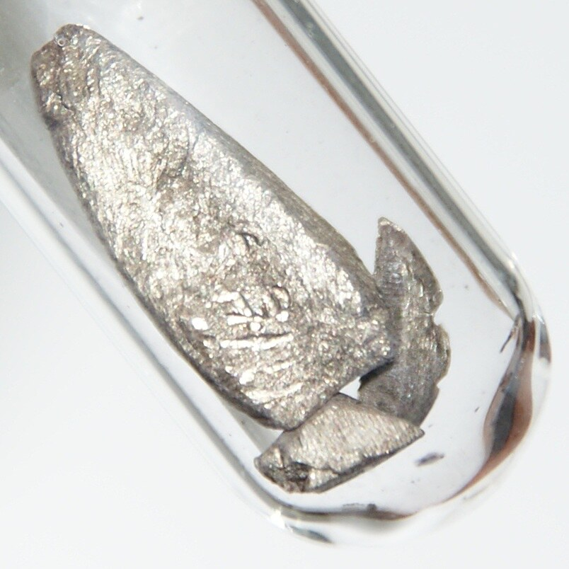

# 1. Что такое спиральность

## Проекция спина на направление движения

Для частицы со спином $1/2$ оператор спиральности

$$
\hat h
=
\frac{2}{\hbar}\,\hat{\mathbf S}\cdot\hat{\mathbf p}
=
\boldsymbol\sigma\cdot\hat{\mathbf p},
\qquad
\hat{\mathbf p}=\frac{\mathbf p}{|\mathbf p|}.
$$

:::: {.helicity-pair}

::: {.helicity-card .helicity-card-right}

ν

спин

импульс

**Правоспиральное состояние**

$$h=+1$$

:::

::: {.helicity-card .helicity-card-left}

ν

спин

импульс

**Левоспиральное состояние**

$$h=-1$$

:::

::::

## Геометрический смысл

:::: {.columns}

::: {.column width="54%"}

Спиральность отвечает на один вопрос:

::: {.helicity-question}

направлены ли спин и импульс одинаково или противоположно?

:::

Это **не** новая компонента спина. Мы выбираем ось вдоль движения частицы и
измеряем проекцию уже знакомого спина на эту ось.

:::

::: {.column width="46%"}

$$
\begin{aligned}
\mathbf S\uparrow\uparrow\mathbf p
&\quad\Longrightarrow\quad h=+1,\\[0.5em]
\mathbf S\uparrow\downarrow\mathbf p
&\quad\Longrightarrow\quad h=-1.
\end{aligned}
$$

:::

::::

## Можно ли изменить спиральность? {#frame-change}



## Безмассовую частицу не обогнать

Для массивной частицы существует система покоя. Наблюдатель может изменить
знак её импульса, не меняя направление спина:

$$
\mathbf p\to-\mathbf p,
\qquad
\mathbf S\to\mathbf S,
\qquad
h\to-h.
$$

Для безмассовой частицы допустимые инерциальные системы связаны преобразованиями,
которые не могут обратить её импульс. Поэтому

::: {.helicity-verdict}

спиральность безмассовой частицы — лоренц-инвариантная характеристика.

:::

## Нейтрино почти безмассовы

Нейтрино имеют массу, но в большинстве экспериментов

$$
E_\nu\gg m_\nu c^2,
\qquad
v_\nu\simeq c.
$$

Вероятность обнаружить «неправильную» спиральность в слабом процессе подавлена:

$$
P_{\rm wrong}
\sim
\left(\frac{m_\nu c^2}{2E_\nu}\right)^2.
$$

Например, при $m_\nu=0.1~\mathrm{эВ}$ и $E_\nu=1~\mathrm{МэВ}$ это всего

$$
P_{\rm wrong}\sim2.5\cdot10^{-15}.
$$

## Спиральность и киральность — не одно и то же

:::: {.comparison-grid}

::: {.comparison-card}

Спиральность

Проекция спина на импульс:

$$
h=\boldsymbol\sigma\cdot\hat{\mathbf p}.
$$

Для массивной частицы зависит от системы отсчёта.

:::

::: {.comparison-card}

Киральность

Собственное значение проектора

$$
P_{L,R}=\frac{1\mp\gamma^5}{2}.
$$

Определяет, как поле входит в слабое взаимодействие.

:::

::::

В ультрарелятивистском пределе для частиц левую киральность практически нельзя
отличить от $h=-1$.

# 2. Как измерить спиральность нейтрино

## Нейтрино не оставляет удобной стрелки

Нельзя просто поставить нейтрино в магнитное поле и измерить направление его
спина:

- электрический заряд равен нулю;
- магнитный момент чрезвычайно мал;
- вероятность взаимодействия мала;
- сам акт регистрации уничтожает или рассеивает нейтрино.

::: {.helicity-question}

Нужен процесс, в котором спиральность нейтрино оставляет измеримый след в
другой частице.

:::

## «Шедевральный эксперимент»

В 1958 году Морис Голдхабер, Эндрю Суньяр и Ли Гродзинс предложили измерить
спиральность нейтрино через последовательность двух квантовых переходов.

:::: {.experiment-team}

::: {.team-card}

{.team-photo fig-alt="Морис Голдхабер"}

**Морис Голдхабер**

:::

::: {.team-card}

{.team-photo fig-alt="Эндрю Суньяр в 1970 году"}

**Эндрю Суньяр**

:::

::: {.team-card}

{.team-photo fig-alt="Ли Гродзинс во время работы над измерением спиральности нейтрино в 1957 году"}

**Ли Гродзинс**

:::

::::

Фото: архив лекции · Brookhaven Bulletin · MIT News / New York Daily News

::: {.helicity-emphasis}

Идея: заставить ядро и фотон по очереди «запомнить» проекцию спина нейтрино.

:::

## Первый переход: электронный захват

Рассмотрим переход

$$
A(0)+e^-\longrightarrow B^*(1)+\nu_e.
$$

:::: {.columns}

::: {.column width="52%"}

- исходное ядро имеет спин $0$;
- электрон на $K$-оболочке имеет спин $1/2$;
- возбуждённое ядро имеет спин $1$;
- нейтрино имеет спин $1/2$.

:::

::: {.column width="48%"}

$$
\mathbf J_{e}
=
\mathbf J_{B^*}+\mathbf S_\nu.
$$

Сохранение момента импульса связывает проекции спинов $B^*$ и нейтрино.

:::

::::

## Кто запоминает спин нейтрино {#spin-tagging}



## Разрешённые проекции

Выберем ось $z$ вдоль импульса нейтрино. Для состояний
$m_{B^*}=\pm1$ проекция возбуждённого ядра однозначно определяет спиральность:

| $m_e$ | $m_{B^*}$ | $m_\nu$ | $h_\nu$ |
|---:|---:|---:|:---|
| $+\tfrac12$ | $0$ | $+\tfrac12$ | $+1$ |
| $+\tfrac12$ | $+1$ | $-\tfrac12$ | $-1$ |
| $-\tfrac12$ | $0$ | $-\tfrac12$ | $-1$ |
| $-\tfrac12$ | $-1$ | $+\tfrac12$ | $+1$ |

::: {.helicity-emphasis}

Состояния $m_{B^*}=\pm1$ — хороший «анализатор»; состояния $m_{B^*}=0$ не
дают однозначной метки.

:::

## Второй переход: фотон наследует проекцию

Возбуждённое ядро быстро испускает фотон:

$$
B^*(1)\longrightarrow B(0)+\gamma.
$$

Поскольку конечное ядро имеет спин $0$,

$$
m_\gamma=m_{B^*}=\pm1.
$$

Если фотон летит **вдоль отдачи ядра**, то есть противоположно нейтрино,

$$
h_\gamma=h_\nu.
$$

Так невидимая спиральность нейтрино превращается в измеримую круговую
поляризацию фотона.

## Как измерить круговую поляризацию фотона {#photon-analyzer}



Магнитное поле меняет знак поляризации электронов в железе. Разность
пропусканий при $+B$ и $-B$ выделяет компоненту, чувствительную к
спиральности фотона.

## Проблема направления

Одна и та же спиральность нейтрино может сопровождаться разными проекциями
спина фотона, если не знать взаимное направление их импульсов.

:::: {.direction-cases}

::: {.direction-case .direction-good}

$$
\mathbf p_\gamma\uparrow\downarrow\mathbf p_\nu
$$

$$h_\gamma=h_\nu$$

**нужный случай**

:::

::: {.direction-case .direction-bad}

$$
\mathbf p_\gamma\uparrow\uparrow\mathbf p_\nu
$$

$$h_\gamma=-h_\nu$$

**знак меняется**

:::

::::

Нужен фильтр, выбирающий фотоны, летящие строго противоположно нейтрино.

# 3. Резонансный фильтр направления

## Почему неподвижное ядро не даёт резонанса

При испускании фотона часть энергии уходит в отдачу ядра:

$$
E_\gamma^{\rm em}
=
\Delta E-E_R,
\qquad
E_R\simeq\frac{E_\gamma^2}{2Mc^2}.
$$

Для поглощения требуется энергия

$$
E_\gamma^{\rm abs}=\Delta E+E_R.
$$

Поэтому свободное покоящееся ядро не может резонансно поглотить собственный
фотон:

$$
E_\gamma^{\rm em}<E_\gamma^{\rm abs}.
$$

## Доплеровский сдвиг чинит резонанс {#resonance-filter}



## Фильтр выбирает геометрию

После электронного захвата ядро $B^*$ получает отдачу, противоположную
импульсу нейтрино:

$$
\mathbf p_{B^*}\simeq-\mathbf p_\nu.
$$

Доплеровский сдвиг повышает энергию фотона, испущенного вдоль движения $B^*$:

$$
E_\gamma(\theta)
\simeq
E_0\left(1+\frac{v_{B^*}}{c}\cos\theta\right).
$$

Резонансный поглотитель пропускает в анализ только

$$
\mathbf p_\gamma\parallel\mathbf p_{B^*}
\quad\Longrightarrow\quad
\mathbf p_\gamma\uparrow\downarrow\mathbf p_\nu.
$$

## Возбуждённое ядро должно успеть излучить

Ядро теряет скорость отдачи при столкновениях в веществе. Фотон должен быть
испущен до остановки:

$$
\tau(B^*)\ll\tau_{\rm stop}\sim10^{-13}\ \mathrm c.
$$

Тогда доплеровский сдвиг сохраняет информацию о направлении отдачи.

::: {.helicity-verdict}

Короткое время жизни уровня превращает спектроскопический резонанс в
кинематический фильтр направления.

:::

## Подходящая ядерная пара

В эксперименте использовали метастабильный европий:

$$
{}^{152m}\mathrm{Eu}(0^-)+e^-
\longrightarrow
{}^{152}\mathrm{Sm}^{*}(1^-)+\nu_e,
$$

за которым следует быстрый переход

$$
{}^{152}\mathrm{Sm}^{*}(1^-)
\longrightarrow
{}^{152}\mathrm{Sm}(0^+)+\gamma.
$$

Время жизни возбуждённого уровня самария — около $0.07~\mathrm{пс}$, поэтому
значительная часть фотонов испускается до остановки ядра.

## Европий и самарий

:::: {.material-pair}

::: {.material-card}

{fig-alt="Металлический европий"}

**${}^{152m}\mathrm{Eu}$** — источник электронного захвата

:::

::: {.material-arrow}

$$
e^-\text{-захват}
\quad\Longrightarrow\quad
\gamma\text{-переход}
$$

:::

::: {.material-card}

{fig-alt="Металлический самарий"}

**${}^{152}\mathrm{Sm}$** — резонансный поглотитель

:::

::::

## Полная логика эксперимента {#experiment-chain}



## Что фактически сравнивают

Пусть $N_+$ и $N_-$ — числа прошедших резонансных фотонов при двух направлениях
магнитного поля в железном анализаторе. Измеряется асимметрия

$$
\mathcal A
=
\frac{N_+-N_-}{N_++N_-}.
$$

После учёта поляризации электронов, эффективности анализатора и доли
резонансных фотонов знак $\mathcal A$ задаёт знак $h_\gamma$, а значит и
$h_\nu$.

::: {.helicity-emphasis}

Эксперимент не ловит нейтрино: он читает цепочку корреляций, оставленную
нейтрино в ядре и фотоне.

:::

# 4. Результат и физический смысл

## Нейтрино оказалось левоспиральным

:::: {.columns}

::: {.column width="64%"}

Голдхабер, Гродзинс и Суньяр получили

$$
\boxed{h(\nu_e)=-1\pm0.3}.
$$

Знак однозначно указывал: электронные нейтрино рождаются левоспиральными.

::: {.helicity-verdict}

Результат согласуется с максимальным нарушением пространственной чётности в
слабом взаимодействии.

:::

:::

::: {.column width="36%"}

{.goldhaber-portrait fig-alt="Морис Голдхабер"}

Морис Голдхабер

:::

::::

## Почему знак спиральности важен

Заряженный слабый ток имеет структуру $V-A$:

$$
J_L^\mu
=
\bar\psi\gamma^\mu(1-\gamma^5)\psi.
$$

Он выбирает

:::: {.weak-handedness}

::: {.weak-card .weak-neutrino}

**нейтрино**

$$h\simeq-1$$

левоспиральные

:::

::: {.weak-card .weak-antineutrino}

**антинейтрино**

$$h\simeq+1$$

правоспиральные

:::

::::

Именно эта асимметрия связывает опыт Голдхабера с нарушением чётности в опыте
Ву.

## Мюонные нейтрино

Спиральность $\nu_\mu$ можно проверить по угловым корреляциям в цепочке

$$
\pi^+\to\mu^++\nu_\mu,
\qquad
\mu^+\to e^++\nu_e+\bar\nu_\mu.
$$

Поляризация мюона хранит информацию о спиральности нейтрино. Ранние измерения
давали, например,

$$
h(\nu_\mu)\approx-1.06\pm0.11,
$$

то есть тот же левоспиральный слабый ток.

## Тау-нейтрино

Для $\nu_\tau$ используют корреляции в распадах $\tau$-лептона. Измерения
совместимы с

$$
h(\nu_\tau)=-1.
$$

В исходной лекции приводился результат CLEO:

$$
h(\nu_\tau)
=
-0.995\pm0.010\pm0.003.
$$

Три флэйвора демонстрируют одну и ту же левую структуру заряженного слабого
тока.

## Что меняет ненулевая масса

Ненулевая масса означает:

- спиральность строго не является лоренц-инвариантной;
- состояние определённой киральности содержит малую примесь противоположной
  спиральности;
- в принципе существует система, обгоняющая нейтрино, но практически это
  невозможно для релятивистского пучка.

Однако слабое взаимодействие по-прежнему выбирает **киральность**, а
эксперимент почти всегда наблюдает соответствующую ей спиральность.

## От невидимого нейтрино к измеримому знаку

:::: {.final-chain}

::: {.final-step}

$$h_\nu$$

спиральность нейтрино

:::

::: {.final-step}

$$m_{B^*}$$

проекция ядра

:::

::: {.final-step}

$$h_\gamma$$

поляризация фотона

:::

::: {.final-step}

$$\mathcal A$$

счётная асимметрия

:::

::::

::: {.helicity-final}

Опыт Голдхабера превратил направление спина почти неуловимой частицы в знак
макроскопически измеримой асимметрии.

:::
