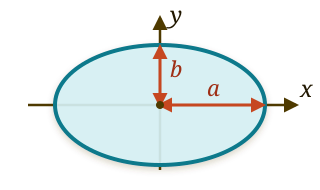
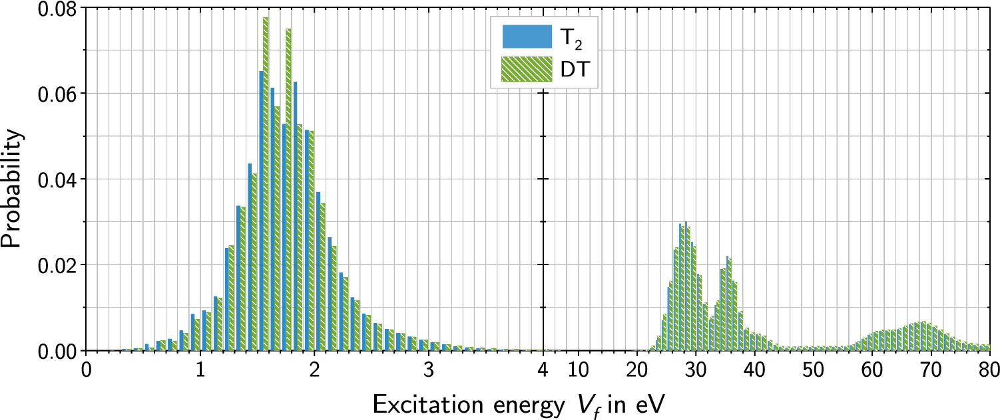

# У нейтрино есть масса
## У нейтрино есть ненулевая масса
- Осцилляции нейтрино надежно наблюдаются. Следовательно
$$
\Delta m^2_{ij}\ne 0.
$$
- Масса нейтрино отлична от нуля, а также $m_i\ne m_j$.
- Как измерить массы, а не разности квадратов масс?

## Метод измерения массы нейтрино в $\beta$-распадах
- Идея измерения формы $\beta$-спектра для определения массы нейтрино предложена Перреном (1933) и Ферми (1934)
- Первые эксперименты с использованием этого метода выполнены Курраном, Ангусом и Кокрофтом (1948) и Ханной и Понтекорво (1949)

## Суть метода {#beta-endpoint-spectrum}

Для одного массового состояния нейтрино:

$$
\frac{d\Gamma}{dE}
\propto
\underbrace{F(Z,E)}_{\substack{\text{кулоновская}\\\text{поправка}}}\,
\underbrace{\sqrt{E^2+2m_eE}}_{p_e}\,
\underbrace{(E+m_e)}_{E_e}\,
\underbrace{(E_0-E)}_{E_\nu}\,
\underbrace{\sqrt{(E_0-E)^2-m_\nu^2}}_{p_\nu}\,
\Theta(E_0-E-m_\nu),
$$

где $E$ — кинетическая энергия электрона, $E_0$ - максимально возможная энергия электрона при условии $m_\nu=0$.



## Экспериментальные требования {#endpoint-resolution}

Нужны высокая статистика у конца спектра и малое, хорошо известное $\sigma_E$.

$$
\begin{aligned}
\frac{d\Gamma_{\mathrm{rec}}}{dE_{\mathrm{rec}}}
&=
\int_0^{E_0-m_\nu}
R(E_{\mathrm{rec}}\mid E;\sigma_E)\,
\frac{d\Gamma}{dE}\,dE,
\\
R(E_{\mathrm{rec}}\mid E;\sigma_E)
&=
\frac{1}{\sqrt{2\pi}\sigma_E}
\exp\left[
-\frac{(E_{\mathrm{rec}}-E)^2}{2\sigma_E^2}
\right].
\end{aligned}
$$



# MAC-E-фильтр

## Как измерять только конец спектра? {#mac-e-filter}

:::: {.panel-tabset .story-tabs}

### Зачем конец?

В упрощённой кинематике:

$$
E_\nu=E_0-E,
$$

где $E$ — кинетическая энергия электрона, $E_0$ — доступная энергия распада,
$E_\nu$ — полная энергия нейтрино.

В конце спектра нейтрино покоится:

$$
E_{\max}=E_0-m_\nu
\quad\Longrightarrow\quad
E_\nu(E_{\max})=m_\nu,
\qquad
p_\nu=0.
$$

Поэтому относительный эффект массы максимален именно здесь:

$$
\frac{(d\Gamma/dE)_{m_\nu}}
     {(d\Gamma/dE)_{m_\nu=0}}
=
\sqrt{1-\frac{m_\nu^2}{E_\nu^2}}
\simeq
1-\frac{m_\nu^2}{2E_\nu^2}.
$$

При $E_\nu\gg m_\nu$ эффект исчезает: поток огромен, а информации о $m_\nu$ почти нет.

### Электростат.-фильтр

Запирающий потенциал $U$ пропускает электроны, для которых

$$
E_\parallel>e|U|.
$$

$U$ — разность потенциалов, $e=|q_e|$, а $E_\parallel$ — кинетическая энергия
движения вдоль магнитного поля.

Низкоэнергетические электроны отражаются до точного спектрометра и детектора.

**E**: *Electrostatic filter*.

### Углы

Продольное и поперечное направления определяются **относительно локального магнитного поля**:

$$
\mathbf b=\frac{\mathbf B}{B},
\qquad
\mathbf p_\parallel=(\mathbf p\cdot\mathbf b)\mathbf b,
\qquad
\mathbf p_\perp=\mathbf p-\mathbf p_\parallel.
$$

$$
p^2=p_\parallel^2+p_\perp^2.
$$

В нерелятивистском приближении:

$$
E_\parallel=\frac{p_\parallel^2}{2m_e},
\qquad
E_\perp=\frac{p_\perp^2}{2m_e},
\qquad
E=E_\parallel+E_\perp.
$$

Электроны рождаются изотропно, поэтому обычно $p_\perp\ne0$.

### Коллимация

Нельзя просто оставить электроны с малым углом: потеряется большая часть событий.

Сильное однородное поле не коллимирует: оно лишь ведёт центр узкой спирали
вдоль силовой линии.

Нужно преобразовать поперечную энергию в продольную, сохранив большой телесный угол:

$$
B\downarrow
\quad\Longrightarrow\quad
p_\perp\downarrow,\qquad p_\parallel\uparrow.
$$

Это происходит при медленном изменении магнитного поля.

**MAC**: *Magnetic Adiabatic Collimation*.

### MAC-E

$$
\boxed{
\text{MAC-E}
=
\text{Magnetic Adiabatic Collimation}
+
\text{Electrostatic filter}
}.
$$

- **MAC** сохраняет большой телесный угол и делает $p_\perp$ малым.

- **E** отбрасывает электроны ниже выбранного энергетического порога.

Далее: движение в $\mathbf B$, адиабатический инвариант, работа фильтра.

### Анимация

<video class="slide-video media-height-lg" controls preload="metadata" playsinline poster="assets/04_direct_neutrino_mass/katrin_mac_e_electric.jpg" src="assets/04_direct_neutrino_mass/katrin_mac_e_electric.mp4"></video>

  MAC-E: электроны выше порога проходят, ниже порога — отражаются.

::::

::: {.absolute bottom=10 left=50 width=1450 style="font-size: 0.42em;"}
[Kruit, Read, 1983](https://doi.org/10.1088/0022-3735/16/4/016) ·
[Лобашёв, Спивак, 1985](https://doi.org/10.1016/0168-9002(85)90640-0) ·
[KATRIN Design Report, §5](https://www.katrin.kit.edu/publikationen/DesignReport2004-12Jan2005.pdf)
:::

## Движение в однородном постоянном магнитном поле {#uniform-b-motion}

:::: {.panel-tabset .story-tabs}

### Уравнение

Рассмотрим нерелятивистскую частицу заряда $q$ и массы $m$:

$$
\mathbf B=B\mathbf e_z,
\qquad
\mathbf E=0.
$$

Сила Лоренца даёт

$$
m\dot{\mathbf v}
=q\,\mathbf v\times\mathbf B
=qB(v_y,-v_x,0),
$$

$$
\dot v_x=\Omega v_y,
\qquad
\dot v_y=-\Omega v_x,
\qquad
\dot v_z=0.
$$

$$
\boxed{\Omega=\frac{qB}{m}},
\qquad
\boxed{\omega_c=|\Omega|=\frac{|q|B}{m}}.
$$

$\Omega$ — знаковая, а $\omega_c$ — положительная циклотронная частота.

### Интегралы

Магнитное поле не совершает работу:

$$
m\mathbf v\cdot\dot{\mathbf v}
=
q\mathbf v\cdot(\mathbf v\times\mathbf B)
=0.
$$

Следовательно,

$$
\frac{d}{dt}\frac{mv^2}{2}=0,
\qquad
v^2=v_\parallel^2+v_\perp^2=\mathrm{const}.
$$

Кроме того,

$$
v_\parallel=v_z=\mathrm{const},
\qquad
v_\perp^2=v_x^2+v_y^2=\mathrm{const}.
$$

Поле меняет направление $\mathbf v_\perp$, но не её модуль.

### Скорость

$$
\ddot v_x=-\Omega^2v_x,
\qquad
\ddot v_y=-\Omega^2v_y.
$$

Поэтому

$$
\boxed{
\begin{aligned}
v_x(t)
&=
v_{x0}\cos\Omega t
+
v_{y0}\sin\Omega t,
\\
v_y(t)
&=
v_{y0}\cos\Omega t
-
v_{x0}\sin\Omega t.
\end{aligned}}
$$

$$
v_x^2(t)+v_y^2(t)
=
v_{x0}^2+v_{y0}^2
=v_\perp^2.
$$

Конец вектора $\mathbf v_\perp$ движется по окружности в пространстве скоростей.

### Траектория

Интегрируя скорость, получаем

$$
\begin{aligned}
x(t)
&=
x_0+\frac{v_{x0}}{\Omega}\sin\Omega t
+\frac{v_{y0}}{\Omega}(1-\cos\Omega t),
\\
y(t)
&=
y_0+\frac{v_{y0}}{\Omega}\sin\Omega t
-\frac{v_{x0}}{\Omega}(1-\cos\Omega t),
\\
z(t)
&=
z_0+v_\parallel t.
\end{aligned}
$$

В плоскости, перпендикулярной $\mathbf B$, частица движется по окружности.
Вдоль поля движение равномерное.

### Анимация

<video class="slide-video media-height-lg" controls preload="metadata" playsinline poster="assets/04_direct_neutrino_mass/uniform_b_ensemble.jpg" src="assets/04_direct_neutrino_mass/uniform_b_ensemble.mp4"></video>

  Точное релятивистское движение трёх электронов одинаковой энергии при
  начальных углах 15°, 45° и 75° к однородному полю.

::::

## Центр орбиты и магнитный момент

:::::: {.panel-tabset .story-tabs}

### Центр орбиты

Введём координаты центра окружности:

$$
\boxed{
X=x+\frac{v_y}{\Omega},
\qquad
Y=y-\frac{v_x}{\Omega}
}.
$$

$$
\dot X=\dot Y=0,
\qquad
x-X=-\frac{v_y}{\Omega},
\qquad
y-Y=\frac{v_x}{\Omega}.
$$

Точка $(X,Y)$ называется **направляющим центром**.

Ларморовский радиус:

$$
\boxed{
\rho_L
=
\frac{v_\perp}{\omega_c}
=
\frac{mv_\perp}{|q|B}
=
\frac{p_\perp}{|q|B}
}.
$$

::: {.marginnote .absolute top=60 left=1215 width=285 style="--note-font-size: 0.62em;"}
Напомним
$$
\boxed{\omega_c=\frac{|q|B}{m}}
$$
:::

### Спираль

Траектория — винтовая линия вокруг силовой линии магнитного поля.
Период обращения и угол $\alpha$ между $\mathbf p$ и $\mathbf B$ постоянны:

$$
\boxed{
T_c=\frac{2\pi}{\omega_c}
=
\frac{2\pi m}{|q|B}
},
\qquad
\boxed{
\tan\alpha=\frac{p_\perp}{p_\parallel}=\mathrm{const}
}.
$$

Вдоль силовой линии движется направляющий центр; мгновенная скорость
направлена по касательной к спирали. Поэтому однородное поле **ведёт**,
но не коллимирует электрон.

Для электрона с $E=18.6~\mathrm{кэВ}$ в поле $B=3.6~\mathrm{Тл}$

$$
\rho_{L,\max}=\frac{p}{eB}\simeq0.13~\mathrm{мм}.
$$

На масштабе установки эта спираль выглядит прямой линией.

### Момент

Орбитальный магнитный момент связан с угловым моментом:

$$
\boldsymbol{\mu}_{\mathrm{orb}}
=
\frac{q}{2m}\mathbf L.
$$

::: {.marginnote .absolute top=60 left=1215 width=285 style="--note-font-size: 0.62em;"}
Напомним

$$
X=x+\frac{v_y}{\Omega}
$$

$$
Y=y-\frac{v_x}{\Omega}
$$

$$
\Omega=\frac{qB}{m}
$$
:::

Относительно направляющего центра

$$
L_z
=
m\bigl[(x-X)v_y-(y-Y)v_x\bigr]
=
-\frac{mv_\perp^2}{\Omega}.
$$

Следовательно,

$$
\boxed{
\boldsymbol{\mu}_{\mathrm{orb}}
=
-\frac{mv_\perp^2}{2B}\mathbf e_z
=
-\frac{E_\perp}{B}\mathbf e_z
}.
$$

### Модуль

:::: {.columns}

::: {.column width="49%"}

Введём положительный модуль:

$$
\boxed{
\mu
\equiv
|\boldsymbol{\mu}_{\mathrm{orb}}|
=
\frac{E_\perp}{B}
=
\frac{mv_\perp^2}{2B}
}.
$$

Циклотронная орбита — токовый виток:

$$
|I|=\frac{|q|\omega_c}{2\pi},
\qquad
S=\pi\rho_L^2,
\qquad
\mu=|I|S.
$$

:::

::: {.column width="49%"}

Если $\mathbf b=\mathbf B/B$, то

$$
\boldsymbol{\mu}_{\mathrm{orb}}=-\mu\,\mathbf b.
$$

- $\mu>0$ не зависит от знака заряда;

- это орбитальный момент циклотронного движения, а не спиновый момент частицы;

- в однородном поле $E_\perp$ и $B$ постоянны, поэтому $\mu$ постоянен тривиально.

Следующий вопрос: сохранится ли $E_\perp/B$, если поле медленно меняется?

:::

::::

::::::

# Переменная действия

## От принципа действия к гамильтоновой механике

:::: {.panel-tabset .story-tabs}

### Принцип

Для траектории $q(t)$ действие равно

$$
\boxed{
S[q]=\int_{t_1}^{t_2}L(q,\dot q,t)\,dt
}.
$$

Сравним её с близкой траекторией

$$
q(t)\longrightarrow q(t)+\varepsilon\eta(t),
\qquad
\eta(t_1)=\eta(t_2)=0.
$$

Физическая траектория стационарна относительно любой такой вариации:

$$
\boxed{
\delta S
\equiv
\left.\frac{d}{d\varepsilon}
S[q+\varepsilon\eta]\right|_{\varepsilon=0}
=0
}.
$$

Это не обязательно минимум: действие может иметь минимум, максимум или
седловую точку.

### Эйлер–Лагранж

В первом порядке по $\varepsilon$

$$
\begin{aligned}
\delta S
&=\int_{t_1}^{t_2}
\left(
\frac{\partial L}{\partial q}\eta
+\frac{\partial L}{\partial\dot q}\dot\eta
\right)dt\\
&=\int_{t_1}^{t_2}
\left[
\frac{\partial L}{\partial q}
-\frac{d}{dt}\frac{\partial L}{\partial\dot q}
\right]\eta\,dt.
\end{aligned}
$$

Граничный член исчез благодаря $\eta(t_1)=\eta(t_2)=0$. Условие
$\delta S=0$ для любой $\eta(t)$ даёт уравнение Эйлера–Лагранжа:

$$
\boxed{
\frac{d}{dt}\frac{\partial L}{\partial\dot q}
-\frac{\partial L}{\partial q}=0
}.
$$

### Гамильтон

Введём канонический импульс и преобразование Лежандра:

$$
p\equiv\frac{\partial L}{\partial\dot q},
\qquad
H(q,p,t)\equiv p\dot q-L.
$$

### Уравнения

Считая $\dot q=\dot q(q,p,t)$ и используя
$\dot p=\partial L/\partial q$, получаем

$$
\begin{aligned}
dH
&=\dot q\,dp+p\,d\dot q
-\frac{\partial L}{\partial q}dq
-\frac{\partial L}{\partial\dot q}d\dot q
-\frac{\partial L}{\partial t}dt\\
&=\dot q\,dp
+\underbrace{\left(
p-\frac{\partial L}{\partial\dot q}
\right)}_{=\,0}d\dot q
-\underbrace{\frac{\partial L}{\partial q}}_{=\,\dot p}dq
-\frac{\partial L}{\partial t}dt\\
&=\dot q\,dp-\dot p\,dq-\frac{\partial L}{\partial t}dt.
\end{aligned}
$$

Сравнивая это с
$dH=(\partial H/\partial q)dq+(\partial H/\partial p)dp+
(\partial H/\partial t)dt$, находим

$$
\boxed{
\dot q=\frac{\partial H}{\partial p},
\qquad
\dot p=-\frac{\partial H}{\partial q}
}.
$$

::::

## Замкнутая орбита и действие

::::: {.panel-tabset .story-tabs}

### Энергия

Если $H$ не зависит явно от времени, то

$$
\frac{dH}{dt}
=\frac{\partial H}{\partial q}\dot q
+\frac{\partial H}{\partial p}\dot p
=-\dot p\dot q+\dot q\dot p=0.
$$

Поэтому движение идёт по линии постоянной энергии:

$$
\boxed{H(q,p)=E=\mathrm{const}}.
$$

Состояние системы — точка $(q,p)$ в фазовом пространстве. Во время
движения она остаётся на одной энергетической линии.

### Орбита

Для

$$
H=\frac{p^2}{2m}+V(q)
$$

колебательное связанное движение ограничено точками поворота $q_-$ и
$q_+$, где $V(q_\pm)=E$. Между ними

$$
p_\pm(q)=\pm\sqrt{2m[E-V(q)]}.
$$

В точках поворота $p(q_\pm)=0$. Поэтому верхняя и нижняя ветви
соединяются, образуя замкнутую энергетическую орбиту.

Это утверждение относится именно к одномерному колебательному движению
для гамильтониана указанного вида.

### Действие

::: {style="width: 70%;"}

Для замкнутой энергетической орбиты $C_E$ вводят

$$
\boxed{
J(E)=\frac{1}{2\pi}\oint_{C_E}p\,dq
}.
$$

Интеграл $\oint p\,dq$ равен ориентированной площади внутри орбиты в
фазовой плоскости. Поэтому $J$ имеет размерность действия.

:::

::: {.marginnote .note-right .absolute top=225 left=1160 width=330 style="--note-font-size: 0.62em; --note-math-font-size: 1em; --note-padding: 0.7rem 0.8rem;"}
Площадь эллипса

$$
S=\pi ab
$$
:::

### Замена координат

Одно и то же движение можно описывать разными каноническими координатами:

$$
(q,p)\longrightarrow(Q,P).
$$

**Каноническими** называют переменные, для которых сохраняется
гамильтонова форма уравнений движения.

При такой замене форма фазовой орбиты может измениться: она растянется
вдоль одной оси и сожмётся вдоль другой. Но площадь внутри неё сохранится:

$$
\boxed{
\oint p\,dq=\oint P\,dQ
}.
$$

Следовательно, переменная действия $J$ не зависит от выбора канонических
координат.

### Цепочка

На энергетической орбите импульс можно считать функцией $p=p(q,E)$:

$$
H\bigl(q,p(q,E)\bigr)=E.
$$

Дифференцируя это тождество по $E$ при фиксированном $q$, получаем

$$
\frac{\partial H}{\partial p}
\left(\frac{\partial p}{\partial E}\right)_q=1.
$$

Но $\partial H/\partial p=\dot q$, поэтому

$$
\boxed{
\left(\frac{\partial p}{\partial E}\right)_q
=\frac{1}{\dot q}
}.
$$

### Период

$$
\begin{aligned}
\frac{dJ}{dE}
&=\frac{1}{2\pi}\oint
\left(\frac{\partial p}{\partial E}\right)_q dq
=\frac{1}{2\pi}\oint\frac{dq}{\dot q}\\
&=\frac{1}{2\pi}\oint\frac{dq}{dq}dt\\
&=\frac{T}{2\pi}=\frac{1}{\omega}.
\end{aligned}
$$

Таким образом,

$$
\boxed{\frac{dE}{dJ}=\omega}.
$$

:::::

## Действие циклотронного движения

:::: {.panel-tabset .story-tabs}

### Осциллятор

Для гармонического осциллятора

$$
H=\frac{p^2}{2m}+\frac{m\omega^2q^2}{2}=E
$$

фазовая орбита — эллипс с полуосями

$$
q_{\max}=\sqrt{\frac{2E}{m\omega^2}},
\qquad
p_{\max}=\sqrt{2mE}.
$$

Следовательно,

$$
\boxed{
J=\frac{\pi q_{\max}p_{\max}}{2\pi}=\frac{E}{\omega}
}.
$$

### Вывод

В однородном поле мы уже получили

$$
\dot v_x=\Omega v_y,
\qquad
\dot v_y=-\Omega v_x,
\qquad
\Omega=\frac{qB}{m}.
$$

Координата направляющего центра $X$ постоянна. Поэтому для отклонения
от центра орбиты

$$
Q\equiv x-X=-\frac{v_y}{\Omega},
\qquad
\dot Q=v_x.
$$

Введём импульс этого одномерного движения:

$$
P\equiv m\dot Q=mv_x.
$$

Поскольку $v_y=-\Omega Q$ и $\Omega^2=\omega_c^2$, поперечная энергия равна

$$
\boxed{
E_\perp
=\frac{m}{2}\left(v_x^2+v_y^2\right)
=\frac{P^2}{2m}+\frac{m\omega_c^2Q^2}{2}
}.
$$

### Циклотрон

Поперечное циклотронное движение математически совпадает с гармоническим
осциллятором частоты $\omega_c$. Поэтому из $J=E/\omega$ следует

$$
\boxed{
J=\frac{E_\perp}{\omega_c}
=\frac{p_\perp^2}{2|q|B}
}.
$$

Здесь

$$
E_\perp=\frac{p_\perp^2}{2m},
\qquad
\omega_c=\frac{|q|B}{m}.
$$

$P=mv_x$ — импульс выбранного одномерного осциллятора, а
$p_\perp=m\sqrt{v_x^2+v_y^2}$ — модуль полного поперечного импульса.

### Анимация



::::

## Адиабатически меняющееся поле

:::: {.panel-tabset .story-tabs}

### Масштабы

Теперь $\mathbf B=\mathbf B(\mathbf r,t)$, но за один циклотронный оборот поле
должно изменяться мало:

$$
\boxed{
\frac{\rho_L|\nabla B|}{B}\ll1,
\qquad
\frac{1}{\omega_c B}
\left|\frac{dB}{dt}\right|\ll1
}.
$$

Здесь $dB/dt$ — изменение поля вдоль траектории направляющего центра.
Эквивалентно,

$$
T_c\ll\tau_B,
$$

где $T_c$ — быстрый циклотронный период, а $\tau_B$ — характерное время
изменения поля. **Адиабатически** не значит «постоянно»: параметры
меняются, но медленно по сравнению с циклотронным движением.

### Энергия

::: {style="width: 72%;"}

Для быстрого движения поперёк поля
$\omega_c=\omega_c[s(t)]$ — медленный параметр:

$$
H_\perp(Q,P;t)\equiv E_\perp
=\frac{P^2}{2m}+\frac{m\omega_c^2(t)Q^2}{2}.
$$

По уравнениям Гамильтона

$$
\begin{aligned}
\dot E_\perp=\frac{dH_\perp}{dt}
&=
\frac{\partial H_\perp}{\partial Q}\dot Q
+\frac{\partial H_\perp}{\partial P}\dot P
+\frac{\partial H_\perp}{\partial t}
\\
&=-\dot P\dot Q+\dot Q\dot P
+\frac{\partial H_\perp}{\partial t}
=\frac{\partial H_\perp}{\partial t}.
\end{aligned}
$$

При фиксированных $Q$ и $P$

$$
\boxed{
\dot E_\perp
=\frac{\partial}{\partial t}
\left(\frac{m\omega_c^2(t)Q^2}{2}\right)
=m\omega_c\dot\omega_c Q^2.
}
$$

:::

::: {.marginnote .note-right .absolute top=215 left=1175 width=350 style="--note-font-size: 0.62em; --note-math-font-size: 1em;"}
Движение вдоль поля

$$
s\parallel\mathbf B,
\qquad
p_\parallel=m\dot s,
$$

$$
H
=\frac{p_\parallel^2}{2m}+H_\perp.
$$

В статическом поле $H$ сохраняется: поперечная и продольная
энергии обмениваются.

Уравнения Гамильтона

$$
\begin{aligned}
\dot Q&=\frac{\partial H_\perp}{\partial P},\\[1mm]
\dot P&=-\frac{\partial H_\perp}{\partial Q}.
\end{aligned}
$$
:::

### Усреднение

::: {style="width: 72%;"}

За один оборот $E_\perp$ и $\omega_c$ почти не меняются, поэтому

$$
Q(t)=A\cos(\omega_ct+\varphi),
\qquad
E_\perp=\frac{m\omega_c^2A^2}{2}.
$$

Отсюда

$$
\left\langle Q^2\right\rangle
=A^2\left\langle\cos^2(\omega_ct+\varphi)\right\rangle
=\frac{A^2}{2}
=\frac{E_\perp}{m\omega_c^2}.
$$

Усредняя полученное на предыдущей вкладке уравнение энергии, находим

$$
\left\langle\dot E_\perp\right\rangle
=m\omega_c\dot\omega_c\left\langle Q^2\right\rangle
=\frac{E_\perp\dot\omega_c}{\omega_c}.
$$

:::

::: {.marginnote .note-right .absolute top=225 left=1215 width=300 style="--note-font-size: 0.62em; --note-math-font-size: 1em;"}
Среднее за период

$$
\langle f\rangle
=\frac{1}{T_c}
\int_t^{t+T_c}f(t')\,dt',
$$

$$
\left\langle\cos^2\right\rangle=\frac12.
$$
:::

### Инвариант

::: {style="width: 72%;"}

На предыдущей вкладке получено

$$
\left\langle\dot E_\perp\right\rangle
=\frac{E_\perp\dot\omega_c}{\omega_c}.
$$

Применим правило производной частного:

$$
\begin{aligned}
\left\langle
\frac{d}{dt}\frac{E_\perp}{\omega_c}
\right\rangle
&=
\frac{\left\langle\dot E_\perp\right\rangle}{\omega_c}
-\frac{E_\perp\dot\omega_c}{\omega_c^2}
\\[1mm]
&=
\frac{E_\perp\dot\omega_c}{\omega_c^2}
-\frac{E_\perp\dot\omega_c}{\omega_c^2}
=0.
\end{aligned}
$$

Следовательно,

$$
\boxed{
J=\frac{E_\perp}{\omega_c}\simeq\mathrm{const}
}.
$$

:::

::: {.marginnote .note-right .absolute top=420 left=1190 width=325 style="--note-font-size: 0.64em; --note-math-font-size: 1em;"}
Адиабатическая точность

$$
\left\langle\dot J\right\rangle=0
$$

После усреднения по быстрому циклотронному обороту $J$ постоянно.
Внутри оборота возможны малые отклонения от среднего.
:::

### Магнитный момент

Так как $\omega_c=|q|B/m$, сохранение $J$ даёт

$$
\boxed{
\mu_{\mathrm{ad}}
\equiv\frac{|q|}{m}J
=\frac{E_\perp}{B}
=\frac{p_\perp^2}{2mB}
\simeq\mathrm{const}
}.
$$

В однородном поле $E_\perp$ и $B$ постоянны по отдельности. В медленно
меняющемся поле они меняются, но их отношение остаётся почти постоянным.

Таким образом, введённый ранее модуль орбитального магнитного момента
становится первым адиабатическим инвариантом. Столкновения и резкие
изменения поля нарушают это приближение.

### Угол

Для статического магнитного поля без электрического потенциала
$p=\mathrm{const}$. Пусть $\alpha$ — угол между $\mathbf p$ и локальным
полем $\mathbf B$. Выберем опорную точку $s_0$; индекс $0$ означает
$B_0=B(s_0)$, $p_{\perp,0}=p_\perp(s_0)$ и $\alpha_0=\alpha(s_0)$. Тогда

$$
\begin{gathered}
\frac{p_\perp^2}{B}\simeq\mathrm{const},
\qquad
p_\perp=p\sin\alpha,
\\[2mm]
\boxed{
p_\perp(s)=p_{\perp,0}\sqrt{\frac{B(s)}{B_0}}
},
\qquad
\boxed{
\sin^2\alpha(s)=\sin^2\alpha_0\frac{B(s)}{B_0}
}.
\end{gathered}
$$

Отсюда

$$
\begin{array}{ccl}
B=\mathrm{const} &\Longrightarrow& \alpha=\mathrm{const}
\quad\text{(магнитное ведение)},\\[2mm]
B\downarrow &\Longrightarrow& \alpha\downarrow
\quad\text{(коллимация)},\\[2mm]
B\uparrow &\Longrightarrow& \alpha\uparrow
\quad\text{(вплоть до магнитного отражения)}.
\end{array}
$$

::::

## Движение направляющего центра

:::: {.panel-tabset .story-tabs}

### Энергия

Рассмотрим статическое, но пространственно неоднородное поле $B=B(s)$.

Объединим два результата:

$$
E=E_\parallel+E_\perp=\mathrm{const},
\qquad
\mu_{\mathrm{ad}}=\frac{E_\perp}{B}\simeq\mathrm{const}.
$$

Тогда вдоль силовой линии

$$
\boxed{
E_\perp(s)=\mu_{\mathrm{ad}}B(s),
\qquad
E_\parallel(s)=E-\mu_{\mathrm{ad}}B(s)
}.
$$

Следовательно,

$$
\begin{array}{lll}
B\downarrow: & E_\perp\downarrow, & E_\parallel\uparrow,\\[2mm]
B\uparrow:   & E_\perp\uparrow,   & E_\parallel\downarrow.
\end{array}
$$

Магнитное поле не меняет полную энергию, а перераспределяет её между
двумя компонентами движения.

### Сила

Пусть $s$ — координата вдоль силовой линии. Для направляющего центра

$$
\boxed{
\mathcal H_{\mathrm{gc}}
=
\frac{p_\parallel^2}{2m}
+
\mu_{\mathrm{ad}}B(s)
}.
$$

Величина $\mu_{\mathrm{ad}}B(s)$ играет роль эффективной потенциальной энергии.

Поэтому

$$
\boxed{
\dot p_\parallel
=
-\frac{\partial\mathcal H_{\mathrm{gc}}}{\partial s}
=
-\mu_{\mathrm{ad}}\frac{\partial B}{\partial s}
}.
$$

Это **сила магнитного зеркала**: она направлена в сторону более слабого поля.

### Зеркало

Пусть частица стартует в источнике, где поле равно $B_{\mathrm{src}}$,
с энергией $E$ под углом $\vartheta_{\mathrm{src}}$ к $\mathbf B$:

$$
\mu_{\mathrm{ad}}
=
\frac{E\sin^2\vartheta_{\mathrm{src}}}{B_{\mathrm{src}}}.
$$

Тогда

$$
E_\parallel(s)
=
E\left[
1-\frac{B(s)}{B_{\mathrm{src}}}\sin^2\vartheta_{\mathrm{src}}
\right].
$$

При $E_\parallel=0$ частица отражается:

$$
\boxed{
B_{\mathrm{mirror}}
=
\frac{B_{\mathrm{src}}}{\sin^2\vartheta_{\mathrm{src}}}
}.
$$

### Акцептанс

Максимальное поле на пути электрона равно $B_{\max}$. Электрон проходит
магнитную систему, если

$$
B_{\max}
<B_{\mathrm{mirror}}
=\frac{B_{\mathrm{src}}}{\sin^2\vartheta_{\mathrm{src}}}
\quad\Longleftrightarrow\quad
\sin^2\vartheta_{\mathrm{src}}
<\frac{B_{\mathrm{src}}}{B_{\max}}.
$$

**Угол акцептанса** — наибольший начальный угол, принимаемый магнитной
системой:

$$
\boxed{
\vartheta_{\mathrm{acc}}
\equiv
\arcsin\sqrt{\frac{B_{\mathrm{src}}}{B_{\max}}}
}.
$$

$$
B_{\mathrm{src}}=3.6~\mathrm{Тл},
\qquad
B_{\max}=6~\mathrm{Тл}
\quad\Longrightarrow\quad
\vartheta_{\mathrm{acc}}\simeq50.8^\circ.
$$

Электроны с $\vartheta_{\mathrm{src}}>\vartheta_{\mathrm{acc}}$
отражаются и не достигают главного спектрометра.

### Релятивистика

Для релятивистского электрона сохраняется

$$
\boxed{
\mu_{\mathrm{ad}}
=
\frac{p_\perp^2}{2m_eB}
\simeq\mathrm{const}
},
$$

но разложение кинетической энергии
$E=E_\parallel+E_\perp$ уже не является точным.

Если $E$ — полная кинетическая энергия электрона, то

$$
p^2c^2=E(E+2m_ec^2).
$$

### Поправка

Разделив релятивистское соотношение энергии и импульса на $2m_ec^2$,
получаем

$$
\frac{p^2}{2m_e}
=
E\left(1+\frac{E}{2m_ec^2}\right).
$$

Относительная поправка к нерелятивистскому равенству
$p^2/(2m_e)=E$ равна

$$
\delta_{\mathrm{rel}}
=\frac{E}{2m_ec^2}.
$$

Для конца тритиевого спектра

$$
\delta_{\mathrm{rel}}
\simeq\frac{18.6}{2\cdot511}
\simeq0.018,
\qquad
1+\delta_{\mathrm{rel}}\simeq1.018.
$$

Поправка составляет около $1.8\%$, поэтому точное рассмотрение ведут
через $p_\parallel$ и $p_\perp$.

::::

## Где происходит коллимация? {#magnetic-collimation}

:::: {.panel-tabset .story-tabs}

### Источник

WGTS находится внутри криостата длиной около $16$ м с семью
сверхпроводящими соленоидами.

В области распада

$$
B_{\mathrm{src}}\simeq3.6~\mathrm{Тл}.
$$

Электроны рождаются под разными углами. Сильное почти однородное поле
удерживает их на узких спиралях и ведёт вдоль магнитной силовой линии,
но не уменьшает угол к $\mathbf B$.

На общей схеме установки:

- сильные соленоиды источника скрыты внутри криостата;

- большие наружные кольца у главного спектрометра — корректирующие катушки;

- спирали электронов не видны из-за их малого радиуса.

### Транспорт

Поля порядка нескольких тесла проводят электроны через секции откачки
и сохраняют магнитную трубку.

При росте поля угол относительно $\mathbf B$ не уменьшается:

$$
\sin^2\alpha(s)
=
\sin^2\alpha_{\mathrm{src}}
\frac{B(s)}{B_{\mathrm{src}}}.
$$

Например,

$$
B:3.6\to4.5~\mathrm{Тл},
\qquad
\alpha_{\mathrm{src}}=50^\circ\to\alpha\simeq58.9^\circ.
$$

Большие углы отсекаются магнитным зеркалом при $B_{\max}=6~\mathrm{Тл}$.

### Коллимация

Основная коллимация происходит при входе в главный спектрометр:
поле падает от тесла до

$$
B_{\min}\simeq0.35~\mathrm{мТл}.
$$

Из сохранения адиабатического инварианта

$$
\boxed{
\frac{p_{\perp,\min}}{p_{\perp,\mathrm{src}}}
=
\sqrt{\frac{B_{\min}}{B_{\mathrm{src}}}}
\simeq9.8\cdot10^{-3}
}.
$$

Поперечный импульс уменьшается примерно в $102$ раза. Например,

$$
\alpha_{\mathrm{src}}=50^\circ
\quad\longrightarrow\quad
\alpha_{\min}\simeq0.43^\circ.
$$

### Размер

Расширяется не ларморовская орбита отдельного электрона, а вся
**магнитная трубка**:

$$
\boxed{
\Phi_{\mathrm{tube}}=BA\simeq\mathrm{const}
},
\qquad
d\propto B^{-1/2}.
$$

При падении поля примерно в $10^4$ раз площадь трубки возрастает
примерно в $10^4$ раз, а её диаметр — примерно в $100$ раз:

$$
d:\ 6.4~\mathrm{см}\longrightarrow 9~\mathrm{м}.
$$

Поэтому диаметр главного спектрометра KATRIN составляет около $10$ м.

### Анимация коллимации

<video class="slide-video media-height-lg" controls preload="metadata" playsinline poster="assets/04_direct_neutrino_mass/katrin_magnetic_collimation.jpg" src="assets/04_direct_neutrino_mass/katrin_magnetic_collimation.mp4"></video>

  Расчёт начинается в поле WGTS B = 3,603 Тл: при входе в главный
  спектрометр p⊥ уменьшается, а после анализирующей плоскости снова растёт.
  Электрическое поле в этой анимации отключено.

### Потенциал

В анализирующей плоскости магнитное поле сначала делает
$E_{\perp,\min}$ малой. Затем задерживающий потенциал отнимает
продольную энергию:

$$
\boxed{
E_{\parallel,\mathrm A}
\simeq
E-e|U|-E_{\perp,\min}
}.
$$

- $E_{\parallel,\mathrm A}>0$: электрон проходит;

- $E_{\parallel,\mathrm A}=0$: порог прохождения;

- $E_{\parallel,\mathrm A}<0$: электрон отражается.

Остаточная поперечная энергия задаёт разрешение:

$$
\boxed{
\Delta E
\simeq
E\frac{B_{\min}}{B_{\max}}\frac{\gamma+1}{2}
\simeq0.95~\mathrm{эВ}
}.
$$

::::

::: {.absolute bottom=10 left=50 width=1450 style="font-size: 0.42em;"}
[Источник WGTS](https://www.katrin.kit.edu/deutsch/888.php) ·
[Магнитная система KATRIN](https://arxiv.org/abs/1806.08312) ·
[Обзор KATRIN](https://pmc.ncbi.nlm.nih.gov/articles/PMC11624236/)
:::

# Что измеряет $\beta$-спектр?

## Масса, флэйвор и конечное состояние

:::: {.panel-tabset .story-tabs}

### Состояния

Слабое взаимодействие рождает электронное антинейтрино:

$$
|\bar\nu_e\rangle=\sum_i V_{ei}|\bar\nu_i\rangle.
$$

$|\bar\nu_i\rangle$ — состояние с определённой массой $m_i$;
$V_{ei}$ — элемент матрицы смешивания. В каждом массовом канале

$$
E_{\nu,i}^2=p_{\nu,i}^2+m_i^2.
$$

Кинематический эксперимент чувствителен к массам $m_i$, хотя частица
рождается электронным антинейтрино.

### Почему сумма?

Конечные состояния с разными массами ортогональны:

$$
\langle\bar\nu_j|\bar\nu_i\rangle=\delta_{ij}.
$$

Нейтрино не регистрируется. После суммирования по ненаблюдаемому конечному
состоянию интерференционные члены исчезают:

$$
\sum_i\left|V_{ei}\mathcal M_i\right|^2
=\sum_i|V_{ei}|^2|\mathcal M_i|^2.
$$

Поэтому в $\beta$-спектре складываются **вероятности**, а не амплитуды.

### Спектр

Обозначим

$$
E_\nu=E_0-E,
\qquad
C(E)\propto F(Z,E)p_e(E+m_e).
$$

Тогда

$$
\boxed{
\frac{d\Gamma}{dE}
=C(E)\sum_i|V_{ei}|^2
E_\nu\sqrt{E_\nu^2-m_i^2}\,
\Theta(E_\nu-m_i)
}.
$$

Каждое массовое состояние заканчивается при $E_{\max,i}=E_0-m_i$.

### Разрешение

Если энергетическое разрешение лучше разделения масс, спектр содержит
несколько изломов:

$$
\sigma_E\lesssim |m_i-m_j|.
$$

Для трёх лёгких нейтрино $|m_i-m_j|\lesssim5\cdot10^{-2}~\mathrm{эВ}$,
что намного меньше разрешения современных тритиевых экспериментов.

Отдельные пороги сливаются в один эффективный конец спектра.

::::

## Разрешённые массовые пороги {#resolved-mass-spectrum}

В учебном примере массы искусственно увеличены до кэВ, чтобы пороги были видны.



## Эффективная масса $m_\beta$

Если пороги не разрешаются и $E_\nu\gg m_i$, то

$$
\begin{aligned}
\sum_i|V_{ei}|^2\sqrt{E_\nu^2-m_i^2}
&\simeq E_\nu\sum_i|V_{ei}|^2
\left(1-\frac{m_i^2}{2E_\nu^2}\right)
\\
&=E_\nu\left[
1-\frac{1}{2E_\nu^2}\sum_i|V_{ei}|^2m_i^2
\right].
\end{aligned}
$$

Сравнивая это с

$$
\sqrt{E_\nu^2-m_\beta^2}
\simeq E_\nu\left(1-\frac{m_\beta^2}{2E_\nu^2}\right),
$$

получаем

$$
\boxed{m_\beta^2=\sum_i|V_{ei}|^2m_i^2}.
$$

## График Кури {#kurie-plot}

Для разрешённого перехода уберём медленно меняющиеся множители:

$$
K(E)\equiv
\left[
\frac{d\Gamma/dE}{F(Z,E)p_e(E+m_e)}
\right]^{1/2}.
$$

При $m_\beta=0$ получаем прямую $K(E)=E_0-E$; ненулевая масса
искривляет её и сдвигает конец.



::: {.marginnote .absolute top=55 left=1220 width=275 style="--note-font-size: 0.62em;"}
Кури, не Кюри
График предложил Франц Ньюэлл Деверё Кури
(*Franz N. D. Kurie*).

Кюри — Мария.
:::

## Конечные возбуждённые состояния

:::: {.columns}

::: {.column width="60%"}

После распада молекула может оказаться в состоянии $j$ с энергией
возбуждения $V_j$ и вероятностью $W_j$:

$$
E_{\nu,j}=E_0-E-V_j,
\qquad
\sum_jW_j=1.
$$

Тогда

$$
\frac{d\Gamma}{dE}
=C(E)\sum_jW_j\sum_i|V_{ei}|^2
E_{\nu,j}\sqrt{E_{\nu,j}^2-m_i^2}\,
\Theta(E_{\nu,j}-m_i).
$$

При неразрешённых массовых порогах

$$
\frac{d\Gamma}{dE}
\simeq C(E)\sum_jW_j
E_{\nu,j}\sqrt{E_{\nu,j}^2-m_\beta^2}\,
\Theta(E_{\nu,j}-m_\beta).
$$

:::

::: {.column width="40%"}

{fig-alt="Распределения конечных молекулярных состояний после бета-распада T2 и DT" width="100%"}

<small>[M. Kleesiek et al., *EPJ C* **79**, 204 (2019), Fig. 3](https://doi.org/10.1140/epjc/s10052-019-6686-7), CC BY 4.0.</small>

:::

::::

## Три разные наблюдаемые массы

| Метод | Наблюдаемая | Что дополнительно предполагается |
|---|---|---|
| кинематика | $m_\beta^2=\sum_i|V_{ei}|^2m_i^2$ | сохранение энергии и импульса |
| $0\nu2\beta$ | $m_{\beta\beta}=\left|\sum_iV_{ei}^{\,2}m_i\right|$ | майорановская природа и механизм распада |
| космология | $\Sigma=m_1+m_2+m_3$ | космологическая модель и набор данных |

Прямой кинематический результат не зависит от майорановских фаз и не требует
космологической модели.

$$
\boxed{\text{Прямые методы измеряют }m_\beta.}
$$

# Тритий

## Почему выбран тритий?

:::: {.panel-tabset .story-tabs}

### Распад

$$
{}^3\mathrm H
\to{}^3\mathrm{He}^{+}+e^-+\bar\nu_e,
\qquad
E_0\simeq18.6~\mathrm{кэВ}.
$$

- малый $E_0$: относительная доля событий у конца велика;
- сверхразрешённый переход: ядерный матричный элемент почти не меняет форму;
- $T_{1/2}=12.32$ года: высокая удельная активность и стабильный источник;
- лёгкая система: отдача и молекулярные состояния точно вычисляются.

### Цена статистики

У конца разрешённого спектра при $m_\beta=0$

$$
\frac{d\Gamma}{dE}\propto(E_0-E)^2.
$$

Поэтому доля распадов в последнем интервале $\Delta E$ оценивается как

$$
f(\Delta E)
\simeq
\frac{\int_{E_0-\Delta E}^{E_0}(E_0-E)^2dE}
{\int_0^{E_0}(E_0-E)^2dE}
=\left(\frac{\Delta E}{E_0}\right)^3.
$$

Для $\Delta E=1~\mathrm{эВ}$ это всего

$$
f\sim1.6\cdot10^{-13}.
$$

### Атом или молекула?

В KATRIN используется молекулярный тритий:

$$
\mathrm T_2\to{}^3\mathrm{HeT}^{+}+e^-+\bar\nu_e.
$$

Молекулу удобно хранить и непрерывно прокачивать, но дочерний ион получает
вращательное, колебательное или электронное возбуждение.

Неизмеренная энергия $V_j$ вычитается из энергии нейтрино:

$$
E_{\nu,j}=E_0-E-V_j.
$$

Поэтому распределение конечных состояний входит непосредственно в модель спектра.

### Источник

Безоконный газовый источник устраняет неизвестные потери в подложке:

$$
\rho d\simeq4\cdot10^{17}\ \text{молекул}/\mathrm{см}^2,
\qquad
T\simeq30~\mathrm K.
$$

Для средней толщины $\lambda$ число неупругих рассеяний приближённо
распределено по Пуассону:

$$
P_s=e^{-\lambda}\frac{\lambda^s}{s!},
\qquad
P_0=e^{-\lambda}.
$$

Толстый источник даёт больше распадов, но уменьшает долю электронов без потери энергии.

::::

# От 30 эВ к KATRIN

## Что изменили эксперименты 1980-х?

:::: {.panel-tabset .story-tabs}

### Заявление

В 1980 году группа В. А. Любимова в ИТЭФ сообщила результат порядка

$$
m_{\bar\nu_e}\sim30~\mathrm{эВ}.
$$

- источник: плёнка тритированного валина;
- анализатор: магнитный спектрометр Третьякова;
- высокая светосила и хорошее для того времени разрешение.

Форму конца спектра интерпретировали как проявление массы нейтрино.

### Проверки

Результат проверяли в Лос-Аламосе, Цюрихе, Майнце и Троицке.
Масса около $30~\mathrm{эВ}$ не подтвердилась.

Главный урок: конец спектра искажают эффекты, похожие на массу:

$$
\text{потери энергии}
+\text{конечные состояния}
+\text{функция отклика}.
$$

Источник и спектрометр нельзя калибровать и моделировать независимо.

### Две технологии

Следующее поколение объединило

$$
\boxed{\text{безоконный газовый источник }\mathrm T_2}
\qquad+\qquad
\boxed{\text{MAC-E-фильтр}}.
$$

Первый уменьшает неопределённые потери энергии, второй сочетает
большой телесный угол с суб-эВ энергетическим разрешением.

Эта комбинация была развита в Майнце и Троицке и масштабирована в KATRIN.

::::

::: {.absolute bottom=10 left=50 width=1450 style="font-size: 0.42em;"}
[В. А. Любимов и др., *Phys. Lett. B* **94**, 266 (1980)](https://doi.org/10.1016/0370-2693(80)90873-4) ·
[G. Drexlin, C. Weinheimer, обзор KATRIN (2026)](https://arxiv.org/abs/2601.00248)
:::

# KATRIN

## От распада до зарегистрированного электрона

:::: {.panel-tabset .story-tabs}

### Источник

В безоконном газовом источнике WGTS циркулирует молекулярный тритий:

$$
{}^3\mathrm H_2\to{}^3\mathrm{HeT}^{+}+e^-+\bar\nu_e.
$$

Активность составляет около $10^{11}$ распадов в секунду. Для стабильной
формы спектра контролируются

$$
T\simeq30~\mathrm K,
\qquad
\rho d,
\qquad
\text{изотопный состав газа}.
$$

Электроны направляются магнитным полем к спектрометрам; окон между источником
и транспортной системой нет.

### Откачка

Сам тритий не должен попасть в главный спектрометр и создать там фон.

- **DPS** удаляет газ турбомолекулярными насосами;
- **CPS** криогенно сорбирует оставшиеся молекулы;
- магнитное поле при этом сохраняет электронный пучок.

Поток трития подавляется более чем на $14$ порядков, но электроны проходят
транспортную систему.

### Спектрометры

Предспектрометр отбрасывает электроны далеко от конца спектра. Главный
спектрометр длиной $23.3$ м и диаметром около $10$ м реализует MAC-E-фильтр.

В анализирующей плоскости

$$
B_{min}\simeq0.35~\mathrm{мТл},
\qquad
\Delta E\simeq0.95~\mathrm{эВ}.
$$

Напряжение электродов задаёт исследуемый порог энергии $e|U|$.

### Детектор

Прошедшие электроны ускоряются к сегментированному кремниевому детектору.
Он регистрирует число электронов и их положение, но точную энергию конца
спектра определяет прежде всего задерживающий потенциал.

Поэтому KATRIN — **интегральный**, а не дифференциальный спектрометр.

### Калибровка

Для контроля шкалы энергии и функции отклика используются

- моноэнергетическая электронная пушка;
- конверсионные электроны ${}^{83\mathrm m}\mathrm{Kr}$;
- прецизионный делитель высокого напряжения;
- мониторный спектрометр.

Масштаб цели задаёт требование: стабильность потенциала должна быть намного
лучше одного электронвольта при $|U|\simeq18.6$ кВ.

::::

## Функция пропускания

:::: {.panel-tabset .story-tabs}

### Порог

В анализирующей плоскости продольная энергия приближённо равна

$$
E_{\parallel,\mathrm A}
\simeq E-e|U|-E_{\perp,\mathrm A}.
$$

Адиабатическая коллимация даёт

$$
E_{\perp,\mathrm A}
\simeq E\sin^2\vartheta_{\mathrm{src}}
\frac{B_{\min}}{B_{\mathrm{src}}}.
$$

Электрон проходит, если $E_{\parallel,\mathrm A}>0$. Поэтому порог немного
зависит от начального угла.

### Разрешение

Максимальная остаточная поперечная энергия задаётся угловой акцептансой:

$$
\boxed{
\Delta E
=E\frac{B_{\min}}{B_{\max}}\frac{\gamma+1}{2}
}.
$$

Для конца тритиевого спектра

$$
E=18.6~\mathrm{кэВ},
\qquad
B_{\min}\simeq0.35~\mathrm{мТл},
\qquad
B_{\max}=6~\mathrm{Тл},
$$

откуда $Delta E\simeq0.95~\mathrm{эВ}$.

### Геометрия

Для изотропного вылета в принятом конусе доля прошедших направлений равна

$$
T(E,U)=
\frac{1-\cos\vartheta_T}{1-\cos\vartheta_{\mathrm{acc}}},
$$

где до насыщения

$$
\sin^2\vartheta_T
=\frac{E-e|U|}{E}\frac{B_{\mathrm{src}}}{B_{\min}},
\qquad
\sin^2\vartheta_{\mathrm{acc}}
=\frac{B_{\mathrm{src}}}{B_{\max}}.
$$

Так резкий порог превращается в переход шириной $\Delta E$.

### Рассеяние

Электрон может $s$ раз неупруго рассеяться в источнике и потерять суммарную
энергию $\varepsilon$. Поэтому функция отклика имеет вид

$$
f(E,U)=P_0T(E,U)
+\sum_{s\ge1}P_s
\int d\varepsilon\,g_s(\varepsilon)T(E-\varepsilon,U).
$$

$P_s$ — вероятность $s$ рассеяний, $g_s$ — распределение потери энергии.
Именно $f(E,U)$ связывает теоретический $\beta$-спектр с измеряемой скоростью.

::::

## Интегральное измерение {#katrin-integral-spectrum}

При фиксированном задерживающем потенциале измеряется не одна энергия, а все
электроны, прошедшие фильтр:

$$
\boxed{
R(U)=A\int_0^{E_0}dE\,
\frac{d\Gamma}{dE}(E;m_\beta^2,E_0)\,f(E,U)+b
}.
$$

$A$ — нормировка сигнала, $f(E,U)$ — функция отклика, $b$ — фон.



## Статистическая модель

:::: {.panel-tabset .story-tabs}

### Данные

Для настройки $k$ с длительностью измерения $t_k$ ожидается

$$
\lambda_k=t_kR(U_k),
\qquad
n_k\sim\operatorname{Poisson}(\lambda_k).
$$

Логарифм функции правдоподобия содержит

$$
-2\ln L
=2\sum_k\left[
\lambda_k-n_k+n_k\ln\frac{n_k}{\lambda_k}
\right]
+\text{штрафы систематик}.
$$

### Четыре параметра

В основном фитируются

$$
\boxed{m_\beta^2,quad E_0,quad A,quad b}.
$$

- $m_\beta^2$ меняет кривизну у конца;
- $E_0$ сдвигает спектр;
- $A$ задаёт нормировку;
- $b$ задаёт уровень фона.

Эти параметры коррелированы, поэтому их нельзя надёжно определять по одной
точке задерживающего потенциала.

### Сканирование

KATRIN использует около $35$ значений $U$. Время распределяется неравномерно:
от десятков секунд далеко от конца до десятков минут в наиболее
чувствительной области.

Точки ниже конца фиксируют $A$ и свойства источника; точки около и выше конца
разделяют $m_\beta^2$, $E_0$ и фон.

### Почему $m_\beta^2$?

Спектр аналитически зависит от квадрата массы:

$$
E_\nu\sqrt{E_\nu^2-m_\beta^2}.
$$

Если искусственно запретить $m_\beta^2<0$, статистическая флуктуация около
нуля даст смещённую вверх оценку. Поэтому сначала фитируют неограниченный
$m_\beta^2$, а физический предел $m_\beta\ge0$ вводят при построении интервала.

### Отрицательный минимум

Пусть неучтённое гауссово уширение имеет дисперсию $\sigma^2$. Для
безмассового конца, где спектр пропорционален $x^2$ при $x=E_0-E$, свёртка даёт

$$
\langle(x+\delta)^2\rangle=x^2+\sigma^2.
$$

Масса меняет ту же форму приближённо как $x^2-m_\beta^2/2$. Поэтому

$$
\boxed{\Delta m_\beta^2\simeq-2\sigma^2}.
$$

Отрицательный минимум может указывать на флуктуацию или недооценённое
уширение; это не «мнимая масса» нейтрино.

::::

## Систематические неопределённости

:::: {.columns}

::: {.column width="56%"}

| Источник | $\sigma(m_\beta^2)$, $\mathrm{эВ}^2$ |
|---|---:|
| статистика | 0.108 |
| $\rho d\times\sigma_{\mathrm{inel}}$ | 0.052 |
| функция потерь энергии | 0.034 |
| фон, зависящий от длительности шага | 0.027 |
| потенциал источника | 0.022 |
| непуассоновский фон | 0.015 |

:::

::: {.column width="44%"}

Все эти величины входят не после фита, а в модель отклика или в совместную
функцию правдоподобия.

Главное соотношение:

$$
\boxed{
\text{точность массы}
\neq
\text{только энергетическое разрешение}
}.
$$

Нужны одновременно стабильный источник, известные потери, контролируемый
потенциал и модель фона.

:::

::::

## Результат KATRIN

По первым пяти измерительным кампаниям, $259$ суткам данных,

$$
\boxed{
m_\beta^2=-0.14^{+0.13}_{-0.15}~\mathrm{эВ}^2
}.
$$

Физическая граница $m_\beta^2\ge0$ учитывается при построении интервала:

$$
\boxed{m_\beta<0.45~\mathrm{эВ}quad(90\%~\text{доверительный уровень}).}
$$

К концу 2025 года KATRIN набрал около $1000$ суток данных. Полный анализ ещё
не опубликован; ожидаемая итоговая чувствительность — лучше $0.30~\mathrm{эВ}$.

::: {.absolute bottom=10 left=50 width=1450 style="font-size: 0.42em;"}
[KATRIN Collaboration, результат первых пяти кампаний](https://arxiv.org/abs/2406.13516) ·
[G. Drexlin, C. Weinheimer, обзор программы KATRIN (2026)](https://arxiv.org/abs/2601.00248)
:::

## После основной программы

:::: {.panel-tabset .story-tabs}

### Полный спектр

После измерения конца спектра KATRIN переходит к более широкой области
энергий. Тяжёлое массовое состояние с примесью $|V_{e4}|^2$ создало бы излом:

$$
\frac{d\Gamma}{dE}
=(1-|V_{e4}|^2)\frac{d\Gamma_l}{dE}
+|V_{e4}|^2\frac{d\Gamma_4}{dE}.
$$

Положение излома определяет $m_4$, его величина — $|V_{e4}|^2$.

### Дифференциальный режим

Для следующего шага исследуются детекторы, измеряющие энергию каждого
электрона после MAC-E-фильтра. Это позволяет использовать больше информации
о форме спектра и повышать скорость набора данных.

Задача KATRIN++ — приблизиться к масштабу порядка $50~\mathrm{мэВ}$.

### Атомарный тритий

Молекулярный ${}^3\mathrm H_2$ оставляет распределение вращательных,
колебательных и электронных состояний. У атомарного трития такого
молекулярного уширения нет.

Цена — необходимость создать интенсивный, холодный и чистый атомарный
источник и удерживать атомы от рекомбинации.

::::

# Project 8: энергия как частота

## Циклотронное излучение

:::: {.panel-tabset .story-tabs}

### Частота

Релятивистская циклотронная частота электрона в однородном поле равна

$$
f_c=\frac{eB}{2\pi\gamma m_e}
=\frac{f_0}{\gamma},
\qquad
f_0\equiv\frac{eB}{2\pi m_e}.
$$

Поскольку

$$
\gamma=1+\frac{K}{m_ec^2},
$$

кинетическая энергия определяется непосредственно по частоте:

$$
\boxed{K=m_ec^2\left(\frac{f_0}{f_c}-1\right)}.
$$

При $B=1~\mathrm{Тл}$ электрон конца тритиевого спектра излучает около
$27~\mathrm{ГГц}$.

### Сигнал

Ускоренный электрон излучает микроволновую мощность. Антенна регистрирует
узкополосный сигнал, не поглощая электрон сразу.

Пока электрон излучает,

$$
\dot K<0
\quad\Longrightarrow\quad
\dot\gamma<0
\quad\Longrightarrow\quad
\dot f_c>0.
$$

Один электрон даёт на спектрограмме восходящий частотный трек.

### Ловушка

Чтобы трек был достаточно длинным, электрон удерживают в слабой магнитной
ловушке. Частота зависит не только от энергии, но и от поля вдоль траектории:

$$
f_c(t)=\frac{eB[\mathbf r(t)]}{2\pi\gamma(t)m_e}.
$$

Продольное движение создаёт боковые полосы. Рассеяние на газе вызывает
скачок энергии и начало нового сегмента трека.

Реконструкция должна одновременно определить энергию, угол и положение.

### Разрешение

Из

$$
K=m_ec^2\left(\frac{f_0}{f_c}-1\right)
$$

следует

$$
\boxed{
|\delta K|=(m_ec^2+K)\frac{|\delta f_c|}{f_c}
}.
$$

Длинный когерентный трек даёт малую $\delta f_c$. Но время наблюдения
ограничивают излучение, рассеяние и выход из магнитной ловушки.

::::

## Как возникает CRES-трек {#project8-cres}

<video class="slide-video media-height-lg" data-autoplay muted loop controls preload="metadata" playsinline poster="assets/04_direct_neutrino_mass/project8_cres.jpg" src="assets/04_direct_neutrino_mass/project8_cres.mp4"></video>

Электрон многократно проходит магнитную ловушку. Антенны непрерывно принимают
его циклотронное излучение, а анализ частоты превращает радиосигнал в
энергетическое измерение одного электрона.

## Частотный трек электрона {#cres-frequency-track}



График схематический: постоянная потеря энергии выбрана только для наглядности.
В реальном анализе мощность излучения, поле и траектория моделируются совместно.

## Состояние Project 8

:::: {.panel-tabset .story-tabs}

### Phase II

На молекулярном тритии впервые получен непрерывный $\beta$-спектр методом CRES.
Достигнуто разрешение

$$
\Delta E_{\mathrm{FWHM}}=1.66\pm0.19~\mathrm{эВ}.
$$

Получены пределы

$$
m_\beta<155~\mathrm{эВ}quad(90\%~\text{байесовский интервал}),
$$

$$
m_\beta<152~\mathrm{эВ}quad(90\%~\text{частотный интервал}).
$$

Это демонстрация метода, а не конкурирующий с KATRIN предел.

### Масштабирование

Чувствительность требует одновременно увеличить объём трития и сохранить
точное знание поля. В большом объёме обычный волновод уже не подходит.

Исследуется свободнопространственная CRES-система с массивом антенн:
фазы сигналов позволяют локализовать электрон и когерентно сложить слабое
излучение.

### Атомарный тритий

Финальная концепция использует атомарный тритий, чтобы убрать молекулярное
распределение конечных состояний.

Цель Phase IV — чувствительность порядка

$$
\boxed{m_\beta\sim40~\mathrm{мэВ}}.
$$

Это уже область, где результат зависит от иерархии масс, но достижение цели
требует новых источника, антенн и магнитной томографии.

::::

::: {.absolute bottom=10 left=50 width=1450 style="font-size: 0.42em;"}
[Project 8, первый предел по тритию, *Phys. Rev. Lett.* **131**, 102502 (2023)](https://doi.org/10.1103/PhysRevLett.131.102502) ·
[Официальное описание фаз Project 8](https://www.project8.org/experiment.html)
:::

# Калориметрия ${}^{163}\mathrm{Ho}$

## Электронный захват

:::: {.panel-tabset .story-tabs}

### Баланс энергии

При электронном захвате

$$
{}^{163}\mathrm{Ho}+e^-_{mathrm{атом}}
\to{}^{163}\mathrm{Dy}^{*}+\nu_e.
$$

Калориметр поглощает всю энергию распада, кроме энергии нейтрино:

$$
\boxed{E_c=Q-E_\nu}.
$$

Поэтому чувствительная область снова находится у конца спектра:

$$
E_c^{\max}=Q-m_\beta,
\qquad
Q\simeq2.86~\mathrm{кэВ}.
$$

### Атомный спектр

Захват возможен с разных электронных оболочек. После него вакансии
заполняются, а рентгеновские кванты и оже-электроны поглощаются калориметром:

$$
\frac{d\Gamma}{dE_c}
\propto
(Q-E_c)\sqrt{(Q-E_c)^2-m_\beta^2}
\sum_i
\frac{A_i\Gamma_i/(2\pi)}
{(E_c-E_i)^2+\Gamma_i^2/4}.
$$

$E_i$, $\Gamma_i$ и $A_i$ задают положение, ширину и интенсивность атомного
пика; масса изменяет общую фазовую область у $E_c\simeq Q$.

### Микрокалориметр

Изотоп внедряется непосредственно в поглотитель. Энергия $E_c$ нагревает
детектор:

$$
\Delta T=\frac{E_c}{C}.
$$

При малой теплоёмкости $C$ даже энергия порядка кэВ даёт измеримый импульс.
ECHo использует металлические магнитные калориметры, HOLMES — переходные
датчики TES.

### Наложения

Два неразрешённых импульса имитируют одно событие с большей энергией.
При активности одного пикселя $A$ и временном разрешении $\tau_r$

$$
f_{\mathrm{pp}}\simeq A\tau_r.
$$

Увеличивать активность одного пикселя нельзя безгранично: нужны большие
массивы быстрых детекторов и точная модель pile-up.

::::

## ECHo и HOLMES

:::: {.columns}

::: {.column width="50%"}

### ECHo

- около $2\cdot10^8$ событий;
- $Q=2862(4)~\mathrm{эВ}$;
- металлические магнитные калориметры;
- одновременный фит атомного спектра и конца.

$$
\boxed{m_\beta<15~\mathrm{эВ}}
\qquad(90\%~\text{доверительный интервал}).
$$

:::

::: {.column width="50%"}

### HOLMES

- около $7\cdot10^7$ событий;
- разрешение около $6~\mathrm{эВ}$ FWHM;
- массив TES с микроволновым мультиплексированием;
- отдельный контроль неразрешённых наложений.

$$
\boxed{m_\beta<27~\mathrm{эВ}}
\qquad(90\%~\text{доверительный интервал}).
$$

:::

::::

::: {.absolute bottom=10 left=50 width=1450 style="font-size: 0.42em;"}
[ECHo Collaboration, результат по ${}^{163}\mathrm{Ho}$ (2025)](https://arxiv.org/abs/2509.03423) ·
[HOLMES Collaboration, результат по ${}^{163}\mathrm{Ho}$ (2025)](https://www.nist.gov/publications/first-neutrino-mass-limit-holmes-experiment)
:::

## Спектрометр или калориметр?

| | Спектрометр KATRIN | Калориметр ${}^{163}\mathrm{Ho}$ |
|---|---|---|
| измеряет | энергию электрона | всю энергию, кроме $E_\nu$ |
| источник | отделён от детектора | находится внутри детектора |
| главный отклик | прохождение MAC-E | тепловой импульс |
| ключевая сложность | потери в источнике, потенциал, фон | pile-up, атомная теория, массив пикселей |
| сильная сторона | большое число событий и зрелая модель | нет потерь энергии из поглотителя |

Оба метода используют только закон сохранения энергии и одну и ту же
конечную кинематическую переменную:

$$
E_\nu=E_0-E
\quad\text{или}\quad
E_\nu=Q-E_c.
$$

# Другие прямые методы

## Разные флэйворы и распады

:::: {.panel-tabset .story-tabs}

### ${}^{187}\mathrm{Re}$

${}^{187}\mathrm{Re}$ имеет очень малую энергию распада,

$$
Q\simeq2.47~\mathrm{кэВ},
$$

и может измеряться калориметрически. Но период полураспада чрезвычайно велик,
$T_{1/2}\simeq4.3\cdot10^{10}$ лет, поэтому удельная активность мала.

Дополнительные трудности — медленные импульсы, pile-up и осцилляции формы
спектра из-за рассеяния электронов в кристалле. Сегодня ${}^{163}\mathrm{Ho}$
практичнее для масштабируемой калориметрии.

### Масса $\nu_\mu$

В распаде покоящегося пиона

$$
\pi^+\to\mu^++\nu_\mu
$$

двухчастичная кинематика даёт

$$
\boxed{
m_{\nu_\mu}^2
=m_\pi^2+m_\mu^2-2m_\pi\sqrt{p_\mu^2+m_\mu^2}
}.
$$

Нужны точные $m_\pi$, $m_\mu$ и импульс моноэнергетического мюона.
Прямой предел:

$$
m_{\nu_\mu}<190~\mathrm{кэВ}
\qquad(90\%~\text{доверительный уровень}).
$$

### Масса $\nu_\tau$

В распадах

$$
\tau^-\to X^-+\nu_\tau
$$

используют двумерную границу по инвариантной массе $m_X$ и энергии адронной
системы $E_X$. Ненулевая масса нейтрино изменяет доступную границу фазового
пространства.

По распадам с пятью пионами ALEPH получил

$$
m_{\nu_\tau}<18.2~\mathrm{МэВ}
\qquad(95\%~\text{доверительный уровень}).
$$

### Время пролёта

Для ультрарелятивистского нейтрино

$$
v\simeq c\left(1-\frac{m^2}{2E^2}\right),
\qquad
\boxed{
\Delta t\simeq\frac{L}{2c}\frac{m^2}{E^2}
}.
$$

Большая база $L$ усиливает задержку, но нужно знать момент рождения и
энергию нейтрино. Для сверхновой это требует модели временного профиля
источника; такие ограничения менее прямые, чем лабораторная кинематика.

::::

## Почему пределы так различаются?

| Канал | Характерная энергия | Прямой предел |
|---|---:|---:|
| $\beta$-распад трития | $18.6~\mathrm{кэВ}$ | $m_\beta<0.45~\mathrm{эВ}$ |
| захват ${}^{163}\mathrm{Ho}$ | $2.86~\mathrm{кэВ}$ | $m_\beta<15~\mathrm{эВ}$ |
| $\pi^+\to\mu^+\nu_\mu$ | $30~\mathrm{МэВ}$ | $m_{\nu_\mu}<190~\mathrm{кэВ}$ |
| $\tau\to5\pi\nu_\tau$ | $1.8~\mathrm{ГэВ}$ | $m_{\nu_\tau}<18.2~\mathrm{МэВ}$ |

Масса проявляется в узкой области у кинематической границы. Чем выше масштаб
энергии, тем труднее увидеть суб-эВ изменение границы при том же относительном
разрешении.

# Что мы узнали?

## Карта прямых методов

| Метод | Наблюдаемый сигнал | Что ограничивает точность |
|---|---|---|
| тритий + MAC-E | интеграл конца $\beta$-спектра | статистика, отклик, потенциал, фон |
| CRES | частота излучения одного электрона | неоднородность поля, длина трека, рассеяние |
| ${}^{163}\mathrm{Ho}$ | калориметрический конец | разрешение, pile-up, атомная модель |
| двухчастичный распад | импульс заряженной частицы | калибровка импульса и массы частиц |
| время пролёта | задержка $\Delta t\propto m^2/E^2$ | время рождения и модель источника |

Прямой метод всегда ищет небольшое нарушение безмассовой кинематической
границы. Различаются только измеряемая величина и функция отклика.

## Масштаб, заданный осцилляциями

Осцилляции измеряют разности квадратов масс. Если самая лёгкая масса мала,
то для нормального порядка

$$
m_\beta
\simeq
\sqrt{|V_{e2}|^2\Delta m_{21}^2
+|V_{e3}|^2\Delta m_{31}^2}
\simeq9~\mathrm{мэВ}.
$$

Для обращённого порядка

$$
m_\beta\simeq
\sqrt{|V_{e1}|^2|\Delta m_{31}^2|
+|V_{e2}|^2|\Delta m_{32}^2|}
\simeq50~\mathrm{мэВ}.
$$

Поэтому диапазон $40$–$50~\mathrm{мэВ}$ качественно важен: он начинает
проверять минимальный масштаб обращённого порядка масс.

## Итог

1. Нейтринная масса изменяет фазовое пространство только у конца спектра.
2. При неразрешённых массовых состояниях измеряется
   $m_\beta^2=\sum_i|V_{ei}|^2m_i^2$.
3. MAC-E-фильтр превращает поперечную энергию в продольную и измеряет
   интегральный спектр задерживающим потенциалом.
4. Наблюдаемая форма всегда является свёрткой физического спектра с откликом
   источника и детектора.
5. KATRIN установил $m_\beta<0.45~\mathrm{эВ}$; следующий масштаб требует
   новых источников и способов считывания.

$$
\boxed{
\text{Масса нейтрино измеряется не по одному событию, а по форме границы.}
}
$$

## Литература

- [G. Drexlin, C. Weinheimer, *KATRIN experiment* (2026)](https://arxiv.org/abs/2601.00248)
- [KATRIN Collaboration, *Direct neutrino-mass measurement based on 259 days of KATRIN data*](https://arxiv.org/abs/2406.13516)
- [Project 8 Collaboration, *Tritium beta spectrum on the electronvolt scale in Project 8*](https://doi.org/10.1103/PhysRevLett.131.102502)
- [ECHo Collaboration, ${}^{163}\mathrm{Ho}$ electron-capture spectrum and neutrino-mass limit](https://arxiv.org/abs/2509.03423)
- [M. Kleesiek et al., *\beta$-decay spectrum, response function and statistical model for neutrino mass measurements with KATRIN*](https://doi.org/10.1140/epjc/s10052-019-6686-7)
