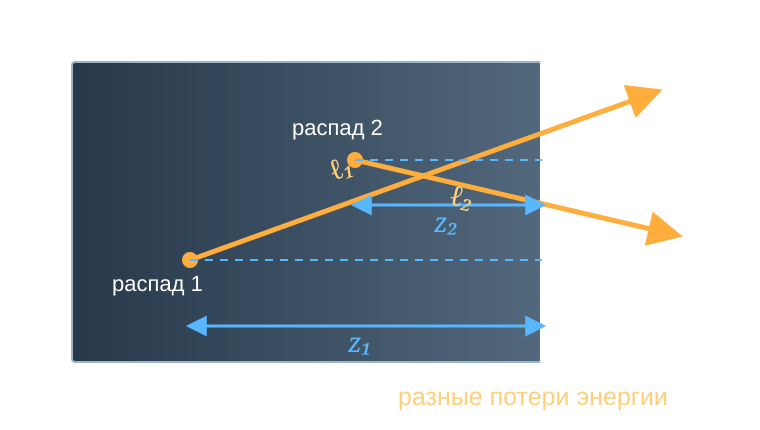

# У нейтрино есть масса
## У нейтрино есть ненулевая масса
- Осцилляции нейтрино надежно наблюдаются. Следовательно
$$
\Delta m^2_{ij}\ne 0.
$$
- Масса нейтрино отлична от нуля, а также $m_i\ne m_j$.
- Как измерить массы, а не разности квадратов масс?

## Метод измерения массы нейтрино в $\beta$-распадах
- Идея измерения формы $\beta$-спектра для определения массы нейтрино предложена Перреном (1933) и Ферми (1934)
- Первые эксперименты с использованием этого метода выполнены Курраном, Ангусом и Кокрофтом (1948) и Ханной и Понтекорво (1949)

## Суть метода {#beta-endpoint-spectrum}

Для одного массового состояния нейтрино:

$$
\frac{d\Gamma}{dE}
\propto
\underbrace{F(Z,E)}_{\substack{\text{кулоновская}\\\text{поправка}}}\,
\underbrace{\sqrt{E^2+2m_eE}}_{p_e}\,
\underbrace{(E+m_e)}_{E_e}\,
\underbrace{(E_0-E)}_{E_\nu}\,
\underbrace{\sqrt{(E_0-E)^2-m_\nu^2}}_{p_\nu}\,
\Theta(E_0-E-m_\nu),
$$

где $E$ — кинетическая энергия электрона, $E_0$ - максимально возможная энергия электрона при условии $m_\nu=0$.



## Функция Ферми $F(Z,E;A)$ {#fermi-function}

:::: {.panel-tabset .story-tabs .fermi-function-tabs}

### Конечное состояние

Для свободных частиц удобно вычислить спектр с плоскими волнами. Для нейтрино
это хорошее приближение, но заряженный лептон рождается внутри кулоновского
поля дочернего ядра. Поэтому плоская электронная волна не является состоянием
конечного гамильтониана:

$$
\left[
\boldsymbol\alpha\cdot\mathbf p+\beta m_e+V_C(r)
\right]\psi^{(-)}_{E_e\mathbf p}(\mathbf r)
=E_e\psi^{(-)}_{E_e\mathbf p}(\mathbf r),
\qquad
V_C(r)\simeq-\frac{Z_d\alpha}{r}.
$$

Для разрешённого перехода, $p_eR\ll1$ и $p_\nu R\ll1$, слабая вершина
зондирует электронную волну в области ядра:

$$
\mathcal M_{fi}\simeq
\psi_{E_e\mathbf p}^{(-)*}(R)\,\mathcal M_{\mathrm{nucl}},
\qquad
\boxed{
F(Z_d,E_e;A)=
\frac{|\psi_C^{(-)}(R)|^2}{|\psi_{\mathrm{pw}}(R)|^2}
}.
$$

То есть простой результат не выбрасывают, а умножают на вычисляемое отношение
плотностей волны в области слабой вершины:

$$
\boxed{
\frac{d\Gamma_C}{dE_e}
=F(Z_d,E_e;A)\frac{d\Gamma_{\mathrm{pw}}}{dE_e}
}.
$$

$F$ — не феноменологическая «потеря энергии после распада»: она исправляет
**матричный элемент**, а не фазовое пространство нейтрино.

### Кулоновская фокусировка

Обратим картину во времени: медленный электрон с заданным асимптотическим
импульсом падает на положительное ядро. Притяжение повышает плотность его
волны у ядра. Поэтому для $\beta^-$-распада

$$
\eta=\frac{Z_d\alpha}{\beta_e},
\qquad
\boxed{
F_{\mathrm{NR}}(Z_d,E_e)
=\frac{2\pi\eta}{1-e^{-2\pi\eta}}>1
},
\qquad
\beta_e=\frac{p_e}{E_e}.
$$

При $\beta_e\ll1$ имеем $F_{\mathrm{NR}}\simeq2\pi Z_d\alpha/\beta_e$:
это кулоновское усиление Зоммерфельда. Для $\beta^+$ знак потенциала меняется,
волна дефокусируется и $F<1$.

### Спектры $\beta^-$ и $\beta^+$

Для разрешённого перехода и $m_\nu=0$:

$$
\frac{d\Gamma_\mp}{dK}\propto
F(\pm Z_d,E_e;A)\,p_eE_e(E_0-K)^2,
\qquad E_e=K+m_e.
$$



### Релятивистский вид

Для точечного ядра решение уравнения Дирака даёт

$$
\boxed{
F_0(Z_d,E_e;R)=
\frac{2(1+\gamma)}{\Gamma(2\gamma+1)^2}
(2p_eR)^{2(\gamma-1)}
e^{\pi\eta}|\Gamma(\gamma+i\eta)|^2
},
$$

$$
\gamma=\sqrt{1-(Z_d\alpha)^2},
\qquad
\eta=\frac{Z_d\alpha E_e}{p_e},
\qquad
R\simeq r_0A^{1/3}.
$$

Поэтому краткая запись $F(Z,A)$ скрывает энергетическую зависимость:
фактически $F=F(Z_d,E_e;R(A))$. В точном расчёте используют конечное
распределение заряда ядра, экранировку и радиационные поправки.

### Причинность

Термин «поправка на конечное состояние» иногда иллюстрируют так: электрон
сначала вылетел с одной энергией, затем затормозился и пришёл на бесконечность
с меньшей. Такая последовательная картина вводит в заблуждение: свободного
электрона «до поправки» не было.

Кулоновское конечное состояние сразу задаётся асимптотической энергией $E_e$.
Точно и в квазиклассическом пределе соответственно:

$$
H_C\psi_{E_e}=E_e\psi_{E_e},
\qquad
E_e=\sqrt{\boldsymbol\pi^2(r)+m_e^2}+V_C(r)=\mathrm{const},
\qquad V_C(\infty)=0.
$$

Для $\beta^-$ имеем $V_C<0$: вблизи ядра локальная кинетическая энергия
больше и убывает при удалении, но полная $E_e$ остаётся той же. Для $\beta^+$
знак эффекта противоположен.

В $S$-матрице эта же асимптотическая $E_e$ входит в закон сохранения энергии:

$$
\int dt\,e^{i(E_f+E_e+E_\nu-E_i)t}
=2\pi\delta(E_i-E_f-E_e-E_\nu).
$$

Поэтому $F(Z_d,E_e)$ меняет амплитуду и вероятности разных разбиений энергии,
но ничего не перераспределяет «после распада». У трития $F$ входит в медленный
множитель $C(E)$ и не сдвигает границу $E_{\max}=E_0-m_\nu$.

::: {.takeaway}
$F$ исправляет конечное состояние, а не энергию уже испущенных частиц.
:::

::::

::: {.absolute bottom=10 left=50 width=1450 style="font-size: 0.58em;"}
[Hayen et al., *Rev. Mod. Phys.* **90**, 015008 (2018)](https://doi.org/10.1103/RevModPhys.90.015008) ·
[Hill, Plestid, *Phys. Rev. Lett.* **133**, 021803 (2024)](https://doi.org/10.1103/PhysRevLett.133.021803)
:::

## Экспериментальные требования {#endpoint-resolution}

Нужны высокая статистика у конца спектра и малое, хорошо известное $\sigma_E$.

$$
\begin{aligned}
\frac{d\Gamma_{\mathrm{rec}}}{dE_{\mathrm{rec}}}
&=
\int_0^{E_0-m_\nu}
R(E_{\mathrm{rec}}\mid E;\sigma_E)\,
\frac{d\Gamma}{dE}\,dE,
\\
R(E_{\mathrm{rec}}\mid E;\sigma_E)
&=
\frac{1}{\sqrt{2\pi}\sigma_E}
\exp\left[
-\frac{(E_{\mathrm{rec}}-E)^2}{2\sigma_E^2}
\right].
\end{aligned}
$$



# Что измеряет $\beta$-спектр?

## Масса, флэйвор и конечное состояние

:::: {.panel-tabset .story-tabs}

### Состояния

Слабое взаимодействие рождает электронное антинейтрино:

$$
|\bar\nu_e\rangle=\sum_i V_{ei}|\bar\nu_i\rangle.
$$

$|\bar\nu_i\rangle$ — состояние с определённой массой $m_i$;
$V_{ei}$ — элемент матрицы смешивания. В каждом массовом канале

$$
E_{\nu,i}^2=p_{\nu,i}^2+m_i^2.
$$

Кинематический эксперимент чувствителен к массам $m_i$, хотя частица
рождается электронным антинейтрино.

### Почему сумма?

Конечные состояния с разными массами ортогональны:

$$
\langle\bar\nu_j|\bar\nu_i\rangle=\delta_{ij}.
$$

Нейтрино не регистрируется. После суммирования по ненаблюдаемому конечному
состоянию интерференционные члены исчезают:

$$
\sum_i\left|V_{ei}\mathcal M_i\right|^2
=\sum_i|V_{ei}|^2|\mathcal M_i|^2.
$$

Поэтому в $\beta$-спектре складываются **вероятности**, а не амплитуды.

### Спектр

Обозначим

$$
E_\nu=E_0-E,
\qquad
C(E)\propto F(Z,E)p_e(E+m_e).
$$

Тогда

$$
\boxed{
\frac{d\Gamma}{dE}
=C(E)\sum_i|V_{ei}|^2
E_\nu\sqrt{E_\nu^2-m_i^2}\,
\Theta(E_\nu-m_i)
}.
$$

Каждое массовое состояние заканчивается при $E_{\max,i}=E_0-m_i$.

### Разрешение

Если энергетическое разрешение лучше разделения масс, спектр содержит
несколько изломов:

$$
\sigma_E\lesssim |m_i-m_j|.
$$

Для трёх лёгких нейтрино $|m_i-m_j|\lesssim5\cdot10^{-2}~\mathrm{эВ}$,
что намного меньше разрешения современных тритиевых экспериментов.

Отдельные пороги сливаются в один эффективный конец спектра.

::::

## Разрешённые массовые пороги {#resolved-mass-spectrum}

В учебном примере массы искусственно увеличены до кэВ, чтобы пороги были видны.



## Эффективная масса $m_\beta$

Если пороги не разрешаются и $E_\nu\gg m_i$, то

$$
\begin{aligned}
\sum_i|V_{ei}|^2\sqrt{E_\nu^2-m_i^2}
&\simeq E_\nu\sum_i|V_{ei}|^2
\left(1-\frac{m_i^2}{2E_\nu^2}\right)
\\
&=E_\nu\left[
1-\frac{1}{2E_\nu^2}\sum_i|V_{ei}|^2m_i^2
\right].
\end{aligned}
$$

Сравнивая это с

$$
\sqrt{E_\nu^2-m_\beta^2}
\simeq E_\nu\left(1-\frac{m_\beta^2}{2E_\nu^2}\right),
$$

получаем

$$
\boxed{m_\beta^2=\sum_i|V_{ei}|^2m_i^2}.
$$

## График Кури {#kurie-plot}

Для разрешённого перехода уберём медленно меняющиеся множители:

$$
K(E)\equiv
\left[
\frac{d\Gamma/dE}{F(Z,E)p_e(E+m_e)}
\right]^{1/2}.
$$

При $m_\beta=0$ получаем прямую $K(E)=E_0-E$; ненулевая масса
искривляет её и сдвигает конец.



::: {.marginnote .absolute top=55 left=1420 width=275 style="--note-font-size: 0.62em;"}
Кури, не Кюри
График предложил Франц Ньюэлл Деверё Кури
(*Franz N. D. Kurie*).

Кюри — Мария.
:::

## Конечные возбуждённые состояния

:::: {.columns}

::: {.column width="60%"}

После распада молекула может оказаться в состоянии $j$ с энергией
возбуждения $V_j$ и вероятностью $W_j$:

$$
E_{\nu,j}=E_0-E-V_j,
\qquad
\sum_jW_j=1.
$$

Тогда

$$
\frac{d\Gamma}{dE}
=C(E)\sum_jW_j\sum_i|V_{ei}|^2
E_{\nu,j}\sqrt{E_{\nu,j}^2-m_i^2}\,
\Theta(E_{\nu,j}-m_i).
$$

При неразрешённых массовых порогах

$$
\frac{d\Gamma}{dE}
\simeq C(E)\sum_jW_j
E_{\nu,j}\sqrt{E_{\nu,j}^2-m_\beta^2}\,
\Theta(E_{\nu,j}-m_\beta).
$$

:::

::: {.column width="40%"}

{fig-alt="Распределения конечных молекулярных состояний после бета-распада T2 и DT" width="100%"}

<small>[M. Kleesiek et al., *EPJ C* **79**, 204 (2019), Fig. 3](https://doi.org/10.1140/epjc/s10052-019-6686-7), CC BY 4.0.</small>

:::

::::

# Тритий

## Почему выбран тритий?

:::: {.panel-tabset .story-tabs}

### Распад

$$
{}^3\mathrm H
\to{}^3\mathrm{He}^{+}+e^-+\bar\nu_e,
\qquad
E_0\simeq18.6~\mathrm{кэВ}.
$$

- малый $E_0$: относительная доля событий у конца велика;
- сверхразрешённый переход: ядерный матричный элемент почти не меняет форму;
- $T_{1/2}=12.32$ года: высокая удельная активность и стабильный источник;
- лёгкая система: отдача и молекулярные состояния точно вычисляются.

### Цена статистики

У конца разрешённого спектра при $m_\beta=0$

$$
\frac{d\Gamma}{dE}\propto(E_0-E)^2.
$$

Поэтому доля распадов в последнем интервале $\Delta E$ оценивается как

$$
f(\Delta E)
\simeq
\frac{\int_{E_0-\Delta E}^{E_0}(E_0-E)^2dE}
{\int_0^{E_0}(E_0-E)^2dE}
=\left(\frac{\Delta E}{E_0}\right)^3.
$$

Для $\Delta E=1~\mathrm{эВ}$ это всего

$$
f\sim1.6\cdot10^{-13}.
$$

### Атом или молекула?

В KATRIN используется молекулярный тритий:

$$
\mathrm T_2\to{}^3\mathrm{HeT}^{+}+e^-+\bar\nu_e.
$$

Молекулу удобно хранить и непрерывно прокачивать, но дочерний ион получает
вращательное, колебательное или электронное возбуждение.

Неизмеренная энергия $V_j$ вычитается из энергии нейтрино:

$$
E_{\nu,j}=E_0-E-V_j.
$$

Поэтому распределение конечных состояний входит непосредственно в модель спектра.

::::

# От 30 эВ к KATRIN

## Что изменили эксперименты 1980-х?

:::: {.panel-tabset .story-tabs}

### ИТЭФ

В эксперименте группы В. А. Любимова использовались

- твёрдый источник — тонкая плёнка тритированного валина;
- магнитный спектрометр Третьякова с высокой светосилой;
- измерение формы последних сотен электронвольт $\beta$-спектра.

В 1980 году группа сообщила

$$
m_{\bar\nu_e}\simeq30~\mathrm{эВ}.
$$

Дефицит электронов у конца спектра интерпретировали как кинематический эффект
массы нейтрино.

### Плёнка

:::: {.columns}

::: {.column width="48%"}

{fig-alt="Электроны рождаются на разной глубине твёрдой плёнки и проходят в ней разные пути" width="100%"}

:::

::: {.column width="52%"}

Электрон рождается на глубине $z$ и вылетает под углом $\theta$ к нормали.
Его путь в веществе равен

$$
\ell=\frac{z}{\cos\theta},
\qquad
E_{\mathrm{det}}=E-\Delta E(\ell).
$$

Поэтому наблюдаемый спектр содержит свёртку с распределением потерь $L$:

$$
S_{\mathrm{obs}}(E)
=\int L(\Delta E)S_\beta(E+\Delta E)\,d\Delta E.
$$

Неоднородность толщины, шероховатость и состав плёнки меняют $L(\Delta E)$.
Ошибка в этой функции искажает конец спектра и может имитировать массу.

:::

::::

### Проверки

Результат проверяли в Лос-Аламосе, Цюрихе, Майнце и Троицке.
Масса около $30~\mathrm{эВ}$ не подтвердилась.

Главный урок: одного энергетического разрешения недостаточно. Конец спектра
искажают эффекты, похожие на массу:

$$
\text{потери энергии}
+\text{конечные состояния}
+\text{функция отклика}.
$$

Источник и спектрометр необходимо калибровать и моделировать вместе.

### Две технологии

Следующее поколение объединило

$$
\boxed{\text{безоконный газовый источник }\mathrm T_2}
\qquad+\qquad
\boxed{\text{MAC-E-фильтр}}.
$$

Газовый источник устраняет подложку. MAC-E-фильтр сочетает большой телесный
угол с суб-эВ энергетическим разрешением.

Эта комбинация была развита в Майнце и Троицке и масштабирована в KATRIN.

::::

::: {.absolute bottom=10 left=50 width=1450 style="font-size: 0.42em;"}
[В. А. Любимов и др., *Phys. Lett. B* **94**, 266 (1980)](https://doi.org/10.1016/0370-2693(80)90873-4) ·
[G. Drexlin, C. Weinheimer, обзор KATRIN (2026)](https://arxiv.org/abs/2601.00248)
:::
