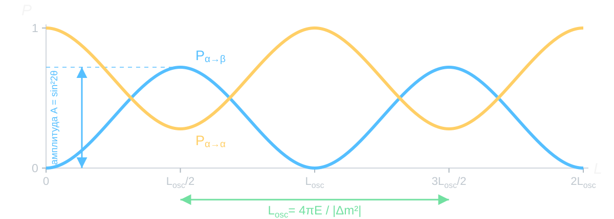

<!-- # Маршрут лекции

## От стационарного состояния к осцилляциям

:::: {.panel-tabset .story-tabs}

### Определённая энергия

- Собственное состояние гамильтониана приобретает только общую фазу.
- Вероятности результатов измерения не меняются со временем.
- Наблюдаемая динамика требует относительных фаз.

### Два флэйвора

- Флэйворное состояние — суперпозиция двух массовых состояний.
- Вывод амплитуд появления и выживания.
- Ультрарелятивистский и нерелятивистский пределы.

### Численная картина

- Амплитуда задаётся углом смешивания.
- Период задаётся разностью квадратов масс.
- Вероятности организуются естественным образом как функции $L/E$.

### Маятники

- Нормальные моды играют роль состояний с определённой энергией.
- Локальное возбуждение является их суперпозицией.
- Биения приводят к передаче энергии между маятниками.

::::

## От двух нейтрино к трём

:::: {.panel-tabset .story-tabs}

### Три флэйвора

- Матрица PMNS связывает флэйворный и массовый базисы.
- Три массовые компоненты приобретают разные фазы.
- Общая формула содержит две независимые разности квадратов масс.

### CP-нарушение

- Для антинейтрино комплексная матрица смешивания сопрягается.
- CP-нечётная часть выражается через инвариант Ярлског.
- В двухфлэйворном приближении фундаментального CP-нарушения нет.

### Современный статус

- Углы смешивания и разности квадратов масс.
- Фаза $\delta_{\rm CP}$, октант $\theta_{23}$ и порядок масс.
- Числа и профили $\Delta\chi^2$ из актуального NuFIT.

### Главный итог

- Флэйвор — базис рождения и регистрации.
- Масса — базис свободного распространения.
- Осцилляции возникают из смешивания и относительного набега фаз.

:::: -->

# Простыми словами

::: {.takeaway}
**Нейтринные осцилляции** — (квази)периодическое изменение вероятности обнаружить
распространяющееся нейтрино с тем или иным флэйвором.
:::

$$
\nu_\alpha
\quad\xrightarrow{\qquad L\qquad}\quad
\begin{cases}
\nu_\alpha & \text{с вероятностью }P_{\alpha\to\alpha}(L,E),\\[2mm]
\nu_\beta  & \text{с вероятностью }P_{\alpha\to\beta}(L,E).
\end{cases}
$$

- В простейшей двухфлэйворной системе эти вероятности **периодичны** по $L/E$.
- Для трёх флэйворов накладываются несколько осцилляционных частот.

::: {.small}
**Что именно осциллирует?** Не масса и не «вещество» нейтрино, а вероятности
результатов флэйворного измерения.
:::

# Нейтрино — квантовый хамелеон

## Квантовый хамелеон {#quantum-chameleon}



## Периодичность — в вероятностях {#oscillation-phases}

<video
  class="slide-video media-width-full"
  style="--media-width: 96%; --media-max-height: 650px;"
  data-autoplay
  autoplay
  loop
  muted
  playsinline
  controls
  preload="auto"
  aria-label="Две массовые фазы нейтрино и возникающие вероятности осцилляций"
  src="assets/05_vacuum_oscillations/neutrino_oscillation_phases.mp4">
</video>

# Когда осцилляций нет

## Состояние с определённой энергией

::: {.marginnote .absolute top=160 left=1215 width=285 style="--note-font-size: 0.62em;"}
 $\hbar=c=1$, 
 гамильтониан  не зависит 
  от времени.
:::

:::: {.panel-tabset .story-tabs .energy-derivation-tabs}

### Начало

Состояние имеет **определённую энергию** $E$, если оно является собственным
состоянием гамильтониана:

$$
\widehat{H}|E\rangle=E|E\rangle.
$$

Пусть в начальный момент

$$
|\psi(0)\rangle=|E\rangle.
$$

Его эволюция определяется уравнением

$$
i\frac{d}{dt}|\psi(t)\rangle=\widehat{H}|\psi(t)\rangle.
$$

### Подстановка

Ищем решение в виде

$$
|\psi(t)\rangle=f(t)|E\rangle.
$$

Подстановка даёт

$$
i\dot f(t)|E\rangle
=
f(t)\widehat{H}|E\rangle
=
E f(t)|E\rangle,
$$

то есть

$$
i\dot f(t)=Ef(t).
$$

### Решение

При начальном условии $f(0)=1$:

$$
f(t)=e^{-iEt}.
$$

Следовательно,

$$
\boxed{
|\psi(t)\rangle=e^{-iEt}|E\rangle
}.
$$

Зависимость от времени есть, но всё состояние умножается на один и тот же
фазовый множитель.

### Физический вывод

$$
|\psi(t)\rangle=e^{-iEt}|\psi(0)\rangle.
$$

Число $e^{-iEt}$ имеет единичный модуль:

$$
\left|e^{-iEt}\right|=1.
$$

Оно меняет представление вектора состояния, но не меняет ни одной
вероятности измерения.

::: {.takeaway}
Собственное состояние энергии приобретает только общую фазу и потому
физически стационарно.
:::

::::

## Почему общая фаза не наблюдаема

Пусть $|a\rangle$ — произвольный возможный результат измерения.

:::: {.panel-tabset .story-tabs .energy-derivation-tabs}

### Вероятность

Амплитуда результата $a$:

$$
\langle a|\psi(t)\rangle
=
e^{-iEt}\langle a|E\rangle.
$$

По правилу Борна:

$$
\begin{aligned}
P(a,t)
&=
\left|\langle a|\psi(t)\rangle\right|^2
\\
&=
\left|e^{-iEt}\right|^2
\left|\langle a|E\rangle\right|^2
\\
&=
P(a,0).
\end{aligned}
$$

### Среднее

Для любого оператора $A$ без явной зависимости от времени:

$$
\begin{aligned}
\langle A\rangle_t
&=
\langle\psi(t)|A|\psi(t)\rangle
\\
&=
e^{+iEt}e^{-iEt}
\langle E|A|E\rangle
\\
&=
\langle A\rangle_0.
\end{aligned}
$$

Фазы бра и кета взаимно сокращаются.

### Матрица $\rho$

Физическое чистое состояние можно записать как

$$
\rho(t)=|\psi(t)\rangle\langle\psi(t)|.
$$

Для состояния с определённой энергией

$$
\begin{aligned}
\rho(t)
&=e^{-iEt}|E\rangle\langle E|e^{+iEt}
\\
&=|E\rangle\langle E|
=\rho(0).
\end{aligned}
$$

Значит, начальное и эволюционировавшее состояния физически неразличимы.

### Вывод

Состояния

$$
|\psi\rangle
\quad\text{и}\quad
e^{i\varphi}|\psi\rangle
$$

описывают один и тот же физический луч в гильбертовом пространстве.

::: {.takeaway}
Наблюдаема не сама фаза квантовой амплитуды, а разность фаз между
компонентами суперпозиции.
:::

::::

## Что может осциллировать?

::: {.question}
Обе волновые функции зависят от времени. Почему слева ничего наблюдаемого
не меняется, а справа вероятность осциллирует?
:::



## Суперпозиция двух энергий

:::: {.panel-tabset .story-tabs .energy-derivation-tabs}

### Начало

Рассмотрим нормированную суперпозицию двух состояний с разными энергиями:

$$
|\psi(0)\rangle
=
c_1|E_1\rangle+c_2|E_2\rangle,
\qquad
|c_1|^2+|c_2|^2=1,
$$

где

$$
\widehat{H}|E_i\rangle=E_i|E_i\rangle,
\qquad E_1\ne E_2.
$$

Измерение энергии по-прежнему даёт постоянные вероятности

$$
P(E_1)=|c_1|^2,
\qquad
P(E_2)=|c_2|^2.
$$

### Эволюция

Каждая компонента приобретает собственную фазу:

$$
|\psi(t)\rangle
=
c_1e^{-iE_1t}|E_1\rangle
+
c_2e^{-iE_2t}|E_2\rangle.
$$

Теперь нельзя вынести один фазовый множитель так, чтобы внутри скобок
осталось начальное состояние.

У двух компонент разные угловые скорости вращения в комплексной плоскости:

$$
\omega_1=E_1,
\qquad
\omega_2=E_2.
$$

### Относит. фаза

Вынесем фазу первой компоненты:

$$
|\psi(t)\rangle
=
e^{-iE_1t}
\left[
c_1|E_1\rangle
+
c_2e^{-i(E_2-E_1)t}|E_2\rangle
\right].
$$

Общий множитель $e^{-iE_1t}$ не наблюдаем. Внутри скобок остаётся
относительная фаза

$$
\boxed{
\Delta\phi(t)\equiv\phi_2-\phi_1=-\Delta E\,t,
\qquad
\Delta E=E_2-E_1
}.
$$

### Что осциллирует

Распределение энергии не меняется:

$$
P(E_i,t)=|c_i|^2.
$$

Но амплитуда любого состояния
$|a\rangle$, содержащего обе энергетические компоненты, включает
интерференцию:

$$
\langle a|\psi(t)\rangle
=
c_1e^{-iE_1t}\langle a|E_1\rangle
+
c_2e^{-iE_2t}\langle a|E_2\rangle.
$$

Поэтому $P(a,t)$ может зависеть от $\Delta E\,t$.

::: {.takeaway}
Для осцилляций нужны как минимум две компоненты с разными энергиями и
измерение в базисе, отличном от энергетического.
:::

::::

## Двухуровневая система: полный результат

:::: {.panel-tabset .story-tabs .energy-derivation-tabs}

### Базисы

Введём ортонормированный базис наблюдаемых состояний как поворот
энергетического базиса:

$$
\begin{pmatrix}
|\alpha\rangle\\[2pt]
|\beta\rangle
\end{pmatrix}
=
\begin{pmatrix}
\cos\theta & \sin\theta\\
-\sin\theta & \cos\theta
\end{pmatrix}
\begin{pmatrix}
|E_1\rangle\\[2pt]
|E_2\rangle
\end{pmatrix}.
$$

То есть

$$
\begin{aligned}
|\alpha\rangle
&=c_\theta|E_1\rangle+s_\theta|E_2\rangle,
\\
|\beta\rangle
&=-s_\theta|E_1\rangle+c_\theta|E_2\rangle,
\end{aligned}
$$

где $c_\theta\equiv\cos\theta$ и $s_\theta\equiv\sin\theta$.

### Эволюция

Пусть в момент $t=0$ приготовлено состояние $|\alpha\rangle$:

$$
|\psi(0)\rangle=|\alpha\rangle
=c_\theta|E_1\rangle+s_\theta|E_2\rangle.
$$

Через время $t$:

$$
|\psi(t)\rangle
=
c_\theta e^{-iE_1t}|E_1\rangle
+
s_\theta e^{-iE_2t}|E_2\rangle.
$$

В энергетическом базисе меняются только фазы. В базисе
$(|\alpha\rangle,|\beta\rangle)$ меняются вероятности.

### Амплитуда

Амплитуда перехода $\alpha\to\beta$:

$$
\begin{aligned}
\mathcal A_{\alpha\to\beta}(t)
&=\langle\beta|\psi(t)\rangle
\\
&=s_\theta c_\theta
\left(e^{-iE_2t}-e^{-iE_1t}\right).
\end{aligned}
$$

Введём

$$
\overline E=\frac{E_1+E_2}{2},
\qquad
\Delta E=E_2-E_1.
$$

Тогда

$$
\boxed{
\mathcal A_{\alpha\to\beta}(t)
=
-i\,e^{-i\overline E t}
\sin2\theta\,
\sin\frac{\Delta E\,t}{2}
}.
$$

### Вероятности

Общая фаза $e^{-i\overline E t}$ исчезает при вычислении квадрата модуля:

$$
\boxed{
P_{\alpha\to\beta}(t)
=
\sin^22\theta\,
\sin^2\left(\frac{\Delta E\,t}{2}\right)
}.
$$

Амплитуда выживания равна

$$
\mathcal A_{\alpha\to\alpha}(t)
=
c_\theta^2e^{-iE_1t}
+s_\theta^2e^{-iE_2t},
$$

а вероятность

$$
\boxed{
P_{\alpha\to\alpha}(t)
=1-P_{\alpha\to\beta}(t)
}.
$$

### Итог

:::: {.columns}

::: {.column width="52%"}

**Амплитуда перехода**

$$
P_{\alpha\to\beta}^{\max}
=\sin^22\theta.
$$

- $\theta=0$: базисы совпадают;
- $\theta=\pi/4$: возможен полный переход.

:::

::: {.column width="48%"}

**Период вероятности**

$$
T_{\mathrm{osc}}
=\frac{2\pi}{|\Delta E|}.
$$

- $\Delta E=0$: относительная фаза не набегает;
- чем больше $|\Delta E|$, тем быстрее осцилляции.

:::

::::

::: {.takeaway}
Смешивание определяет глубину осцилляций, а расщепление энергий — их частоту.
:::

::::

# Два флэйвора

## Что означает флэйвор

Флэйвор нейтрино определяется **заряженным лептоном** в слабом взаимодействии:

$$
W^+\longrightarrow \ell_\alpha^++\nu_\alpha,
\qquad
\nu_\alpha+N\longrightarrow \ell_\alpha^-+X,
$$

где $\alpha=e,\mu,\tau$ и $\ell_\alpha=e,\mu,\tau$.

:::: {.columns}

::: {.column width="48%"}

**Рождение**

Наблюдаемый лептон $\ell_\alpha$ задаёт приготовленное состояние
$|\nu_\alpha\rangle$.

:::

::: {.column width="52%"}

**Регистрация**

Лептон $\ell_\beta$ в во взаимодействии по каналу с обменом $W$ бозоном означает регистрацию флэйвора $\nu_\beta$.

:::

::::

::: {.takeaway}
Флэйвор — базис рождения и регистрации. Масса — базис свободного
распространения.
:::

## Два базиса

:::: {.panel-tabset .story-tabs .energy-derivation-tabs}

### Массовый базис

Свободный гамильтониан диагонален в базисе массовых состояний:

$$
\widehat H_0|\nu_i\rangle=E_i|\nu_i\rangle,
\qquad
E_i(p)=\sqrt{p^2+m_i^2},
\qquad i=1,2.
$$

Состояния $|\nu_1\rangle$ и $|\nu_2\rangle$ имеют определённые массы и при
распространении приобретают фазы $e^{-iE_it}$.

### Поворот базиса

В двухфлэйворном приближении

$$
\boxed{
\begin{pmatrix}
|\nu_\alpha\rangle\\[2pt]
|\nu_\beta\rangle
\end{pmatrix}
=
\begin{pmatrix}
\cos\theta & \sin\theta\\
-\sin\theta & \cos\theta
\end{pmatrix}
\begin{pmatrix}
|\nu_1\rangle\\[2pt]
|\nu_2\rangle
\end{pmatrix}
}.
$$

То есть

$$
|\nu_\alpha\rangle=c_\theta|\nu_1\rangle+s_\theta|\nu_2\rangle,
\qquad
|\nu_\beta\rangle=-s_\theta|\nu_1\rangle+c_\theta|\nu_2\rangle.
$$

### Поворот

Поскольку матрица поворота ортогональна,

$$
\begin{aligned}
|\nu_1\rangle
&=c_\theta|\nu_\alpha\rangle-s_\theta|\nu_\beta\rangle,
\\
|\nu_2\rangle
&=s_\theta|\nu_\alpha\rangle+c_\theta|\nu_\beta\rangle.
\end{aligned}
$$

- $\theta=0$: флэйворный и массовый базисы совпадают;
- $\theta=\pi/4$: каждое флэйворное состояние содержит равные доли двух масс.

### Гамильтониан

Во флэйворном базисе

$$
H_f
=\overline E\,I
+\frac{\Delta E}{2}
\begin{pmatrix}
-\cos2\theta & \sin2\theta\\
\sin2\theta & \cos2\theta
\end{pmatrix},
$$

где

$$
\overline E=\frac{E_1+E_2}{2},
\qquad
\Delta E=E_2-E_1.
$$

Член $\overline E I$ даёт только общую фазу, а внедиагональные элементы
приводят к переходам между флэйворами.

::::

## Энергия флэйворного нейтрино

:::: {.panel-tabset .story-tabs .energy-derivation-tabs}

### Измерение

Пусть

$$
|\nu_\alpha\rangle
=c_\theta|\nu_1\rangle+s_\theta|\nu_2\rangle,
\qquad
\widehat H_0|\nu_i\rangle=E_i|\nu_i\rangle.
$$

При измерении энергии возможны два результата:

$$
\begin{aligned}
P_\alpha(E_1)
&=|\langle\nu_1|\nu_\alpha\rangle|^2=c_\theta^2,
\\
P_\alpha(E_2)
&=|\langle\nu_2|\nu_\alpha\rangle|^2=s_\theta^2.
\end{aligned}
$$

Флэйворное состояние не является состоянием с определённой энергией.

### $\langle H\rangle$

Используем ортонормированность
$\langle\nu_i|\nu_j\rangle=\delta_{ij}$:

$$
\begin{aligned}
\langle H_0\rangle_\alpha
&=\langle\nu_\alpha|\widehat H_0|\nu_\alpha\rangle
\\
&=(c_\theta\langle\nu_1|+s_\theta\langle\nu_2|)
(c_\theta E_1|\nu_1\rangle+s_\theta E_2|\nu_2\rangle)
\\
&=\boxed{c_\theta^2E_1+s_\theta^2E_2}.
\end{aligned}
$$

Перекрёстные члены исчезают, поскольку
$\langle\nu_1|\nu_2\rangle=0$.

### $\langle H^2\rangle$

Из уравнения на собственные значения следует

$$
\widehat H_0^2|\nu_i\rangle=E_i^2|\nu_i\rangle.
$$

Поэтому

$$
\begin{aligned}
\widehat H_0^2|\nu_\alpha\rangle
&=c_\theta E_1^2|\nu_1\rangle
+s_\theta E_2^2|\nu_2\rangle,
\\[3pt]
\langle H_0^2\rangle_\alpha
&=\boxed{c_\theta^2E_1^2+s_\theta^2E_2^2}.
\end{aligned}
$$

Это второй момент распределения результатов измерения энергии.

### Дисперсия

По определению

$$
\begin{aligned}
\operatorname{Var}_\alpha(H_0)
&=\langle H_0^2\rangle_\alpha-\langle H_0\rangle_\alpha^2
\\
&=c_\theta^2E_1^2+s_\theta^2E_2^2
-(c_\theta^2E_1+s_\theta^2E_2)^2
\\
&=c_\theta^2s_\theta^2(E_2-E_1)^2
\\
&=\boxed{\frac14\sin^22\theta\,(\Delta E)^2}.
\end{aligned}
$$

Стандартное отклонение равно

$$
\sigma_{E,\alpha}
=\frac12|\sin2\theta|\,|\Delta E|.
$$

### Смысл

Для второго флэйвора

$$
\langle H_0\rangle_\beta=s_\theta^2E_1+c_\theta^2E_2,
\qquad
\operatorname{Var}_\beta(H_0)
=\operatorname{Var}_\alpha(H_0).
$$

Дисперсия исчезает, если

$$
\sin2\theta=0
\qquad\text{или}\qquad
E_1=E_2.
$$

Ненулевая дисперсия означает, что в состоянии присутствуют компоненты с
двумя энергиями. **Энергия не осциллирует:** меняется их относительная фаза,
а распределение энергии остаётся постоянным.

::::

## Осцилляции во времени

:::: {.panel-tabset .story-tabs .energy-derivation-tabs}

### $t=0$

Пусть при $t=0$ рождено нейтрино флэйвора $\alpha$:

$$
|\psi(0)\rangle=|\nu_\alpha\rangle
=c_\theta|\nu_1\rangle+s_\theta|\nu_2\rangle.
$$

Это не состояние с определённой энергией, если
$\theta\ne0$ и $E_1\ne E_2$.

### Фазы

Каждая массовая компонента приобретает собственную фазу:

$$
|\psi(t)\rangle
=c_\theta e^{-iE_1t}|\nu_1\rangle
+s_\theta e^{-iE_2t}|\nu_2\rangle.
$$

Сами доли массовых состояний остаются постоянными:

$$
P(\nu_1)=c_\theta^2,
\qquad
P(\nu_2)=s_\theta^2.
$$

### Поворот

Чтобы вернуться во флэйворный базис, используем обратный поворот:

$$
\begin{aligned}
|\nu_1\rangle
&=c_\theta|\nu_\alpha\rangle-s_\theta|\nu_\beta\rangle,
\\
|\nu_2\rangle
&=s_\theta|\nu_\alpha\rangle+c_\theta|\nu_\beta\rangle.
\end{aligned}
$$

Подставим обе формулы в эволюционировавшее состояние:

$$
\begin{aligned}
|\psi(t)\rangle
&=c_\theta e^{-iE_1t}
\bigl(c_\theta|\nu_\alpha\rangle-s_\theta|\nu_\beta\rangle\bigr)
\\
&\quad+s_\theta e^{-iE_2t}
\bigl(s_\theta|\nu_\alpha\rangle+c_\theta|\nu_\beta\rangle\bigr).
\end{aligned}
$$

### Скобки

Раскроем скобки:

$$
\begin{aligned}
|\psi(t)\rangle
={}&c_\theta^2e^{-iE_1t}|\nu_\alpha\rangle
-s_\theta c_\theta e^{-iE_1t}|\nu_\beta\rangle
\\
&+s_\theta^2e^{-iE_2t}|\nu_\alpha\rangle
+s_\theta c_\theta e^{-iE_2t}|\nu_\beta\rangle.
\end{aligned}
$$

### Амплитуды

Собирая отдельно коэффициенты при двух флэйворах, получаем

$$
\begin{aligned}
|\psi(t)\rangle
={}&\underbrace{\left(c_\theta^2e^{-iE_1t}
+s_\theta^2e^{-iE_2t}\right)}_{\mathcal A_{\alpha\to\alpha}(t)}
|\nu_\alpha\rangle
\\
&+\underbrace{s_\theta c_\theta
\left(e^{-iE_2t}-e^{-iE_1t}\right)}_{\mathcal A_{\alpha\to\beta}(t)}
|\nu_\beta\rangle.
\end{aligned}
$$

При $t=0$: $\mathcal A_{\alpha\to\alpha}=1$ и
$\mathcal A_{\alpha\to\beta}=0$, как и должно быть.

::::

## От амплитуд к вероятностям

:::: {.panel-tabset .story-tabs .energy-derivation-tabs}

### Обозначения

Введём среднюю энергию и разность энергий:

$$
\overline E=\frac{E_1+E_2}{2},
\qquad
\Delta E=E_2-E_1.
$$

Отсюда

$$
E_1=\overline E-\frac{\Delta E}{2},
\qquad
E_2=\overline E+\frac{\Delta E}{2}.
$$

### Разность фаз

Используем следствие формулы Эйлера:

$$
e^{-ix}-e^{+ix}=-2i\sin x.
$$

Вынесем общую фазу $e^{-i\overline Et}$:

$$
\begin{aligned}
e^{-iE_2t}-e^{-iE_1t}
&=e^{-i\overline Et}
\left(e^{-i\Delta Et/2}-e^{+i\Delta Et/2}\right)
\\
&=-2i\,e^{-i\overline Et}
\sin\left(\frac{\Delta E\,t}{2}\right).
\end{aligned}
$$

Общая фаза имеет единичный модуль и не влияет на вероятность.

::::

## Вероятность появления

:::: {.panel-tabset .story-tabs .energy-derivation-tabs}

### Амплитуда

Подставим найденную разность фаз:

$$
\begin{aligned}
\mathcal A_{\alpha\to\beta}(t)
&=s_\theta c_\theta
\left(e^{-iE_2t}-e^{-iE_1t}\right)
\\
&=-2i\,s_\theta c_\theta\,e^{-i\overline Et}
\sin\left(\frac{\Delta E\,t}{2}\right)
\\
&=-i\sin2\theta\,e^{-i\overline Et}
\sin\left(\frac{\Delta E\,t}{2}\right),
\end{aligned}
$$

где использовано $2s_\theta c_\theta=\sin2\theta$.

### Квадрат модуля

Сначала заметим:

$$
|-i|^2=1,
\qquad
\left|e^{-i\overline Et}\right|^2
=e^{-i\overline Et}e^{+i\overline Et}=1.
$$

Поэтому

$$
\begin{aligned}
P_{\alpha\to\beta}(t)
&=|\mathcal A_{\alpha\to\beta}(t)|^2
\\
&=\sin^22\theta\,
\sin^2\left(\frac{\Delta E\,t}{2}\right).
\end{aligned}
$$

$$
\boxed{
P_{\alpha\to\beta}(t)
=\sin^22\theta\,
\sin^2\left(\frac{\Delta E\,t}{2}\right)
}.
$$

::::

## Вероятность выживания

:::: {.panel-tabset .story-tabs .energy-derivation-tabs}

### Общая фаза

Обозначим

$$
\phi=\frac{\Delta E\,t}{2}.
$$

Тогда

$$
\begin{aligned}
\mathcal A_{\alpha\to\alpha}(t)
&=c_\theta^2e^{-iE_1t}+s_\theta^2e^{-iE_2t}
\\
&=e^{-i\overline Et}
\left(c_\theta^2e^{+i\phi}+s_\theta^2e^{-i\phi}\right).
\end{aligned}
$$

### Формула Эйлера

Раскроем две экспоненты:

$$
\begin{aligned}
c_\theta^2e^{+i\phi}+s_\theta^2e^{-i\phi}
&=c_\theta^2(\cos \phi+i\sin \phi)
+s_\theta^2(\cos \phi-i\sin \phi)
\\
&=(c_\theta^2+s_\theta^2)\cos \phi
+i(c_\theta^2-s_\theta^2)\sin \phi
\\
&=\cos \phi+i\cos2\theta\sin \phi.
\end{aligned}
$$

Следовательно,

$$
\mathcal A_{\alpha\to\alpha}(t)
=e^{-i\overline Et}
\left(\cos \phi+i\cos2\theta\sin \phi\right).
$$

### Квадрат модуля

Общая фаза снова сокращается:

$$
\begin{aligned}
P_{\alpha\to\alpha}(t)
&=\left|\cos \phi+i\cos2\theta\sin \phi\right|^2
\\
&=\cos^2\phi+\cos^22\theta\sin^2\phi
\\
&=1-\left(1-\cos^22\theta\right)\sin^2\phi
\\
&=1-\sin^22\theta\sin^2\phi.
\end{aligned}
$$

$$
\boxed{
P_{\alpha\to\alpha}(t)
=1-\sin^22\theta\,
\sin^2\left(\frac{\Delta E\,t}{2}\right)
}.
$$

::::

## Проверки вероятностей

:::: {.panel-tabset .story-tabs .energy-derivation-tabs}

### Нормировка

В двухфлэйворной системе

$$
\boxed{
P_{\alpha\to\alpha}(t)+P_{\alpha\to\beta}(t)=1
}.
$$

В начальный момент

$$
P_{\alpha\to\alpha}(0)=1,
\qquad
P_{\alpha\to\beta}(0)=0.
$$

### Максимум

Поскольку $0\leq\sin^2(\Delta E\,t/2)\leq1$,

$$
P_{\alpha\to\beta}^{\max}=\sin^22\theta.
$$

Полное превращение возможно только при максимальном смешивании

$$
\theta=\frac{\pi}{4}
$$

и в максимумах осцилляционной фазы.

### Период

Вероятность содержит $\sin^2(\Delta E\,t/2)$, поэтому повторяется при

$$
\frac{|\Delta E|T_{\mathrm{osc}}}{2}=\pi.
$$

Следовательно,

$$
\boxed{
T_{\mathrm{osc}}=\frac{2\pi}{|\Delta E|}
}.
$$

::::

## От времени к расстоянию

:::: {.panel-tabset .story-tabs .energy-derivation-tabs}

### Фаза плоской волны

Для плоской волны массовая компонента в точке $(t,L)$ имеет фазу

$$
|\nu_i;t,L\rangle
=e^{-i(E_it-p_iL)}|\nu_i\rangle.
$$

Наблюдаемой является разность фаз:

$$
\boxed{
\Delta\phi(t,L)
=(E_2-E_1)t-(p_2-p_1)L
}.
$$

### Вероятность

Временная формула обобщается заменой

$$
\frac{\Delta E\,t}{2}
\longrightarrow
\frac{\Delta\phi(t,L)}{2}:
$$

$$
P_{\alpha\to\beta}(t,L)
=\sin^22\theta\,
\sin^2\frac{\Delta\phi(t,L)}{2}.
$$

Детектор находится на расстоянии $L$ и регистрирует событие в момент $t$.
Связь между ними задаётся скоростью нейтрино; для релятивистского нейтрино
$t\simeq L$ при $c=1$.

::::

## Ультрарелятивистский предел

:::: {.panel-tabset .story-tabs .energy-derivation-tabs}

### $E_i(p)$

Пусть обе массовые компоненты имеют общий импульс $p$:

$$
E_i=\sqrt{p^2+m_i^2}
=p+\frac{m_i^2}{2p}
+O\!\left(\frac{m_i^4}{p^3}\right).
$$

Разложение показывает, что различие энергий имеет порядок $m_i^2/p$.
Точное вычисление разности выполним в следующей вкладке.

### $\Delta E$

Домножим разность энергий на сопряжённую сумму:

$$
\begin{aligned}
\Delta E
&=E_2-E_1
\\
&=\frac{(E_2-E_1)(E_2+E_1)}{E_2+E_1}
\\
&=\frac{E_2^2-E_1^2}{E_2+E_1}
\\
&=\frac{(p^2+m_2^2)-(p^2+m_1^2)}{E_2+E_1}
\\
&=\boxed{\frac{\Delta m^2}{E_2+E_1}},
\qquad
\Delta m^2=m_2^2-m_1^2.
\end{aligned}
$$

### УР-предел

В ультрарелятивистском пределе $E_1\simeq E_2\simeq E\simeq p$,
поэтому

$$
\boxed{
\Delta E\simeq\frac{\Delta m^2}{2E}
}.
$$

При $t\simeq L$ получаем
$\Delta\phi\simeq\Delta m^2L/(2E)$.

### $E_1=E_2$

Можно вместо этого положить $E_1=E_2=E$. Тогда

$$
\begin{aligned}
p_i&=\sqrt{E^2-m_i^2}
\simeq E-\frac{m_i^2}{2E},
\\
\Delta p&\simeq-\frac{\Delta m^2}{2E}.
\end{aligned}
$$

Поскольку теперь $\Delta E=0$,

$$
\Delta\phi=-\Delta p\,L
\simeq\frac{\Delta m^2L}{2E}.
$$

Оба предположения дают одинаковую фазу в ведущем порядке.

### $P(L,E)$

В аргумент вероятности входит половина относительной фазы:

$$
\boxed{
P_{\alpha\to\beta}(L,E)
=\sin^22\theta\,
\sin^2\left(\frac{\Delta m^2L}{4E}\right)
},
$$

$$
\boxed{
P_{\alpha\to\alpha}(L,E)
=1-P_{\alpha\to\beta}(L,E)
}.
$$

Кинематика входит только через $L/E$; знак $\Delta m^2$ не влияет на
двухфлэйворную вероятность в вакууме.

### Единицы

Восстанавливая $\hbar c$, получаем

$$
\boxed{
P_{\alpha\to\beta}
=\sin^22\theta\,
\sin^2\!\left[
1.267\,
\frac{\Delta m^2[\mathrm{эВ}^2]L[\mathrm{км}]}
{E[\mathrm{ГэВ}]}
\right]
}.
$$

Численный коэффициент тот же для пары единиц
$L[\mathrm{м}]$ и $E[\mathrm{МэВ}]$.

### График

{fig-alt="Вероятности появления и выживания, амплитуда смешивания и длина осцилляций" width="100%"}

::::

## Нерелятивистский предел

:::: {.panel-tabset .story-tabs .energy-derivation-tabs}

### $\Delta E(p)$

При общем импульсе $p$ временная частота осцилляций равна точной разности
энергий:

$$
\boxed{
\Delta E(p)
=\sqrt{p^2+m_2^2}-\sqrt{p^2+m_1^2}
=\frac{\Delta m^2}{E_2(p)+E_1(p)}
}.
$$

Это выражение справедливо при любой величине $p$.

### Разложение

При $p\ll m_i$ и $\Delta m=m_2-m_1$:

$$
\begin{aligned}
E_i
&=m_i+\frac{p^2}{2m_i}
+O\!\left(\frac{p^4}{m_i^3}\right),
\\[3pt]
\Delta E
&\simeq
\Delta m
+\frac{p^2}{2}
\left(\frac1{m_2}-\frac1{m_1}\right)
\\
&=
\Delta m\left(1-\frac{p^2}{2m_1m_2}\right).
\end{aligned}
$$

Итак, $\Delta E\simeq\Delta m$, а не $\Delta m^2/(2E)$.

### Фаза $pL$

При одинаковом импульсе $p_1=p_2=p$ каждая компонента имеет фазу

$$
|\nu_i;t,L\rangle
=e^{-i(E_it-pL)}|\nu_i\rangle.
$$

Поэтому относительная фаза равна

$$
\begin{aligned}
\Delta\phi(t,L)
&=(E_2-E_1)t-(p_2-p_1)L
\\
&=\Delta E(p)\,t-\underbrace{(p-p)L}_{0}
\\
&=\boxed{\Delta E(p)\,t}.
\end{aligned}
$$

Вклад от $pL$ сокращается в фазе.

### $P(t)$

Точная временная вероятность имеет вид

$$
P_{\alpha\to\beta}(t;p)
=\sin^22\theta\,
\sin^2\!\left[
\frac{t}{2}
\left(\sqrt{p^2+m_2^2}-\sqrt{p^2+m_1^2}\right)
\right].
$$

В нерелятивистском пределе, в ведущем порядке,

$$
\boxed{
P_{\alpha\to\beta}(t)
\simeq
\sin^22\theta\,
\sin^2\left(\frac{\Delta m\,t}{2}\right)
}.
$$

### Отличие

Если массы близки и время пролёта можно выразить через общую характерную
скорость $v\ll1$,

$$
t\simeq\frac{L}{v},
$$

то в ведущем порядке

$$
P_{\alpha\to\beta}(L)
\simeq
\sin^22\theta\,
\sin^2\left(\frac{\Delta m\,L}{2v}\right).
$$

Скорость входит явно: универсальная релятивистская зависимость только от
$L/E$ исчезает.

::::

## Когда осцилляций нет

:::: {.columns}

::: {.column width="33%"}

**Нет смешивания**

$$
\sin2\theta=0.
$$

Флэйворные состояния совпадают с массовыми с точностью до перестановки.

:::

::: {.column width="34%"}

**Нет расщепления**

$$
\Delta E=0,
$$

а в релятивистском пределе $\Delta m^2=0$. Относительная фаза не набегает.

:::

::: {.column width="33%"}

**Узел вероятности**

$$
\frac{\Delta m^2L}{4E}=n\pi.
$$

В частности, при $L=0$ переход ещё не успел произойти.

:::

::::

::: {.takeaway}
В первых двух случаях осцилляций нет вообще. В третьем переход исчезает
лишь в отдельных точках, но между ними вероятность меняется.
:::

# Практикум: два флэйвора

## Соберите осцилляцию {#two-flavor-lab}



## Четыре опорные точки

:::: {.panel-tabset .story-tabs .energy-derivation-tabs}

### $0$

При $x=L/L_{\rm osc}=0$

$$
\sin^2(\pi x)=0.
$$

Поэтому независимо от угла смешивания

$$
\boxed{P_{\alpha\to\beta}=0},
\qquad
\boxed{P_{\alpha\to\alpha}=1}.
$$

Нейтрино ещё не успело изменить флэйвор.

### $L_{\rm osc}/4$

Здесь $x=1/4$ и

$$
\sin^2(\pi x)=\sin^2\frac{\pi}{4}=\frac12.
$$

Следовательно,

$$
\boxed{P_{\alpha\to\beta}=\frac12\sin^22\theta},
\qquad
P_{\alpha\to\alpha}=1-P_{\alpha\to\beta}.
$$

### $L_{\rm osc}/2$

При $x=1/2$

$$
\sin^2(\pi x)=1.
$$

Вероятность появления достигает максимально возможного значения:

$$
\boxed{P_{\alpha\to\beta}^{\max}=\sin^22\theta},
\qquad
\boxed{P_{\alpha\to\alpha}^{\min}=1-\sin^22\theta}.
$$

### $L_{\rm osc}$

Здесь $x=1$ и

$$
\sin^2(\pi x)=\sin^2\pi=0.
$$

Система возвращается к исходным вероятностям:

$$
\boxed{P_{\alpha\to\beta}=0},
\qquad
\boxed{P_{\alpha\to\alpha}=1}.
$$

Это возврат вероятности, а не траектория отдельного нейтрино между двумя
внутренними состояниями.

::::

## Мини-задачи

:::: {.panel-tabset .story-tabs .energy-derivation-tabs}

### Прямая

Пусть

$$
\theta=30^\circ,
\qquad
L=\frac14L_{\rm osc}.
$$

Подставляем параметры последовательно:

$$
\begin{aligned}
A&=\sin^22\theta=\sin^260^\circ=\frac34,\\
P_{\alpha\to\beta}
&=A\sin^2\frac{\pi}{4}=\frac38=0.375,\\
P_{\alpha\to\alpha}
&=1-P_{\alpha\to\beta}=\frac58=0.625.
\end{aligned}
$$

### Обратная

В максимуме эксперимента измерено

$$
P_{\alpha\to\beta}^{\max}=0.64.
$$

При соглашении $0\le\theta\le\pi/4$

$$
\sin^22\theta=0.64
\quad\Longrightarrow\quad
\sin2\theta=0.8
\quad\Longrightarrow\quad
\boxed{\theta=\frac12\arcsin(0.8)\simeq26.6^\circ}.
$$

Без выбранного диапазона остаётся симметрия
$\theta\leftrightarrow\pi/2-\theta$.

### Максимум

Первый максимум возникает при

$$
\frac{\Delta m^2L}{4E}=\frac{\pi}{2}.
$$

Поэтому

$$
\boxed{L_{\max}=\frac{2\pi E}{|\Delta m^2|}
=\frac12L_{\rm osc}}.
$$

Увеличение энергии сдвигает максимум дальше, а увеличение
$|\Delta m^2|$ — ближе.

### Параметры

Из формы осцилляции определяются два разных параметра:

$$
\boxed{P_{\alpha\to\beta}^{\max}=\sin^22\theta}
\quad\Longrightarrow\quad
\text{угол смешивания},
$$

$$
\boxed{L_{\rm osc}=\frac{4\pi E}{|\Delta m^2|}}
\quad\Longrightarrow\quad
\text{расщепление масс}.
$$

Конкретные солнечные и атмосферные масштабы появятся после перехода к трём
флэйворам.

::::

# Аналогия со связанными маятниками



# Три флэйвора







# CP-нарушение



# Параметры осцилляций сегодня



# Итоги


