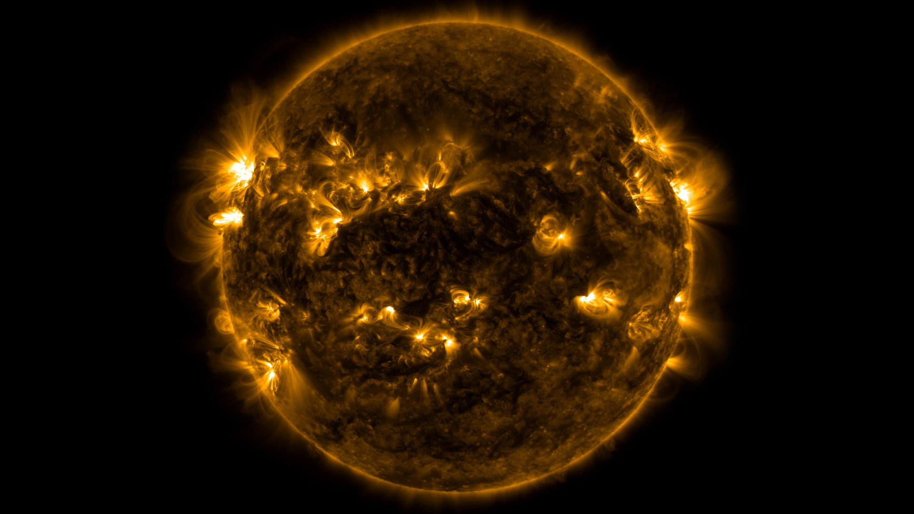
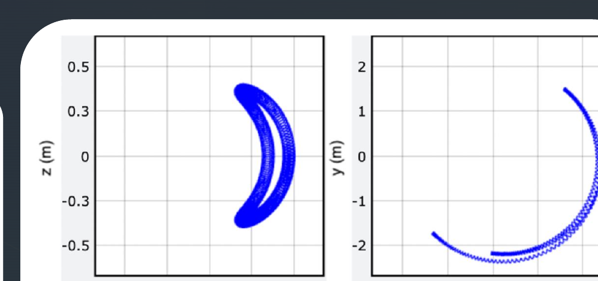
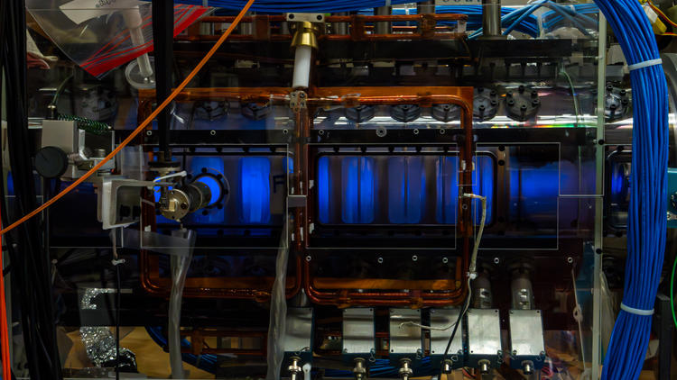

# MAC-E-фильтр

## Как сделать порог почти независимым от угла? {#mac-e-filter}

:::: {.panel-tabset .story-tabs}

### Проблема
::: {.marginnote .note-right .absolute top=215 left=1475 width=350 style="--note-font-size: 0.62em; --note-math-font-size: 1em;"}
<span class="note-title">Обозначения</span>

- $\mathrm{src}$ — область источника (от англ. *source*),

- $\mathrm A$ — анализирующая плоскость.

- $U$ — задерживающее напряжение; $e>0$ — модуль заряда электрона.

:::

- Масса нейтрино изменяет форму $\beta$-спектра.
- Электростатический барьер чувствителен к продольной энергии электрона.

- В анализирующей плоскости

$$
\boxed{
E_{\parallel,\mathrm A}
\simeq E-e|U|-E_{\perp,\mathrm A}
}.
$$

- Электроны одной энергии рождаются под разными углами и имеют разные
$E_\perp$.

- Нужно добиться

$$
\boxed{E_{\perp,\mathrm A}\ll E}
$$

- Это условие должно выполняться для большого телесного угла, а не только для
  электронов, летящих вдоль оси.

### $B=\text{const}$

- В однородном поле

$$
p_\parallel=\mathrm{const},
\qquad
p_\perp=\mathrm{const},
\qquad
\alpha=\mathrm{const}.
$$

- Поле ведёт направляющий центр к детектору, но не коллимирует пучок.

- Для быстрого циклотронного движения мы ввели действие

$$
\boxed{
J=\frac{1}{2\pi}\oint P\,dQ
=\frac{E_\perp}{\omega_c}
=\frac{p_\perp^2}{2|q|B}
}.
$$

- В постоянном однородном поле $J$ сохраняется точно.

- Сохраняется ли $J$ в неоднородном поле?
  - Приближённо — если поле меняется мало за один циклотронный оборот.

### Неоднородное $\ne$ нестационарное

- Магнитная конфигурация MAC-E стационарна:

$$
\boxed{\frac{\partial B(\mathbf r)}{\partial t}=0}.
$$

- Но электрон движется через неоднородное поле, поэтому вдоль его пути

$$
\boxed{
B(t)\equiv B(\mathbf R(t)),
\qquad
\dot B=\dot{\mathbf R}\cdot\nabla B\ne0
}.
$$

Поле не перестраивается со временем: электрон сам попадает в области с
разными $B$.

::: {.nh-box tone="warning" size="sm"}
Если бы $\partial B/\partial t\ne0$, возникло бы вихревое электрическое поле,
и кинетическая энергия электрона могла бы меняться. Это другой режим.
:::

### Сохраняющиеся величины

- Через $E$ обозначаем **кинетическую энергию электрона**.

- На чисто магнитном участке сила Лоренца не совершает работы:

$$
\boxed{
\frac{dE}{dt}
=q\mathbf v\cdot(\mathbf v\times\mathbf B)=0
},
\qquad
p^2=\mathrm{const}.
$$

- Но в неоднородном поле по отдельности уже не обязаны сохраняться $p_\parallel$, $p_\perp$.

### Идея

- Пусть электрон движется из области сильного стационарного поля в область
слабого.

- **Если** $J=\mathrm{const}$, **то**

$$
\boxed{p_\perp^2=2|q|BJ}.
$$

- Это и есть желаемая коллимация:

$$
B\downarrow
\quad\Longrightarrow\quad
p_\perp\downarrow,
\qquad
p_\parallel^2=p^2-p_\perp^2\uparrow.
$$

- Осталось доказать предположение:

$$
\boxed{J=\mathrm{const}}.
$$

### MAC-E

$$
\boxed{
\text{MAC-E}
=
\text{Magnetic Adiabatic Collimation}
+
\text{Electrostatic filter}
}.
$$

- **MAC** сохраняет большой телесный угол и делает $p_\perp$ малым.

- **E** отбрасывает электроны ниже выбранного энергетического порога.

- Сначала докажем сохранение $J$, затем построим движение направляющего центра
  и получим характеристики фильтра.

### Анимация

<video class="slide-video" style="--media-max-height: 750px;" controls preload="metadata" playsinline src="assets/04_direct_neutrino_mass/katrin_mac_e_electric.mp4"></video>

::::

::: {.absolute bottom=10 left=50 width=1450 style="font-size: 0.42em;"}
[Kruit, Read, 1983](https://doi.org/10.1088/0022-3735/16/4/016) ·
[Лобашёв, Спивак, 1985](https://doi.org/10.1016/0168-9002(85)90640-0) ·
[KATRIN Design Report, §5](https://www.katrin.kit.edu/publikationen/DesignReport2004-12Jan2005.pdf)
:::

## Алгоритм

::: incremental

- Электроны одной энергии $E$ испускаются под разными углами с разными значениями $E_{\perp}$.

- Сильным магнитным полем ведём пучок от источника к спектрометру;

- Магнитной частью MAC-E-фильтра делаем поперечную энергию $E_{\perp,\mathrm A}$ малой, сохранив большой телесный
  угол.

- Электростатический барьер пропускает электрон, если в анализирующей
  плоскости остаётся положительная продольная энергия:
$$
E_{\parallel,\mathrm A}
\simeq E-e|U|-E_{\perp,\mathrm A}>0.
$$

- Это работает, если для быстрого циклотронного движения сохраняется, хотя бы приблизительно, действие:
$$
J=\frac{E_\perp}{\omega_c}\simeq\mathrm{const}.
$$

- В плавно убывающем стационарном поле это даёт
$$
B\downarrow\Rightarrow E_\perp\downarrow,\quad E_\parallel\uparrow.
$$

- Это и есть MAC-E-коллимация.

:::

# Адиабатическое движение в неоднородном поле

## Электрон в неоднородном магнитном поле: что сохраняется?

:::: {.panel-tabset .story-tabs}

### Постановка

- Рассматривается электрон с зарядом $q=-e$ в стационарном неоднородном поле
  $\mathbf B(\mathbf r)$.

- В однородном поле действие циклотронной орбиты равно

$$
J=\frac{1}{2\pi}\oint P\,dQ
=\frac{E_\perp}{\omega_c},
\qquad
H_\perp=\omega_cJ,
\qquad
\dot J=0.
$$

- В неоднородном поле частота меняется вдоль пути электрона:

$$
B(t)\equiv B(\mathbf R(t)),
\qquad
\omega_c(s(t))=\frac{|q|B(t)}{m}.
$$

- $\mathbf R(t)$ — положение направляющего центра.

- Требуется проверить, сохраняется ли действие:

$$
\boxed{
J\stackrel{?}{\simeq}\mathrm{const}
}.
$$

### Условия

::: {style="width: 74%; font-size: 0.92em;"}

- Два размера одного витка:

$$
\rho_L=\frac{p_\perp}{|q|B},
\qquad
h=v_\parallel T_c.
$$

- Масштабы изменения поля

$$
L_\perp\equiv\frac{B}{|\nabla_\perp B|},
\qquad
L_\parallel\equiv\frac{B}{|\partial B/\partial s|}.
$$

- Потребуем, чтобы за один оборот поле изменялось мало поперёк орбиты и вдоль пройденного
шага:

$$
\boxed{
\frac{\rho_L}{L_\perp}\ll1,
\qquad
\frac{h}{L_\parallel}\ll1
}.
$$

- Второе условие можно записать через характерное время изменения поля:

$$
\tau_B\equiv\frac{B}{|\dot B|},
\qquad
T_c=\frac{2\pi}{\omega_c},
\qquad
\boxed{T_c\ll\tau_B}.
$$
:::

::: {.marginnote .note-right .absolute top=250 left=1475 width=350 style="--note-font-size: 0.62em; --note-math-font-size: 1em;"}
<span class="note-title">Координата вдоль поля</span>

$s$ — длина дуги вдоль силовой линии:

$$
\frac{d\mathbf R}{ds}=\mathbf b,
\qquad
\mathbf b\equiv\frac{\mathbf B}{B},
$$

$$
\frac{\partial B}{\partial s}
=\mathbf b\cdot\nabla B.
$$

$s$ — непрерывная координата, а $h=v_\parallel T_c$ — путь электрона
вдоль поля за один оборот.

За один оборот поле почти постоянно, но за много оборотов может измениться
заметно.
:::

### Осциллятор

- На одном обороте «заморозим» $B$ и $\omega_c$. Поперечное движение остаётся
быстрым:
$$
\dot\theta\simeq\omega_c.
$$

- Частота медленно меняется от оборота к обороту:
$$
\boxed{
\frac{|\dot\omega_c|}{\omega_c^2}
=\frac{|\dot B|}{\omega_c B}
=\frac{1}{2\pi}\frac{T_c}{\tau_B}
\ll1
}.
$$

- Поперечное движение — осциллятор с медленно меняющимся вдоль пути
параметром:
$$
H_\perp(Q,P;s(t))\equiv E_\perp
=\frac{P^2}{2m}+\frac{m\omega_c^2(s(t))Q^2}{2}.
$$

- Зависимость от $t$ здесь составная: $\omega_c(s(t))$. Лабораторное поле от
времени не зависит. Для связанной быстрой и медленной динамики
$$
\boxed{
H(s,p_\parallel,Q,P)
=\frac{p_\parallel^2}{2m}+H_\perp(Q,P;s),
\qquad
\frac{\partial H}{\partial t}=0
}.
$$


### Энергия

- Согласно уравнениям Гамильтона для поперечной пары

$$
\begin{aligned}
\dot E_\perp=\frac{dH_\perp}{dt}
&=
\frac{\partial H_\perp}{\partial Q}\dot Q
+\frac{\partial H_\perp}{\partial P}\dot P
+\frac{\partial H_\perp}{\partial s}\dot s
\\
&=-\dot P\dot Q+\dot Q\dot P
+\frac{\partial H_\perp}{\partial s}\dot s
=\frac{\partial H_\perp}{\partial s}\dot s.
\end{aligned}
$$

- При фиксированных $Q$ и $P$

$$
\boxed{
\dot E_\perp
=\frac{\partial}{\partial s}
\left(\frac{m\omega_c^2(s)Q^2}{2}\right)\dot s
=m\omega_c\dot\omega_c Q^2.
}
$$


::: {.marginnote .note-right .absolute top=215 left=1475 width=350 style="--note-font-size: 0.62em; --note-math-font-size: 1em;"}
<span class="note-title">Движение вдоль поля</span>

$$
s\parallel\mathbf B,
\qquad
p_\parallel=m\dot s,
$$

$$
H
=\frac{p_\parallel^2}{2m}+H_\perp.
$$

Так как полный $H$ не зависит явно от времени,

$$
\dot E_\parallel=-\dot E_\perp.
$$

Поперечная и продольная энергии обмениваются, а их сумма сохраняется.

<span class="note-title">Уравнения Гамильтона</span>

$$
\begin{aligned}
\dot Q&=\frac{\partial H_\perp}{\partial P},\\[1mm]
\dot P&=-\frac{\partial H_\perp}{\partial Q}.
\end{aligned}
$$

:::


### Среднее

- За один оборот $E_\perp$ и $\omega_c$ почти не меняются, поэтому

$$
Q(t)=Q_0\cos(\omega_ct+\varphi),
\qquad
E_\perp=\frac{m\omega_c^2Q_0^2}{2}.
$$

- Отсюда

$$
\left\langle Q^2\right\rangle
=Q_0^2\left\langle\cos^2(\omega_ct+\varphi)\right\rangle
=\frac{Q_0^2}{2}
=\frac{E_\perp}{m\omega_c^2}.
$$

- Усредняя полученное на предыдущей вкладке уравнение энергии, находим

$$
\left\langle\dot E_\perp\right\rangle
=m\omega_c\dot\omega_c\left\langle Q^2\right\rangle
=\frac{E_\perp\dot\omega_c}{\omega_c}.
$$


::: {.marginnote .note-right .absolute top=225 left=1415 width=300 style="--note-font-size: 0.62em; --note-math-font-size: 1em;"}
<span class="note-title">Среднее за период</span>

$$
\langle f\rangle
=\frac{1}{T_c}
\int_t^{t+T_c}f(t')\,dt',
$$

$$
\left\langle\cos^2\right\rangle=\frac12.
$$

:::

### Инвариант J

::: {.marginnote .note-right .absolute top=225 left=1415 width=300 style="--note-font-size: 0.62em; --note-math-font-size: 1em;"}
<span class="note-title">На предыдущей вкладке</span>

$$
\left\langle\dot E_\perp\right\rangle
=\frac{E_\perp\dot\omega_c}{\omega_c}.
$$


:::


- Применим правило производной частного:

$$
\begin{aligned}
\left\langle
\frac{d}{dt}\frac{E_\perp}{\omega_c}
\right\rangle
&=
\frac{\left\langle\dot E_\perp\right\rangle}{\omega_c}
-\frac{E_\perp\dot\omega_c}{\omega_c^2}
\\[1mm]
&=
\frac{E_\perp\dot\omega_c}{\omega_c^2}
-\frac{E_\perp\dot\omega_c}{\omega_c^2}
=0.
\end{aligned}
$$

- Следовательно,

$$
\boxed{
\langle\dot J\rangle=\langle\frac{d}{dt}\frac{E_\perp}{\omega_c}\rangle=0}.
$$

- Фазовый эллипс медленно меняет форму, но сохраняет площадь $2\pi J$.


::: {.marginnote .note-right .absolute top=615 left=1490 width=330 style="--note-font-size: 0.60em; --note-math-font-size: 0.95em;"}
<span class="note-title">Фазовый смысл</span>

$$
\begin{aligned}
Q_{\max}&=\sqrt{\frac{2J}{m\omega_c}},\\
P_{\max}&=\sqrt{2m\omega_cJ},
\end{aligned}
$$

$$
\pi Q_{\max}P_{\max}=2\pi J.
$$

:::

### Момент $\mu$

- Так как $\omega_c=|q|B/m$, сохранение $J$ даёт

$$
\boxed{
\mu
\equiv\frac{|q|}{m}J
=\frac{E_\perp}{B}
=\frac{p_\perp^2}{2mB}
\simeq\mathrm{const}
}.
$$

- В однородном поле $E_\perp$ и $B$ постоянны по отдельности. При движении через медленно меняющееся магнитное поле они меняются, но их отношение остаётся почти
постоянным.

- Таким образом, введённый ранее модуль орбитального магнитного момента
становится первым адиабатическим инвариантом.

- Столкновения и резкие изменения поля нарушают это приближение.

::::

## Резюме


- В адиабатическом режиме действие сохраняется с хорошей точностью.


- Хотя $E_\perp$ изменяется
$$
\langle\dot E_\perp\rangle
=E_\perp\frac{\dot\omega_c}{\omega_c}, \qquad (T_c\ll\tau_B).
$$


- В адиабатическом приближении $E_\perp$ следует за изменением поля:

$$
\boxed{J\simeq\mathrm{const}},
\qquad
\boxed{\mu=E_\perp/B\simeq\mathrm{const}}.
$$

- Это золотой ключик для MAC-E-коллимации: при уменьшении $B$ уменьшается $E_\perp$, а продольная энергия $E_\parallel=E-E_\perp$ растёт.

## Направляющий центр в эффективном потенциале

:::: {.panel-tabset .story-tabs}

### Редукция

- Продолжим разложение из предыдущей лекции: координату $z$ заменяет длина
дуги $s$, а $(X,Y)$ метят магнитную трубку:

$$
(\mathbf r,\mathbf p)
\longleftrightarrow
\underbrace{(X,Y)}_{\text{магнитная трубка}}
\oplus
\underbrace{(s,p_\parallel)}_{\text{движение вдоль поля}}
\oplus
\underbrace{(\theta,J)}_{\text{быстрое вращение}}.
$$

- Усредним быструю фазу $\theta$; её сопряжённый импульс $J$ сохраняется
адиабатически:

$$
\theta\ \text{усреднена},
\qquad
J\simeq\mathrm{const}.
$$

- Для оставшейся пары $(s,p_\parallel)$ получаем

$$
\boxed{
\mathcal H_{\mathrm{gc}}(s,p_\parallel;J)
=\frac{p_\parallel^2}{2m}+\omega_c(s)J
=\frac{p_\parallel^2}{2m}+\mu B(s)
},
$$

где $\mu=|q|J/m$.

- Энергия быстрого вращения стала эффективным потенциалом $\mu B(s)$.

::: {.marginnote .note-right .absolute top=615 left=1490 width=330 style="--note-font-size: 0.60em; --note-math-font-size: 0.95em;"}
<span class="note-title">Обратите внимание!</span>

- Это нерелятивистская запись.

- Поправка для электрона конца тритиевого спектра будет восстановлена при вычислении разрешения.
:::

### Энергия

- В статическом магнитном поле полная кинетическая энергия сохраняется:

$$
E=E_\parallel+E_\perp=\mathrm{const}.
$$

- Из гамильтониана направляющего центра

$$
\boxed{
E_\perp(s)=\omega_c(s)J=\mu B(s),
\qquad
E_\parallel(s)=E-\mu B(s)
}.
$$

- Поэтому

$$
\begin{array}{lll}
B\downarrow: & E_\perp\downarrow, & E_\parallel\uparrow,\\[2mm]
B\uparrow:   & E_\perp\uparrow,   & E_\parallel\downarrow.
\end{array}
$$

- Сила Лоренца не совершает работы: модуль скорости постоянен. Меняется
разложение движения на компоненты относительно локального направления поля.

### Коллимация

- Пусть $\alpha$ — угол между $\mathbf p$ и локальным полем. Из сохранения
$J$ следует

$$
\frac{p_\perp^2}{B}\simeq\mathrm{const},
\qquad
p_\perp=p\sin\alpha.
$$

- Относительно начальной точки $s_0$:

$$
\boxed{
p_\perp(s)=p_{\perp,0}\sqrt{\frac{B(s)}{B_0}}
},
\qquad
\boxed{
\sin^2\alpha(s)=\sin^2\alpha_0\frac{B(s)}{B_0}
}.
$$

- Следовательно, пучок коллимируется:

$$
B\downarrow
\quad\Longrightarrow\quad
p_\perp\downarrow,
\quad
\alpha\downarrow.
$$

- При этом

$$
\rho_L=\frac{p_\perp}{|q|B}\propto B^{-1/2}:
$$

::: {.marginnote .note-right .absolute top=615 left=1490 width=330 style="--note-font-size: 0.60em; --note-math-font-size: 0.95em;"}
<span class="note-title">Обратите внимание!</span>

Поперечный импульс уменьшается, хотя радиус отдельной орбиты растёт.
:::


### Сила

- Теперь польза гамильтоновой записи видна непосредственно:

$$
\begin{aligned}
\dot p_\parallel
&=-\frac{\partial\mathcal H_{\mathrm{gc}}}{\partial s}\\
&=-J\frac{d\omega_c}{ds}
=-\mu\frac{dB}{ds}.
\end{aligned}
$$

$$
\boxed{
F_\parallel=-\mu\frac{dB}{ds}
}.
$$

- Это **сила магнитного зеркала**:
  - Она всегда направлена в сторону более слабого поля: при движении в область растущего $B$ частица тормозится вдоль силовой линии.

### Зеркало

::: {.marginnote .note-right .absolute top=615 left=1490 width=330 style="--note-font-size: 0.60em; --note-math-font-size: 0.95em;"}
<span class="note-title">Напомним:</span>

$$
\sin^2\alpha(s)=\sin^2\alpha_0\frac{B(s)}{B_0}
$$
:::


- Пусть электрон стартует при $B_0$ с энергией $E$ под углом
$\alpha_0$:

$$
\mu
=\frac{E\sin^2\alpha_{0}}{B_{0}}.
$$

- Тогда

$$
E_\parallel(s)
=E\left[
1-\frac{B(s)}{B_{0}}\sin^2\alpha_{0}
\right].
$$

- В точке, где $E_\parallel=0$, направляющий центр останавливается и движется
обратно:

$$
\boxed{
B_{\mathrm{mirror}}
=\frac{B_{0}}{\sin^2\alpha_{0}}
}.
$$

### Акцептанс

- Пусть $B_{\max}$ — максимальное поле на всём пути электрона. Частица проходит
магнитную систему, если

$$
B_{\max}<B_{\mathrm{mirror}}
\quad\Longleftrightarrow\quad
\sin^2\alpha_{0}
<\frac{B_{0}}{B_{\max}}.
$$

- Максимальный принимаемый угол равен

$$
\boxed{
\alpha_{\mathrm{acc}}
=\arcsin\sqrt{\frac{B_{0}}{B_{\max}}}
}.
$$

- Для KATRIN

$$
B_{\mathrm{src}}=3.6~\mathrm{Тл},
\qquad
B_{\max}=6.0~\mathrm{Тл}
\quad\Longrightarrow\quad
\alpha_{\mathrm{acc}}\simeq50.8^\circ.
$$

- Электроны с большими углами отражаются магнитным зеркалом.

::::

# Примеры магнитных зеркал

## Пояса Ван Аллена: магнитная ловушка Земли

:::: {.panel-tabset .story-tabs}

### Открытие

- **31 января 1958 года:** первый американский спутник Explorer 1 выходит на
  орбиту с счётчиком Гейгера—Мюллера группы Джеймса Ван Аллена.

- На больших высотах счётчик временами показывал почти нулевую скорость
  счёта. Причина оказалась неожиданной: поток был настолько велик, что прибор
  насыщался.

- Данные следующего спутника, Explorer 3, подтвердили область интенсивного
  излучения, удерживаемого магнитным полем Земли.

- «Отказ» прибора оказался одним из первых крупных открытий космической эры.

- Открытие подтвердили данные советского «Спутника-3».

- Сигнал радиационных поясов зарегистрировал и более ранний «Спутник-2», но
  тогда его не связали с новой областью околоземного пространства.

### Что это?

::: {style="font-size: 0.82em; line-height: 1.15;"}

- Радиационные пояса — тороидальные области, где магнитное поле удерживает
  энергичные протоны и электроны. В распределении частиц обычно видны два
  максимума: внутренний и внешний пояса.

:::: {.columns}

::: {.column width="48%"}

#### Внутренний пояс

$$
\boxed{h\sim10^3\text{–}1.2\cdot10^4~\mathrm{км}}
$$

- Начинается примерно в тысяче километров над поверхностью.

- Наиболее устойчив; богат энергичными протонами.

- Главный источник протонов высоких энергий — распад атмосферных нейтронов,
  рождённых космическими лучами: механизм CRAND.

#### Межпоясная область

- Плазмосферный шум рассеивает электроны в конус потерь и тем самым
  поддерживает разреженную область между поясами.

:::

::: {.column width="48%"}

#### Внешний пояс

$$
\boxed{h\sim1.3\cdot10^4\text{–}6\cdot10^4~\mathrm{км}}
$$

- Состоит преимущественно из электронов, поступающих из внешней магнитосферы.

- Во время магнитных бурь электроны переносятся и ускоряются; пояс может
  расширяться, сжиматься и почти исчезать.

#### Это не твёрдые оболочки

- Границы зависят от энергии частиц и состояния магнитосферы.

:::

::::

::: {.nh-box tone="info" size="sm"}
Магнитное зеркало объясняет удержание отдельной частицы, но не создаёт два
пояса. Два максимума возникают из-за разных источников, переноса и потерь;
между ними волны особенно эффективно осаждают электроны в атмосферу.
:::

:::

### Энергии

- Во внутреннем поясе доминируют протоны с энергиями примерно
  $0.1\text{–}400~\mathrm{МэВ}$; присутствуют и электроны порядка
  $10^2~\mathrm{кэВ}$.

- Во внешнем поясе преобладают электроны примерно
  $0.1\text{–}10~\mathrm{МэВ}$.

- Электрон с кинетической энергией $1~\mathrm{МэВ}$ уже релятивистский:

$$
\gamma=1+\frac{E}{m_ec^2}\simeq2.96,
\qquad
v\simeq0.94c.
$$

- Эти частицы повреждают электронику и солнечные батареи, создают фон в
  детекторах и определяют радиационную нагрузку на космические аппараты.

::: {.nh-box tone="info" size="sm"}
Диапазоны ориентировочные: пояс — это широкий, изменчивый спектр, а не пучок
частиц одной энергии.
:::

### Анимация

:::: {.columns}

::: {.column width="70%"}

<video autoplay loop muted controls playsinline preload="metadata"
       poster="assets/06_mac_e_spectrometer/nasa_radiation_belts_particles.jpg"
       src="assets/06_mac_e_spectrometer/nasa_radiation_belts_plasmapause_particles.mov"
       style="display:block; width:100%; max-height:545px; margin:0 auto 0.2rem; object-fit:contain;">
</video>

<p class="media-caption" style="font-size:0.46em; line-height:1.22;">
  Жёлтые частицы — электроны, синие — положительные ионы; голубовато-зелёная
  поверхность — плазмопауза. NASA/GSFC Scientific Visualization Studio.
</p>

:::

::: {.column width="26%"}

- Частица вращается вокруг силовой линии.

- Отражается между северной и южной зеркальными точками.

- Медленно дрейфует вокруг Земли.

- Вместе эти движения заполняют тороидальные радиационные пояса.

::: {.nh-box tone="warning" size="sm"}
Спираль искусственно увеличена: в масштабе всей магнитосферы отдельные витки
не были бы видны.
:::

:::

::::

### Динамика поясов

:::: {.columns style="font-size: 0.88em; line-height: 1.18;"}

::: {.column width="48%"}

- **Перенос внутрь магнитосферы:** поле усиливается, и при сохранении
  магнитного момента растёт поперечная энергия
  $E_\perp=\mu B$ — бетатронное ускорение.

- **Укорачивание силовой линии:** зеркальные точки сближаются, поэтому растёт
  продольная энергия — ускорение Ферми.

- **Резонанс с плазменными волнами:** хоровые волны могут передавать электронам
  энергию и ускорять их до релятивистских значений.

:::

::: {.column width="48%"}

- Другие волны рассеивают частицы по углам и переводят их в конус потерь.

- Частица, попавшая в конус потерь, достигает плотных слоёв атмосферы и быстро
  теряет энергию в столкновениях.

- Положение и интенсивность поясов определяются конкуренцией источников,
  ускорения, переноса и осаждения.

::: {.nh-box tone="warning" size="sm"}
Магнитосфера не стационарна: солнечный ветер и магнитные бури меняют поля.
Поэтому кинетическая энергия частицы здесь не обязана сохраняться.
:::

:::

::::

### Конус потерь

:::: {.columns style="font-size: 0.80em; line-height: 1.13;"}

::: {.column width="49%"}

- Зафиксируем одну силовую линию диполя. Пусть $R_\oplus$ — радиус Земли, а
  $r_{\mathrm{eq}}$ и $h_{\mathrm{eq}}$ — расстояние от центра и высота над
  поверхностью на экваторе:

$$
L=\frac{r_{\mathrm{eq}}}{R_\oplus},
\qquad
h_{\mathrm{eq}}=(L-1)R_\oplus.
$$

- $L$ — непрерывный параметр. На экваторе этой линии поле минимально и равно
  $B_{\mathrm{eq}}(L)$.

- Частица пересекает экватор под углом $\alpha_{\mathrm{eq}}$ к $\mathbf B$.
  Из сохранения $\mu$ следует

$$
B_{\mathrm m}
=\frac{B_{\mathrm{eq}}(L)}{\sin^2\alpha_{\mathrm{eq}}}.
$$

- На той же линии поле у условной границы атмосферы равно
  $B_{\mathrm{atm}}(L)$.

$$
\boxed{
\sin^2\alpha_{\mathrm{loss}}(L)
=\frac{B_{\mathrm{eq}}(L)}{B_{\mathrm{atm}}(L)}
}.
$$

- При $\alpha_{\mathrm{eq}}<\alpha_{\mathrm{loss}}(L)$ частица достигает атмосферы раньше
  зеркальной точки.

:::

::: {.column width="47%"}

- При фиксированном модуле скорости все направления лежат на сфере в
  пространстве скоростей.

- Направления с одним углом $\alpha_{\mathrm{loss}}$ образуют окружность
  вокруг оси $\mathbf B$.

- Меньшие углы заполняют **конус**. Для двух направлений вдоль поля существуют
  два противоположных конуса.

- Волны и столкновения рассеивают частицы по углам. Попав внутрь конуса,
  частица осаждается в атмосферу.

::: {.nh-box tone="info" size="sm"}
Поле на экваторе входит в формулу потому, что там задаются начальный угол и
магнитный момент частицы. Сравниваются две точки **одной и той же** линии $L$.
:::

:::

::::

### Интерактив

```{=html}
<link rel="stylesheet" href="assets/06_mac_e_spectrometer/loss_cone_interactive.css">
```



```{=html}
<script src="assets/06_mac_e_spectrometer/loss_cone_interactive.js"></script>
```

::::

::: {.absolute bottom=10 left=50 width=1740 style="font-size: 0.36em;"}
[NASA/SVS](https://svs.gsfc.nasa.gov/4241/) ·
[NASA: высоты](https://science.nasa.gov/earth/earth-observatory/probing-the-electric-space-around-earth-78985/) ·
[NASA: энергии](https://www.nasa.gov/wp-content/uploads/2013/05/radiation_math.pdf) ·
[JPL: Explorer 1](https://www.jpl.nasa.gov/missions/explorer-1/) ·
[NASA: CRAND](https://pwg.gsfc.nasa.gov/Education/winbelt.html) ·
[NASA/NTRS: плазмосферный шум](https://ntrs.nasa.gov/citations/20080039430) ·
[NASA: геометрия конуса потерь](https://ntrs.nasa.gov/api/citations/19660003733/downloads/19660003733.pdf) ·
[Reeves et al., 2013: локальное ускорение](https://doi.org/10.1126/science.1237743) ·
[Thorne et al., 2013: ускорение хоровыми волнами](https://doi.org/10.1038/nature12889)
:::

## Ещё примеры магнитных зеркал

:::: {.panel-tabset .story-tabs}

### Солнечная корона

:::: {.columns style="font-size: 0.90em; line-height: 1.18;"}

::: {.column width="45%"}

- Светящиеся дуги солнечной короны — это горячая плазма, очерчивающая
  замкнутые магнитные петли.

- Поле усиливается у оснований петли. Частицы с достаточно большой поперечной
  скоростью отражаются и многократно проходят между зеркальными точками.

- Частицы из конуса потерь достигают хромосферы. Их тормозное излучение
  наблюдается как яркие рентгеновские источники у оснований вспышечной петли.

- Зеркальное удержание влияет на длительность солнечных вспышек и на
  распределение энергии между короной и нижними слоями атмосферы.

:::

::: {.column width="51%"}



<p class="media-caption" style="font-size:0.46em; line-height:1.22;">
  Горячая плазма очерчивает магнитные петли в короне Солнца.
  NASA/SDO и NASA/GSFC.
</p>

:::

::::

### Токамак

:::: {.columns style="font-size: 0.88em; line-height: 1.18;"}

::: {.column width="43%"}

- Основное удержание плазмы в токамаке создаёт тороидальная магнитная
  конфигурация.

- Тороидальное поле неоднородно:

$$
B(R)\propto\frac{1}{R}.
$$

- На внешней стороне тора поле слабее, на внутренней — сильнее. Частицы с малой
  $v_\parallel/v_\perp$ отражаются, не доходя до области максимального поля.

- Вместе с медленным дрейфом это даёт в полоидальном сечении **банановую
  орбиту**. Такие частицы существенно влияют на неоклассический перенос плазмы.

:::

::: {.column width="53%"}

<div style="display:flex; gap:0.5rem; align-items:center; justify-content:center;">
  
  
</div>

<p class="media-caption" style="font-size:0.46em; line-height:1.22;">
  Тороидальная геометрия и траектория зеркально запертой частицы.
  Учебные материалы PPPL.
</p>

:::

::::

### Зеркальная ловушка

:::: {.columns style="font-size: 0.90em; line-height: 1.18;"}

::: {.column width="43%"}

- В открытой зеркальной ловушке поле мало в центральной камере и усиливается у
  двух концов.

- Частицы вне конуса потерь отражаются от магнитных пробок и многократно
  проходят через центральную плазму.

- Частицы из конуса потерь уходят через торцы. Уменьшение этих потерь — одна из
  главных задач зеркальных термоядерных установок.

- Такие установки применяются в исследованиях управляемого синтеза, нагрева
  плазмы и взаимодействия потоков плазмы с материалами.

:::

::: {.column width="53%"}



<p class="media-caption" style="font-size:0.46em; line-height:1.22;">
  Экспериментальная установка PFRC использует концевые магнитные зеркала.
  PPPL, 2024.
</p>

:::

::::

### Ускорение Ферми

:::: {.columns style="font-size: 0.84em; line-height: 1.16;"}

::: {.column width="61%"}

<video autoplay loop muted controls playsinline preload="metadata"
       poster="assets/06_mac_e_spectrometer/nasa_fermi_shock_acceleration_poster.jpg"
       src="assets/06_mac_e_spectrometer/nasa_fermi_shock_acceleration.mp4"
       style="display:block; width:100%; max-height:455px; margin:0 auto 0.2rem; object-fit:contain;">
</video>

<p class="media-caption" style="font-size:0.46em; line-height:1.22;">
  Частица многократно пересекает ударный фронт остатка сверхновой и набирает
  энергию. NASA/GSFC.
</p>

:::

::: {.column width="35%"}

- В хорошо проводящей плазме магнитное поле приблизительно вморожено в
  вещество. Движущееся намагниченное облако переносит с собой и магнитную
  неоднородность.

- В системе облака рассеяние частицы почти упругое. В лабораторной системе
  движущийся магнитный рассеиватель и связанное с ним электрическое поле могут
  изменить энергию частицы.

- В модели Ферми 1949 года случайные облака дают средний прирост второго
  порядка по $u/c$, где $u$ — характерная скорость рассеивателя. Повторные
  пересечения ударного фронта дают более быстрый прирост первого порядка.

$$
\boxed{
\begin{array}{ll}
\text{неподвижная структура:}&\Delta E=0,\\
\text{движущаяся структура:}&\Delta E\ne0
\end{array}
}
$$

- Так объясняют ускорение космических лучей в остатках сверхновых.

:::

::::


::::

::: {.absolute bottom=10 left=50 width=1740 style="font-size: 0.36em;"}
[NASA/SDO: солнечные магнитные петли](https://svs.gsfc.nasa.gov/11755/) ·
[NASA/NTRS: удержание в корональных петлях](https://ntrs.nasa.gov/citations/19930072101) ·
[PPPL: движение частиц в токамаке](https://suli.pppl.gov/2026/course/SULI_SingleParticleMotion_06-02-26.pdf) ·
[PPPL: PFRC](https://www.pppl.gov/Princeton-Field-Reversed-Configuration) ·
[NASA/SVS: ускорение на ударном фронте](https://svs.gsfc.nasa.gov/11209/) ·
[Fermi, 1949](https://doi.org/10.1103/PhysRev.75.1169) ·
[KATRIN Design Report, §5](https://www.katrin.kit.edu/publikationen/DesignReport2004-12Jan2005.pdf)
:::

# KATRIN: Magnetic Adiabatic Collimation with Electrostatic Filter

## MAC-E-фильтр: от полей к порогу {#magnetic-collimation}

:::: {.panel-tabset .story-tabs}

### Схема

:::: {.columns}

::: {.column width="53%"}

Три значения поля выполняют три разные функции:

$$
\begin{array}{ccl}
B_{\mathrm{src}}=3.6~\mathrm{Тл}
&:& \text{поле в источнике},\\[1mm]
B_{\mathrm A}=0.30~\mathrm{мТл}
&:& \text{минимум в анализирующей плоскости},\\[1mm]
B_{\max}=6.0~\mathrm{Тл}
&:& \text{максимум на пути электрона}.
\end{array}
$$

:::

::: {.column width="43%"}

- $B_{\mathrm A}\ll B_{\mathrm{src}}$ делает $p_{\perp,\mathrm A}$ малым.
- $B_{\max}$ задаёт магнитное зеркало и угловой акцептанс.
- Максимум задерживающего потенциала совпадает с минимумом $B$.

$$
\boxed{\text{сначала MAC}\quad\longrightarrow\quad\text{затем E}}
$$

:::

::::

### MAC

Из сохранения $J$ между источником и анализирующей плоскостью

$$
\boxed{
\frac{p_{\perp,\mathrm A}}{p_{\perp,\mathrm{src}}}
=\sqrt{\frac{B_{\mathrm A}}{B_{\mathrm{src}}}}
\simeq9.1\cdot10^{-3}
}.
$$

Поперечный импульс уменьшается примерно в $110$ раз. При сохранении полной
энергии освободившаяся поперечная энергия становится продольной.

Например,

$$
\alpha_{\mathrm{src}}=50^\circ
\quad\longrightarrow\quad
\alpha_{\mathrm A}\simeq0.40^\circ.
$$

Это **Magnetic Adiabatic Collimation**: поле не уменьшает энергию электрона,
а поворачивает его импульс почти вдоль оси спектрометра.

### E-фильтр

:::: {.columns}

::: {.column width="55%"}

После включения потенциала кинетическая энергия $E$ уже не постоянна. При
стационарных $\mathbf E$ и $\mathbf B$ сохраняется

$$
\boxed{
\mathcal E
=\frac{p_\parallel^2}{2m}+\mu B(s)+q\Phi(s)
=\mathrm{const}
}.
$$

Здесь $\Phi(s)$ — электростатический потенциал, а $\mathcal E$ — сумма
кинетической и потенциальной энергий.

- $p_\parallel^2/(2m)$ — энергия прохода вдоль оси;
- $\mu B$ — магнитная коллимация и зеркало;
- $q\Phi$ — задерживающий барьер.

Электрическое поле направлено преимущественно вдоль $\mathbf B$ и почти не
нарушает циклотронное действие.

:::

::: {.column width="41%"}

В анализирующей плоскости

$$
\boxed{
E_{\parallel,\mathrm A}
\simeq E-e|U|-E_{\perp,\mathrm A}
}.
$$

$$
\begin{array}{ccl}
E_{\parallel,\mathrm A}>0 &:& \text{электрон проходит},\\[1mm]
E_{\parallel,\mathrm A}=0 &:& \text{порог прохождения},\\[1mm]
E_{\parallel,\mathrm A}<0 &:& \text{электрон отражается}.
\end{array}
$$

::: {.takeaway style="font-size: 0.72em; margin-top: 0.35rem; padding: 0.35rem 0.55rem;"}
MAC делает $E_{\perp,\mathrm A}$ малой; E-фильтр сравнивает почти всю энергию
$E$ с порогом $e|U|$.
:::

:::

::::

### Анимация

<video class="slide-video" style="--media-max-height: 750px;" controls preload="metadata" playsinline src="assets/04_direct_neutrino_mass/katrin_mac_e_electric.mp4"></video>

<p class="media-caption">
  В магнитном поле KATRIN при входе в главный спектрометр $p_\perp$
  уменьшается, а после анализирующей плоскости снова растёт. Электрическое
  поле здесь отключено, чтобы показать только MAC.
</p>


### Разрешение

:::: {.columns style="width: 74%; font-size: 0.75em; line-height: 1.10;"}

::: {.column width="49%"}

**1. Акцептанс магнитного зеркала**

- В источнике $p_{\perp,\mathrm{src}}=p\sin\alpha_{\mathrm{src}}$.

- Условие прохождения области максимального поля:

$$
\sin^2\alpha_{\mathrm{src}}
=
\frac{p_{\perp,\mathrm{src}}^2}{p^2}
\leq\frac{B_{\mathrm{src}}}{B_{\max}}.
$$

**2. Адиабатическая коллимация**

- Из сохранения адиабатического инварианта

$$
\frac{p_\perp^2}{B}\simeq\mathrm{const}
\quad\Longrightarrow\quad
\frac{p_{\perp,\mathrm A}^2}{p_{\perp,\mathrm{src}}^2}
=\frac{B_{\mathrm A}}{B_{\mathrm{src}}}.
$$

- Чтобы получить долю поперечного импульса в анализирующей плоскости,
  вставляем промежуточный импульс в источнике:

$$
\boxed{
\frac{p_{\perp,\mathrm A}^2}{p^2}
=
\underbrace{\frac{p_{\perp,\mathrm A}^2}
{p_{\perp,\mathrm{src}}^2}}_{B_{\mathrm A}/B_{\mathrm{src}}}
\frac{p_{\perp,\mathrm{src}}^2}{p^2}
\leq
\frac{B_{\mathrm A}}{B_{\mathrm{src}}}
\frac{B_{\mathrm{src}}}{B_{\max}}
=\frac{B_{\mathrm A}}{B_{\max}}.
}
$$

:::

::: {.column width="47%"}

**3. Что задаёт ширину порога?**

- Барьер проверяет $E_{\parallel,\mathrm A}$:

$$
\begin{aligned}
E_{\parallel,\mathrm A}
&\simeq E-e|U|-E_{\perp,\mathrm A},\\
0\leq E_{\perp,\mathrm A}
&\leq E_{\perp,\mathrm A}^{\max}\equiv\Delta E.
\end{aligned}
$$

- У порога электрон почти остановлен ($\gamma_{\mathrm A}\simeq1$):

$$
E_{\perp,\mathrm A}^{\max}
\simeq\frac{(p_{\perp,\mathrm A}^{\max})^{2}}{2m_e}
=\frac{p^2}{2m_e}\frac{B_{\mathrm A}}{B_{\max}}.
$$

$$
\frac{p^2}{2m_e}
=E\left(1+\frac{E}{2m_e}\right)
=E\frac{\gamma+1}{2}.
$$

Отсюда для $E=18.6~\mathrm{кэВ}$, $\gamma=1.036$ и
$B_{\mathrm A}/B_{\max}=5.0\cdot10^{-5}$:

$$
\boxed{
\Delta E
=E\frac{B_{\mathrm A}}{B_{\max}}\frac{\gamma+1}{2}
\simeq0.95~\mathrm{эВ}.
}
$$

:::

::::

::: {.marginnote .note-right .absolute top=100 left=1650 width=280 style="--note-font-size: 0.56em; --note-math-font-size: 0.90em;"}
<span class="note-title">$E$ — кинетическая энергия электрона</span>

$$
\begin{aligned}
E   &= \sqrt{p^2+m_e^2}-m_e\\
p^2 &=(E+m_e)^2 - m_e^2\\
    &= E^2+2Em_e,\\
\frac{p^2}{2m_e} &= E(1+\frac{E}{2m_e})    
\end{aligned}
$$
$$
\begin{aligned}
\gamma &=\frac{\sqrt{p^2+m_e^2}}{m_e}\\
       &=\frac{E+m_e}{m_e}= 1+\frac{E}{m_e}.
\end{aligned}
$$
:::

### Почему 10 м?

:::: {.columns}

::: {.column width="51%"}

Разрешение требует

$$
\frac{\Delta E}{E}\sim\frac{B_{\mathrm A}}{B_{\max}}
\sim5\cdot10^{-5}.
$$

При сохранении потока принятой магнитной трубки

$$
\boxed{\Phi_{\mathrm{tube}}=B\mathcal A\simeq\mathrm{const}},
\qquad
\boxed{
d(B)=2\sqrt{\frac{\Phi_{\mathrm{tube}}}{\pi B}}
\propto B^{-1/2}
}.
$$

$\mathcal A$ — площадь поперечного сечения магнитной трубки.

$$
\boxed{
\Phi_{\mathrm{tube}}=191~\mathrm{Тл\,см^2}
\quad\Longrightarrow\quad
d_{\mathrm A}\simeq9.0~\mathrm{м}
}.
$$

**Цена высокого разрешения:** малое $B_{\mathrm A}$ неизбежно расширяет всю
магнитную трубку, а не только одну ларморовскую орбиту.

:::

::: {.column width="45%"}


<p class="media-caption" style="font-size:0.48em; line-height:1.25;">
  Главный сосуд KATRIN: длина $23.3$ м, внутренний диаметр $9.8$ м, масса около
  $200$ т. Транспорт через Эггенштайн-Леопольдсхафен, 25 ноября 2006 года.
  Фото: Markus Breig, KIT-Archiv 28010/I 7185;
  <a href="https://www.100objekte.kit.edu/en/object/085/">источник KIT</a>.
</p>

:::

::::

::::

::: {.absolute bottom=10 left=50 width=1500 style="font-size: 0.42em;"}
[Магнитная система KATRIN](https://arxiv.org/abs/1806.08312) ·
[KATRIN: функция отклика и ширина фильтра](https://doi.org/10.1140/epjc/s10052-019-6686-7) ·
[Принцип MAC-E и главный спектрометр](https://www.katrin.kit.edu/deutsch/893.php)
:::

## Итоги

:::: {.columns}

::: {.column width="49%"}

**Быстрое и медленное движение**

$$
T_c\ll\tau_B
\quad\Longrightarrow\quad
\boxed{J\simeq\mathrm{const}}.
$$

После усреднения быстрой фазы $\theta$

$$
\boxed{
\mathcal H_{\mathrm{gc}}
=\frac{p_\parallel^2}{2m}+\omega_c(s)J
=\frac{p_\parallel^2}{2m}+\mu B(s)
}.
$$

$$
B\downarrow\Rightarrow\text{коллимация},
\qquad
B\uparrow\Rightarrow\text{магнитное зеркало}.
$$

:::

::: {.column width="49%"}

**Идеальный MAC-E-фильтр**

$$
\sin^2\alpha_{\mathrm{acc}}
=\frac{B_{\mathrm{src}}}{B_{\max}},
$$

$$
\Delta E
=E\frac{B_{\mathrm A}}{B_{\max}}\frac{\gamma+1}{2},
$$

$$
E_{\parallel,\mathrm A}
\simeq E-e|U|-E_{\perp,\mathrm A}.
$$

$B_{\mathrm A}\ll B_{\max}$ даёт высокое разрешение, но расширяет магнитную
трубку и требует огромного спектрометра.

:::

::::

::: {.takeaway style="text-align: center; font-size: 1.02em; margin-top: 0.25rem; padding: 0.42rem 0.8rem; border: 2px solid #58b8ee; border-radius: 14px; background: rgba(55, 145, 205, 0.12);"}
Мы получили прохождение **одного электрона**. В следующей лекции углы,
рассеяние и свойства источника превратят идеальный порог в функцию отклика
реального эксперимента KATRIN.
:::
