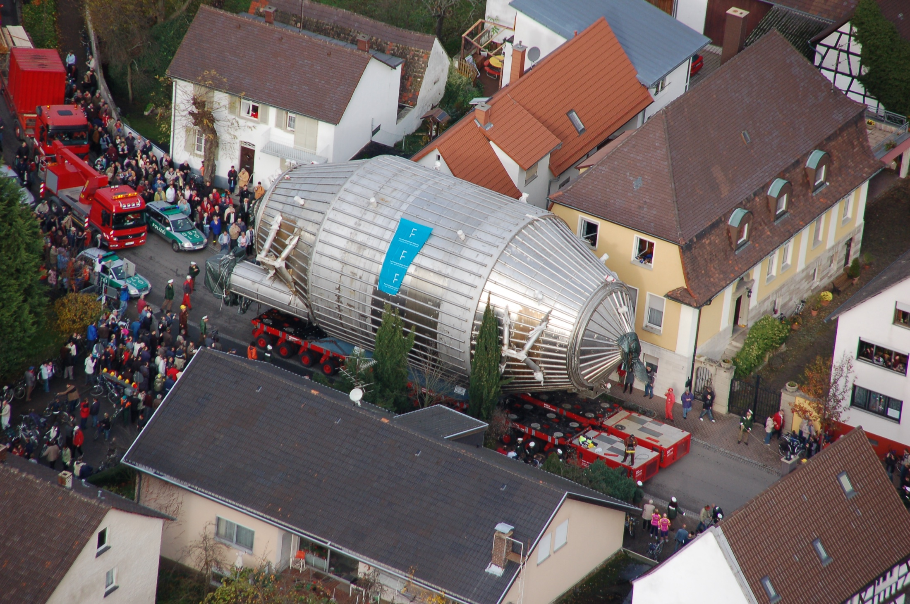

# MAC-E-фильтр

## Как сделать порог почти независимым от угла? {#mac-e-filter}

:::: {.panel-tabset .story-tabs}

### Проблема

Из лекций 04 и 05 мы знаем: масса нейтрино меняет конец $\beta$-спектра,
а электростатический барьер проверяет продольную энергию электрона.

В анализирующей плоскости

$$
\boxed{
E_{\parallel,\mathrm A}
\simeq E-e|U|-E_{\perp,\mathrm A}
}.
$$

Электроны одной энергии рождаются под разными углами и имеют разные
$E_\perp$. Поэтому без коллимации их порог прохождения зависит от угла.

Нужно добиться

$$
\boxed{E_{\perp,\mathrm A}\ll E}
$$

для большого телесного угла, а не отбирать только электроны, летящие вдоль
оси.

### Из лекции 05

В однородном поле

$$
p_\parallel=\mathrm{const},
\qquad
p_\perp=\mathrm{const},
\qquad
\alpha=\mathrm{const}.
$$

Поле ведёт направляющий центр к детектору, но не коллимирует пучок.

Для быстрого циклотронного движения мы ввели действие

$$
\boxed{
J=\frac{1}{2\pi}\oint P\,dQ
=\frac{E_\perp}{\omega_c}
=\frac{p_\perp^2}{2|q|B}
}.
$$

В постоянном однородном поле $J$ сохраняется точно. Теперь поле будет
неоднородным: выясним, переживёт ли $J$ это изменение.

### Идея

Если при медленном уменьшении $B$ действие останется постоянным, то

$$
p_\perp^2=2|q|BJ
\quad\Longrightarrow\quad
B\downarrow\ Rightarrow\ p_\perp\downarrow.
$$

В статическом магнитном поле полная энергия не меняется, поэтому

$$
E_\perp\downarrow
\quad\Longrightarrow\quad
E_\parallel\uparrow.
$$

Это и есть желаемая коллимация. Но сначала нужно доказать исходное
предположение:

$$
\boxed{J\stackrel{?}{\simeq}\mathrm{const}}.
$$

### MAC-E

$$
\boxed{
\text{MAC-E}
=
\text{Magnetic Adiabatic Collimation}
+
\text{Electrostatic filter}
}.
$$

- **MAC** сохраняет большой телесный угол и делает $p_\perp$ малым.

- **E** отбрасывает электроны ниже выбранного энергетического порога.

- Сначала докажем сохранение $J$, затем построим движение направляющего центра
  и получим характеристики фильтра.

### Анимация

<video class="slide-video" style="--media-max-height: 820px;" controls preload="metadata" playsinline src="assets/04_direct_neutrino_mass/katrin_mac_e_electric.mp4"></video>

  Эту анимацию мы видели в лекции 05 как цель. Теперь разберём отдельно
  магнитную коллимацию и электростатический порог.

::::

::: {.absolute bottom=10 left=50 width=1450 style="font-size: 0.42em;"}
[Kruit, Read, 1983](https://doi.org/10.1088/0022-3735/16/4/016) ·
[Лобашёв, Спивак, 1985](https://doi.org/10.1016/0168-9002(85)90640-0) ·
[KATRIN Design Report, §5](https://www.katrin.kit.edu/publikationen/DesignReport2004-12Jan2005.pdf)
:::

# Адиабатическое движение в неоднородном поле

## Что сохраняется при медленном изменении поля?

:::: {.panel-tabset .story-tabs}

### Главное

В однородном поле мы описали циклотронную орбиту действием

$$
J=\frac{1}{2\pi}\oint P\,dQ
=\frac{E_\perp}{\omega_c},
\qquad
H_\perp=\omega_cJ,
\qquad
\dot J=0.
$$

Теперь поле статично, но неоднородно. Вдоль пути электрона

$$
B_c(t)\equiv B(\mathbf R(t)),
\qquad
\omega_c(t)=\frac{|q|B_c(t)}{m}.
$$

Здесь $\mathbf R(t)$ — положение направляющего центра. Вообще говоря,
$E_\perp$ и $\omega_c$ теперь не постоянны.

Наша задача — выяснить, сохранится ли метка циклотронной орбиты:

$$
\boxed{
J=\frac{E_\perp}{\omega_c}
\stackrel{?}{\simeq}\mathrm{const}
}.
$$

### Поле в пути

Раскроем, почему статическое поле $B_c(t)$ всё же зависит от времени для
движущегося электрона.

По обычному правилу дифференцирования сложной функции

$$
\boxed{
\dot B_c
\equiv\frac{d}{dt}B(\mathbf R(t))
=\dot{\mathbf R}\cdot\nabla B
\simeq v_\parallel\frac{\partial B}{\partial s}
}.
$$

Это обычная производная сложной функции вдоль траектории, а не ковариантная
производная. Здесь $s$ — координата вдоль выбранной силовой линии.

Для поля с явной зависимостью от времени к правой части добавилось бы
$\partial B/\partial t$, но для MAC-E-спектрометра это не требуется.

### Условия

В лекции 05 появились два размера одного витка:

$$
\rho_L=\frac{p_\perp}{|q|B},
\qquad
h=v_\parallel T_c.
$$

Введём масштабы изменения поля

$$
L_\perp\equiv\frac{B_c}{|\nabla_\perp B|},
\qquad
L_\parallel\equiv\frac{B_c}{|\partial B/\partial s|}.
$$

За один оборот поле должно изменяться мало поперёк орбиты и вдоль пройденного
шага:

$$
\boxed{
\frac{\rho_L}{L_\perp}\ll1,
\qquad
\frac{h}{L_\parallel}\ll1
}.
$$

Второе условие можно записать через характерное время изменения поля:

$$
\tau_B\equiv\frac{B_c}{|\dot B_c|},
\qquad
T_c=\frac{2\pi}{\omega_c},
$$

$$
\boxed{T_c\ll\tau_B}.
$$

Поле почти постоянно на одном витке, но может заметно измениться за много
оборотов.

### Осциллятор

На одном обороте «заморозим» $B_c$ и $\omega_c$. Поперечное движение остаётся
быстрым:

$$
\dot\theta\simeq\omega_c.
$$

Но сама частота медленно меняется от оборота к обороту:

$$
\boxed{
\frac{|\dot\omega_c|}{\omega_c^2}
=\frac{|\dot B_c|}{\omega_c B_c}
=\frac{1}{2\pi}\frac{T_c}{\tau_B}
\ll1
}.
$$

Поэтому поперечное движение — осциллятор с медленно меняющимся параметром:

$$
H_\perp(Q,P;t)\equiv E_\perp
=\frac{P^2}{2m}+\frac{m\omega_c^2(t)Q^2}{2}.
$$

При изменении $\omega_c$ поперечная энергия не обязана сохраняться. Проверим,
сохраняется ли вместо неё действие $J$.

### Энергия

Согласно уравнениям Гамильтона

$$
\begin{aligned}
\dot E_\perp=\frac{dH_\perp}{dt}
&=
\frac{\partial H_\perp}{\partial Q}\dot Q
+\frac{\partial H_\perp}{\partial P}\dot P
+\frac{\partial H_\perp}{\partial t}
\\
&=-\dot P\dot Q+\dot Q\dot P
+\frac{\partial H_\perp}{\partial t}
=\frac{\partial H_\perp}{\partial t}.
\end{aligned}
$$

При фиксированных $Q$ и $P$

$$
\boxed{
\dot E_\perp
=\frac{\partial}{\partial t}
\left(\frac{m\omega_c^2(t)Q^2}{2}\right)
=m\omega_c\dot\omega_c Q^2.
}
$$

::: {.marginnote .note-right .absolute top=215 left=1475 width=350 style="--note-font-size: 0.62em; --note-math-font-size: 1em;"}
Движение вдоль поля

$$
s\parallel\mathbf B,
\qquad
p_\parallel=m\dot s,
$$

$$
H
=\frac{p_\parallel^2}{2m}+H_\perp.
$$

В статическом поле $H$ сохраняется: поперечная и продольная
энергии обмениваются.

Уравнения Гамильтона

$$
\begin{aligned}
\dot Q&=\frac{\partial H_\perp}{\partial P},\\[1mm]
\dot P&=-\frac{\partial H_\perp}{\partial Q}.
\end{aligned}
$$
:::

### Среднее

::: {style="width: 72%;"}

За один оборот $E_\perp$ и $\omega_c$ почти не меняются, поэтому

$$
Q(t)=A\cos(\omega_ct+\varphi),
\qquad
E_\perp=\frac{m\omega_c^2A^2}{2}.
$$

Отсюда

$$
\left\langle Q^2\right\rangle
=A^2\left\langle\cos^2(\omega_ct+\varphi)\right\rangle
=\frac{A^2}{2}
=\frac{E_\perp}{m\omega_c^2}.
$$

Усредняя полученное на предыдущей вкладке уравнение энергии, находим

$$
\left\langle\dot E_\perp\right\rangle
=m\omega_c\dot\omega_c\left\langle Q^2\right\rangle
=\frac{E_\perp\dot\omega_c}{\omega_c}.
$$

:::

::: {.marginnote .note-right .absolute top=225 left=1215 width=300 style="--note-font-size: 0.62em; --note-math-font-size: 1em;"}
Среднее за период

$$
\langle f\rangle
=\frac{1}{T_c}
\int_t^{t+T_c}f(t')\,dt',
$$

$$
\left\langle\cos^2\right\rangle=\frac12.
$$
:::

### Инвариант J

::: {style="width: 72%;"}

На предыдущей вкладке получено

$$
\left\langle\dot E_\perp\right\rangle
=\frac{E_\perp\dot\omega_c}{\omega_c}.
$$

Применим правило производной частного:

$$
\begin{aligned}
\left\langle
\frac{d}{dt}\frac{E_\perp}{\omega_c}
\right\rangle
&=
\frac{\left\langle\dot E_\perp\right\rangle}{\omega_c}
-\frac{E_\perp\dot\omega_c}{\omega_c^2}
\\[1mm]
&=
\frac{E_\perp\dot\omega_c}{\omega_c^2}
-\frac{E_\perp\dot\omega_c}{\omega_c^2}
=0.
\end{aligned}
$$

Следовательно,

$$
\boxed{
J=\frac{E_\perp}{\omega_c}\simeq\mathrm{const}
}.
$$

Фазовый эллипс медленно меняет форму, но сохраняет площадь $2\pi J$.

:::

::: {.marginnote .note-right .absolute top=315 left=1190 width=330 style="--note-font-size: 0.60em; --note-math-font-size: 0.95em;"}
Фазовый смысл

$$
Q_{\max}=\sqrt{\frac{2J}{m\omega_c}},
\qquad
P_{\max}=\sqrt{2m\omega_cJ},
$$

$$
\pi Q_{\max}P_{\max}=2\pi J.
$$

После усреднения $\langle\dot J\rangle=0$; внутри одного оборота возможны
малые отклонения.
:::

### Момент μ

Так как $\omega_c=|q|B/m$, сохранение $J$ даёт

$$
\boxed{
\mu
\equiv\frac{|q|}{m}J
=\frac{E_\perp}{B}
=\frac{p_\perp^2}{2mB}
\simeq\mathrm{const}
}.
$$

В однородном поле $E_\perp$ и $B$ постоянны по отдельности. В медленно
меняющемся поле они меняются, но их отношение остаётся почти постоянным.

Таким образом, введённый ранее модуль орбитального магнитного момента
становится первым адиабатическим инвариантом. Столкновения и резкие
изменения поля нарушают это приближение.

::::

## Направляющий центр в эффективном потенциале

:::: {.panel-tabset .story-tabs}

### Редукция

В лекции 05 мы разделили шесть переменных частицы на три движения:

$$
(\mathbf r,\mathbf p)
\longleftrightarrow
\underbrace{(X,Y)}_{\text{силовая линия}}
\oplus
\underbrace{(s,p_\parallel)}_{\text{движение вдоль поля}}
\oplus
\underbrace{(\theta,J)}_{\text{быстрое вращение}}.
$$

Проследим движение вдоль одной магнитной трубки и усредним быструю фазу
$\theta$. Её сопряжённый импульс остаётся параметром медленного движения:

$$
\theta\ \text{усреднена},
\qquad
J\simeq\mathrm{const}.
$$

Для оставшейся пары $(s,p_\parallel)$ получаем

$$
\boxed{
\mathcal H_{\mathrm{gc}}(s,p_\parallel;J)
=\frac{p_\parallel^2}{2m}+\omega_c(s)J
=\frac{p_\parallel^2}{2m}+\mu B(s)
},
$$

где $\mu=|q|J/m$. Быстрое вращение не исчезло: его энергия стала
эффективным потенциалом $\mu B(s)$.

<small>Пока используем нерелятивистскую запись. Поправка для электрона
конца тритиевого спектра будет восстановлена при вычислении разрешения.</small>

### Энергия

В статическом магнитном поле полная кинетическая энергия сохраняется:

$$
E=E_\parallel+E_\perp=\mathrm{const}.
$$

Из гамильтониана направляющего центра

$$
\boxed{
E_\perp(s)=\omega_c(s)J=\mu B(s),
\qquad
E_\parallel(s)=E-\mu B(s)
}.
$$

Поэтому

$$
\begin{array}{lll}
B\downarrow: & E_\perp\downarrow, & E_\parallel\uparrow,\\[2mm]
B\uparrow:   & E_\perp\uparrow,   & E_\parallel\downarrow.
\end{array}
$$

Сила Лоренца не совершает работы: модуль скорости постоянен. Меняется
разложение движения на компоненты относительно локального направления поля.

### Коллимация

Пусть $\alpha$ — угол между $\mathbf p$ и локальным полем. Из сохранения
$J$ следует

$$
\frac{p_\perp^2}{B}\simeq\mathrm{const},
\qquad
p_\perp=p\sin\alpha.
$$

Относительно точки $s_0$:

$$
\boxed{
p_\perp(s)=p_{\perp,0}\sqrt{\frac{B(s)}{B_0}}
},
\qquad
\boxed{
\sin^2\alpha(s)=\sin^2\alpha_0\frac{B(s)}{B_0}
}.
$$

Следовательно,

$$
B\downarrow
\quad\Longrightarrow\quad
p_\perp\downarrow,
\quad
\alpha\downarrow:
\quad\text{пучок коллимируется}.
$$

При этом

$$
\rho_L=\frac{p_\perp}{|q|B}\propto B^{-1/2}:
$$

поперечный импульс уменьшается, хотя радиус отдельной орбиты растёт.

### Сила

Теперь польза гамильтоновой записи видна непосредственно:

$$
\begin{aligned}
\dot p_\parallel
&=-\frac{\partial\mathcal H_{\mathrm{gc}}}{\partial s}\\
&=-J\frac{d\omega_c}{ds}
=-\mu\frac{dB}{ds}.
\end{aligned}
$$

$$
\boxed{
F_\parallel=-\mu\frac{dB}{ds}
}.
$$

Это **сила магнитного зеркала**. Она всегда направлена в сторону более
слабого поля: при движении в область растущего $B$ частица тормозится вдоль
силовой линии.

### Зеркало

Пусть электрон стартует при $B_{\mathrm{src}}$ с энергией $E$ под углом
$\alpha_{\mathrm{src}}$:

$$
\mu
=\frac{E\sin^2\alpha_{\mathrm{src}}}{B_{\mathrm{src}}}.
$$

Тогда

$$
E_\parallel(s)
=E\left[
1-\frac{B(s)}{B_{\mathrm{src}}}\sin^2\alpha_{\mathrm{src}}
\right].
$$

В точке, где $E_\parallel=0$, направляющий центр останавливается и движется
обратно:

$$
\boxed{
B_{\mathrm{mirror}}
=\frac{B_{\mathrm{src}}}{\sin^2\alpha_{\mathrm{src}}}
}.
$$

### Акцептанс

Пусть $B_{\max}$ — максимальное поле на всём пути электрона. Частица проходит
магнитную систему, если

$$
B_{\max}<B_{\mathrm{mirror}}
\quad\Longleftrightarrow\quad
\sin^2\alpha_{\mathrm{src}}
<\frac{B_{\mathrm{src}}}{B_{\max}}.
$$

Максимальный принимаемый угол равен

$$
\boxed{
\alpha_{\mathrm{acc}}
=\arcsin\sqrt{\frac{B_{\mathrm{src}}}{B_{\max}}}
}.
$$

Для KATRIN

$$
B_{\mathrm{src}}=3.6~\mathrm{Тл},
\qquad
B_{\max}=6.0~\mathrm{Тл}
\quad\Longrightarrow\quad
\alpha_{\mathrm{acc}}\simeq50.8^\circ.
$$

Электроны с большими углами отражаются магнитным зеркалом.

::::

## Как из этого получается MAC-E-фильтр? {#magnetic-collimation}

:::: {.panel-tabset .story-tabs}

### Геометрия

Идеальный MAC-E-фильтр задают три значения магнитного поля:

$$
\begin{array}{ccl}
B_{\mathrm{src}} &:& \text{поле в источнике},\\[1mm]
B_{\mathrm A}=B_{\min} &:& \text{поле в анализирующей плоскости},\\[1mm]
B_{\max} &:& \text{максимальное поле на пути электрона}.
\end{array}
$$

Для KATRIN номинально

$$
B_{\mathrm{src}}=3.6~\mathrm{Тл},
\qquad
B_{\mathrm A}=0.30~\mathrm{мТл},
\qquad
B_{\max}=6.0~\mathrm{Тл}.
$$

- $B_{\max}$ задаёт магнитное зеркало и угловой акцептанс.
- $B_{\mathrm A}\ll B_{\mathrm{src}}$ коллимирует импульс перед
  электростатическим барьером.
- Максимум задерживающего потенциала расположен в той же анализирующей
  области, где магнитное поле минимально.

### MAC

Из сохранения $J$ между источником и анализирующей плоскостью

$$
\boxed{
\frac{p_{\perp,\mathrm A}}{p_{\perp,\mathrm{src}}}
=\sqrt{\frac{B_{\mathrm A}}{B_{\mathrm{src}}}}
\simeq9.1\cdot10^{-3}
}.
$$

Поперечный импульс уменьшается примерно в $110$ раз. При сохранении полной
энергии освободившаяся поперечная энергия становится продольной.

Например,

$$
\alpha_{\mathrm{src}}=50^\circ
\quad\longrightarrow\quad
\alpha_{\mathrm A}\simeq0.40^\circ.
$$

Это **Magnetic Adiabatic Collimation**: поле не уменьшает энергию электрона,
а поворачивает его импульс почти вдоль оси спектрометра.

### Анимация

<video class="slide-video media-height-lg" controls preload="metadata" playsinline poster="assets/04_direct_neutrino_mass/katrin_magnetic_collimation.jpg" src="assets/04_direct_neutrino_mass/katrin_magnetic_collimation.mp4"></video>

  В магнитном поле KATRIN при входе в главный спектрометр $p_\perp$
  уменьшается, а после анализирующей плоскости снова растёт. Электрическое
  поле здесь отключено, чтобы показать только MAC.

### E-фильтр

В идеальной геометрии электрическое поле в анализирующей области направлено
преимущественно вдоль $\mathbf B$. Оно изменяет продольную энергию, почти не
затрагивая циклотронное действие.

Для электрона задерживающий потенциал создаёт барьер $e|U|$:

$$
\boxed{
E_{\parallel,\mathrm A}
\simeq E-e|U|-E_{\perp,\mathrm A}
}.
$$

$$
\begin{array}{ccl}
E_{\parallel,\mathrm A}>0 &:& \text{электрон проходит},\\[1mm]
E_{\parallel,\mathrm A}=0 &:& \text{порог прохождения},\\[1mm]
E_{\parallel,\mathrm A}<0 &:& \text{электрон отражается}.
\end{array}
$$

Магнитная часть делает $E_{\perp,\mathrm A}$ малой; электрическая сравнивает
почти всю кинетическую энергию с управляемым порогом.

### Разрешение

Для принятого электрона

$$
\frac{p_{\perp,\mathrm{src}}^2}{p^2}
\leq\frac{B_{\mathrm{src}}}{B_{\max}}.
$$

Сохранение $J$ даёт в анализирующей плоскости

$$
\frac{p_{\perp,\mathrm A}^2}{p^2}
\leq\frac{B_{\mathrm A}}{B_{\max}}.
$$

Для кинетической энергии $E$

$$
\frac{p^2}{2m_e}
=E\left(1+\frac{E}{2m_ec^2}\right)
=E\frac{\gamma+1}{2}.
$$

Поэтому ширина идеального порога равна

$$
\boxed{
\Delta E
=E\frac{B_{\mathrm A}}{B_{\max}}\frac{\gamma+1}{2}
}.
$$

При $E=18.6~\mathrm{кэВ}$ и $\gamma=1.036$ получаем

$$
\boxed{\Delta E\simeq0.95~\mathrm{эВ}}.
$$

### Почему 10 м?

Сохранение $J$ связывает разрешение с отношением полей:

$$
\frac{\Delta E}{E}\sim\frac{B_{\mathrm A}}{B_{\max}}.
$$

Чтобы получить суб-эВ разрешение при $E=18.6~\mathrm{кэВ}$, необходимо
$B_{\mathrm A}/B_{\max}\sim5\cdot10^{-5}$, то есть чрезвычайно малое поле в
анализирующей плоскости.

Но из $\nabla\cdot\mathbf B=0$ следует сохранение магнитного потока внутри
принятой трубки; $\mathcal A$ — площадь её поперечного сечения:

$$
\boxed{\Phi_{\mathrm{tube}}=B\mathcal A\simeq\mathrm{const}},
\qquad
\boxed{
d(B)=2\sqrt{\frac{\Phi_{\mathrm{tube}}}{\pi B}}
\propto B^{-1/2}
}.
$$

$$
\Phi_{\mathrm{tube}}=191~\mathrm{Тл\,см^2}
\quad\Longrightarrow\quad
d(6~\mathrm{Тл})\simeq6.4~\mathrm{см},
\qquad
d(0.30~\mathrm{мТл})\simeq9.0~\mathrm{м}.
$$

$$
\boxed{
\Delta E\downarrow
\xRightarrow{\ J\simeq\mathrm{const}\ }
B_{\mathrm A}\downarrow
\xRightarrow{\ \Phi_{\mathrm{tube}}\simeq\mathrm{const}\ }
\mathcal A_{\mathrm A}\uparrow
\Longrightarrow d_{\mathrm A}\simeq9~\mathrm{м}
}.
$$

<small>Расширяется вся магнитная трубка, а не только ларморовская орбита
отдельного электрона; обе величины масштабируются как $B^{-1/2}$.</small>

### Фото

  Главный сосуд KATRIN: длина $23.3$ м, внутренний диаметр $9.8$ м, масса около
  $200$ т. Транспорт через Эггенштайн-Леопольдсхафен, 25 ноября 2006 года.
  Фото: Markus Breig, KIT-Archiv 28010/I 7185;
  <a href="https://www.100objekte.kit.edu/en/object/085/">источник KIT</a>.

::::

::: {.absolute bottom=10 left=50 width=1500 style="font-size: 0.42em;"}
[Магнитная система KATRIN](https://arxiv.org/abs/1806.08312) ·
[Принцип MAC-E и главный спектрометр](https://www.katrin.kit.edu/deutsch/893.php)
:::

## Итоги

:::: {.columns}

::: {.column width="49%"}

**Быстрое и медленное движение**

$$
T_c\ll\tau_B
\quad\Longrightarrow\quad
\boxed{J\simeq\mathrm{const}}.
$$

После усреднения быстрой фазы $\theta$

$$
\boxed{
\mathcal H_{\mathrm{gc}}
=\frac{p_\parallel^2}{2m}+\omega_c(s)J
=\frac{p_\parallel^2}{2m}+\mu B(s)
}.
$$

$$
B\downarrow\Rightarrow\text{коллимация},
\qquad
B\uparrow\Rightarrow\text{магнитное зеркало}.
$$

:::

::: {.column width="49%"}

**Идеальный MAC-E-фильтр**

$$
\sin^2\alpha_{\mathrm{acc}}
=\frac{B_{\mathrm{src}}}{B_{\max}},
$$

$$
\Delta E
=E\frac{B_{\mathrm A}}{B_{\max}}\frac{\gamma+1}{2},
$$

$$
E_{\parallel,\mathrm A}
\simeq E-e|U|-E_{\perp,\mathrm A}.
$$

$B_{\mathrm A}\ll B_{\max}$ даёт высокое разрешение, но расширяет магнитную
трубку и требует огромного спектрометра.

:::

::::

::: {.takeaway style="text-align: center; font-size: 1.02em; margin-top: 0.25rem; padding: 0.42rem 0.8rem; border: 2px solid #58b8ee; border-radius: 14px; background: rgba(55, 145, 205, 0.12);"}
Мы получили прохождение **одного электрона**. В следующей лекции углы,
рассеяние и свойства источника превратят идеальный порог в функцию отклика
реального эксперимента KATRIN.
:::
