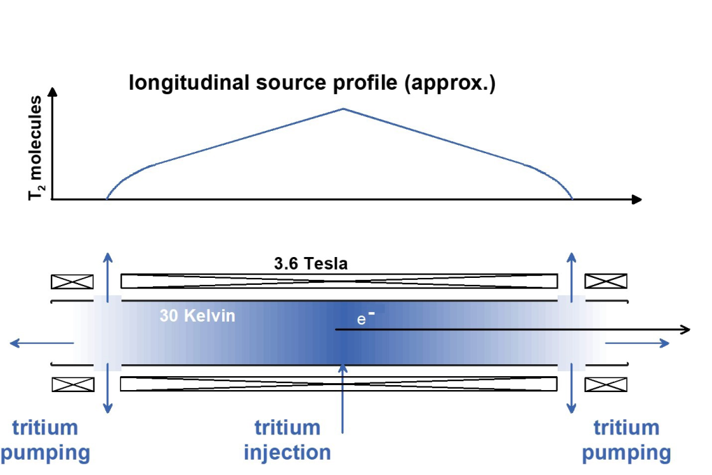

# KATRIN

## От распада до зарегистрированного электрона

:::: {.panel-tabset .story-tabs}

### WGTS

:::: {.columns}

::: {.column width="58%"}

{fig-alt="Тритий подаётся в центр безоконного газового источника KATRIN и откачивается с обоих концов" width="100%"}

<small>[G. Drexlin, C. Weinheimer, *KATRIN experiment* (2026), Fig. 6](https://arxiv.org/abs/2601.00248), левая часть.</small>

:::

::: {.column width="42%"}

Молекулярный тритий подаётся в середину $10$-метровой трубы и непрерывно
откачивается с обоих концов.

Поэтому вдоль источника возникает приблизительно треугольный профиль плотности.
Окон и твёрдой подложки на пути электронов нет.

Активность источника составляет около $10^{11}$ распадов в секунду. Для формы
спектра контролируются

$$
T,\qquad \rho d,\qquad \text{изотопный состав}.
$$

:::

::::

### Рассеяние

::: {style="width: 74%;"}

Подложки нет, но электрон может неупруго рассеяться на молекуле $\mathrm T_2$.
Для электронов у конца спектра

$$
\rho d\simeq4\cdot10^{17}~\mathrm{см}^{-2},
\qquad
\sigma_{\mathrm{inel}}\simeq3.4\cdot10^{-18}~\mathrm{см}^2,
$$

$$
\tau_{\mathrm{full}}=(\rho d)\sigma_{\mathrm{inel}}\simeq1.4.
$$

Значит, рассеянием пренебречь нельзя: для электрона, прошедшего весь столб,

$$
P_0=e^{-\tau_{\mathrm{full}}}\simeq0.25.
$$

Но теперь потери происходят в известном газе. Электронная пушка измеряет
$\rho d\,\sigma_{\mathrm{inel}}$ и распределение потерь энергии; вероятности
нуля, одного и нескольких рассеяний входят в функцию отклика.

:::

::: {.marginnote .absolute top=145 left=1230 width=285 style="--note-font-size: 0.61em; --note-math-font-size: 0.95em;"}
Столбцовая плотность

$$
\rho d\equiv\int n(z)\,dz.
$$

$n(z)$ — концентрация молекул, $d$ — длина источника.

$[\rho d]=\mathrm{см}^{-2}$.
:::

### Откачка

Сам тритий не должен попасть в главный спектрометр и создать там фон.

- **DPS** (*Differential Pumping Section*, секция дифференциальной откачки)
  удаляет газ турбомолекулярными насосами;
- **CPS** (*Cryogenic Pumping Section*, секция криогенной откачки)
  криогенно сорбирует оставшиеся молекулы;
- магнитное поле при этом сохраняет электронный пучок.

Поток трития подавляется более чем на $14$ порядков, но электроны проходят
транспортную систему.

### Спектрометры

Предспектрометр отбрасывает электроны далеко от конца спектра. Главный
спектрометр длиной $23.3$ м и диаметром около $10$ м реализует MAC-E-фильтр.

В анализирующей плоскости

$$
B_{min}\simeq0.35~\mathrm{мТл},
\qquad
\Delta E\simeq0.95~\mathrm{эВ}.
$$

Напряжение электродов задаёт исследуемый порог энергии $e|U|$.

### Детектор

Прошедшие электроны ускоряются к сегментированному кремниевому детектору.
Он регистрирует число электронов и их положение, но точную энергию конца
спектра определяет прежде всего задерживающий потенциал.

Поэтому KATRIN — **интегральный**, а не дифференциальный спектрометр.

### Калибровка

Для контроля шкалы энергии и функции отклика используются

- моноэнергетическая электронная пушка;
- конверсионные электроны ${}^{83\mathrm m}\mathrm{Kr}$;
- прецизионный делитель высокого напряжения;
- мониторный спектрометр.

Масштаб цели задаёт требование: стабильность потенциала должна быть намного
лучше одного электронвольта при $|U|\simeq18.6$ кВ.

::::

## Функция пропускания

:::: {.panel-tabset .story-tabs}

### Порог

В анализирующей плоскости продольная энергия приближённо равна

$$
E_{\parallel,\mathrm A}
\simeq E-e|U|-E_{\perp,\mathrm A}.
$$

Адиабатическая коллимация даёт

$$
E_{\perp,\mathrm A}
\simeq E\sin^2\vartheta_{\mathrm{src}}
\frac{B_{\min}}{B_{\mathrm{src}}}.
$$

Электрон проходит, если $E_{\parallel,\mathrm A}>0$. Поэтому порог немного
зависит от начального угла.

### Разрешение

Максимальная остаточная поперечная энергия задаётся угловой акцептансой:

$$
\boxed{
\Delta E
=E\frac{B_{\min}}{B_{\max}}\frac{\gamma+1}{2}
}.
$$

Для конца тритиевого спектра

$$
E=18.6~\mathrm{кэВ},
\qquad
B_{\min}\simeq0.35~\mathrm{мТл},
\qquad
B_{\max}=6~\mathrm{Тл},
$$

откуда $\Delta E\simeq0.95~\mathrm{эВ}$.

### Геометрия

Для изотропного вылета в принятом конусе доля прошедших направлений равна

$$
T(E,U)=
\frac{1-\cos\vartheta_T}{1-\cos\vartheta_{\mathrm{acc}}},
$$

где до насыщения

$$
\sin^2\vartheta_T
=\frac{E-e|U|}{E}\frac{B_{\mathrm{src}}}{B_{\min}},
\qquad
\sin^2\vartheta_{\mathrm{acc}}
=\frac{B_{\mathrm{src}}}{B_{\max}}.
$$

Так резкий порог превращается в переход шириной $\Delta E$.

### Рассеяние

Электрон может $s$ раз неупруго рассеяться в источнике и потерять суммарную
энергию $\varepsilon$. Поэтому функция отклика имеет вид

$$
f(E,U)=P_0T(E,U)
+\sum_{s\ge1}P_s
\int d\varepsilon\,g_s(\varepsilon)T(E-\varepsilon,U).
$$

$P_s$ — вероятность $s$ рассеяний, $g_s$ — распределение потери энергии.
Именно $f(E,U)$ связывает теоретический $\beta$-спектр с измеряемой скоростью.

::::

## Интегральное измерение {#katrin-integral-spectrum}

При фиксированном задерживающем потенциале измеряется не одна энергия, а все
электроны, прошедшие фильтр:

$$
\boxed{
R(U)=A\int_0^{E_0}dE\,
\frac{d\Gamma}{dE}(E;m_\beta^2,E_0)\,f(E,U)+b
}.
$$

$A$ — нормировка сигнала, $f(E,U)$ — функция отклика, $b$ — фон.



## Статистическая модель

:::: {.panel-tabset .story-tabs}

### Данные

Для настройки $k$ с длительностью измерения $t_k$ ожидается

$$
\lambda_k=t_kR(U_k),
\qquad
n_k\sim\operatorname{Poisson}(\lambda_k).
$$

Логарифм функции правдоподобия содержит

$$
-2\ln L
=2\sum_k\left[
\lambda_k-n_k+n_k\ln\frac{n_k}{\lambda_k}
\right]
+\text{штрафы систематик}.
$$

### Четыре параметра

В основном фитируются

$$
\boxed{m_\beta^2,\quad E_0,\quad A,\quad b}.
$$

- $m_\beta^2$ меняет кривизну у конца;
- $E_0$ сдвигает спектр;
- $A$ задаёт нормировку;
- $b$ задаёт уровень фона.

Эти параметры коррелированы, поэтому их нельзя надёжно определять по одной
точке задерживающего потенциала.

### Сканирование

KATRIN использует около $35$ значений $U$. Время распределяется неравномерно:
от десятков секунд далеко от конца до десятков минут в наиболее
чувствительной области.

Точки ниже конца фиксируют $A$ и свойства источника; точки около и выше конца
разделяют $m_\beta^2$, $E_0$ и фон.

### Почему $m_\beta^2$?

Спектр аналитически зависит от квадрата массы:

$$
E_\nu\sqrt{E_\nu^2-m_\beta^2}.
$$

Если искусственно запретить $m_\beta^2<0$, статистическая флуктуация около
нуля даст смещённую вверх оценку. Поэтому сначала фитируют неограниченный
$m_\beta^2$, а физический предел $m_\beta\ge0$ вводят при построении интервала.

### Отрицательный минимум

Пусть неучтённое гауссово уширение имеет дисперсию $\sigma^2$. Для
безмассового конца, где спектр пропорционален $x^2$ при $x=E_0-E$, свёртка даёт

$$
\langle(x+\delta)^2\rangle=x^2+\sigma^2.
$$

Масса меняет ту же форму приближённо как $x^2-m_\beta^2/2$. Поэтому

$$
\boxed{\Delta m_\beta^2\simeq-2\sigma^2}.
$$

Отрицательный минимум может указывать на флуктуацию или недооценённое
уширение; это не «мнимая масса» нейтрино.

::::

## Систематические неопределённости

:::: {.columns}

::: {.column width="56%"}

| Источник | $\sigma(m_\beta^2)$, $\mathrm{эВ}^2$ |
|---|---:|
| статистика | 0.108 |
| $\rho d\times\sigma_{\mathrm{inel}}$ | 0.052 |
| функция потерь энергии | 0.034 |
| фон, зависящий от длительности шага | 0.027 |
| потенциал источника | 0.022 |
| непуассоновский фон | 0.015 |

:::

::: {.column width="44%"}

Все эти величины входят не после фита, а в модель отклика или в совместную
функцию правдоподобия.

Главное соотношение:

$$
\boxed{
\text{точность массы}
\neq
\text{только энергетическое разрешение}
}.
$$

Нужны одновременно стабильный источник, известные потери, контролируемый
потенциал и модель фона.

:::

::::

## Результат KATRIN

По первым пяти измерительным кампаниям, $259$ суткам данных,

$$
\boxed{
m_\beta^2=-0.14^{+0.13}_{-0.15}~\mathrm{эВ}^2
}.
$$

Физическая граница $m_\beta^2\ge0$ учитывается при построении интервала:

$$
\boxed{m_\beta<0.45~\mathrm{эВ}\quad(90\%~\text{доверительный уровень}).}
$$

К концу 2025 года KATRIN набрал около $1000$ суток данных. Полный анализ ещё
не опубликован; ожидаемая итоговая чувствительность — лучше $0.30~\mathrm{эВ}$.

::: {.absolute bottom=10 left=50 width=1450 style="font-size: 0.42em;"}
[KATRIN Collaboration, результат первых пяти кампаний](https://arxiv.org/abs/2406.13516) ·
[G. Drexlin, C. Weinheimer, обзор программы KATRIN (2026)](https://arxiv.org/abs/2601.00248)
:::

## После основной программы

:::: {.panel-tabset .story-tabs}

### Полный спектр

После измерения конца спектра KATRIN переходит к более широкой области
энергий. Тяжёлое массовое состояние с примесью $|V_{e4}|^2$ создало бы излом:

$$
\frac{d\Gamma}{dE}
=(1-|V_{e4}|^2)\frac{d\Gamma_l}{dE}
+|V_{e4}|^2\frac{d\Gamma_4}{dE}.
$$

Положение излома определяет $m_4$, его величина — $|V_{e4}|^2$.

### Дифференциальный режим

Для следующего шага исследуются детекторы, измеряющие энергию каждого
электрона после MAC-E-фильтра. Это позволяет использовать больше информации
о форме спектра и повышать скорость набора данных.

Задача KATRIN++ — приблизиться к масштабу порядка $50~\mathrm{мэВ}$.

### Атомарный тритий

Молекулярный ${}^3\mathrm H_2$ оставляет распределение вращательных,
колебательных и электронных состояний. У атомарного трития такого
молекулярного уширения нет.

Цена — необходимость создать интенсивный, холодный и чистый атомарный
источник и удерживать атомы от рекомбинации.

::::
