## От энергии электрона к массе нейтрино

::: {style="width:76%;"}

- В лекции 04 мы получили форму спектра рождения электронов.
- В лекциях 05–06 разобрали, как магнитное поле собирает электроны, а
  электростатический барьер отбирает их по энергии.
- Теперь нужно предсказать число отсчётов настоящего прибора:

$$
\boxed{
\text{спектр рождения}
\ \longrightarrow\
\text{потери и пропускание}
\ \longrightarrow\
\text{скорость счёта}
}.
$$

- Если электрон потерял энергию в источнике, это изменит измеренный спектр.
  Если сдвинулось напряжение, изменится порог. Если вырос фон, изменится число
  отсчётов.
- Каждую из этих величин можно проверить отдельным измерением.

::: {.nh-box tone="question" size="md"}
Как отличить изменение спектра из-за массы нейтрино от изменения самого прибора?
:::

:::

::: {.marginnote .absolute top=180 left=1530 width=310 style="--note-font-size:0.62em;"}
Напомним

- $E$ — кинетическая энергия электрона.
- $E_0$ — конец спектра при нулевой массе нейтрино.
- $e>0$ — модуль заряда электрона.
- $e|U|$ — задерживающая энергия.
- Используем $\hbar=c=1$.

:::

## От распада до зарегистрированного электрона {#katrin-beamline}

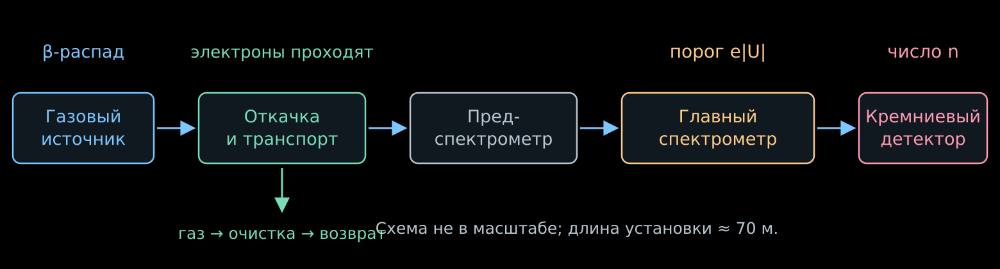{width="100%" fig-alt="Источник рождает электроны, откачка удаляет газ, спектрометр задаёт порог, детектор считает прошедшие электроны"}

- **Источник:** много распадов в известном газе.
- **Транспорт:** электроны следуют за магнитным полем; нейтральный газ откачивается.
- **Главный спектрометр:** каждый электрон проходит или отражается.
- **Детектор:** за время $t$ накапливается число событий $n$; скорость счёта
  равна $R=n/t$.

::: {.nh-text tone="muted" size="sm"}
Схема: основные узлы [KATRIN](https://arxiv.org/abs/2103.04755).
:::

## Безоконный источник: газ должен течь {#katrin-source}

::::: {.panel-tabset .story-tabs}

### Источник

:::: {.columns}

::: {.column width="53%"}

{.slide-image-center .nostretch width="100%" fig-alt="Тритий подаётся в центр десятиметрового источника и откачивается с обоих концов"}

::: {.nh-text tone="muted" size="sm"}
Схема источника: [Drexlin, Weinheimer, рис. 6](https://arxiv.org/abs/2601.00248).
WGTS — безоконный газовый тритиевый источник.
:::

:::

::: {.column width="44%"}

- Тритий подают в середину трубы длиной $10$ м.
- Насосы на обоих концах непрерывно удаляют газ. Плотность максимальна в центре
  и падает к выходам.
- Газ очищают и возвращают в источник: поддерживается стационарный поток.
- Электрон не проходит через плёнку или окно. Но на его пути остаются другие
  молекулы газа.

:::

::::

### Плотность и температура

- Число молекул на единицу поперечной площади задаёт **столбцовая плотность**:

$$
\rho d\equiv\int_0^d n(z)\,dz
\simeq4\cdot10^{17}\ \mathrm{см}^{-2}.
$$

- $n(z)$ — концентрация молекул; $\rho d$ — принятое обозначение интеграла.
- Чем больше $\rho d$, тем больше распадов, но тем чаще электрон рассеивается.
  Поэтому нестабильность плотности меняет и интенсивность, и форму спектра.
- Давление подачи и температуру $T_{\mathrm{газ}}$ стабилизируют:
  они определяют распределение газа. Тепловое движение молекул также
  даёт доплеровское уширение спектра.

::: {.nh-box tone="accent" size="sm"}
Важно знать не только число распавшихся ядер, но и количество газа,
которое электрон встретит после рождения.
:::

### Состав газа

- В газе встречаются $\mathrm T_2$, $\mathrm{DT}$, $\mathrm{HT}$ и молекулы
  без трития. У $\mathrm T_2$ два радиоактивных ядра, у $\mathrm{DT}$ — одно.
- Разные молекулы дают разные распределения конечных возбуждений дочернего
  иона. Это меняет спектр рождения, как мы видели в лекции 04.
- Состав непрерывно измеряют **рамановской спектроскопией**:
  лазерный фотон при рассеянии отдаёт молекуле энергию вращения или колебания,

$$
E_{\gamma,\mathrm{вх}}-E_{\gamma,\mathrm{вых}}
=\Delta E_{\mathrm{мол}}.
$$

- Положение линий различает молекулы, а их интенсивности после калибровки дают
  концентрации компонентов.

::: {.nh-text tone="muted" size="sm"}
[Измерение изотопного состава методом рамановской спектроскопии](https://doi.org/10.3390/s20174827).
:::

:::::

## Электроны пропустить, тритий остановить

::::: {.panel-tabset .story-tabs}

### Изогнутая труба

- Электрон заряжен. В плавно искривлённом магнитном поле его направляющий
  центр следует за силовой линией.
- Нейтральная молекула $\mathrm T_2$ не удерживается этим полем. Между
  столкновениями она летит почти прямолинейно.
- Изгибы трубы убирают прямой пролёт молекул к спектрометру. Молекулы
  сталкиваются со стенками и получают больше возможностей попасть в насос.
- Электронный пучок при этом проходит вдоль магнитной трубки.

::: {.nh-box tone="success" size="md"}
Различие в электрическом заряде позволяет разделить электроны и газ
без материального окна.
:::

### Две ступени откачки

- **Дифференциальная откачка:** несколько насосов последовательно понижают
  давление. Быстрые лопатки турбомолекулярного насоса передают молекулам
  импульс в направлении откачки.
- **Криогенная откачка:** остаточный газ попадает на стенки холоднее $5$ К,
  покрытые пористым слоем замороженного аргона.
- На холодной поверхности молекулы адсорбируются и очень медленно
  возвращаются в газ. Большая поверхность аргонового слоя увеличивает
  ёмкость ловушки.
- Вся система уменьшает поток трития к спектрометрам более чем на
  $14$ порядков.

::: {.nh-text tone="muted" size="sm"}
DPS и CPS на технических схемах — секции дифференциальной и криогенной
откачки. [Устройство KATRIN, разделы об откачке](https://arxiv.org/abs/2103.04755).
:::

### Почему это важно для спектра

- Распад внутри источника начинается до задерживающего барьера.
  Энергия электрона проверяется фильтром.
- Если тритий распадётся уже внутри главного спектрометра, электрон может
  родиться по другую сторону барьера.
- Такой электрон способен попасть на детектор, хотя исходная энергия
  не удовлетворяла отбору для электронов источника.
- Эти отсчёты образуют фон. В области конца спектра даже небольшая
  добавка сравнима с полезным сигналом.

:::::

## Чем опасен газ на пути электрона?

::::: {.panel-tabset .story-tabs}

### Плюс и минус

- **Плюс.** В твёрдом источнике 1980-х годов электрон рождался внутри плёнки и
  терял энергию в ней же. Толщина, шероховатость и состав плёнки входили в
  ответ — и не подтвердившиеся $30$ эВ тому пример (лекция 04).
- **Минус.** Безоконный источник убрал подложку, но газ остался на пути:
  между точкой рождения и фильтром лежит столб молекул.
- Для отдельного электрона неизвестно ни место рождения, ни число
  столкновений, ни потерянная энергия:

$$
\boxed{E_{\text{у фильтра}}=E-\varepsilon},
\qquad
\varepsilon=\varepsilon_1+\ldots+\varepsilon_n.
$$

- Барьер сравнивает с порогом именно $E-\varepsilon$, а масса нейтрино
  записана в распределении $E$.

### Чем это грозит массе

- Потеря энергии уводит электрон вниз по измеряемому спектру. У конца спектра
  это выглядит как нехватка отсчётов.
- Но нехватку отсчётов у конца умеет объяснять и масса нейтрино. Ошибка в
  потерях перетечёт в $m_\beta^2$.
- Неупругие потери начинаются примерно с $11$ эВ, а массу определяют по
  последним $40$ эВ спектра: потери попадают прямо в рабочее окно.
- Оценка из последнего раздела лекции: неучтённое уширение отклика $\sigma_E$
  сдвигает результат на

$$
\Delta m_\beta^2\simeq-2\sigma_E^2.
$$

- Уширение всего $0.2$ эВ даёт $-0.08$ эВ$^2$ — это уже порядок всей
  статистической ошибки первых пяти кампаний.

::: {.nh-box tone="warning" size="sm"}
В таблице неопределённостей KATRIN оптическая толщина ($0.052$ эВ$^2$) и
распределение потерь энергии ($0.034$ эВ$^2$) — два крупнейших вклада после
статистики. Этот слайд объясняет, откуда они берутся.
:::

### Что делать

- Нужны две вещи: распределение потерь в одном столкновении $g_1$ и
  вероятности числа столкновений $P_n$.
- Из самого β-спектра их не достать: там та же смесь неизвестных. Нужен
  отдельный пучок с известной энергией — **фотоэлектронная пушка**.
- План измерения:

$$
\begin{array}{ll}
\text{сканируем } e|U| &\text{— видим, сколько энергии потерял пучок},\\[2mm]
\text{меняем } \rho d &\text{— меняем веса однократных и многократных столкновений},\\[2mm]
\text{убираем газ} &\text{— получаем собственное разрешение прибора}.
\end{array}
$$

::: {.nh-box tone="accent" size="sm"}
Пушка ничего не говорит о массе нейтрино. Она измеряет свойства газа, которые
затем входят в расчёт β-спектра.
:::

:::::

## Сколько столкновений испытает электрон?

::::: {.panel-tabset .story-tabs}

### Путь в газе

- Пусть электрон родился в точке $z$ и движется к выходу $z=d$ под углом
  $\alpha$ к оси почти однородного поля. На осевое перемещение $dz'$ он тратит
  путь $dz'/\cos\alpha$. Среднее число неупругих столкновений равно

$$
\boxed{
\tau(z,\alpha)=
\frac{\sigma_{\mathrm{inel}}}{\cos\alpha}
\int_z^d n(z')\,dz'
}.
$$

- Эта величина называется **оптической толщиной**: путь, выраженный в длинах
  свободного пробега $\lambda=1/(n\sigma_{\mathrm{inel}})$. В лекции 01 в том
  же смысле стояло отношение $x/\lambda$ в законе $P_0=e^{-x/\lambda}$.
- Для всего столба газа

$$
\boxed{
\tau_{\mathrm{col}}=(\rho d)\,\sigma_{\mathrm{inel}}
\simeq(4\cdot10^{17})(3.4\cdot10^{-18})\simeq1.36
}.
$$

- Пучок пушки идёт вдоль оси через весь столб, поэтому
  $\tau_{\mathrm{gun}}=\tau_{\mathrm{col}}$.

::: {.nh-text tone="muted" size="sm"}
Угол и сечение считаются постоянными на пути. Это приближение для оценки
вероятностей; изменение направления при столкновениях учитывают в более полной
модели.
:::

### Вероятности

- Столкновения независимы, поэтому их число распределено по Пуассону:

$$
\boxed{
P_n(z,\alpha)=e^{-\tau}\frac{\tau^n}{n!}
},
\qquad
\tau=\tau(z,\alpha).
$$

- Для пучка пушки $\tau=\tau_{\mathrm{col}}\simeq1.36$:

$$
P_0\simeq0.26,
\qquad
P_1\simeq0.35,
\qquad
P_2\simeq0.24,
\qquad
P_3\simeq0.11.
$$

- Хотя бы одно столкновение испытывают три четверти пучка, два и больше —
  почти сорок процентов.

::: {.nh-box tone="accent" size="sm"}
Одной средней поправкой на потерянную энергию здесь не обойтись: нужны и
полное распределение потерь, и веса всех кратностей.
:::

### Пушка и β-распад

:::: {.columns}

::: {.column width="54%"}

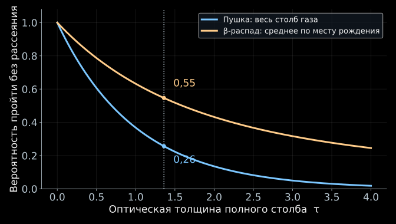{width="100%" fig-alt="Вероятность выйти без рассеяния у электронов, рождённых в газе, больше, чем у пучка, проходящего весь столб"}

:::

::: {.column width="43%"}

- Пушка проходит **весь** столб, поэтому доля непотерявших равна

$$
P_0^{\mathrm{gun}}=e^{-\tau_{\mathrm{col}}}\simeq0.26.
$$

- β-электрон рождается **внутри** газа. При $\alpha=0$ и постоянном составе
  оставшаяся до выхода толщина $u$ равномерна на $[0,\tau_{\mathrm{col}}]$:

$$
\boxed{
\langle P_0\rangle_\beta
=\frac{1}{\tau_{\mathrm{col}}}\int_0^{\tau_{\mathrm{col}}}e^{-u}\,du
=\frac{1-e^{-\tau_{\mathrm{col}}}}{\tau_{\mathrm{col}}}
\simeq0.55
}.
$$

- Усреднение по углам уменьшает это число: наклонные траектории длиннее.

:::

::::

::: {.nh-box tone="warning" size="sm"}
Числа относятся к разным объектам: $0.26$ — к пучку пушки, $0.55$ — к
β-электронам того же газа. Пушка измеряет **газ**; чтобы перейти к β-спектру,
нужно усреднить по местам рождения и углам.
:::

::: {.nh-text tone="muted" size="sm"}
Вероятность рождения пропорциональна концентрации, поэтому $u$ равномерна при
любой форме профиля $n(z)$.
:::

:::::

## Электронная пушка: что измеряем? {#electron-gun}

::::: {.panel-tabset .story-tabs}

### Задача

**Определить распределение потерь энергии в одном неупругом столкновении
с молекулой трития.**

$g_1(\varepsilon)\,d\varepsilon$ — вероятность потери в интервале
$[\varepsilon,\varepsilon+d\varepsilon]$ при таком столкновении.

$$
\int_0^\infty g_1(\varepsilon)\,d\varepsilon=1.
$$

- $g_1$ — самый простой объект в этой задаче: свойство одной молекулы, а не
  установки. Эта функция не зависит ни от плотности газа, ни от места рождения
  электрона, ни от угла.
- Всё остальное собирается из неё: потери при $n$ столкновениях — свёртки
  $g_1$, а веса кратностей — пуассоновские $P_n(\tau)$.

::: {.nh-box tone="accent" size="sm"}
Знаем $g_1$ и $\tau$ — знаем распределение потерь для любой плотности газа и
любого пути в нём.
:::

### Сумма потерь

При двух независимых столкновениях потери складываются:
$\varepsilon=\varepsilon_1+\varepsilon_2$.

$$
\boxed{
g_2(\varepsilon)=
\int_0^\varepsilon
 g_1(x)\,g_1(\varepsilon-x)\,dx
\equiv (g_1*g_1)(\varepsilon).
}
$$

Интеграл по всем разбиениям суммарной потери — **свёртка**.

Для ровно $n$ столкновений:

$$
g_n=\underbrace{g_1*\cdots*g_1}_{n\ \text{раз}}.
$$

::: {.nh-text tone="muted" size="sm"}
Свёртка распределений и закон Пуассона обсуждаются в моём курсе
по статистическому анализу.
:::

### Пример

:::: {.columns}

::: {.column width="62%"}

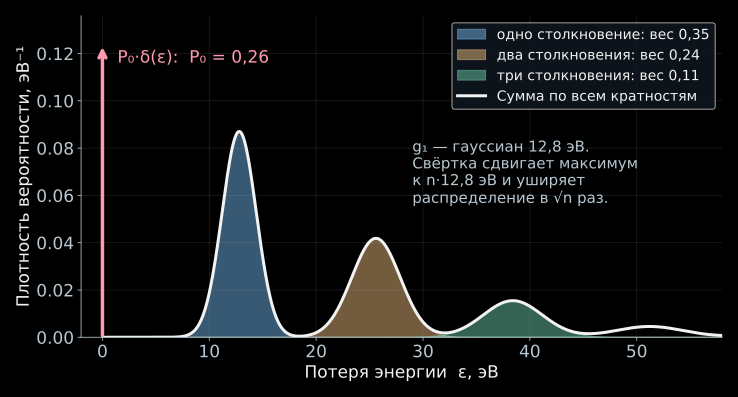{width="100%" fig-alt="Игрушечная модель: гауссова функция потерь и её свёртки с пуассоновскими весами дают полное распределение потерь"}

:::

::: {.column width="35%"}

- Игрушечная модель: $g_1$ — гауссиан с центром $12.8$ эВ и шириной $1.6$ эВ.
- Вклад ровно $n$ столкновений равен $P_ng_n$: максимум уезжает к
  $n\cdot12.8$ эВ, ширина растёт как $\sqrt n$, вес падает по Пуассону.
- Полное распределение потерь пучка:

$$
\boxed{
G(\varepsilon)=P_0\,\delta(\varepsilon)
+\sum_{n\ge1}P_n\,g_n(\varepsilon)
}.
$$

- Красная стрелка — вклад $P_0\delta(\varepsilon)$: электроны без потерь.

:::

::::

::: {.nh-text tone="muted" size="sm"}
Учебная модель, а не измеренная $g_1$: у настоящей функции есть ещё
ионизационный хвост — он виден на рис. 11 в конце раздела.
:::

:::::

## Как измеряют потери энергии? {#electron-gun-measurement}

::::: {.panel-tabset .story-tabs}

### Заряжаем пушку!

::: {.nh-text tone="muted" size="sm"}
Напомним: $\tau_{\mathrm{col}}=(\rho d)\sigma_{\mathrm{inel}}\simeq1.36$ —
оптическая толщина всего столба, $P_n=e^{-\tau}\tau^n/n!$ — вероятность ровно
$n$ столкновений, $g_n$ — распределение потери энергии после них.
:::

:::: {.columns}

::: {.column width="51%"}

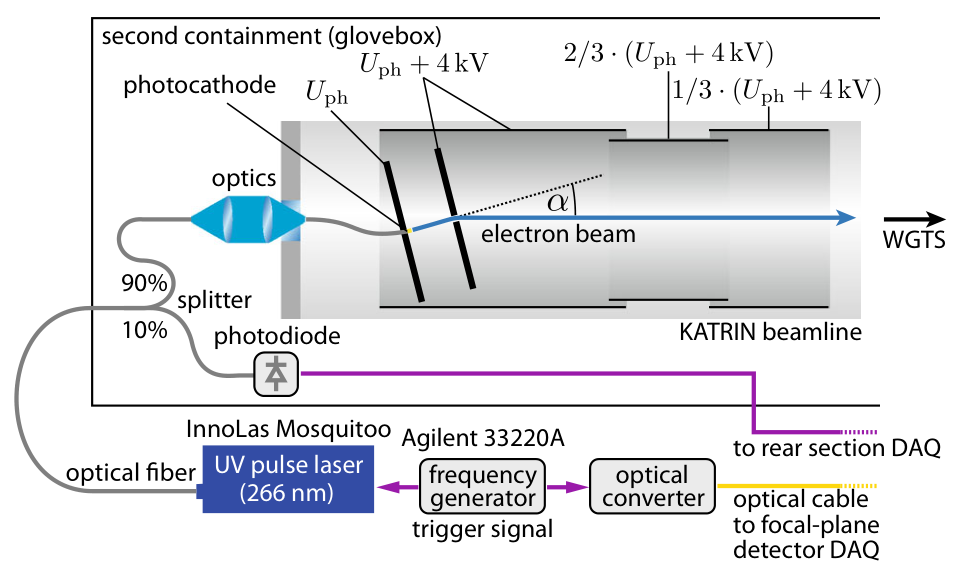{.slide-image-center .nostretch width="100%" fig-alt="Фотоэлектронная пушка: ультрафиолет освещает фотокатод, электроды ускоряют электроны в направлении газового источника"}

::: {.nh-text tone="muted" size="sm"}
[KATRIN, рис. 2](https://doi.org/10.1140/epjc/s10052-021-09325-z).
Свет выбирают близко к порогу фотоэффекта, чтобы уменьшить начальный
разброс энергий.
:::

:::

::: {.column width="46%"}

Ультрафиолет освобождает электроны из фотокатода, электрическое поле задаёт
энергию $E_{\mathrm{gun}}\simeq18.6$ кэВ. Пучок проходит весь газовый столб
почти вдоль оси.

Смысл имеет не энергия и не барьер по отдельности, а их разность:

$$
\boxed{E_s=E_{\mathrm{gun}}-e|U|}.
$$

$E_s$ — **избыточная энергия** (surplus energy, отсюда индекс $s$).
При резком фильтре электрон проходит, если

$$
E_{\mathrm{gun}}-\varepsilon>e|U|
\quad\Longleftrightarrow\quad
\boxed{\varepsilon<E_s}.
$$

**Иначе говоря, $E_s$ — наибольшая потеря, которую фильтр пропускает.**
Сканируя $E_s$, мы сканируем порог по потерям.

:::

::::

### Сканирование по плотности

:::: {.columns}

::: {.column width="55%"}

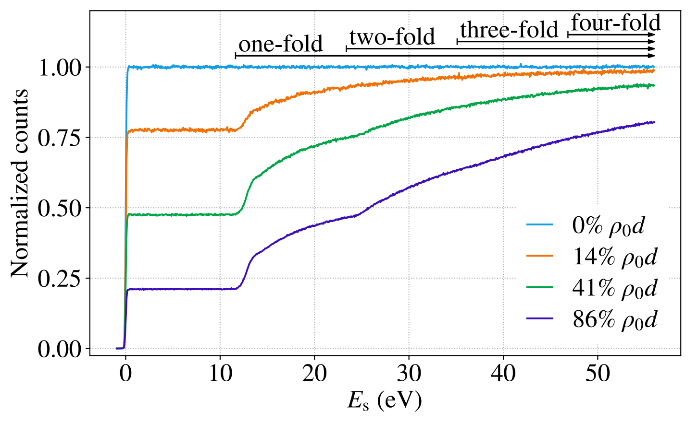{.slide-image-center .nostretch width="100%" fig-alt="Измеренный нормированный счёт в зависимости от избыточной энергии при нулевой и трёх ненулевых плотностях газа"}

::: {.nh-text tone="muted" size="sm"}
[KATRIN, рис. 3](https://doi.org/10.1140/epjc/s10052-021-09325-z) — измеренные
кривые. Фон и изменения интенсивности пушки учитываются в анализе.
:::

:::

::: {.column width="42%"}

- По горизонтали — $E_s$, наибольшая пропускаемая потеря. По вертикали —
  нормированный счёт $r_{\mathrm{gun}}$: отношение к счёту без газа при
  большом $E_s$.
- **Газа нет** (голубая): ступенька при $E_s=0$. Её ширина — собственное
  разрешение пушки и фильтра, это функция $\mathcal T_{\mathrm{gun}}(E_s)$.
- **Плато:** прошли только электроны без потерь. Пока $E_s$ не дорастёт
  до наименьшей возможной потери ($\simeq11$ эВ), добавляться нечему:

$$
r_{\mathrm{gun}}^{\text{плато}}\simeq P_0=e^{-\tau}.
$$

- **Подъём:** при $E_s\simeq12$ эВ проходят однократно рассеянные, при
  $\simeq25$ — двукратные, при $\simeq37$ — трёхкратные.

:::

::::

### Что это значит

:::: {.columns}

::: {.column width="55%"}

{.slide-image-center .nostretch width="100%" fig-alt="Измеренный нормированный счёт в зависимости от избыточной энергии при нулевой и трёх ненулевых плотностях газа"}

::: {.nh-text tone="muted" size="sm"}
[KATRIN, рис. 3](https://doi.org/10.1140/epjc/s10052-021-09325-z) — измеренные
кривые. Фон и изменения интенсивности пушки учитываются в анализе.
:::

:::

::: {.column width="42%"}

- Плато отвечает, **сколько** электронов ничего не потеряли: высоты
$0.78$, $0.48$, $0.21$ при $14$, $41$, $86\,\%$ от $\rho_0d$ дают
$\tau=-\ln P_0\simeq0.25$, $0.73$, $1.56$.

- **Подъём** отвечает, **как** теряют
энергию остальные: его форма повторяет интеграл от $g_1$.

- Чем плотнее газ, тем ниже плато и тем заметнее многократные столкновения.

- Форма $g_1$ при этом не меняется — на этом и держится разделение параметров.
$\mathcal T_{\mathrm{gun}}$ относится к почти осевому пучку пушки.

- **пропускание** для изотропных β-электронов мы построим перед сборкой функции отклика.

:::

::::

:::::

## Восстанавливаем функцию потерь {#electron-gun-fit}

::::: {.panel-tabset .story-tabs}

### Модель отклика

::: {.nh-text tone="muted" size="sm"}
Напомним обозначения предыдущих двух слайдов: $P_n$ — вероятность $n$
столкновений, $g_n$ — распределение суммарной потери энергии после них,
$\mathcal T_{\mathrm{gun}}(E_s)$ — измеренное пропускание пушки без газа.
:::

Потеря $\varepsilon$ сдвигает аргумент пропускания:
$\mathcal T_{\mathrm{gun}}(E_s-\varepsilon)$.
Усредняем по потерям после $n$ столкновений:

$$
(\mathcal T_{\mathrm{gun}}*g_n)(E_s)
=
\int_0^\infty
 g_n(\varepsilon)\,
 \mathcal T_{\mathrm{gun}}(E_s-\varepsilon)\,d\varepsilon.
$$

Суммируем вклады с вероятностями $P_n$:

$$
\boxed{
\begin{aligned}
r_{\mathrm{gun}}(E_s)
&=P_0\,\mathcal T_{\mathrm{gun}}(E_s)
 +P_1(\mathcal T_{\mathrm{gun}}*g_1)(E_s)\\
&\quad+P_2(\mathcal T_{\mathrm{gun}}*g_2)(E_s)+\ldots
\end{aligned}
}
$$

::: {.nh-text tone="muted" size="sm"}
$r_{\mathrm{gun}}$ — нормированный сигнал пушки; фон учитывается отдельно.
[KATRIN, уравнения (6)–(9)](https://doi.org/10.1140/epjc/s10052-021-09325-z).
:::

### Подбор параметров

:::: {.columns}

::: {.column width="57%"}

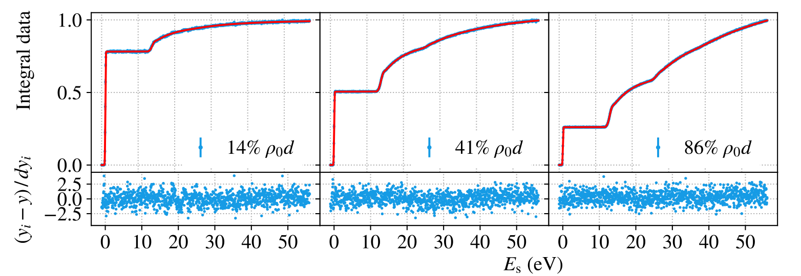{.slide-image-center .nostretch width="100%" fig-alt="Три интегральных набора данных при разных плотностях газа описаны общей моделью; под каждым графиком приведены нормированные остатки"}

::: {.nh-text tone="muted" size="sm"}
[KATRIN, рис. 10, верхний ряд](https://doi.org/10.1140/epjc/s10052-021-09325-z) —
те же измерения, что и на рис. 3, но уже с моделью. Рис. 3 показывает сами
кривые: все плотности на одной панели, нормировка на счёт без газа. Рис. 10
показывает результат совместного фита: данные, модель и остатки, причём каждая
панель нормирована на свой последний бин — поэтому высота плато здесь уже не
равна $P_0$. В совместный фит входят также дифференциальные данные по времени
пролёта.
:::

:::

::: {.column width="40%"}

- **Общее для всех наборов:** форма $g_1$. До порога ионизации её берут суммой
  трёх гауссиан, выше — расчётным ионизационным хвостом.
- **Своё у каждого набора:** оптическая толщина $\tau$, нормировка и фон.
- Параметры подбирают сразу по всем плотностям: одна и та же $g_1$ должна
  описать и высоту плато, и форму всех ступеней.
- Нижние панели — нормированные остатки $(y_i-y)/dy_i$. Разброс около нуля без
  видимой структуры и означает, что подбор удался.

:::

::::

::: {.nh-box tone="accent" size="sm"}
Почему разные плотности разделяют параметры: $\tau$ двигает высоту плато и
веса ступеней, а $g_1$ задаёт их форму. Меняя $\rho d$, мы перемешиваем эти
вклады по-разному — и «сколько столкновений» отделяется от «как теряет
энергию одно столкновение».
:::

### Результат

:::: {.columns}

::: {.column width="58%"}

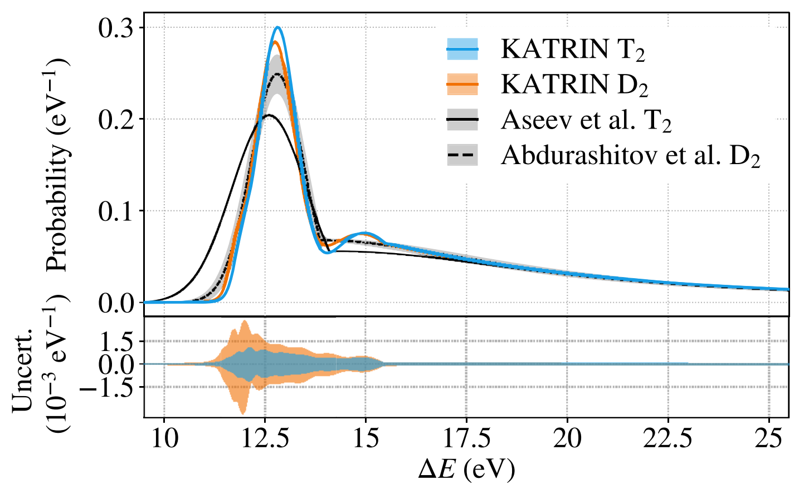{.slide-image-center .nostretch width="100%" fig-alt="Восстановленное распределение потерь в одном столкновении: кривая KATRIN T2 и сравнение с дейтерием и предыдущими измерениями"}

:::

::: {.column width="39%"}

- Голубая кривая — найденная $g_1$ для трития.

- Пик около $12.8$ эВ — электронные возбуждения молекулы.
Хвост выше $15.5$ эВ — ионизация.

- Далее используем $g_n$ в расчёте отклика β-источника,
учитывая места рождения и углы электронов.

:::

::::

::: {.nh-text tone="muted" size="sm"}
[KATRIN, рис. 11](https://doi.org/10.1140/epjc/s10052-021-09325-z).
На горизонтальной оси $\Delta E=\varepsilon$; на вертикальной —
плотность вероятности, эВ$^{-1}$.
:::

:::::

## Как измерить 18 600 вольт с точностью до сотых?

::::: {.panel-tabset .story-tabs}

### Что делает каждый прибор

- На сосуд главного спектрометра подают отрицательное напряжение
  $U\simeq-18.6$ кВ. Коммерческий источник задаёт основной уровень, но его
  стабильность порядка $10^{-4}$ означает колебания примерно на $1$ В.
- Параллельный пострегулятор на вакуумном триоде подбирает небольшой
  корректирующий ток и подавляет быстрые колебания напряжения.
- Переменную составляющую измеряет **датчик пульсаций**: он видит помехи
  в диапазоне примерно до $1$ МГц.
- Постоянную составляющую измеряют медленно, но точно:

$$
U_{\rm vessel}
\xrightarrow{\ \text{делитель }M\simeq1972\ }
u\simeq-9.4~\text{В}
\xrightarrow{\ \text{вольтметр}\ }
U_{\rm vessel}=Mu.
$$

- Требование $3\cdot 10^{-6}$ при $18.6$ кВ означает
  $|\delta U|\lesssim56$ мВ. Для электрона это сдвиг порога
  $|\delta E|=e|\delta U|\lesssim56$ мэВ.

### Делитель напряжения

:::: {.columns}

::: {.column width="53%"}

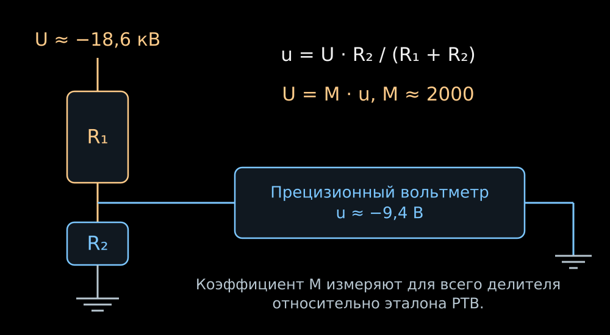{width="100%" fig-alt="Высокое напряжение делится цепочкой сопротивлений до нескольких вольт и измеряется прецизионным вольтметром"}

- В расчёте используют коэффициент всего прибора, измеренный относительно
  эталонного делителя PTB:

$$
M(-18.6~\text{кВ})=1972.4801\pm0.0040
\qquad (\text{расширенная неопределённость},~k=2).
$$

:::

::: {.column width="44%"}

- В делителе K35 высоковольтное плечо — цепочка из ста резисторов по
  $1.84$ МОм. На каждый приходится около $186$ В и $19$ мВт.
- Низковольтное плечо имеет сопротивление около $93$ кОм. Коэффициент
  деления всей цепи равен

$$
M\equiv\frac{U}{u}
=\frac{R_{\rm HV}+R_{\rm LV}}{R_{\rm LV}},
\qquad \boxed{U=Mu}.
$$

- При $|U|=18.6$ кВ вольтметр показывает $|u|\simeq9.43$ **В**.
  Такой сигнал удобно измерять на наиболее точном диапазоне вольтметра.

:::

::::

### Как удерживают точность

:::: {.columns}

::: {.column width="49%"}

**Резисторы и нагрев**

- Сто резисторов выбрали из двухсот после измерения температурного
  коэффициента и прогрева под напряжением.
- Резисторы с противоположными температурными дрейфами ставят рядом.
  Для собранного плеча изменения частично компенсируются.
- После включения делителю дают прогреться не менее пяти минут. Остаточный
  сдвиг при прогреве — около $10^{-6}$.

:::

::: {.column width="49%"}

**Среда, утечки и время**

- Резисторы находятся в сухом азоте при $25.0\pm0.15\,{}^\circ$C.
  Электроды выравнивают поле; изоляторы из тефлона уменьшают токи утечки.
- Температурный коэффициент собранного K35 около
  $-0.081 \cdot 10^{-6}$/К, намного меньше коэффициента отдельного резистора.
- Измеренный долговременный дрейф K35 — около $6\cdot 10^{-7}$ в месяц;
  поэтому коэффициент $M$ периодически перекалибровывают.

:::

::::

- На выходе делителя требование $3\cdot 10^{-6}$ соответствует примерно
  $28$ мкВ из $9.43$ В. Вольтметр сверяют с $10$-вольтовым эталоном,
  привязанным к эффекту Джозефсона.
- Через четыре года калибровка по двум линиям $^{83\mathrm m}$Kr дала
  $M=1972.449(10)$: отличие от измерения PTB составило $(-2\pm5) \cdot 10^{-6}$.
  Это независимая проверка всей электрической шкалы электронами известной
  энергии.

::: {.nh-text tone="muted" size="sm"}
[Система высокого напряжения KATRIN](https://doi.org/10.1088/1748-0221/13/04/P04020) ·
[делитель K35](https://arxiv.org/abs/0908.1523) ·
[калибровка по $^{83\mathrm m}$Kr](https://arxiv.org/abs/1802.05227).
:::

:::::

## Криптон даёт линии известной энергии {#krypton-calibration}

::::: {.panel-tabset .story-tabs}

### Внутренняя конверсия

:::: {.columns}

::: {.column width="51%"}

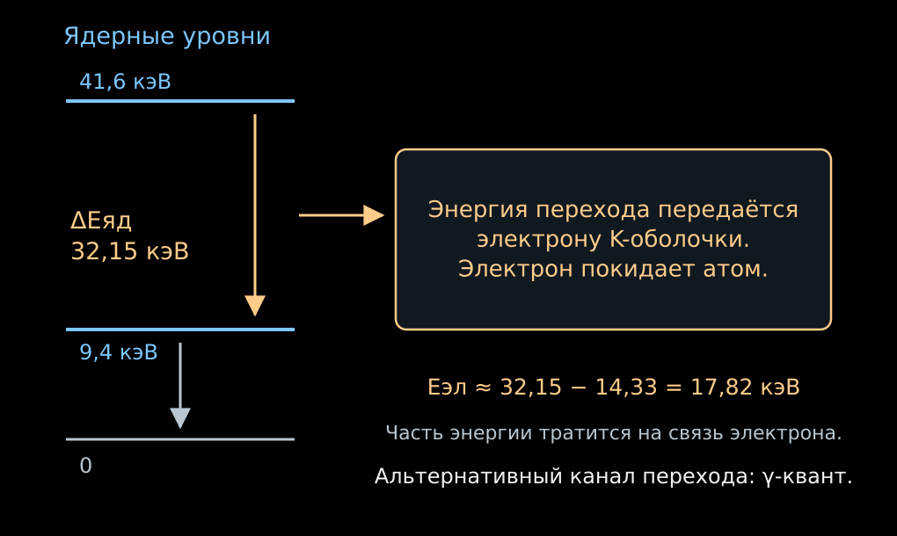{width="100%" fig-alt="В переходе ядра криптона энергия 32,15 кэВ передаётся связанному электрону; вычитание энергии связи даёт линию около 17,82 кэВ"}

:::

::: {.column width="46%"}

- Возбуждённое ядро может передать энергию непосредственно одному из
  электронов атомной оболочки. Это **внутренняя конверсия**.
- Электрон покидает атом; часть энергии перехода расходуется на его связь.
- Для оболочки $a$:

$$
\boxed{
E_{\mathrm{конв},a}
=\Delta E_{\mathrm{яд}}
-E_{\mathrm{связи},a}
-E_{\mathrm{отдачи}}
}.
$$

- Здесь нет нейтрино, которое уносит переменную долю энергии.
  Фиксированный переход и оболочка дают спектральную линию.

:::

::::

### Почему ⁸³ᵐKr

- Индекс $\mathrm m$ означает метастабильное, долгоживущее возбуждённое
  состояние ядра.
- В $^{83\mathrm m}\mathrm{Kr}$ переход с энергией около $32.15$ кэВ даёт
  конверсионную линию $K$-оболочки около $17.82$ кэВ — близко к концу
  тритиевого спектра.
- $K$ — ближайшая к ядру электронная оболочка; обозначение линии $K$-32
  указывает оболочку и энергию ядерного перехода.
- У линии есть естественная ширина, около $2.7$ эВ для $K$-32.
  При большом числе электронов положение её центра можно определить
  гораздо точнее ширины.
- Для других задач используют более узкие линии иных оболочек.

::: {.nh-text tone="muted" size="sm"}
[Конверсионные источники $^{83}\mathrm{Rb}/{}^{83\mathrm m}\mathrm{Kr}$](https://arxiv.org/abs/1212.5016).
:::

### Что показывает измеренная линия

- Сканируем задерживающее напряжение через линию.
  Интегральная скорость счёта меняется от полного пропускания к нулю.
- **Положение края** проверяет энергетическую шкалу.
- **Форма края** зависит от естественной ширины линии, разброса начальных
  потенциалов и пропускания спектрометра.
- Зная собственную форму линии, можно определить дополнительные сдвиги
  и уширения прибора.
- Линии разных оболочек позволяют проверить шкалу в нескольких точках.
  При использовании разности их энергий энергия общего ядерного перехода
  сокращается.

::: {.nh-text tone="muted" size="sm"}
[Калибровка по разности конверсионных линий](https://arxiv.org/abs/1802.05227).
:::

:::::

## Мониторный спектрометр: проверка шкалы

:::: {.columns}

::: {.column width="55%"}

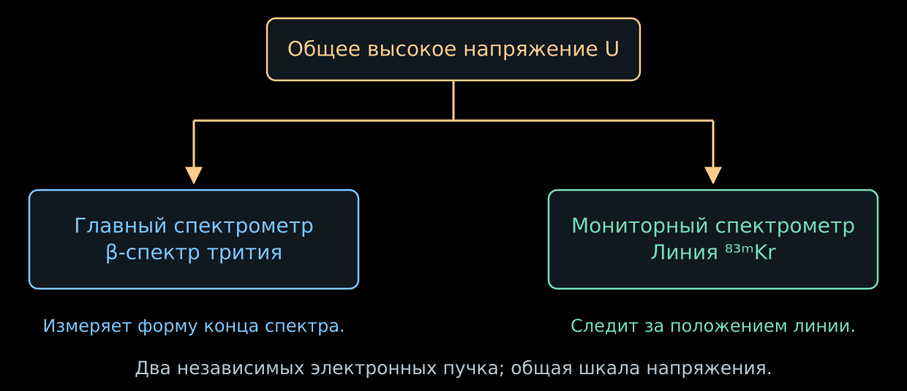{width="100%" fig-alt="Главный и мониторный спектрометры подключены к одному высокому напряжению, но измеряют разные электронные источники"}

:::

::: {.column width="42%"}

- Небольшой отдельный MAC-E-спектрометр измеряет конверсионную линию
  стабильного источника $^{83}\mathrm{Rb}/{}^{83\mathrm m}\mathrm{Kr}$.
- Он подключён к тому же высокому напряжению, что и главный спектрометр.
  Линия $K$-32 лежит примерно на $0.8$ кэВ ниже конца тритиевого спектра;
  отдельное напряжение на источнике сдвигает её в нужную рабочую область.
- Если линия сместилась, а источник стабилен, изменилась энергетическая шкала.
  Это можно сопоставить с показаниями делителя напряжения.
- Монитор проверяет стабильность шкалы во времени. Газовый источник и
  локальные неоднородности главного спектрометра требуют своих калибровок.

:::

::::

::: {.nh-text tone="muted" size="sm"}
[Мониторный спектрометр и стабильность конверсионного источника](https://arxiv.org/abs/1212.5016).
:::

## У электрона есть ещё и начальный потенциал

::::: {.panel-tabset .story-tabs}

### Плазма в источнике

- β-электроны ионизуют газ. В источнике появляются медленные электроны и
  положительные ионы — слабоионизованная плазма.
- Распределение заряда создаёт электрический потенциал
  $\Phi_{\mathrm{src}}(z)$.
- Пусть электрон родился с кинетической энергией $E$ в точке $z$.
  Его заряд равен $-e$, поэтому потенциальная энергия равна $-e\Phi$.
  При переходе в область с $\Phi=0$ закон сохранения энергии даёт

$$
E-e\Phi_{\mathrm{src}}(z)=E_{\mathrm{при}\ \Phi=0}.
$$

- Два электрона с одинаковой начальной $E$, но из разных точек источника,
  могут прийти к фильтру с разными энергиями.

::: {.nh-box tone="warning" size="sm"}
Стабильное напряжение спектрометра ещё не гарантирует одинаковый
энергетический порог для всех мест рождения электрона.
:::

### Измерение внутри газа

- В тритий добавляют небольшую примесь газообразного $^{83\mathrm m}\mathrm{Kr}$.
- Конверсионные электроны рождаются внутри той же плазмы.
  Их начальная линия известна, а измеренная содержит влияние потенциала газа.
- Средний потенциал сдвигает линию. Пространственный разброс потенциалов
  уширяет её.
- По линиям криптона оценивают эти эффекты; при переносе калибровки на
  β-спектр учитывают распределение газа и потери электронов.
- Температуру $80$ К выбирают, в частности, чтобы криптон оставался в газе,
  а не осаждался на стенках.

::: {.nh-text tone="muted" size="sm"}
[Совместная циркуляция трития и криптона и диагностика потенциала источника](https://arxiv.org/abs/2103.04755);
[применение в первых пяти кампаниях](https://arxiv.org/abs/2406.13516).
:::

:::::

## Что регистрирует кремниевый детектор?

::::: {.panel-tabset .story-tabs}

### От электрона к импульсу

- Прошедший фильтр электрон снова ускоряется электрическим полем.
  Дополнительное напряжение у детектора повышает его энергию ещё на
  несколько кэВ.
- В кремнии электрон расходует энергию на возбуждение вещества и создание
  электронно-дырочных пар.
- Поле диода собирает заряд. Электроника регистрирует импульс и его амплитуду.
- Амплитуда позволяет отбирать события в энергетическом окне и подавлять
  часть фона.

::: {.nh-box tone="accent" size="md"}
Энергетический порог с точностью порядка эВ задаёт спектрометр.
Детектор с разрешением порядка кэВ считает прошедшие электроны.
:::

### Зачем 148 сегментов

- Детектор разделён на $148$ чувствительных площадок.
- Магнитная система отображает разные участки источника и анализирующей
  области на разные площадки детектора.
- Электрический потенциал и магнитное поле немного различаются по сечению.
  Значит, отличаются и пороги пропускания.
- Положение попадания позволяет применять соответствующую функцию отклика
  и исключать затенённые или нестабильные участки.
- Спектры отдельных участков описывают совместно: масса нейтрино для них одна.

::: {.nh-text tone="muted" size="sm"}
[Устройство сегментированного детектора](https://arxiv.org/abs/1404.2925).
:::

### Электрон, родившийся после барьера

- Медленный электрон может появиться внутри спектрометра,
  например при ионизации остаточного газа.
- Если он родился при $\Phi\simeq-|U|$ с энергией $\varepsilon\ll1$ кэВ,
  то у заземлённого выхода

$$
\boxed{E_{\mathrm{выход}}\simeq\varepsilon+e|U|}.
$$

- Вблизи конца спектра это почти те же $18.6$ кэВ, что у полезного электрона.
- Детектор не может различить их только по амплитуде.
  Нужно уменьшать само рождение таких электронов.

:::::

## Фон меняет устройство эксперимента

::::: {.panel-tabset .story-tabs}

### Запертые электроны

- В лекции 06 магнитное зеркало удерживало частицы в ловушке.
  В спектрометре оно может удержать электрон радиоактивного происхождения.
- Электрон многократно проходит через остаточный газ и рождает вторичные
  электроны при ионизации. Один первичный распад способен дать серию отсчётов.
- Поэтому счёт фона может иметь большую дисперсию, чем независимый
  пуассоновский поток.
- Радон из материалов задерживают холодными ловушками в насосных каналах.
  Электроны со стенок подавляют магнитной конфигурацией и более отрицательным
  потенциалом проволочных электродов.

### Предспектрометр

- Предспектрометр первоначально должен был заранее отражать электроны
  с энергиями далеко ниже конца β-спектра.
- Но между двумя электростатическими барьерами возникала область удержания:
  вдоль оси мешали выйти электрические поля, поперёк — магнитное поле.
  Это ловушка Пеннинга.
- Накопление заряженных частиц приводило к фону, растущему со временем.
- Для поздних кампаний задерживающее напряжение предспектрометра
  уменьшили до порядка $100$ В. Главный спектрометр продолжил задавать
  точный энергетический порог.

::: {.nh-box tone="warning" size="sm"}
Дополнительный фильтр полезен, пока он сам не становится источником отсчётов.
:::

### Объём фона

:::: {.columns}

::: {.column width="55%"}

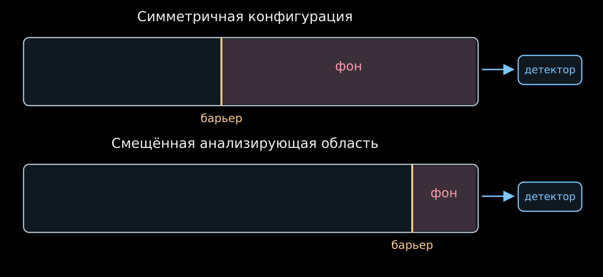{width="100%" fig-alt="Сдвиг анализирующего барьера к детектору уменьшает объём, из которого медленные фоновые электроны могут попасть на детектор"}

:::

::: {.column width="42%"}

- Часть фона рождается из нейтральных возбуждённых атомов,
  попадающих со стенок в объём.
- Слабосвязанный электрон может освободиться даже под действием теплового
  излучения стенок.
- Если сдвинуть барьер к выходу и сжать магнитную трубку, уменьшится
  доступный фону объём после барьера.
- Такая конфигурация снизила фон примерно вдвое.
  Неоднородные поля в ней калибруют по криптону.

:::

::::

::: {.nh-text tone="muted" size="sm"}
Схематически показан доступный объём; геометрия силовых линий опущена.
[Смещённая анализирующая область KATRIN](https://arxiv.org/abs/2408.07022).
:::

### Разрешение и фон

- Учебный пример лекции 06 использовал симметричную конфигурацию:

$$
B_{\mathrm{src}}=3.6~\mathrm{Тл},\quad
B_{\mathrm A}=0.30~\mathrm{мТл},\quad
B_{\max}=6.0~\mathrm{Тл}
\quad\Rightarrow\quad \Delta E\simeq0.95~\mathrm{эВ}.
$$

- Для характерных полей смещённой конфигурации

$$
B_{\mathrm{src}}\simeq2.5~\mathrm{Тл},\quad
B_{\mathrm A}\simeq0.6~\mathrm{мТл},\quad
B_{\max}\simeq4.2~\mathrm{Тл}
\quad\Rightarrow\quad \Delta E\simeq2.7~\mathrm{эВ}.
$$

- При большем $B_{\mathrm A}$ магнитная трубка уже, а край пропускания шире.
- Потерю разрешения сопоставляют с выигрышем от меньшего фона.
  Параметры выбирают по итоговой неопределённости $m_\beta^2$.
- В реальной смещённой области $B_{\mathrm A}$ и потенциал зависят от
  положения; одно число здесь даёт лишь характерный масштаб.

::: {.nh-text tone="muted" size="sm"}
[Уменьшение фона и выбор конфигурации](https://doi.org/10.1140/epjc/s10052-022-10220-4).
:::

:::::

## Одна настройка напряжения — одна скорость счёта {#katrin-integral-spectrum}

::::: {.panel-tabset .story-tabs}

### Наблюдаемая величина

- $S_\beta(E;m_\beta^2,E_0)$ — спектр рождения с учётом конечных
  молекулярных состояний.
- $f(E,U)$ — вероятность того, что электрон, рождённый с энергией $E$,
  после потерь в источнике и усреднения по углам пройдёт фильтр при напряжении $U$.
- Для одного участка детектора и стабильных условий:

$$
\boxed{
R(U)=A\int_0^{E_0}
S_\beta(E;m_\beta^2,E_0)\,f(E,U)\,dE+b
}.
$$

- $A$ включает количество трития, геометрический приём и эффективность;
  $b$ — скорость счёта фона.
- Изменяя $U$, измеряют несколько интегралов от одного спектра.

### Интерактив



- Закрашенная часть спектра даёт прошедшие электроны.
  Изменение порога меняет её площадь — и скорость счёта.

::: {.nh-text tone="muted" size="sm"}
Учебная модель: без молекулярных состояний и рассеяния, край пропускания
аппроксимирован линейным переходом шириной $0.95$ эВ.
[Открыть апплет](../applets/katrin-integral-spectrum.qmd) ·
[Исходный код](https://github.com/NeutrinoHit/neutrinophysics/blob/main/introduction/ru/slides/assets/04_direct_neutrino_mass/_katrin_integral_spectrum.qmd).
:::

:::::

## Где в интегральном спектре находится масса? {#katrin-mass-shape}

::::: {.panel-tabset .story-tabs}

### Интеграл можно взять

- Чтобы увидеть зависимость от массы, временно оставим одно конечное состояние,
  идеальный резкий фильтр и постоянный медленный множитель $C$.
- Введём $x=E_0-E$ и $w=E_0-e|U|$. Величина $w$ — ширина энергетического
  окна между порогом и концом спектра. При $w>m_\beta$:

$$
R(w)-b
=AC\int_{m_\beta}^{w}x\sqrt{x^2-m_\beta^2}\,dx
=\boxed{\frac{AC}{3}(w^2-m_\beta^2)^{3/2}}.
$$

- При $w\gg m_\beta$ разложение даёт

$$
\boxed{
R(w)\simeq AC\left(\frac{w^3}{3}-\frac{m_\beta^2w}{2}\right)+b
}.
$$

- Безмассовый сигнал растёт как $w^3$; масса добавляет дефицит,
  пропорциональный $m_\beta^2w$.

### Четыре разные формы

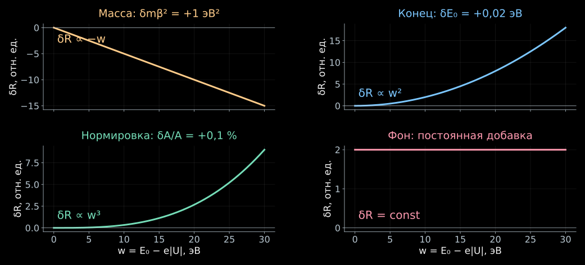{height="610" fig-alt="Малые изменения массы, конца спектра, нормировки и фона дают разные зависимости скорости счёта от расстояния до конца"}

::: {.nh-text tone="muted" size="sm"}
Линеаризованная модель предыдущей вкладки. Показаны изменения скорости
счёта при фиксированных остальных параметрах; масштабы осей по вертикали различны.
:::

### Почему одной точки мало

- В одной точке дефицит отсчётов можно объяснить и массой, и меньшей активностью,
  и сдвигом энергетического порога.
- В нескольких точках эти объяснения дают разные зависимости:

$$
\frac{\partial R}{\partial m_\beta^2}\simeq-\frac{AC}{2}w,\quad
\frac{\partial R}{\partial E_0}\simeq ACw^2,\quad
\frac{\partial R}{\partial A}\simeq\frac{C}{3}w^3,\quad
\frac{\partial R}{\partial b}=1.
$$

- При дифференцировании по $E_0$ напряжение $U$ фиксировано:
  изменяется $w=E_0-e|U|$.
- Форма сканирования позволяет разделить четыре параметра, хотя их
  оценки остаются коррелированными.

:::::

## Как распределить время измерения?

::::: {.panel-tabset .story-tabs}

### Близко к концу

- В простой модели относительное изменение сигнала от массы равно

$$
\frac{R(m_\beta^2)-R(0)}{R(0)-b}
\simeq-\frac{3m_\beta^2}{2w^2}.
$$

- Чем ближе порог к концу, тем больше относительный эффект.
- Но сам сигнал убывает как $w^3$.
  При $w\to0$ детектор видит преимущественно фон.
- Поэтому измерять только у самого конца невыгодно.
  Часть времени нужна для точек ниже конца, часть — выше, где измеряется фон.

### Счёт и его неопределённость

- При пороге $U_k$ измеряем время $t_k$ и число событий $n_k$.
  В модели независимых отсчётов

$$
\lambda_k=t_kR(U_k),
\qquad
n_k\sim\operatorname{Poisson}(\lambda_k).
$$

- Поэтому

$$
\sigma_R\simeq\sqrt{\frac{R}{t}},
\qquad
\frac{\sigma_R}{R}\simeq\frac{1}{\sqrt{Rt}}.
$$

- Чтобы уменьшить статистическую ошибку вдвое, требуется вчетверо больше
  времени.
- Если фон содержит серии событий от одной запертой частицы, независимость
  нарушается; эту добавку к дисперсии учитывают отдельно.

### Сканирование KATRIN

- Один цикл содержит несколько десятков напряжений и занимает около трёх часов.
- Точки выше конца дают фон; точки ниже конца помогают разделить
  массу, $E_0$ и нормировку.
- В анализе первых пяти кампаний массу определяли по области последних
  $40$ эВ ниже конца и фоновым точкам выше него.
- Время в каждой точке выбирают по чувствительности к параметрам.
  Порядок напряжений меняют, чтобы проверить влияние медленных дрейфов.
- Участки детектора и кампании имеют собственные параметры отклика
  и нормировки, но общую массу нейтрино.

:::::

## Как калибровки входят в определение массы?

::::: {.panel-tabset .story-tabs}

### Сравнение модели и данных

- Для независимых пуассоновских отсчётов удобна функция

$$
D=2\sum_k\left[
\lambda_k-n_k+n_k\ln\frac{n_k}{\lambda_k}
\right].
$$

- Это $-2\ln L$ с вычтенной константой, не зависящей от модели.
  При $n_k=0$ логарифмический член принимают равным нулю.
- Подбирают $m_\beta^2$, $E_0$, $A$, $b$ и параметры отклика так, чтобы
  модель описывала все точки.
- Чем больше событий, тем меньшие отклонения формы становятся различимы.

### Отдельное измерение — дополнительное условие

- Пусть пушка дала оптическую толщину
  $\tau_{\mathrm{кал}}\pm\sigma_\tau$.
- В спектральном анализе $\tau$ не обязана быть зафиксирована точно,
  но отклонение от калибровки ухудшает согласие:

$$
\boxed{
-2\ln L_{\mathrm{совм}}
=D_\beta+
\frac{(\tau-\tau_{\mathrm{кал}})^2}{\sigma_\tau^2}
+\ldots
}.
$$

- Квадратичный член — логарифм гауссовой модели калибровочного измерения.
- Так неопределённость плотности газа превращается в неопределённость
  массы. Аналогично учитывают поля, потенциалы и потери энергии.
- Для коррелированных калибровок используют их ковариационную матрицу.

::: {.nh-text tone="muted" size="sm"}
Это простая форма совместного анализа. [Методы анализа KATRIN](https://doi.org/10.1103/PhysRevD.104.012005).
:::

:::::

## Почему минимум может оказаться при $m_\beta^2<0$?

::::: {.panel-tabset .story-tabs}

### Флуктуация около нуля

- В разложении спектра параметр $m_\beta^2$ уменьшает число электронов у конца.
- Если истинная масса мала, случайный дефицит отсчётов тянет оценку
  $m_\beta^2$ вверх, случайный избыток — вниз.
- Спектральную модель продолжают в область отрицательных значений параметра,
  чтобы минимум мог находиться с обеих сторон нуля.
- Физическая масса остаётся неотрицательной.
  Эту границу учитывают при построении доверительного интервала.

::: {.nh-box tone="accent" size="md"}
Отрицательной может оказаться свободная оценка параметра $m_\beta^2$
по данным с флуктуациями. Физический квадрат массы остаётся неотрицательным.
:::

### Неучтённое уширение

- Пусть измеренный $x=E_0-E$ содержит случайный сдвиг
  $\delta$ со средним $0$ и дисперсией $\sigma_E^2$.
- В области, где можно пренебречь обрезанием спектра на границе,

$$
\left\langle(x+\delta)^2\right\rangle=x^2+\sigma_E^2.
$$

- Массовая поправка имеет вид

$$
x\sqrt{x^2-m_\beta^2}\simeq x^2-\frac{m_\beta^2}{2}.
$$

- Приписав неучтённый избыток массовой поправке, получим

$$
\boxed{\Delta m_\beta^2\simeq-2\sigma_E^2}.
$$

- Например, лишнее уширение $0.2$ эВ даёт сдвиг порядка $-0.08$ эВ$^2$.

### Что проверять

- Сдвинулась средняя энергия — проверяем шкалу и $E_0$.
- Увеличилась ширина — проверяем колебания напряжения,
  потенциал источника и распределение конечных состояний.
- Изменился хвост потерь — проверяем газ и калибровку электронной пушкой.
- Изменились отсчёты выше конца — проверяем фон.
- Сам по себе отрицательный минимум не выбирает причину.
  Её ищут в независимых измерениях и в согласии разных наборов данных.

:::::

## Результат KATRIN {#katrin-result}

::::: {.panel-tabset .story-tabs}

### Результат

- Первые пять кампаний: $259$ суток данных, около $36$ миллионов отсчётов
  в анализируемой области.
- Совместный анализ дал

$$
\boxed{m_\beta^2=-0.14^{+0.13}_{-0.15}~\mathrm{эВ}^2}.
$$

- Отклонение от нуля незначимо. С учётом физической границы:

$$
\boxed{m_\beta<0.45~\mathrm{эВ}\qquad(90\%\ \text{доверительный уровень})}.
$$

- Это ограничение на $m_\beta^2=\sum_i|V_{ei}|^2m_i^2$,
  введённое в лекции 04, а не отдельное измерение каждой из трёх масс.

::: {.nh-text tone="muted" size="sm"}
[KATRIN Collaboration, Science 388, 180–185 (2025)](https://arxiv.org/abs/2406.13516).
:::

### Что ограничивает точность

| Вклад для первых пяти кампаний | $\sigma(m_\beta^2)$, эВ$^2$ |
|---|---:|
| Статистика | 0.108 |
| Оптическая толщина $(\rho d)\sigma_{\mathrm{inel}}$ | 0.052 |
| Распределение потерь энергии | 0.034 |
| Фон, зависящий от длительности шага | 0.027 |
| Изменения потенциала источника | 0.022 |
| Непуассоновские флуктуации фона | 0.015 |

- Каждый физический эффект из лекции оставляет измеримый вклад в ошибку массы.
- Это выбранные вклады из таблицы анализа; при наличии корреляций их нельзя
  просто складывать как независимые ошибки.

::: {.nh-text tone="muted" size="sm"}
[Таблица неопределённостей KATRIN](https://arxiv.org/abs/2406.13516).
:::

### Разрешение и точность массы

- Ширина фильтра характеризует прохождение одного электрона.
- Массу определяют по небольшому изменению формы распределения многих
  миллионов электронов.
- Поэтому предел на массу может быть меньше ширины края пропускания,
  если эта ширина и остальные свойства отклика известны достаточно точно.
- По обзору начала 2026 года, набрано около $1000$ суток данных;
  ожидаемая чувствительность полного набора — лучше $0.30$ эВ.
- Чувствительность — прогноз типичного ограничения при малой истинной массе.
  Она не заменяет результат анализа данных.

::: {.nh-text tone="muted" size="sm"}
[Обзор программы KATRIN, январь 2026](https://arxiv.org/abs/2601.00248).
:::

:::::

## Что можно измерить следующим?

::::: {.panel-tabset .story-tabs}

### Излом от тяжёлого состояния

- Пусть существует дополнительное массовое состояние с массой $m_4$
  и примесью $|V_{e4}|^2$.
- Оно создаёт ещё один вклад в спектр:

$$
S_\beta(E)
=(1-|V_{e4}|^2)S_{\mathrm{лёгк}}(E)
+|V_{e4}|^2S_4(E).
$$

- Канал с тяжёлым нейтрино заканчивается при $E\simeq E_0-m_4$.
  На гладком спектре появляется излом.
- Если $m_4$ порядка кэВ, нужно смотреть далеко от конца, где поток
  электронов гораздо больше.
- Для этой задачи разрабатывают многосегментный кремниевый детектор
  TRISTAN, рассчитанный на большую скорость счёта.

### Более точное измерение лёгкой массы

- В интегральном режиме соседние энергии исследуют последовательным
  сканированием напряжения.
- Для KATRIN++ изучают возможность измерять энергии прошедших электронов
  одновременно — микрокалориметрами или через время пролёта.
- Атомарный тритий убрал бы вращательно-колебательное уширение молекулы.
  Атомные возбуждения и отдачу всё равно нужно учитывать.
- Цель обсуждаемой программы — чувствительность порядка $50$ мэВ.
  Для неё ещё разрабатывают источник и методы регистрации.

::: {.nh-text tone="muted" size="sm"}
[Перспективы TRISTAN и KATRIN++, раздел 6](https://arxiv.org/abs/2601.00248).
Другие способы прямого измерения массы — тема лекции 08.
:::

:::::

## Что нужно знать, чтобы взвесить нейтрино?

- **Спектр рождения:** кинематика β-распада и конечные состояния молекулы.
- **Потери по дороге:** плотность газа, углы и рассеяние; их проверяет
  электронная пушка.
- **Энергетическая шкала:** делитель напряжения, конверсионные линии
  и мониторный спектрометр.
- **Условия рождения:** потенциал плазмы внутри источника; его зондирует
  примесь криптона.
- **Число лишних отсчётов:** фон и его зависимости от времени и полей.
- **Масса:** одна общая величина, которая должна описать спектры
  при разных напряжениях и в разных условиях измерения.

::: {.nh-box tone="success" size="md"}
KATRIN извлекает массу нейтрино из формы спектра, проверив, как эту форму
меняют источник, поля и регистрация электронов.
:::

## Литература и материалы

::::: {.panel-tabset .story-tabs}

### Установка и результат

- [Устройство, строительство и ввод в эксплуатацию KATRIN](https://arxiv.org/abs/2103.04755),
  *JINST* **16**, T08015 (2021).
- [Модель спектра и функции отклика](https://doi.org/10.1140/epjc/s10052-019-6686-7),
  *EPJ C* **79**, 204 (2019).
- [Методы анализа первого измерения массы](https://doi.org/10.1103/PhysRevD.104.012005),
  *Phys. Rev. D* **104**, 012005 (2021).
- [Первые пять кампаний: предел $0.45$ эВ](https://arxiv.org/abs/2406.13516),
  *Science* **388**, 180–185 (2025).
- [G. Drexlin, C. Weinheimer: обзор эксперимента и его развития](https://arxiv.org/abs/2601.00248), 2026.

### Калибровки

- [Фотоэлектронная пушка с управляемым углом](https://arxiv.org/abs/2603.15918), 2026.
- [Потери энергии электронов в тритии и дейтерии](https://doi.org/10.1140/epjc/s10052-021-09325-z), 2021.
- [Изотопный состав газа: рамановская спектроскопия](https://doi.org/10.3390/s20174827), 2020.
- [Калибровка делителей напряжения по конверсионным линиям](https://arxiv.org/abs/1802.05227), 2018.
- [Стабильные источники $^{83}\mathrm{Rb}/{}^{83\mathrm m}\mathrm{Kr}$](https://arxiv.org/abs/1212.5016), 2013.
- [Поля в смещённой анализирующей области](https://arxiv.org/abs/2408.07022), 2024.

### Детектор и фон

- [Сегментированный кремниевый детектор](https://arxiv.org/abs/1404.2925),
  *NIM A* **778**, 40–60 (2015).
- [Фон от радиоактивных примесей на поверхности](https://arxiv.org/abs/2011.05107),
  *Astroparticle Physics* **138**, 102686 (2022).
- [Снижение фона со смещённой анализирующей областью](https://doi.org/10.1140/epjc/s10052-022-10220-4),
  *EPJ C* **82**, 258 (2022).

### Апплет и задачи

- [Интегральный спектр KATRIN](../applets/katrin-integral-spectrum.qmd):
  связь положения порога с числом прошедших электронов.
- [Исходный код апплета](https://github.com/NeutrinoHit/neutrinophysics/blob/main/introduction/ru/slides/assets/04_direct_neutrino_mass/_katrin_integral_spectrum.qmd).
- [Задачи к лекции 07](../exercises/07_katrin_exercises.qmd):
  усреднение потерь, интегральный спектр и оценка $m_\beta^2$.

:::::
