## Энергию можно превратить в частоту или тепло

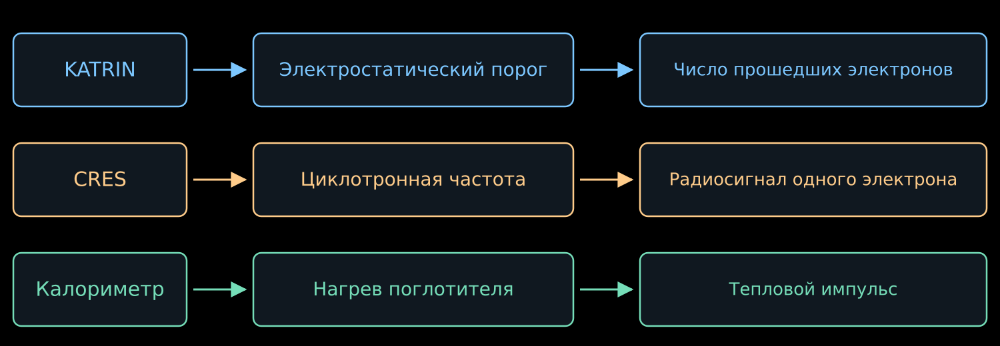{width="86%" fig-alt="KATRIN сравнивает энергию с порогом, CRES измеряет частоту, калориметр регистрирует нагрев"}

- В лекции 07 мы измеряли несколько интегралов от $\beta$-спектра,
  меняя задерживающее напряжение.
- Теперь рассмотрим способы измерять энергию каждого распада отдельно.
- Способов будет четыре:
  - услышать электрон;
  - измерить тепло;
  - восстановить недостающий импульс;
  - сравнить времена прилёта.

## Способ первый: услышать электрон {#cres-intro}

::: {style="width:78%;"}

- Электрон в магнитном поле вращается и, как всякий ускоренный заряд, излучает.
- Частота этой радиоволны падает с ростом энергии. Поймаем волну, измерим
  частоту — получим энергию.

$$
\boxed{
\text{один распад}
\ \longrightarrow\
\text{радиосигнал}
\ \longrightarrow\
\text{частота}
\ \longrightarrow\
\text{энергия}
}
$$

- Порог здесь не нужен: прибор слушает каждый электрон по отдельности.
- Метод называется CRES, его развивает эксперимент Project 8.

:::

## Циклотронная частота зависит от энергии {#cres-energy}

::::: {.panel-tabset .story-tabs}

### Релятивистская поправка

:::: {.columns}

::: {.column width="53%"}

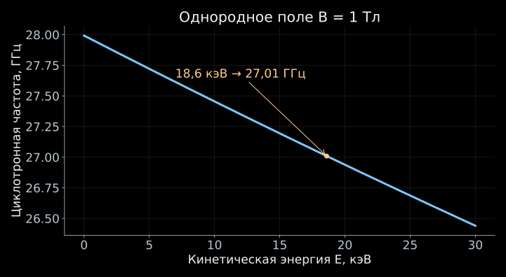{width="100%" fig-alt="В известном магнитном поле циклотронная частота убывает с ростом кинетической энергии электрона"}

:::

::: {.column width="44%"}

- В нерелятивистской формуле $\omega_c=eB/m_e$ энергия не фигурирует.
- В лекции 05 мы получили релятивистское уточнение:

$$
f_c=\frac{\omega_c}{2\pi}
=\frac{eB}{2\pi\gamma m_e}
=\frac{f_0}{\gamma},
\qquad
\gamma=1+\frac{E}{m_ec^2}.
$$

- Здесь $f_0=eB/(2\pi m_e)$.
  Более энергичный электрон вращается медленнее.
- Если поле известно, частота даёт энергию:

$$
\boxed{E=m_ec^2\left(\frac{f_0}{f_c}-1\right)}.
$$

:::

::::

### Как услышать электрон

- Электрон движется с ускорением поперёк магнитного поля и излучает
  электромагнитную волну.
- Периодическое вращение создаёт сигнал на циклотронной частоте.
  Его можно принимать, пока электрон остаётся в наблюдаемом объёме.
- При $B=1$ Тл и $E=18.6$ кэВ

$$
f_0\simeq27.99~\text{ГГц},
\qquad
f_c\simeq27.01~\text{ГГц}.
$$

- Такой подход называется **спектроскопией циклотронного излучения**,
  сокращённо CRES. Его развивает эксперимент Project 8.

::: {.nh-text tone="muted" size="sm"}
В электродинамических формулах этой лекции $c$ выписано явно,
$E$ — кинетическая энергия электрона.
[Принцип и реализация CRES](https://arxiv.org/abs/2503.08807).
:::

:::::

## Что приходит на вход приёмника?

::::: {.panel-tabset .story-tabs}

### Излучаемая мощность

- В приближении свободного пространства мощность излучения равна

$$
P_{\mathrm{rad}}
=\frac{e^4B^2}{6\pi\varepsilon_0m_e^2c}
\,\gamma^2\beta^2\sin^2\alpha.
$$

- $\beta=v/c$, $\alpha$ — угол скорости к полю.
  Излучает поперечное ускорение; при $\alpha=0$ циклотронного излучения нет.
- Для $E=18.6$ кэВ, $B=1$ Тл, $\alpha=90^\circ$:

$$
\boxed{P_{\mathrm{rad}}\simeq1.2\cdot10^{-15}~\text{Вт}}.
$$

- До приёмника доходит лишь часть мощности.
  Волновод или резонатор меняет и сбор сигнала, и условия самого излучения.

::: {.nh-text tone="muted" size="sm"}
[Излучение электрона в электромагнитные моды приёмной системы](https://arxiv.org/abs/1901.02844).
:::

### Фемтоватт — это много?

:::: {.columns}

::: {.column width="58%"}

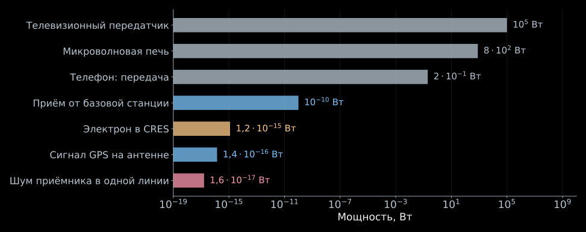{width="100%" fig-alt="Шкала мощностей: передатчики, принимаемые сигналы, сигнал CRES и шум приёмника"}

:::

::: {.column width="39%"}

- Телефон в момент передачи излучает $0.2$ Вт, телевышка — сотни киловатт.
- На антенну того же телефона от базовой станции приходит около
  $10^{-10}$ Вт.
- Сигнал GPS на этой антенне — $1.4\cdot10^{-16}$ Вт, и его уверенно
  принимает каждый смартфон.
- Наш фемтоватт лежит выше сигнала GPS.

:::

::::

::: {.nh-box tone="question" size="md"}
Сравнивать наш фемтоватт с передатчиками бессмысленно. С чем он конкурирует
на самом деле?
:::

### Почему его слышно

- Соперник один — тепловой шум самого приёмника. Он даёт мощность
  $kT_{\mathrm{ш}}$ на каждый герц полосы.
- Полосу задаёт длительность записи: чем дольше мы слушаем электрон,
  тем уже линия в спектре,

$$
\Delta f\simeq\frac{0.886}{T_{\mathrm{набл}}}.
$$

- При $T_{\mathrm{ш}}=132$ К и записи длиной $100$ мкс шум в одной такой линии

$$
\boxed{
P_{\mathrm{ш}}=kT_{\mathrm{ш}}\,\Delta f
\simeq1.6\cdot10^{-17}~\text{Вт}
}.
$$

- Фемтоватт против этого — запас почти в сто раз. Часть мощности теряется
  по дороге к усилителю, и рабочее отношение сигнал/шум выходит порядка единиц.

::: {.nh-box tone="success" size="md"}
Слушать долго и в узкой полосе.
:::

:::::

## Как устроена приёмная цепочка {#cres-receiver}

::::: {.panel-tabset .story-tabs}

### Вся цепочка

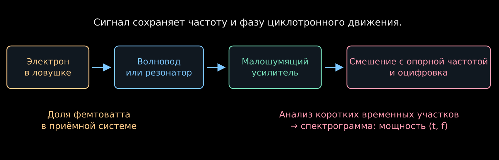{height="330" fig-alt="Излучение электрона возбуждает моду, усиливается, переносится на промежуточную частоту и оцифровывается"}

- Электрон отдаёт мощность электромагнитной моде, мода доводит её до усилителя.
- Усилитель поднимает уровень, смеситель опускает частоту,
  АЦП записывает напряжение как функцию времени.
- Каждый шаг сохраняет частоту — ту самую величину, ради которой всё затеяно.

### Волновод и резонатор

:::: {.columns}

::: {.column width="56%"}

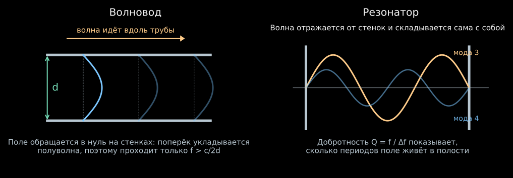{width="100%" fig-alt="В волноводе поперёк трубы укладывается полуволна; в резонаторе волна складывается сама с собой"}

- **Резонатор** — закрытая полость. Волна отражается от стенок и складывается
  сама с собой на избранных частотах.
- Добротность $Q=f/\Delta f$ считает, сколько периодов поле живёт в полости.
  При $Q=10^4$ на $26$ ГГц полоса резонатора равна $2.6$ МГц.

:::

::: {.column width="41%"}

- **Волновод** — металлическая труба. Поле обращается в нуль на стенках,
  поэтому поперёк трубы должна уложиться хотя бы полуволна:

$$
f>f_{\mathrm{кр}}\simeq\frac{c}{2d}.
$$

- При $d=10$ мм это $15$ ГГц; точный расчёт для круглой трубы даёт $17.6$ ГГц.
  Сигнал в $26$ ГГц проходит, всё, что ниже отсечки, затухает.

:::

::::

### Усилитель

- Фемтоватты нужно поднять до уровня, который переживёт кабели и оцифровку.
  Усиление в Project 8 — от $70$ до $82$ дБ, то есть в $10^7$–$10^8$ раз
  по мощности.
- За это приходится платить: усилитель добавляет собственный шум.
  Его выражают температурой $T_{\mathrm{ш}}$, шумовая мощность равна
  $kT_{\mathrm{ш}}$ на герц полосы.
- Для цепочки каскадов с усилениями $G_i$

$$
\boxed{
T_{\mathrm{сист}}=T_1+\frac{T_2}{G_1}+\frac{T_3}{G_1G_2}+\ldots
}
$$

- Шум первого каскада входит целиком, остальные делятся на усиление
  предыдущих. Поэтому первый усилитель охлаждают, а всё остальное терпит.
- У Project 8 $T_{\mathrm{сист}}=132$ К.

### Смеситель и оцифровка

- Записать $26$ ГГц напрямую нечем. Смеситель перемножает сигнал
  с опорным колебанием частоты $f_{\mathrm{оп}}$:

$$
\cos(2\pi f_ct)\cos(2\pi f_{\mathrm{оп}}t)
=\frac12\cos[2\pi(f_c-f_{\mathrm{оп}})t]
+\frac12\cos[2\pi(f_c+f_{\mathrm{оп}})t].
$$

- Фильтр оставляет разность. Смешав $26$ ГГц с $24.5$ ГГц, получаем $1.5$ ГГц;
  все изменения частоты сохраняются в этом сдвиге без искажений.
- АЦП пишет напряжение с частотой дискретизации выше удвоенной полосы —
  иначе разные частоты станут неразличимы.
- Фурье-анализ коротких кусков записи даёт спектрограмму: мощность
  как функция времени и частоты.

::: {.nh-text tone="muted" size="sm"}
[Приёмная электроника Project 8](https://arxiv.org/abs/2503.08807).
:::

:::::

## Один электрон оставляет частотный трек {#project8-cres}

::::: {.panel-tabset .story-tabs}

### Как читать трек

:::: {.columns}

::: {.column width="54%"}

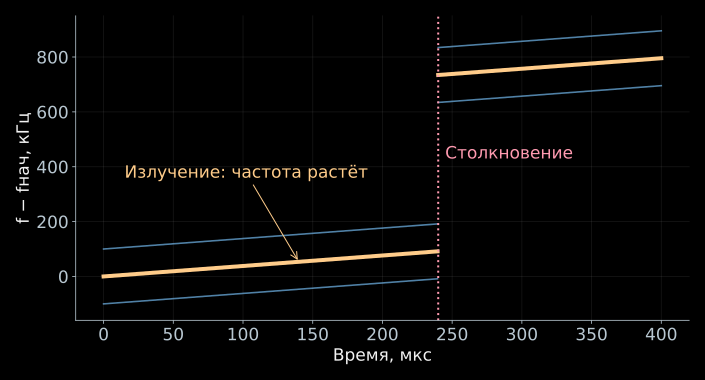{width="100%" fig-alt="Излучение плавно повышает частоту, а столкновение с потерей энергии создаёт скачок частотного трека"}

:::

::: {.column width="43%"}

- По горизонтали — время, по вертикали — частота.
- Начало первой обнаруженной линии даёт оценку начальной энергии электрона.
- Плавный подъём связан с потерей энергии на излучение:

$$
\dot E=-P_{\mathrm{rad}},
\qquad
\dot f_c=\frac{f_cP_{\mathrm{rad}}}{m_ec^2+E}>0.
$$

- Столкновение с молекулой может резко уменьшить энергию:
  частота скачком увеличится.
- Соседние линии могут принадлежать тому же электрону.

:::

::::

::: {.nh-text tone="muted" size="sm"}
- Схематический трек при постоянном среднем поле.
- Потеря в одном столкновении выбрана равной $12.6$ эВ;
- боковые линии показаны условно.
:::

### Энергия излучения

- В лекциях 05–06 сила Лоренца не совершала работы:
  $q\mathbf v\cdot(\mathbf v\times\mathbf B)=0$.
- Но там мы пренебрегали излучением.
  Теперь оно является наблюдаемым сигналом и уносит энергию электрона.
- Магнитное поле не поставляет эту энергию. Электрон расходует свою
  кинетическую энергию; в точном уравнении движения появляется
  сила радиационного торможения.
- При мощности $1.2$ фВт за $100$ мкс теряется примерно

$$
P_{\mathrm{rad}}T_{\mathrm{obs}}
\simeq1.2\cdot10^{-19}~\text{Дж}
\simeq0.75~\text{эВ}.
$$

- Поэтому начальную энергию восстанавливают по началу трека,
  учитывая его последующую эволюцию.

### Анимация

<video class="slide-video" style="--media-max-height:650px;" controls muted loop playsinline preload="metadata" poster="assets/04_direct_neutrino_mass/project8_cres.jpg" src="assets/04_direct_neutrino_mass/project8_cres.mp4"></video>

- Электрон удерживается в ловушке; излучение даёт восходящий трек.
  Столкновение меняет его частоту.

::: {.nh-text tone="muted" size="sm"}
Схематическая анимация; её обозначение $K$ соответствует кинетической энергии
$E$ в лекции. [Исходный код: dvnanima/project8_cres](https://github.com/NeutrinoHit/dvnanima/tree/main/project8_cres).
:::

:::::

## Магнитное зеркало продлевает наблюдение

::::: {.panel-tabset .story-tabs}

### Слабая ловушка

:::: {.columns}

::: {.column width="54%"}

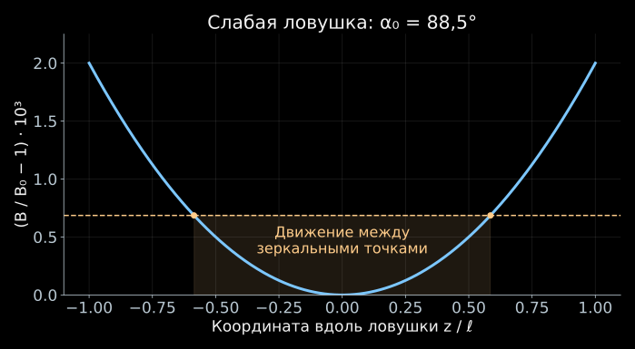{width="100%" fig-alt="Небольшое увеличение поля к краям удерживает электрон с углом, близким к 90 градусам"}

:::

::: {.column width="43%"}

- Без ловушки электрон быстро покинул бы чувствительную область.
- Два магнитных зеркала отражают его обратно — используется эффект лекции 06.
- Между отражениями энергия за один продольный период меняется мало,
  и можно применять адиабатический инвариант.
- Если поле на краях лишь немного больше $B_0$, запираются электроны
  с углами, близкими к $90^\circ$:

$$
\boxed{\sin^2\alpha_0>\frac{B_0}{B_{\max}}}.
$$

:::

::::

### Глубина и приём

- Пусть $B_{\max}=B_0(1+\eta)$, где $\eta\ll1$ — относительная глубина ловушки.
- Условие удержания принимает вид

$$
|\cos\alpha_0|<
\sqrt{1-\frac{1}{1+\eta}}
\simeq\sqrt{\eta}.
$$

- Для изотропного источника $\cos\alpha_0$ равномерен на $[-1,1]$.
  Поэтому геометрическая доля запертых электронов примерно равна
  $\sqrt{\eta}$.
- Глубокая ловушка принимает больше углов, но электрон исследует
  больший диапазон полей.
- Частота зависит и от энергии, и от поля: выигрыш в статистике
  усложняет восстановление энергии.

### Поле, которое чувствует электрон

- Поле ловушки постоянно во времени. Двигается электрон, и вместе с ним
  меняется поле в той точке, где он сейчас находится.
- В параболическом приближении

$$
B(z)=B_0\left(1+\frac{z^2}{\ell^2}\right),
\qquad
z(t)=z_{\max}\cos(2\pi f_zt).
$$

- Подстановка даёт

$$
B(t)=B_0\left[
1+\frac{z_{\max}^2}{2\ell^2}
+\frac{z_{\max}^2}{2\ell^2}\cos(4\pi f_zt)
\right].
$$

- За один продольный период электрон дважды заходит в область сильного поля,
  поэтому частота вращения колеблется на $2f_z$.
- Сдвигается и средняя частота. Подстановка одного $B_0$ в формулу для $E$
  без поправки на траекторию даст ошибку.

:::::

## Почему один электрон даёт несколько линий? {#cres-sidebands-origin}

::::: {.panel-tabset .story-tabs}

### Что слышит приёмник

:::: {.columns}

::: {.column width="57%"}

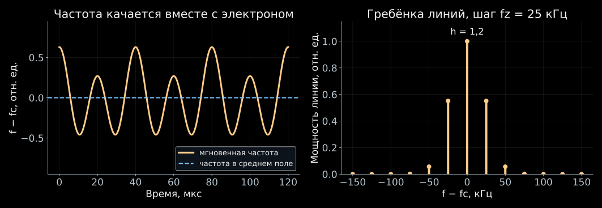{width="100%" fig-alt="Мгновенная частота качается с периодом продольного движения, и спектр распадается на гребёнку линий"}

::: {.nh-text tone="muted" size="sm"}
Полная фаза принятого сигнала складывается из фазы вращения и задержки волны,
$\Phi_{\mathrm{пр}}(t)=\int_0^t2\pi f_c\,dt'+\Phi_{\mathrm{распр}}[z(t)]$:
первое слагаемое качается на $2f_z$, второе — на $f_z$.
[Спектр мощности CRES и продольное движение](https://arxiv.org/abs/1901.02844).
:::

:::

::: {.column width="40%"}

- Электрон качается между зеркалами с частотой $f_z$ и дважды за период
  заходит в сильное поле. Циклотронная частота качается вместе с ним.
- Заодно меняется расстояние до приёмника: волна приходит то чуть раньше,
  то чуть позже.
- Приёмник слышит синусоиду, у которой период слегка дышит с периодом $1/f_z$.
- Дыхание фазы разбивает одну линию на гребёнку:

$$
\boxed{f_n=f_c+nf_z}.
$$

- Все эти линии принадлежат одному электрону.

:::

::::

### Индекс модуляции

- Сначала оставим одну частоту модуляции:

$$
V(t)=V_0\cos\Phi(t),
\qquad
\Phi(t)=2\pi f_ct+h\sin(2\pi f_zt).
$$

- Мгновенная частота определяется производной фазы:

$$
f_{\mathrm{мгн}}=\frac{1}{2\pi}\frac{d\Phi}{dt}
=f_c+h f_z\cos(2\pi f_zt).
$$

- Поэтому $h=\Delta f/f_z$ — **безразмерный индекс модуляции**,
  а $\Delta f$ — амплитуда изменения частоты.
- При малом $h$ сигнал почти гармонический.
  При большом $h$ боковые линии несут заметную долю мощности.

### Сколько мощности в каждой линии

- Тождество Якоби—Ангера даёт

$$
e^{ih\sin\theta}=\sum_{n=-\infty}^{\infty}J_n(h)e^{in\theta}.
$$

- Следовательно,

$$
e^{i\Phi(t)}
=\sum_{n=-\infty}^{\infty}J_n(h)e^{2\pi i(f_c+nf_z)t}.
$$

- $J_n$ — функция Бесселя. Боковая линия имеет частоту
  $f_n=f_c+nf_z$ и относительную мощность $J_n^2(h)$.
- Для длинного наблюдения

$$
\sum_nJ_n^2(h)=1:
$$

  мощность перераспределяется между линиями и никуда не исчезает.

### Зачем это знать

- Гребёнка забирает мощность у центральной линии. Порог обнаружения
  приходится считать по той линии, которую мы действительно видим.
- Расстояние между линиями равно $f_z$. Оно зависит от угла и от того,
  как глубоко электрон заходит в ловушку, — то есть рассказывает о траектории.
- Траектория задаёт среднее поле вдоль пути, а без него частоту не перевести
  в энергию.
- При $h\approx2.4$ функция $J_0$ обращается в нуль: центральная линия гаснет,
  хотя электрон никуда не делся.

:::::

## Длина записи задаёт разрешение по энергии {#cres-linewidth}

::::: {.panel-tabset .story-tabs}

### Зачем нам ширина линии

- Энергию мы берём из частоты, поэтому ошибка частоты сразу становится
  ошибкой энергии:

$$
\delta E=(m_ec^2+E)\frac{\delta f_c}{f_c}.
$$

- Запись конечной длины различает частоты не точнее, чем $1/T_{\mathrm{набл}}$:
  за короткое время две близкие синусоиды не успевают разойтись по фазе.
- Трек длиной $100$ мкс даёт линию шириной $8.9$ кГц. В энергии это

$$
\delta E\simeq529.6~\text{кэВ}\cdot
\frac{8.9~\text{кГц}}{27.0~\text{ГГц}}\simeq0.17~\text{эВ}.
$$

- Вот зачем электрон держат в ловушке: каждая лишняя микросекунда наблюдения
  сужает линию и уточняет энергию.

### Откуда берётся ширина

- Пусть гармоника частоты $f_n$ наблюдается только при
  $0<t<T_{\mathrm{obs}}$. Её амплитуда Фурье равна

$$
A_n(f)=
\int_0^{T_{\mathrm{obs}}}e^{2\pi i(f_n-f)t}\,dt
=T_{\mathrm{obs}}e^{i\pi(f_n-f)T_{\mathrm{obs}}}
\operatorname{sinc}\!\left[\pi(f_n-f)T_{\mathrm{obs}}\right].
$$

- Здесь $\operatorname{sinc}x=\sin x/x$.
  Мощность пропорциональна $\operatorname{sinc}^2$.
- Ширина такого пика на половине высоты:

$$
\boxed{\Delta f_{\mathrm{FWHM}}\simeq\frac{0.886}{T_{\mathrm{obs}}}}.
$$

- Коэффициент относится к прямоугольному временному окну.
  Другая обработка записи меняет форму и ширину пика.

### Интерактив {#cres-sidebands}



- Меняйте индекс $h$. Найдите режим, где центральная линия слабее боковых.
- Расстояние между линиями задаёт $f_z$; их огибающая зависит от $h$.
- Уменьшение мощности несущей не означает исчезновение электрона.

::: {.nh-text tone="muted" size="sm"}
[Открыть апплет](../applets/cres-sidebands.qmd) ·
[Исходный код модели](https://github.com/NeutrinoHit/neutrinophysics/blob/main/introduction/ru/slides/assets/04_direct_neutrino_mass/_cres_radiation_spectrum.qmd).
:::

:::::

## Какой точности требуют частота и поле?

::::: {.panel-tabset .story-tabs}

### Перевод ошибки частоты

- При фиксированном $B$ дифференцируем связь энергии и частоты:

$$
\boxed{\delta E=-(m_ec^2+E)\frac{\delta f_c}{f_c}}.
$$

- У конца тритиевого спектра в поле $1$ Тл

$$
\delta E=0.10~\text{эВ}
\quad\Longleftrightarrow\quad
|\delta f_c|\simeq5.1~\text{кГц}.
$$

- Линию такой ширины даёт прямоугольная запись длительностью около $174$ мкс.
- Центр линии находят точнее её ширины: выигрыш растёт вместе с отношением
  сигнал/шум. Ширина задаёт масштаб, дальше работает статистика.

### Поле тоже измеряется

- Если меняются и поле, и частота,

$$
\boxed{
\delta E=(m_ec^2+E)
\left(\frac{\delta B}{B}-\frac{\delta f_c}{f_c}\right)
}.
$$

- Для вклада в ошибку не более $0.10$ эВ при $E=18.6$ кэВ требуется
  относительное знание эффективного поля порядка

$$
\frac{|\delta B|}{B}\lesssim1.9\cdot10^{-7}.
$$

- Неизвестное положение электрона в неоднородном поле становится
  неопределённостью его энергии.
- Для калибровки используют конверсионные линии криптона, знакомые по лекции 07,
  а структуру трека сопоставляют с моделью ловушки.

### Дрейф частоты {#cres-frequency-track}



- Меняйте начальную энергию. Более энергичный электрон начинает с меньшей частоты.
- Мощность в этой модели фиксирована. В реальном приборе она зависит
  также от угла и связи электрона с электромагнитной модой.

::: {.nh-text tone="muted" size="sm"}
[Открыть апплет](../applets/cres-frequency-track.qmd) ·
[Исходный код](https://github.com/NeutrinoHit/neutrinophysics/blob/main/introduction/ru/slides/assets/04_direct_neutrino_mass/_cres_frequency_track.qmd).
:::

:::::

## От отдельных треков к спектру Project 8

::::: {.panel-tabset .story-tabs}

### Ячейка

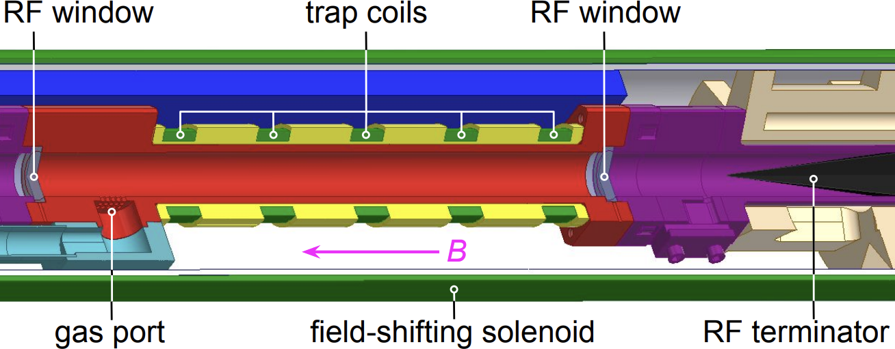{.slide-image-center .nostretch width="62%" fig-alt="Разрез криогенной ячейки CRES: окна для радиосигнала, катушки ловушки, ввод газа, соленоид сдвига поля, поглотитель радиоволн"}

- Электрон рождается в распаде прямо внутри волновода и остаётся там,
  запертый катушками ловушки.
- Радиоволна уходит вдоль трубы к усилителям, а с дальнего конца её гасит
  поглотитель, чтобы не приходило эхо.
- Газ подаётся через отдельный ввод, а соленоид сдвига поля меняет рабочее
  поле без перестройки самого магнита.

::: {.nh-text tone="muted" size="sm"}
[Project 8, рис. 1](https://arxiv.org/abs/2212.05048).
:::

### Параметры

:::: {.columns}

::: {.column width="55%"}

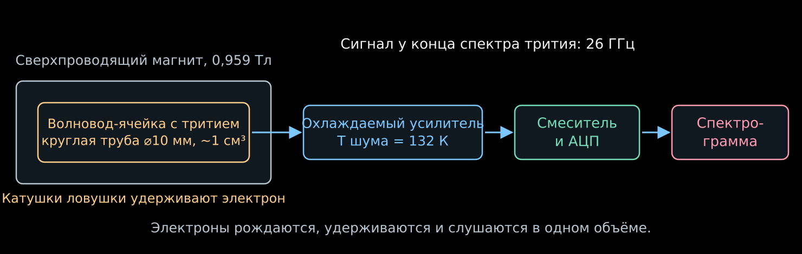{width="100%" fig-alt="Ячейка с тритием внутри магнита, охлаждаемый усилитель, смеситель с АЦП и спектрограмма"}

:::

::: {.column width="42%"}

| Параметр | Значение |
|---|---|
| Поле | $0.959$ Тл |
| Частота у конца спектра | $\simeq26$ ГГц |
| Ячейка | круглый волновод $\varnothing\,10$ мм |
| Объём | порядка см³ |
| Шум системы | $132$ К |
| Усиление | $70$–$82$ дБ |
| Разрешение на линии Kr | $1.66$ эВ |

:::

::::

::: {.nh-text tone="muted" size="sm"}
Параметры Phase II. [Обзор метода и установки](https://arxiv.org/abs/2503.08807).
:::

### Спектр начальных энергий

- Для каждого обнаруженного электрона восстанавливают начало трека.
- Начальные частоты переводят в энергии и заполняют спектр.
  Затем сравнивают его с моделью β-распада и отклика.
- Не каждый электрон даёт видимый трек: вероятность обнаружения зависит
  от мощности, длительности, угла и полосы приёмника.
- Если первый участок слишком слаб или короток, электрон может быть замечен
  только после потери энергии. Это искажает реконструированный спектр.
- Калибровки и модель эффективности здесь нужны так же, как в KATRIN.

### Опубликованное измерение

:::: {.columns}

::: {.column width="50%"}

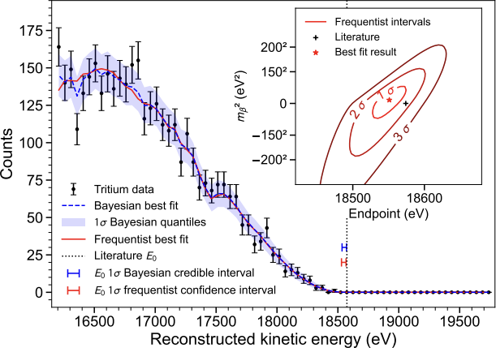{.slide-image-center .nostretch width="100%" fig-alt="Измеренный тритиевый спектр у конца с байесовской и частотной подгонками, во вставке контуры по массе и концу спектра"}

:::

::: {.column width="47%"}

- В 2023 году Project 8 опубликовал первый тритиевый спектр,
  измеренный по циклотронному излучению.
- Получены ограничения

$$
m_\beta<155~\text{эВ}\quad(90\%\ \text{байесовский интервал}),
$$

$$
m_\beta<152~\text{эВ}\quad(90\%\ \text{частотный интервал}).
$$

- Разрешение $1.66\pm0.19$ эВ FWHM было показано на линии
  $^{83\mathrm m}\mathrm{Kr}$ около $17.8$ кэВ
  в специально выбранной неглубокой ловушке.
- Хорошее разрешение отдельного электрона ещё не даёт сильного ограничения
  на массу: важны число тритиевых событий и весь отклик.

:::

::::

::: {.nh-text tone="muted" size="sm"}
Рисунок 5 и результат: [Project 8, Phys. Rev. Lett. 131, 102502 (2023)](https://arxiv.org/abs/2212.05048).
:::

### Это ещё демонстрация

- Объём источника — кубический сантиметр. У KATRIN источник длиной в десять
  метров, отсюда и разница в пределах: $155$ эВ против $0.45$ эВ.
- Phase II решала свою задачу: показать разрешение. На одном электроне
  получено $1.66$ эВ в объёме размером с напёрсток.
- Дальше нужен объём. Слабый сигнал собирают либо антенной решёткой, складывая
  сигналы с задержками по положению электрона, либо резонатором с выбранной
  модой.
- Phase III — резонатор масштаба м³. Phase IV — атомарный тритий с целью
  $40$ мэВ.
- Физику массы нейтрино CRES начнёт измерять на следующих этапах.

::: {.nh-text tone="muted" size="sm"}
[Project 8: CRES в резонаторах, 2026](https://arxiv.org/abs/2601.07848).
:::

### Атомарный источник

- В молекулярном тритии часть энергии остаётся во вращении и колебаниях
  дочерней молекулы. Частотное считывание само по себе этого не устраняет.
- Атомарный тритий убирает молекулярные степени свободы,
  но сохраняет атомные возбуждения и отдачу.
- Атомы нужно охлаждать, удерживать и защищать от рекомбинации
  в молекулы на стенках.
- Обсуждаемая цель Project 8 — чувствительность порядка $40$ мэВ.
  Для неё нужны большой атомарный источник и новое считывание.

::: {.nh-text tone="muted" size="sm"}
[Project 8: цель и атомарный тритий](https://nuclearscience.lbl.gov/research/research-programs/neutrinos/neutrinos-research/katrin-project-8/).
:::

:::::

## Способ второй: поймать тепло {#calorimetry-intro}

::: {style="width:78%;"}

- В CRES энергию электрона определяют по частоте его циклотронного излучения.
- В калориметрическом методе источник помещают внутрь поглотителя. При полном поглощении в нём остаётся вся энергия распада, кроме унесённой нейтрино. Её измеряют по нагреву.
$$
\boxed{
\text{распад внутри поглотителя}
\ \longrightarrow\
\text{нагрев}
\ \longrightarrow\
\text{импульс термометра}
}
$$

:::

## Калориметр: общая картина {#calorimeter-overview}

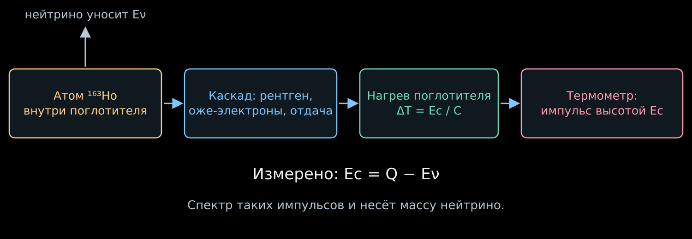{width="92%" fig-alt="Захват электрона в гольмии, каскад перестроек оболочки, нагрев поглотителя, импульс термометра"}

:::: {.columns}

::: {.column width="47%"}

- Атом $^{163}\mathrm{Ho}$ сидит внутри поглотителя и захватывает собственный
  электрон. Нейтрино уходит, остальное остаётся здесь же.
- Рентгеновские кванты и оже-электроны каскада тормозятся в веществе,
  и через микросекунды всё это становится теплом.

:::

::: {.column width="49%"}

- Поглотитель нагревается, термометр превращает нагрев в импульс,
  высота импульса даёт

$$
\boxed{E_c=Q-E_\nu}.
$$

- $Q$ — полное энерговыделение распада, $E_c$ — измеренная
  калориметрическая энергия.
- Дальше разберём каждое звено этой цепочки по отдельности.

:::

::::

## Электронный захват в гольмии-163

::::: {.panel-tabset .story-tabs}

### Что захватывается?

:::: {.columns}

::: {.column width="45%"}

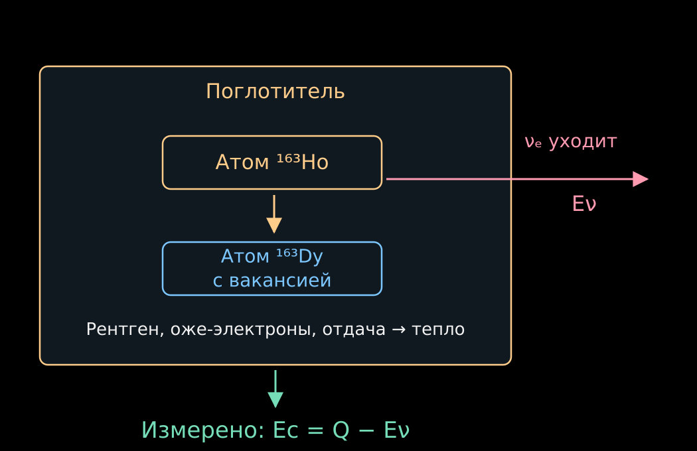{width="100%" fig-alt="Гольмий распадается внутри поглотителя: нейтрино уходит, рентгеновское излучение и электроны нагревают поглотитель"}

:::

::: {.column width="52%"}

- Протон ядра захватывает один из связанных электронов своего атома:

$$
p+e^-_{\mathrm{связ}}\to n+\nu_e.
$$

- Заряд ядра уменьшается на единицу. Для полного нейтрального атома

$$
{}^{163}\mathrm{Ho}_{\mathrm{атом}}
\to{}^{163}\mathrm{Dy}_{\mathrm{атом}}^*+\nu_e.
$$

- Здесь звёздочка обозначает возбуждение **электронной оболочки**:
  после захвата осталась вакансия и перестроилось поле ядра.
- Разность масс нейтральных атомов задаёт $Q\simeq2.86$ кэВ.
  Связанный электрон уже включён в массу исходного атома.

:::

::::

### Куда уходит энергия вакансии?

- Электрон с внешней оболочки может занять вакансию.
- Освобождённая энергия испускается рентгеновским квантом
  или передаётся другому электрону, который вылетает из атома.
  Последний процесс даёт **оже-электрон**.
- Возникает каскад перестроек оболочки.
  Внутри поглотителя все эти частицы передают энергию веществу.
- Калориметр суммирует каскад. Для одного и того же конечного атомного
  состояния несущественно, как энергия поделилась между фотонами и электронами.

::: {.nh-box tone="accent" size="md"}
Калориметр измеряет полную оставшуюся энергию, даже если она разошлась
по нескольким частицам.
:::

### Условия полного поглощения

- Фотоны и электроны должны поглотиться внутри чувствительного объёма.
  Уход фотона уменьшит измеренную энергию и создаст хвост отклика.
- Энергия должна успеть перейти в измеряемые тепловые степени свободы.
  Долгоживущие возбуждения могут изменить форму импульса.
- Положение внедрённых атомов, толщину поглотителя и калибровку проверяют
  экспериментально.
- При выполнении этих условий исчезают потери при выходе электрона
  из отдельного источника, знакомые по лекции 07.

:::::

## Почему калориметрический спектр содержит пики?

::::: {.panel-tabset .story-tabs}

### Конечные состояния

- Электрон может быть захвачен с разных оболочек.
  После захвата остаются разные энергии возбуждения атома диспрозия.
- Для идеально определённого конечного состояния двухчастичная кинематика
  дала бы одну энергию нейтрино и одну $E_c$.
- Но возбуждённые атомные состояния имеют конечное время жизни
  и естественную ширину.
- Несколько каналов дают несколько линий с хвостами.
  Дополнительные возбуждения и ионизация других электронов усложняют спектр.

### Спектр

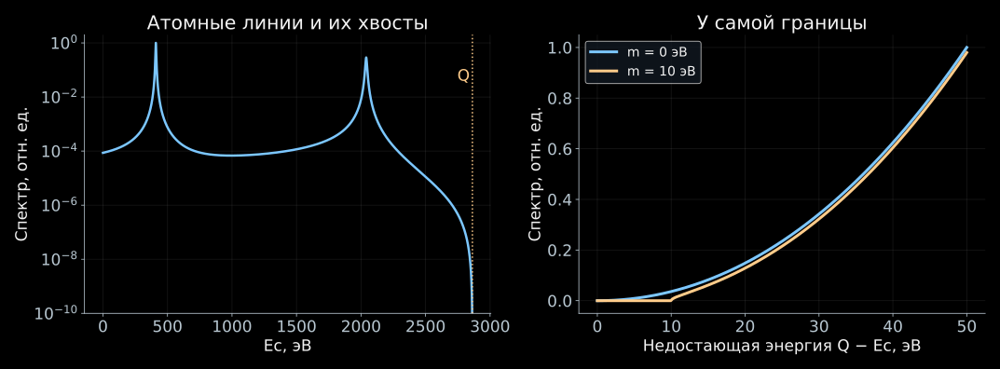{height="480" fig-alt="Учебный двухлинейный спектр электронного захвата: атомные пики далеко от Q и подавление спектра массой вблизи конечной энергии"}

- Атомные пики определяют большую часть статистики.
  Чувствительность к малой массе находится у границы $E_c\simeq Q$.

::: {.nh-text tone="muted" size="sm"}
Учебный двухлинейный спектр. Масса $10$ эВ выбрана для наглядности;
это не данные ECHo или HOLMES.
:::

### Фазовое пространство

- В приближении неразрешённых лёгких масс введём $x=Q-E_c$.
  Для $x\ge m_\beta$:

$$
\boxed{
\frac{d\Gamma}{dE_c}
=C\,x\sqrt{x^2-m_\beta^2}\,\Theta(x-m_\beta)\,\mathcal A(E_c)
}.
$$

- $C$ — нормировка, $\mathcal A(E_c)$ — атомная спектральная функция.
- Простейшая модель независимых линий:

$$
\mathcal A(E_c)\simeq
\sum_j a_j\,
\frac{\Gamma_j/(2\pi)}
{(E_c-E_j)^2+\Gamma_j^2/4}.
$$

- $E_j$, $\Gamma_j$, $a_j$ — энергия, ширина и вес канала.
  Массовая поправка умножает всю атомную функцию.

### Атомный расчёт

- Модель одиночных вакансий даёт полезную картину, но недостаточна
  для точного анализа конца спектра.
- После изменения заряда ядра другие электроны могут дополнительно
  возбудиться или уйти в непрерывный спектр.
- Поэтому $\mathcal A(E_c)$ требует многоэлектронного расчёта
  и проверки по измеренным линиям.
- В эффективной одномассовой модели край равен $E_c^{\max}=Q-m_\beta$.
  Точное трёхмассовое описание содержит пороги $Q-m_i$ с весами $|V_{ei}|^2$.
- Малое $Q$ полезно.
- Атомные пики нужны для калибровки детектора и проверки модели спектра. Для измерения малой массы нейтрино необходима достаточная статистика у самой границы спектра.

::: {.nh-text tone="muted" size="sm"}
[Атомный спектр и анализ ECHo-1k](https://arxiv.org/abs/2509.03423).
:::

:::::

## Как измерить нагрев от одного распада?

::::: {.panel-tabset .story-tabs}

### Теплоёмкость

:::: {.columns}

::: {.column width="54%"}

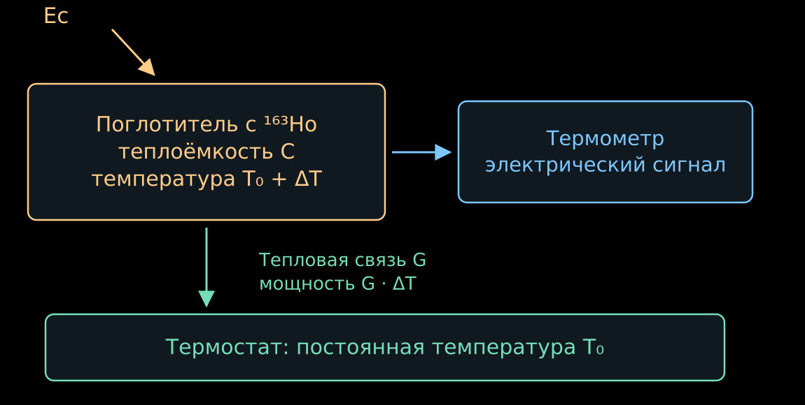{width="100%" fig-alt="Поглотитель с теплоёмкостью C связан с термометром и холодным термостатом тепловой связью G"}

:::

::: {.column width="43%"}

- Поглотитель охлаждают до температуры порядка десятков милликельвинов.
  Его теплоёмкость $C$ становится малой.
- Быстрое выделение энергии повышает температуру:

$$
\boxed{\Delta T\simeq\frac{E_c}{C}}.
$$

- Например, при $C=10^{-12}$ Дж/К энергия $2.86$ кэВ даёт

$$
\Delta T\simeq0.46~\text{мК}.
$$

- Термометр переводит этот нагрев в электрический сигнал.

:::

::::

### Возврат к исходной температуре

- После распада энергия постепенно уходит в термостат через тепловую связь $G$.
- В линейной модели, когда выделение энергии уже закончилось,

$$
C\frac{d\Delta T}{dt}=-G\Delta T.
$$

- Отсюда

$$
\boxed{
\Delta T(t)=\frac{E_c}{C}e^{-t/\tau_{\mathrm{тепл}}},
\qquad
\tau_{\mathrm{тепл}}=\frac{C}{G}
}.
$$

- Малое $C$ увеличивает амплитуду, а большое $G$ ускоряет возврат.
- Чувствительность ограничивают шум термометра и тепловые флуктуации.
  Быстродействие и энергетическое разрешение приходится выбирать совместно.

:::::

## Два способа превратить температуру в сигнал

::::: {.panel-tabset .story-tabs}

### Магнитный термометр

- В ECHo используют металлические магнитные калориметры.
  Датчик содержит парамагнитные ионы эрбия в металлической матрице.
- В слабом поле магнитные моменты частично упорядочены.
  Нагрев усиливает тепловое разупорядочение и уменьшает намагниченность.
- Простейшая картина — закон Кюри $M\propto B/T$.
  Реальный датчик калибруют при его рабочей температуре и поле.
- Изменение магнитного потока считывает СКВИД — сверхпроводящий квантовый
  интерферометр, чувствительный магнитометр.

$$
E_c\ \longrightarrow\ \Delta T
\ \longrightarrow\ \Delta M
\ \longrightarrow\ \Delta\Phi.
$$

::: {.nh-text tone="muted" size="sm"}
[Металлические магнитные калориметры](https://doi.org/10.1016/S0921-4526(02)02307-4).
:::

### Сверхпроводящий термометр

- HOLMES использует датчики на краю сверхпроводящего перехода:
  TES — принятое сокращение этого типа термометров.
- Датчик удерживают в узком интервале температур, где сопротивление
  резко меняется от почти нулевого до нормального.
- Небольшой нагрев заметно повышает сопротивление.
  При заданном напряжении ток уменьшается:

$$
\Delta T>0\quad\Rightarrow\quad
\Delta R>0\quad\Rightarrow\quad
\Delta I<0.
$$

- При этом уменьшается джоулев нагрев $P_J=V_{\mathrm{см}}^2/R$.
  Такая отрицательная обратная связь помогает датчику остывать.
- Реальный импульс определяется и тепловой, и электрической динамикой.

::: {.nh-text tone="muted" size="sm"}
[Термометры HOLMES с внедрённым гольмием](https://arxiv.org/abs/2506.13665).
:::

### Характеристики датчиков

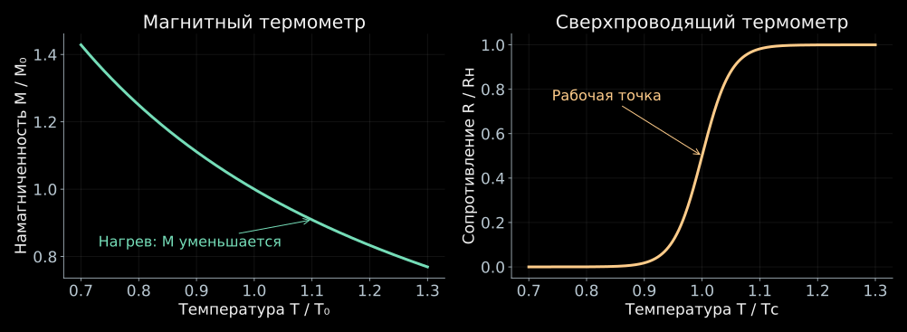{height="570" fig-alt="Намагниченность парамагнитного датчика убывает при нагреве, сопротивление TES резко растёт в области сверхпроводящего перехода"}

- Тепловой сигнал один и тот же. Различаются физические величины,
  которыми измеряют температуру.
- Кривые схематические; для магнитного датчика показан слабополевой
  закон Кюри, для TES — модель перехода.

:::::

## Два распада могут выглядеть как один

::::: {.panel-tabset .story-tabs}

### Наложение импульсов

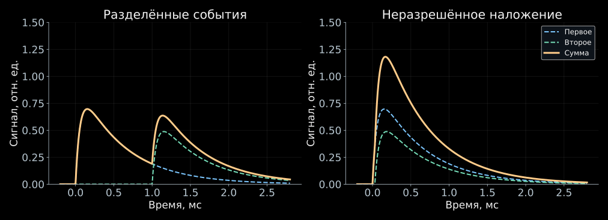{height="540" fig-alt="Далёкие по времени тепловые импульсы различимы, близкие складываются в один повышенный сигнал"}

- Если два события произошли слишком близко по времени,
  электроника может восстановить одно событие с энергией $E_1+E_2$.
- Низкоэнергетические распады тогда попадают в область конца спектра.
  У суммарного спектра появляются события даже выше $Q$.

### Вероятность

- Пусть активность одного пикселя равна $a$ распадов в секунду,
  а интервалы меньше $\tau_r$ не разрешаются.
- Вероятность следующего распада в этом интервале:

$$
\boxed{
f_{\mathrm{нал}}=1-e^{-a\tau_r}
\simeq a\tau_r,\qquad a\tau_r\ll1
}.
$$

- При $a=10~\text{с}^{-1}$ и $\tau_r=1$ мкс получаем $f_{\mathrm{нал}}\sim10^{-5}$.
- Это малая доля всех событий, но полезных событий у конца спектра
  ещё меньше.
- Для независимых распадов энергетическое распределение наложений
  пропорционально свёртке $S*S$, где $S(E_c)$ — одиночный спектр.

### Зачем много пикселей?

- При $N$ одинаковых пикселях и общей активности
  $A_{\mathrm{общ}}=Na$ число одиночных распадов растёт как $A_{\mathrm{общ}}$.
- Скорость близких пар во всём массиве примерно равна

$$
\boxed{
R_{\mathrm{пар}}\simeq Na^2\tau_r
=\frac{A_{\mathrm{общ}}^2\tau_r}{N}
}.
$$

- При фиксированной общей активности её распределение по большему числу
  пикселей уменьшает наложения.
- Много каналов нужно одновременно читать и калибровать.
  Каналы можно различать по собственным частотам резонаторов
  в общей линии считывания.

::: {.nh-text tone="muted" size="sm"}
[Многоканальное считывание HOLMES](https://arxiv.org/abs/1910.05217).
:::

:::::

## Что показали ECHo и HOLMES?

:::: {.columns}

::: {.column width="48%"}

**ECHo-1k, 2025**

- Магнитные микрокалориметры.
- Около $2\cdot10^8$ событий.
- Из спектра получено $Q=2862(4)$ эВ.

$$
\boxed{m_\beta<15~\text{эВ}}
$$

при $90\%$ байесовском уровне достоверности.

[Публикация ECHo](https://arxiv.org/abs/2509.03423).

:::

::: {.column width="48%"}

**HOLMES, 2025**

- Сверхпроводящие термометры TES.
- Около $7\cdot10^7$ событий.
- Среднее разрешение около $6$ эВ FWHM.

$$
\boxed{m_\beta<27~\text{эВ}}
$$

при $90\%$ байесовском уровне достоверности.

[Публикация HOLMES](https://arxiv.org/abs/2503.19920).

:::

::::

::: {.nh-box tone="accent" size="md"}
Следующее улучшение требует больше событий у конца, быстрой регистрации
и точно известного атомного спектра.
:::

## Почему не любой низкоэнергетический распад удобен?

::::: {.panel-tabset .story-tabs}

### Пример: рений-187

- У $^{187}\mathrm{Re}$ малая энергия β-распада,
  $Q\simeq2.47$ кэВ, и его можно встроить в калориметр.
- Но период полураспада около $4.3\cdot10^{10}$ лет.
  Чтобы набрать активность, нужно много атомов:

$$
A=\frac{\ln2}{T_{1/2}}N_{\mathrm{атомов}}.
$$

- Большой поглотитель имеет большую теплоёмкость,
  поэтому нагрев от одного события уменьшается.
- Дополнительные трудности — тепловая релаксация и изменение формы
  β-спектра из-за взаимодействия электрона с кристаллической средой.

### Что сравнивать

- Малое $Q$ увеличивает относительную важность малой массы.
- Но чувствительность определяется также активностью, числом событий
  около границы, сложностью теории спектра и свойствами детектора.
- У гольмия основная статистика лежит в атомных линиях.
  У трития — в непрерывном β-спектре.
- Поэтому сравнение только по $Q$ или только по разрешению
  не определяет, какой эксперимент измерит меньшую массу.

:::::

## Способ третий: посчитать недостающее {#kinematics-intro}

::: {style="width:78%;"}

- Нейтрино можно вообще не ловить. Если известны все остальные участники
  распада, его четырёхимпульс находится вычитанием:

$$
\boxed{
P_\nu=P_{\text{нач}}-\sum_a P_a,
\qquad
m_\nu^2=P_\nu^2
}
$$

- Дальше в формулах $c=1$.
- Масса выходит как разность больших величин. Отсюда и вся трудность.

:::

## Недостающий импульс: пион и тау {#missing-mass}

::::: {.panel-tabset .story-tabs}

### Пион в покое

:::: {.columns}

::: {.column width="47%"}

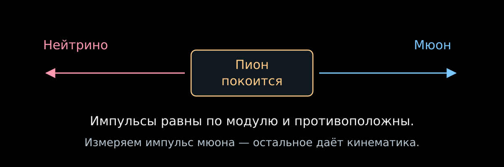{width="100%" fig-alt="Покоящийся пион распадается на мюон и нейтрино с противоположными импульсами"}

:::

::: {.column width="50%"}

- В распаде $\pi^+\to\mu^++\nu_\mu$ покоящийся пион отдаёт мюону и нейтрино
  равные по модулю импульсы. Достаточно измерить $p_\mu$:

$$
\boxed{
m_\nu^2=(P_\pi-P_\mu)^2
=m_\pi^2+m_\mu^2-2m_\pi\sqrt{p_\mu^2+m_\mu^2}
}.
$$

- При нулевой массе

$$
p_\mu=\frac{m_\pi^2-m_\mu^2}{2m_\pi}\simeq29.79~\text{МэВ}.
$$

- Измерение Ассамагана и соавторов: $m_{\nu_\mu}<170$ кэВ ($90\%$).

:::

::::

::: {.nh-text tone="muted" size="sm"}
[Измерение импульса мюона в распаде пиона](https://doi.org/10.1103/PhysRevD.53.6065).
Обозначение $m_{\nu_\mu}$ традиционно для этого канала; отдельной определённой
массы у флэйворного состояния нет.
:::

### Граница в распаде тау

:::: {.columns}

::: {.column width="52%"}

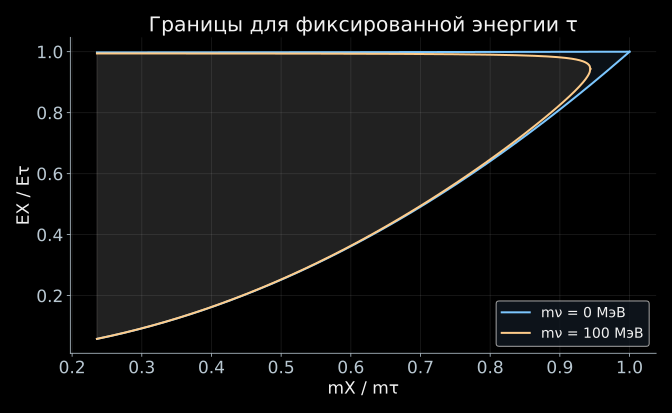{width="100%" fig-alt="Ненулевая масса нейтрино сужает доступную область по массе и энергии адронной системы"}

:::

::: {.column width="45%"}

- В $\tau^-\to X^-+\nu_\tau$ складывают четырёхимпульсы зарегистрированных
  адронов и получают массу $m_X$ и энергию $E_X$ видимой системы.
- Масса нейтрино отрезает край доступной области:

$$
m_X\le m_\tau-m_\nu.
$$

- Тау движется, поэтому граница по энергии размывается в полосу между
  $\cos\theta^*=\pm1$. Массу ищут по тому, как события ложатся у края полосы.
- ALEPH: $m_{\nu_\tau}<18.2$ МэВ ($95\%$).
- На рисунке $\gamma_\tau=10$ и масса $100$ МэВ, чтобы эффект был виден.

:::

::::

::: {.nh-text tone="muted" size="sm"}
[ALEPH, анализ трёх- и пятитрековых распадов, 1998](https://cds.cern.ch/record/337738).
:::

### Почему эти пределы слабые

- Продифференцируем связь массы и импульса мюона:

$$
\delta m_\nu^2=-2m_\pi\frac{p_\mu}{E_\mu}\,\delta p_\mu.
$$

- Чтобы почувствовать $m_\nu=1$ эВ, импульс в $29.79$ МэВ нужно знать
  с относительной точностью $5\cdot10^{-16}$.
- Сравним с тритием, где предел равен $0.45$ эВ: пионный канал слабее
  в $4\cdot10^5$ раз, тау-канал — в $4\cdot10^7$ раз.
- Вся разница в масштабе энергий: тритий работает с десятками кэВ,
  а здесь приходится вычитать сотни МэВ.

:::::

## Способ четвёртый: засечь время прилёта {#sn-delay}

::::: {.panel-tabset .story-tabs}

### Скорость и масса

- Для массового состояния $i$

$$
v_i=c\sqrt{1-\frac{m_i^2c^4}{E_\nu^2}}
\simeq c\left(1-\frac{m_i^2c^4}{2E_\nu^2}\right).
$$

- Относительно частицы, испущенной одновременно и движущейся со скоростью $c$,

$$
\boxed{
\Delta t_i=\frac{L}{v_i}-\frac{L}{c}
\simeq\frac{L}{2c}\frac{m_i^2c^4}{E_\nu^2}
}.
$$

- Длинная база усиливает задержку; большая энергия её уменьшает.

### Оценка

:::: {.columns}

::: {.column width="54%"}

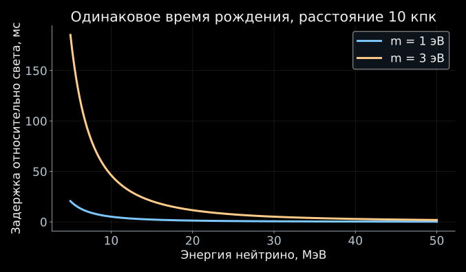{width="100%" fig-alt="При одинаковом времени рождения низкоэнергетические массивные нейтрино приходят позже высокоэнергетических"}

:::

::: {.column width="43%"}

$$
\Delta t_i\simeq5.15~\text{мс}
\left(\frac{L}{10~\text{кпк}}\right)
\left(\frac{m_ic^2}{1~\text{эВ}}\right)^2
\left(\frac{10~\text{МэВ}}{E_\nu}\right)^2.
$$

- За десятки тысяч лет полёта масса порядка эВ даёт задержку порядка
  миллисекунд.
- Энергетическая зависимость $1/E_\nu^2$ помогает искать этот эффект
  в сигнале сверхновой.

:::

::::

### Что мешает

- Детектор измеряет сумму трёх слагаемых:

$$
t_{\mathrm{приход}}
=t_{\mathrm{рожд}}+\frac{L}{c}+\Delta t_i.
$$

- Момент вспышки нам неизвестен, и сдвиг всех времён сразу поглощается им
  без следа. Работает только зависимость задержки от энергии.
- Сверхновая к тому же излучает нейтрино в течение нескольких секунд,
  а искомая задержка — миллисекунды.
- Поэтому нужен либо модельный временной профиль источника, либо достаточно
  резкая особенность сигнала.
- Одной величиной $m_\beta^2$ здесь не обойтись: в поток входят массовые
  состояния по отдельности.

### Восстановим массу



- В координатах $(1/E^2,\ t)$ задержка ложится на прямую, а её наклон
  равен $m^2$.
- Ползунок разброса времени рождения показывает, как быстро тонет сигнал.
- Справа — профиль $-2\ln L(m^2)$; его минимум и есть оценка массы,
  а ширина по уровню $+1$ даёт ошибку.

::: {.nh-text tone="muted" size="sm"}
[Открыть апплет](../applets/sn-mass-likelihood.qmd) ·
метод правдоподобия разбирается в моём курсе по статистическому анализу.
:::

:::::

## Что общего у этих измерений?

| Метод | Что измеряет прибор | Где появляется масса |
|---|---|---|
| CRES | начальную частоту электронного трека | в форме восстановленного β-спектра |
| Калориметрия $^{163}\mathrm{Ho}$ | тепло от одного атомного распада | у границы $E_c\simeq Q$ |
| $\pi\to\mu\nu$ | импульс мюона | в недостающем четырёхимпульсе |
| $\tau\to X\nu$ | массу и энергию адронной системы | в границе доступной области |
| Время пролёта | времена и энергии нейтрино | в задержке $\propto m_i^2/E_\nu^2$ |

- Масса входит через закон дисперсии $E_\nu^2=p_\nu^2+m_i^2$.
- Её эффект сравнивают с точной моделью отклика и доступной статистикой.
- «Прямое измерение» не означает отсутствие модели прибора или физики источника.

## Зачем добиваться десятков миллиэлектронвольт?

::::: {.panel-tabset .story-tabs}

### Два порядка масс

:::: {.columns}

::: {.column width="54%"}

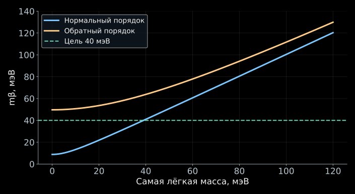{width="100%" fig-alt="Минимальное значение эффективной электронной массы составляет около 9 мэВ для нормального и около 50 мэВ для обратного порядка"}

:::

::: {.column width="43%"}

- В тритиевом β-распаде и электронном захвате измеряется

$$
m_\beta^2=\sum_i|V_{ei}|^2m_i^2.
$$

- Осцилляции задают разности квадратов масс и коэффициенты смешивания,
  но оставляют неизвестной самую лёгкую массу.
- Даже если самая лёгкая масса мала, $m_\beta$ не обращается в нуль.
- Линия $40$ мэВ на графике обозначает цель будущего эксперимента.
  Полученных ограничений на этом уровне пока нет.

:::

::::

### Откуда 9 и 50 мэВ?

- Для нормального порядка и $m_1\simeq0$:

$$
m_\beta^2
\simeq |V_{e2}|^2\Delta m_{21}^2
+|V_{e3}|^2\Delta m_{31}^2.
$$

- Подставим округлённые значения
  $|V_{e2}|^2\simeq0.30$, $|V_{e3}|^2\simeq0.022$,
  $\Delta m_{21}^2\simeq7.5\cdot10^{-5}$ эВ$^2$,
  $|\Delta m_{31}^2|\simeq2.5\cdot10^{-3}$ эВ$^2$:

$$
m_\beta\simeq
\sqrt{0.30\cdot7.5\cdot10^{-5}+0.022\cdot2.5\cdot10^{-3}}
\simeq9~\text{мэВ}.
$$

- Для обратного порядка и $m_3\simeq0$ почти весь электронный вес находится
  в двух состояниях с массами около $50$ мэВ; поэтому
  $m_\beta\simeq50$ мэВ.

::: {.nh-text tone="muted" size="sm"}
[Округлённые масштабы осцилляционных параметров: NuFIT 6.0](https://arxiv.org/abs/2410.05380).
:::

### Другие наблюдаемые массы

| Измерение | Комбинация масс | Дополнительная физика |
|---|---|---|
| Электронная кинематика | $m_\beta^2=\sum_i|V_{ei}|^2m_i^2$ | спектр распада и отклик |
| $0\nu2\beta$ через лёгкие нейтрино | $m_{\beta\beta}=|\sum_iV_{ei}^2m_i|$ | майорановские фазы, ядерная амплитуда |
| Космология | $\Sigma=m_1+m_2+m_3$ | эволюция Вселенной и набор наблюдений |

- В β-спектре разные ненаблюдаемые массовые состояния складываются
  по вероятностям.
- В майорановской амплитуде возможна интерференция.
  В космологии измеряется влияние нейтрино на эволюцию вещества.
- Поэтому эти величины нельзя сравнивать как три измерения одного числа.

:::::

## От абсолютной массы к осцилляциям

::: {style="width:80%;"}

- Все четыре способа упираются в одно: масса входит через закон дисперсии
  $E^2=p^2+m^2$, и её след тем незаметнее, чем выше энергия. Поэтому выигрывает
  распад с самым малым энерговыделением.
- В следующих лекциях наблюдаемой станет разность квадратов масс. Она входит
  в фазу, которую массовые состояния набирают при распространении,
  и измеряется в миллионы раз точнее.

:::

::: {.nh-box tone="success" size="md"}
Взвесить нейтрино трудно. Сравнить два нейтрино друг с другом — куда легче.
:::

## Литература и материалы

::::: {.panel-tabset .story-tabs}

### CRES

- [Project 8: первый тритиевый спектр и ограничение массы](https://arxiv.org/abs/2212.05048),
  *Phys. Rev. Lett.* **131**, 102502 (2023).
- [Электронное излучение и боковые полосы](https://arxiv.org/abs/1901.02844),
  *Phys. Rev. C* **100**, 015501 (2019).
- [Аппаратура для криптона и трития](https://arxiv.org/abs/2503.08807).
- [Сигнал CRES в резонаторах](https://arxiv.org/abs/2601.07848), 2026.
- [Project 8: новости и публикации](https://www.project8.org/).

### Калориметрия

- [ECHo-1k: спектр гольмия и предел $15$ эВ](https://arxiv.org/abs/2509.03423), 2025.
- [HOLMES: спектр гольмия и предел $27$ эВ](https://arxiv.org/abs/2503.19920), 2025.
- [Магнитные микрокалориметры](https://doi.org/10.1016/S0921-4526(02)02307-4).
- [Влияние внедрённого гольмия на термометр HOLMES](https://arxiv.org/abs/2506.13665).
- [Многоканальное считывание HOLMES](https://arxiv.org/abs/1910.05217).

### Кинематика

- [Assamagan et al.: импульс мюона и масса нейтрино](https://doi.org/10.1103/PhysRevD.53.6065), 1996.
- [ALEPH: границы в трёх- и пятитрековых τ-распадах](https://cds.cern.ch/record/337738), 1998.
- [NuFIT 6.0: осцилляционные параметры](https://arxiv.org/abs/2410.05380).
- [Задачи к лекции 08](../exercises/08_alternative_neutrino_mass_exercises.qmd).

### Анимация и апплеты

- [Анимация CRES: dvnanima/project8_cres](https://github.com/NeutrinoHit/dvnanima/tree/main/project8_cres).
- [Апплет «Боковые частоты CRES»](../applets/cres-sidebands.qmd).
- [Апплет «Частотный трек электрона»](../applets/cres-frequency-track.qmd).
- [Обе модели на одной странице](../applets/cres-observables.qmd).
- [Апплет «Масса по временам прилёта»](../applets/sn-mass-likelihood.qmd).

:::::
