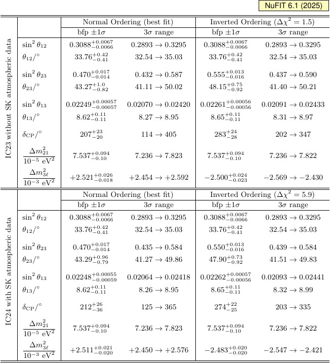
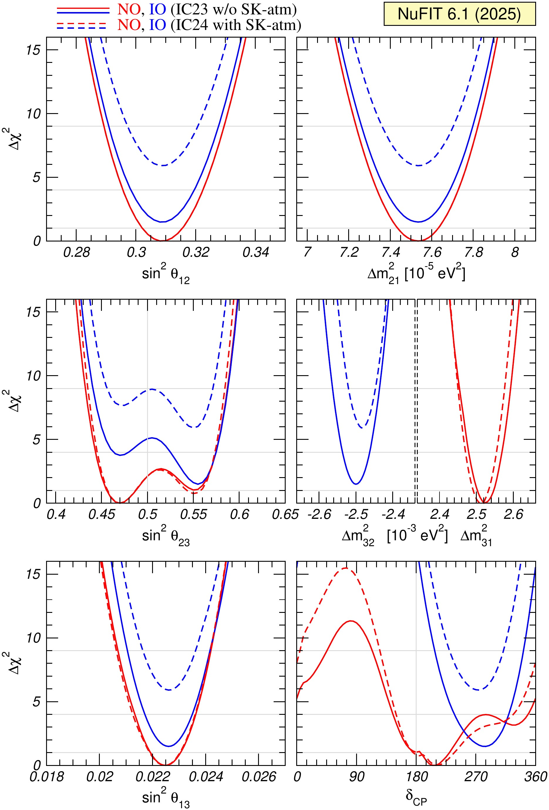
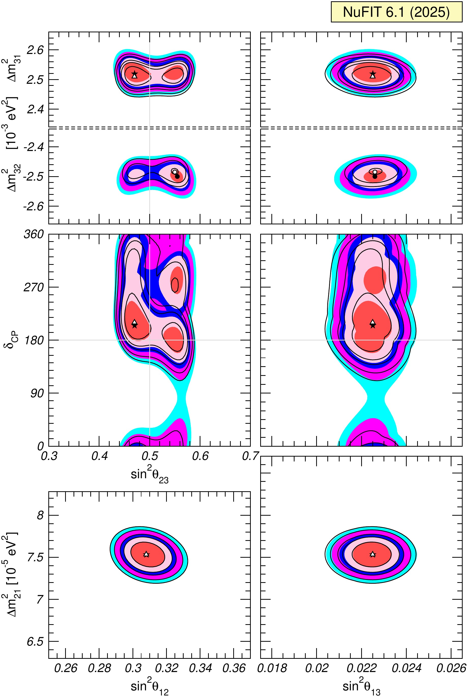
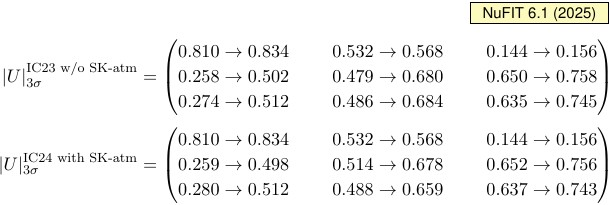
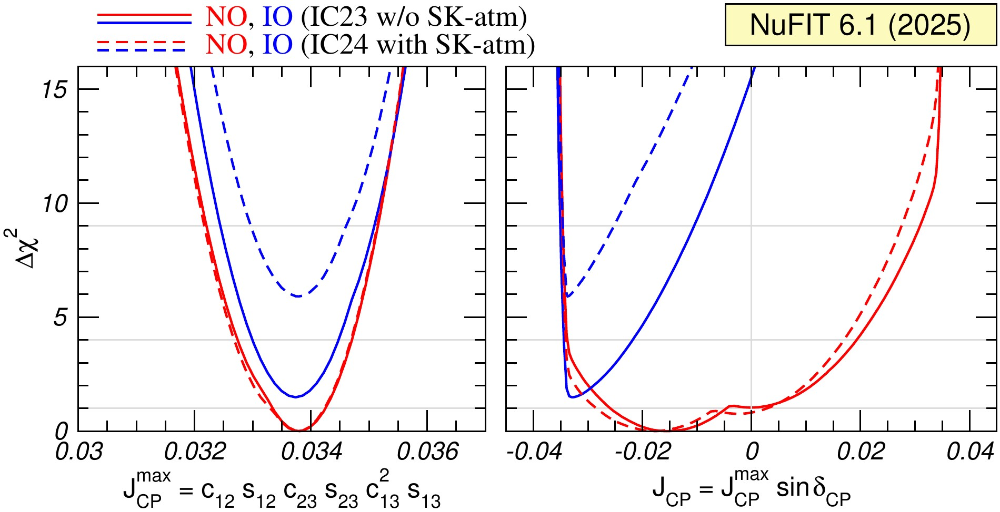
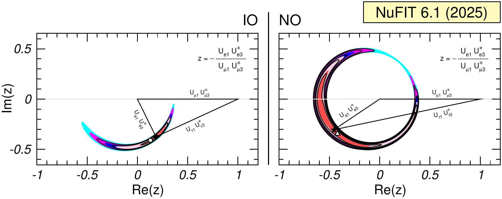

# Три флэйвора

## Почему теперь нужны три флэйвора

:::: {.panel-tabset .story-tabs}

### Слабый базис

Заряженное слабое взаимодействие различает три состояния по заряженному
лептону, который рождается вместе с нейтрино:

$$
\boxed{
\alpha=e,\mu,\tau
},
\qquad
\boldsymbol\nu_f=
\begin{pmatrix}
|\nu_e\rangle\\
|\nu_\mu\rangle\\
|\nu_\tau\rangle
\end{pmatrix}.
$$

Это **флэйворный базис** рождения и регистрации.

### Массовый базис

Свободно распространяются три собственных состояния гамильтониана:

$$
\widehat H_0|\nu_i\rangle=E_i|\nu_i\rangle,
\qquad
i=1,2,3,
$$

$$
\boldsymbol\nu_m=
\begin{pmatrix}
|\nu_1\rangle\\
|\nu_2\rangle\\
|\nu_3\rangle
\end{pmatrix}.
$$

При распространении каждая компонента приобретает свою фазу
$e^{-iE_it}$.

### Две фазы

Вынесем общую фазу первой компоненты:

$$
\begin{pmatrix}
e^{-iE_1t}\\ e^{-iE_2t}\\ e^{-iE_3t}
\end{pmatrix}
=e^{-iE_1t}
\begin{pmatrix}
1\\ e^{-i(E_2-E_1)t}\\ e^{-i(E_3-E_1)t}
\end{pmatrix}.
$$

Общая фаза ненаблюдаема. Поэтому независимы только **две** разности фаз;
третья связана с ними:

$$
\Delta E_{31}=\Delta E_{32}+\Delta E_{21}.
$$

### Что добавилось

```{=html}
<div class="three-flavor-comparison">
  <div>
    <strong>Два флэйвора</strong>
    один угол смешивания;<br>
    одна разность фаз;<br>
    матрицу можно выбрать вещественной.
  </div>
  <div>
    <strong>Три флэйвора</strong>
    три угла смешивания;<br>
    две разности фаз;<br>
    одна неустранимая комплексная фаза.
  </div>
</div>
```

Именно комплексная фаза делает возможным CP-нарушение в вакуумных
осцилляциях.

::::

## Флэйворный и массовый базисы {.three-flavor-tight}

:::: {.panel-tabset .story-tabs}

### Обозначения

Пусть

$$
\alpha,\beta\in\{e,\mu,\tau\},
\qquad
i,j\in\{1,2,3\}.
$$

Матрица смешивания

$$
U=
\begin{pmatrix}
U_{e1}&U_{e2}&U_{e3}\\
U_{\mu1}&U_{\mu2}&U_{\mu3}\\
U_{\tau1}&U_{\tau2}&U_{\tau3}
\end{pmatrix}
$$

переводит один ортонормированный базис в другой.

### Флэйвор через массы

::: {.marginnote .note-right .absolute top=158 left=990 width=250 style="--note-font-size: 0.54em;"}
**Почему комплексное сопряжение?**

Для рождения
$W^+\to\ell_\alpha^++\nu_i$
амплитуда пропорциональна $U_{\alpha i}^*$.

Для антинейтрино все элементы сопрягаются ещё раз.
:::

::: {.derivation-main-with-note}

Флэйворное состояние является когерентной суперпозицией трёх масс:

$$
\boxed{
|\nu_\alpha\rangle
=\sum_{i=1}^3U_{\alpha i}^*|\nu_i\rangle
}.
$$

В матричном виде

$$
\boxed{
\boldsymbol\nu_f=U^*\boldsymbol\nu_m
}.
$$

:::

### Массы через флэйворы

Обратное преобразование имеет вид

$$
\boxed{
|\nu_i\rangle
=\sum_{\alpha=e,\mu,\tau}U_{\alpha i}|\nu_\alpha\rangle
}.
$$

Действительно,

$$
\begin{aligned}
\sum_\alpha U_{\alpha j}|\nu_\alpha\rangle
&=\sum_{\alpha,i}
U_{\alpha j}U_{\alpha i}^*|\nu_i\rangle\\
&=\sum_i\delta_{ji}|\nu_i\rangle
=|\nu_j\rangle.
\end{aligned}
$$

### Унитарность

Равенство базисов по размерности и сохранение нормы требуют

$$
\boxed{U^\dagger U=UU^\dagger=I}.
$$

Поэтому строки и столбцы ортонормированы:

$$
\sum_iU_{\alpha i}U_{\beta i}^*=\delta_{\alpha\beta},
\qquad
\sum_\alpha U_{\alpha i}^*U_{\alpha j}=\delta_{ij}.
$$

В частности,

$$
\langle\nu_\beta|\nu_\alpha\rangle
=\delta_{\alpha\beta}.
$$

::::

## Три поворота и одна фаза {.three-flavor-tight}

:::: {.panel-tabset .story-tabs}

### Факторизация

Стандартное соглашение:

$$
\boxed{
U=R_{23}\,U_{13}(\delta)\,R_{12}
}.
$$

::: {.marginnote .note-right .absolute top=165 left=990 width=245 style="--note-font-size: 0.57em;"}
**Короткие обозначения**

$$
\begin{aligned}
c_{ij}&=\cos\theta_{ij},\\
s_{ij}&=\sin\theta_{ij}.
\end{aligned}
$$
:::

::: {.derivation-main-with-note}

- $R_{12}$ смешивает направления $1$ и $2$;
- $U_{13}$ смешивает $1$ и $3$ и содержит фазу $\delta$;
- $R_{23}$ смешивает направления $2$ и $3$.

Каждый множитель унитарен, поэтому их произведение автоматически унитарно.

:::

### Поворот $12$

$$
\boxed{
R_{12}=
\begin{pmatrix}
c_{12}&s_{12}&0\\
-s_{12}&c_{12}&0\\
0&0&1
\end{pmatrix}
}.
$$

Третье направление не меняется. При $\theta_{13}=\theta_{23}=0$ это обычная
двухфлэйворная матрица смешивания состояний $1$ и $2$.

### Поворот $13$

$$
\boxed{
U_{13}(\delta)=
\begin{pmatrix}
c_{13}&0&s_{13}e^{-i\delta}\\
0&1&0\\
-s_{13}e^{i\delta}&0&c_{13}
\end{pmatrix}
}.
$$

Сопряжённые фазы в симметричных позициях обеспечивают
$U_{13}^\dagger U_{13}=I$.

### Поворот $23$

$$
\boxed{
R_{23}=
\begin{pmatrix}
1&0&0\\
0&c_{23}&s_{23}\\
0&-s_{23}&c_{23}
\end{pmatrix}
}.
$$

Первое направление не меняется. Этот поворот распределяет третью массовую
компоненту между $\nu_\mu$ и $\nu_\tau$.

::::

## Перемножаем повороты {.three-flavor-tight}

:::: {.panel-tabset .story-tabs}

### Первый шаг

Сначала умножим два правых множителя:

$$
V\equiv U_{13}R_{12}.
$$

Построчно получаем

$$
\boxed{
V=
\begin{pmatrix}
c_{13}c_{12}&c_{13}s_{12}&s_{13}e^{-i\delta}\\
-s_{12}&c_{12}&0\\
-s_{13}c_{12}e^{i\delta}&-s_{13}s_{12}e^{i\delta}&c_{13}
\end{pmatrix}
}.
$$

### Вторая строка

Теперь $U=R_{23}V$. Вторая строка равна
$c_{23}$, умноженному на вторую строку $V$, плюс
$s_{23}$, умноженному на третью:

$$
\begin{aligned}
U_{\mu1}
&=c_{23}(-s_{12})
+s_{23}(-s_{13}c_{12}e^{i\delta}),\\
U_{\mu2}
&=c_{23}c_{12}
+s_{23}(-s_{13}s_{12}e^{i\delta}),\\
U_{\mu3}
&=s_{23}c_{13}.
\end{aligned}
$$

### Третья строка

Третья строка равна минус $s_{23}$, умноженному на вторую строку $V$,
плюс $c_{23}$, умноженному на третью:

$$
\begin{aligned}
U_{\tau1}
&=s_{23}s_{12}
-c_{23}s_{13}c_{12}e^{i\delta},\\
U_{\tau2}
&=-s_{23}c_{12}
-c_{23}s_{13}s_{12}e^{i\delta},\\
U_{\tau3}
&=c_{23}c_{13}.
\end{aligned}
$$

### Результат

$$
\boxed{
U=
\begin{pmatrix}
c_{12}c_{13}&s_{12}c_{13}&s_{13}e^{-i\delta}\\
-s_{12}c_{23}-c_{12}s_{23}s_{13}e^{i\delta}
&c_{12}c_{23}-s_{12}s_{23}s_{13}e^{i\delta}
&s_{23}c_{13}\\
s_{12}s_{23}-c_{12}c_{23}s_{13}e^{i\delta}
&-c_{12}s_{23}-s_{12}c_{23}s_{13}e^{i\delta}
&c_{23}c_{13}
\end{pmatrix}
}.
$$

### Проверки

- Если $\theta_{12}=\theta_{13}=\theta_{23}=0$, то $U=I$.
- Если $\delta=0$ или $\pi$, матрица становится вещественной.
- Если $s_{13}=0$, фаза $\delta$ полностью исчезает.
- Поскольку каждый множитель унитарен,

$$
U^\dagger U
=R_{12}^\dagger U_{13}^\dagger
R_{23}^\dagger R_{23}U_{13}R_{12}
=I.
$$

::::

## Что означают четыре параметра {.three-flavor-tight}

:::: {.panel-tabset .story-tabs}

### Угол $\theta_{12}$

Из первой строки матрицы

$$
U_{e1}=c_{12}c_{13},
\qquad
U_{e2}=s_{12}c_{13}.
$$

Поэтому

$$
\boxed{
\frac{|U_{e2}|}{|U_{e1}|}=\tan\theta_{12}
}.
$$

$\theta_{12}$ задаёт относительные доли состояний $\nu_1$ и $\nu_2$ в
электронном флэйворе.

### Угол $\theta_{13}$

Элемент в правом верхнем углу особенно прост:

$$
\boxed{|U_{e3}|=s_{13}}.
$$

Следовательно, $\theta_{13}$ непосредственно задаёт примесь третьего массового
состояния в $\nu_e$.

Если $s_{13}=0$, третье состояние отделяется от электронной строки, а
CP-фаза становится ненаблюдаемой.

### Угол $\theta_{23}$

В третьем столбце

$$
U_{\mu3}=s_{23}c_{13},
\qquad
U_{\tau3}=c_{23}c_{13}.
$$

Поэтому

$$
\boxed{
\frac{|U_{\mu3}|}{|U_{\tau3}|}=\tan\theta_{23}
}.
$$

$\theta_{23}$ определяет распределение состояния $\nu_3$ между мюонным и
тау-флэйворами.

### Фаза $\delta$

Фаза входит не как отдельная вероятность, а в интерференционные произведения
элементов $U$.

$$
e^{i\delta}=\cos\delta+i\sin\delta.
$$

- члены с $\cos\delta$ CP-чётны;
- члены с $\sin\delta$ меняют знак при $U\to U^*$.

Подробно это проявится после вывода общей вероятности перехода.

::::

## Сколько физических параметров? {.three-flavor-tight}

:::: {.panel-tabset .story-tabs}

### Матрица $U(3)$

Произвольная унитарная матрица $3\times3$ содержит девять вещественных
параметров:

$$
\boxed{
9=3\ \text{угла}+6\ \text{фаз}
}.
$$

Однако фазы самих полей можно переопределять, не меняя наблюдаемые величины.
Поэтому не все шесть фаз физически различимы.

### Дираковский случай

Можно переопределить фазы трёх заряженных лептонов и трёх нейтрино.
Одна общая замена ничего не меняет, поэтому удаляются

$$
3+3-1=5
$$

фаз. Остаётся

$$
\boxed{3\ \text{угла}+1\ \text{дираковская фаза }\delta}.
$$

### Майорановский случай

Майорановские массовые поля нельзя независимо перефазировать. Тогда полная
матрица записывается как

$$
\boxed{
\widetilde U
=U\,
\operatorname{diag}
\left(1,e^{i\alpha_{21}/2},e^{i\alpha_{31}/2}\right)
}.
$$

Появляются две дополнительные фазы $\alpha_{21}$ и $\alpha_{31}$.

### Почему их не видно

Пусть $\widetilde U_{\alpha i}=U_{\alpha i}e^{i\eta_i}$. В осцилляционной
амплитуде элементы одного столбца входят как

$$
\widetilde U_{\beta i}\widetilde U_{\alpha i}^*
=\left(U_{\beta i}e^{i\eta_i}\right)
 \left(U_{\alpha i}^*e^{-i\eta_i}\right)
=U_{\beta i}U_{\alpha i}^*.
$$

Следовательно,

$$
\boxed{\text{майорановские фазы из осцилляций сокращаются}}.
$$

### Параметры осцилляций

В вакуумных осцилляциях трёх активных нейтрино остаются

$$
\boxed{
\theta_{12},\ \theta_{13},\ \theta_{23},\ \delta;
\qquad
\Delta m_{21}^2,\ \Delta m_{31}^2
}.
$$

Абсолютная шкала масс и майорановские фазы в этот список не входят.

::: {.takeaway}
Три флэйвора означают не «ещё один синус», а новую структуру: три угла,
две частоты и физическую комплексную фазу.
:::

::::

## Амплитуда перехода {.three-flavor-tight}

:::: {.panel-tabset .story-tabs}

### Старт

Источник создаёт нейтрино определённого флэйвора $\alpha$:

$$
\boxed{
|\nu_\alpha;0\rangle
=\sum_{i=1}^{3}U_{\alpha i}^*|\nu_i\rangle
}.
$$

Массовые состояния являются собственными состояниями свободного
гамильтониана:

$$
H|\nu_i\rangle=E_i|\nu_i\rangle.
$$

Следовательно, каждая компонента будет набирать собственную фазу.

### Эволюция

Через время $t$ состояние становится

$$
|\nu_\alpha;t\rangle
=\sum_i U_{\alpha i}^*e^{-iE_it}|\nu_i\rangle.
$$

При распространении плоской волны на расстояние $L$:

$$
|\nu_\alpha;L,t\rangle
=\sum_i U_{\alpha i}^*
e^{-i(E_it-p_iL)}|\nu_i\rangle.
$$

::: {.marginnote .absolute top=485 left=1010 width=225 style="--note-font-size: 0.54em;"}
Знак фазы следует из
$e^{-ip\cdot x}=e^{-i(Et-\mathbf p\cdot\mathbf x)}$.
:::

### Проекция

Детектор ищет флэйвор $\beta$. Комплексное сопряжение даёт

$$
|\nu_\beta\rangle
=\sum_jU_{\beta j}^*|\nu_j\rangle
\quad\Longrightarrow\quad
\langle\nu_\beta|
=\sum_jU_{\beta j}\langle\nu_j|.
$$

Поэтому

$$
\mathcal A_{\alpha\to\beta}(L,t)
=\langle\nu_\beta|\nu_\alpha;L,t\rangle.
$$

Остаётся подставить оба разложения в эту проекцию.

### Ортогональность

После подстановки

$$
\mathcal A_{\alpha\to\beta}
=\sum_{i,j}U_{\beta j}U_{\alpha i}^*
e^{-i(E_it-p_iL)}\langle\nu_j|\nu_i\rangle.
$$

Но массовые состояния ортонормированы:

$$
\langle\nu_j|\nu_i\rangle=\delta_{ji}.
$$

Двойная сумма превращается в одинарную:

$$
\boxed{
\mathcal A_{\alpha\to\beta}(L,t)
=\sum_i U_{\beta i}U_{\alpha i}^*
e^{-i(E_it-p_iL)}
}.
$$

### УР-фаза

Для ультрарелятивистского нейтрино при $t\simeq L$ предыдущий вывод даёт

$$
E_it-p_iL
=\text{общая фаза}+\frac{m_i^2L}{2E}.
$$

Общая фаза исчезает из квадрата модуля. Поэтому можно записать

$$
\boxed{
\mathcal A_{\alpha\to\beta}(L,E)
=\sum_iU_{\beta i}U_{\alpha i}^*
\exp\!\left(-i\frac{m_i^2L}{2E}\right)
}.
$$

::: {.marginnote .absolute top=475 left=1010 width=225 style="--note-font-size: 0.54em;"}
Идеализации с равными импульсами и равными энергиями дают эту фазу
в одном ведущем порядке.
:::

### $\Delta m^2$

Вынесем фазу первой компоненты:

$$
\mathcal A_{\alpha\to\beta}
=e^{-im_1^2L/(2E)}
\sum_iU_{\beta i}U_{\alpha i}^*
e^{-i\Delta m_{i1}^2L/(2E)}.
$$

Первый множитель имеет единичный модуль. Введём

$$
\boxed{
\Delta_{ij}\equiv\frac{\Delta m_{ij}^2L}{4E}},
\qquad
\Delta m_{ij}^2\equiv m_i^2-m_j^2.
$$

Тогда наблюдаемая относительная фаза равна $2\Delta_{ij}$.

При $L=0$ унитарность сразу даёт

$$
\mathcal A_{\alpha\to\beta}(0)
=\sum_iU_{\beta i}U_{\alpha i}^*
=\delta_{\alpha\beta}.
$$

::::

## Возводим амплитуду в квадрат {.three-flavor-tight}

:::: {.panel-tabset .story-tabs}

### Правило Борна

Обозначим

$$
\phi_i\equiv\frac{m_i^2L}{2E}.
$$

Вероятность перехода равна

$$
P_{\alpha\to\beta}
=|\mathcal A_{\alpha\to\beta}|^2
=\mathcal A_{\alpha\to\beta}
 \mathcal A_{\alpha\to\beta}^*.
$$

Комплексно-сопряжённая амплитуда:

$$
\mathcal A_{\alpha\to\beta}^*
=\sum_jU_{\beta j}^*U_{\alpha j}e^{+i\phi_j}.
$$

### Двойная сумма

Перемножая две суммы, получаем

$$
\begin{aligned}
P_{\alpha\to\beta}
&=\sum_{i,j}
U_{\beta i}U_{\alpha i}^*
U_{\beta j}^*U_{\alpha j}
e^{-i(\phi_i-\phi_j)}.
\end{aligned}
$$

Введём компактное обозначение

$$
\boxed{
X_{\alpha\beta}^{ij}
\equiv
U_{\alpha i}^*U_{\beta i}
U_{\alpha j}U_{\beta j}^*
}.
$$

Поскольку $\phi_i-\phi_j=2\Delta_{ij}$,

$$
P_{\alpha\to\beta}
=\sum_{i,j}X_{\alpha\beta}^{ij}e^{-2i\Delta_{ij}}.
$$

### Диагональ

При $i=j$ фаза равна нулю, а

$$
X_{\alpha\beta}^{ii}
=|U_{\alpha i}|^2|U_{\beta i}|^2.
$$

Поэтому диагональная часть равна

$$
P_{\rm diag}
=\sum_i|U_{\alpha i}|^2|U_{\beta i}|^2.
$$

Она сама по себе не зависит от $L$, но не является всей вероятностью:
нужно добавить интерференцию разных массовых компонент.

### Пара $i,j$

Для $i\ne j$ два переставленных слагаемых комплексно сопряжены:

$$
X_{\alpha\beta}^{ji}
=\left(X_{\alpha\beta}^{ij}\right)^*,
\qquad
\Delta_{ji}=-\Delta_{ij}.
$$

Их сумма при $i>j$ равна

$$
\begin{aligned}
&X_{\alpha\beta}^{ij}e^{-2i\Delta_{ij}}
+X_{\alpha\beta}^{ji}e^{-2i\Delta_{ji}}
\\[1mm]
&\hspace{22mm}
=2\operatorname{Re}
\!\left[X_{\alpha\beta}^{ij}e^{-2i\Delta_{ij}}\right].
\end{aligned}
$$

### Разделяем части

Пусть $X=a+ib$. Тогда

$$
\operatorname{Re}\!\left[Xe^{-2i\Delta}\right]
=a\cos2\Delta+b\sin2\Delta.
$$

Следовательно,

$$
\begin{aligned}
P_{\alpha\to\beta}
={}&\sum_i|U_{\alpha i}|^2|U_{\beta i}|^2\\
&+2\sum_{i>j}\operatorname{Re}X_{\alpha\beta}^{ij}
\cos2\Delta_{ij}\\
&+2\sum_{i>j}\operatorname{Im}X_{\alpha\beta}^{ij}
\sin2\Delta_{ij}.
\end{aligned}
$$

::::

## Общая вероятность в вакууме {.three-flavor-tight}

:::: {.panel-tabset .story-tabs}

### Тождество

При $L=0$ амплитуда равна $\delta_{\alpha\beta}$. Поэтому

$$
\begin{aligned}
\delta_{\alpha\beta}
&=\left|\sum_iU_{\beta i}U_{\alpha i}^*\right|^2\\
&=\sum_i|U_{\alpha i}|^2|U_{\beta i}|^2
+2\sum_{i>j}\operatorname{Re}X_{\alpha\beta}^{ij}.
\end{aligned}
$$

Здесь использовано $\delta_{\alpha\beta}^2=\delta_{\alpha\beta}$.

### Косинус

Используем

$$
\cos2\Delta=1-2\sin^2\Delta.
$$

Тогда CP-чётная часть предыдущего результата принимает вид

$$
\begin{aligned}
&\sum_i|U_{\alpha i}|^2|U_{\beta i}|^2
+2\sum_{i>j}\operatorname{Re}X^{ij}_{\alpha\beta}\cos2\Delta_{ij}
\\
&\qquad
=\delta_{\alpha\beta}
-4\sum_{i>j}\operatorname{Re}X^{ij}_{\alpha\beta}
\sin^2\Delta_{ij}.
\end{aligned}
$$

### Результат

Собирая действительную и мнимую части, получаем

$$
\boxed{
\begin{aligned}
P_{\alpha\to\beta}(L,E)
={}&\delta_{\alpha\beta}
-4\sum_{i>j}\operatorname{Re}X_{\alpha\beta}^{ij}
\sin^2\Delta_{ij}
\\
&+2\sum_{i>j}\operatorname{Im}X_{\alpha\beta}^{ij}
\sin2\Delta_{ij},
\end{aligned}}
$$

где

$$
X_{\alpha\beta}^{ij}
=U_{\alpha i}^*U_{\beta i}U_{\alpha j}U_{\beta j}^*,
\qquad
\Delta_{ij}=\frac{\Delta m_{ij}^2L}{4E}.
$$

### Выживание

Если $\beta=\alpha$, то

$$
X_{\alpha\alpha}^{ij}
=|U_{\alpha i}|^2|U_{\alpha j}|^2
$$

вещественно. Мнимая часть исчезает:

$$
\boxed{
P_{\alpha\to\alpha}
=1-4\sum_{i>j}|U_{\alpha i}|^2|U_{\alpha j}|^2
\sin^2\Delta_{ij}
}.
$$

Таким образом, CP-нечётный член возможен только в каналах появления.

### Нормировка

Просуммируем по всем регистрируемым флэйворам $\beta$:

$$
\begin{aligned}
\sum_\beta X_{\alpha\beta}^{ij}
&=U_{\alpha i}^*U_{\alpha j}
\sum_\beta U_{\beta i}U_{\beta j}^*\\
&=U_{\alpha i}^*U_{\alpha j}\,\delta_{ij}.
\end{aligned}
$$

Для $i>j$ это ноль. Поэтому

$$
\boxed{\sum_\beta P_{\alpha\to\beta}=1}.
$$

Вероятность не теряется, а перераспределяется между тремя флэйворами.

### Два флэйвора

Если один массовый компонент не участвует, остаётся единственная пара
$i,j$. Матрицу смешивания можно выбрать вещественной, поэтому
$\operatorname{Im}X^{ij}=0$.

Общая формула сводится к уже полученному результату

$$
P_{\alpha\to\beta}
=\sin^22\theta\,\sin^2\Delta,
\qquad \alpha\ne\beta.
$$

::: {.takeaway}
Новая физика трёх флэйворов находится в одновременной интерференции трёх пар
массовых состояний и в мнимой части произведений элементов $U$.
:::

::::

## Две части вероятности {.three-flavor-tight}

:::: {.panel-tabset .story-tabs}

### Разложение

Полезно записать

$$
P_{\alpha\to\beta}
=P_{\alpha\beta}^{\rm even}
+P_{\alpha\beta}^{\rm odd},
$$

где

$$
\begin{aligned}
P_{\alpha\beta}^{\rm even}
&=\delta_{\alpha\beta}
-4\sum_{i>j}\operatorname{Re}X_{\alpha\beta}^{ij}
\sin^2\Delta_{ij},\\[1mm]
P_{\alpha\beta}^{\rm odd}
&=2\sum_{i>j}\operatorname{Im}X_{\alpha\beta}^{ij}
\sin2\Delta_{ij}.
\end{aligned}
$$

### Чётная часть

При комплексном сопряжении матрицы смешивания

$$
U\longrightarrow U^*
$$

действительная часть $X_{\alpha\beta}^{ij}$ не меняется. Поэтому

$$
P_{\alpha\beta}^{\rm even}
\longrightarrow P_{\alpha\beta}^{\rm even}.
$$

Эта часть содержит обычную зависимость $\sin^2\Delta_{ij}$ и присутствует
уже при двух флэйворах.

### Нечётная часть

При $U\to U^*$

$$
\operatorname{Im}X_{\alpha\beta}^{ij}
\longrightarrow
-\operatorname{Im}X_{\alpha\beta}^{ij}.
$$

Значит,

$$
P_{\alpha\beta}^{\rm odd}
\longrightarrow -P_{\alpha\beta}^{\rm odd}.
$$

Именно эта часть позволит вероятностям нейтрино и антинейтрино различаться
в вакууме.

### Что требуется

Для ненулевого нечётного вклада одновременно нужны

1. комплексная фаза в матрице $U$;
2. ненулевые углы смешивания;
3. невырожденные массовые состояния;
4. канал появления $\alpha\ne\beta$.

::: {.takeaway}
CP-нарушение — не дополнительная частота: это различие знака одной
интерференционной части общей трёхфлэйворной вероятности.
:::

::::

## Почему разностей масс только две {.three-flavor-tight}

:::: {.panel-tabset .story-tabs}

### Общая фаза

Амплитуду можно умножить на любую общую фазу без изменения вероятности:

$$
\left|e^{-i\chi}\mathcal A_{\alpha\to\beta}\right|^2
=|\mathcal A_{\alpha\to\beta}|^2.
$$

Поэтому абсолютные фазы $m_i^2L/(2E)$ ненаблюдаемы. Измеримы только их
разности.

### Три пары

Три массовых состояния образуют три пары:

$$
(2,1),\qquad(3,1),\qquad(3,2).
$$

Им соответствуют

$$
\Delta m_{21}^2,\qquad
\Delta m_{31}^2,\qquad
\Delta m_{32}^2.
$$

Но эти величины не независимы.

### Связь

Непосредственно из определений

$$
\begin{aligned}
\Delta m_{31}^2
&=m_3^2-m_1^2\\
&=(m_3^2-m_2^2)+(m_2^2-m_1^2)\\
&=\Delta m_{32}^2+\Delta m_{21}^2.
\end{aligned}
$$

Следовательно,

$$
\boxed{\Delta_{31}=\Delta_{32}+\Delta_{21}}.
$$

### Два масштаба

Удобный независимый набор:

$$
\boxed{\Delta m_{21}^2,\qquad\Delta m_{31}^2}.
$$

Вместо второй величины можно использовать $\Delta m_{32}^2$ или специально
определённую «атмосферную» разность масс.

::: {.takeaway}
Три интерференционные пары дают три члена в вероятности, но только две
независимые осцилляционные частоты.
:::

::::

## Три вероятности на одном рисунке {#three-flavor-triangle .three-flavor-tight}

:::: {.panel-tabset .story-tabs}

### Интерактив

```{=html}
<link rel="stylesheet" href="assets/05_vacuum_oscillations/three_flavor_triangle.css">
```



```{=html}
<script src="assets/05_vacuum_oscillations/three_flavor_triangle.js"></script>
```

### Координаты

Каждому моменту эволюции соответствует тройка

$$
\mathbf P_\alpha(L,E)
=
\left(P_{\alpha e},P_{\alpha\mu},P_{\alpha\tau}\right),
\qquad
P_{\alpha e}+P_{\alpha\mu}+P_{\alpha\tau}=1.
$$

Это барицентрические координаты точки внутри треугольника:

- вершина $e$ означает $(1,0,0)$;
- вершина $\mu$ означает $(0,1,0)$;
- вершина $\tau$ означает $(0,0,1)$.

Чем ближе точка к вершине, тем больше вероятность соответствующего
флэйвора. В начале она находится в выбранной начальной вершине.

### Числа

В интерактиве использованы лучшие значения NuFIT 6.1 для нормального
порядка с атмосферными данными IC24 и Super-Kamiokande:

$$
\begin{aligned}
\sin^2\theta_{12}&=0.3088,&
\sin^2\theta_{23}&=0.470,&
\sin^2\theta_{13}&=0.02248,\\
\Delta m^2_{21}&=7.537\times10^{-5}\ {\rm эВ}^2,&
\Delta m^2_{31}&=2.511\times10^{-3}\ {\rm эВ}^2,&
\delta_{\rm CP}&=212^\circ.
\end{aligned}
$$

Фазу $\delta_{\rm CP}$ можно менять, чтобы непосредственно сравнить
траектории нейтрино и антинейтрино.

::: {.small}
[NuFIT 6.1: таблица параметров](https://www.nu-fit.org/sites/default/files/v61.tbl-parameters.pdf),
данные по ноябрь 2025 года.
:::

### Нормировка

Эволюция в массовом базисе унитарна:

$$
S(L)=U\,
\operatorname{diag}
\left(e^{-i\phi_1},e^{-i\phi_2},e^{-i\phi_3}\right)
U^\dagger,
\qquad S^\dagger S=1.
$$

Поэтому для фиксированного начального флэйвора $\alpha$

$$
\sum_\beta P_{\alpha\to\beta}
=\sum_\beta|S_{\beta\alpha}|^2
=(S^\dagger S)_{\alpha\alpha}
=1.
$$

::: {.takeaway}
Треугольник показывает не три независимые величины, а одно нормированное
распределение вероятностей измерения во флэйворном базисе.
:::

::::

# CP-нарушение

## Что именно сравниваем {.three-flavor-tight}

:::: {.panel-tabset .story-tabs}

### Зарядовое сопряжение

Операция $C$ заменяет частицу соответствующей античастицей:

$$
C:\qquad \nu_\alpha\longleftrightarrow\bar\nu_\alpha.
$$

Заряды и внутренние квантовые числа меняют знак, а координаты и импульсы
не изменяются.

Для нейтрино одной операции $C$ недостаточно: слабое взаимодействие различает
левые и правые состояния.

### Пространственная инверсия

Операция $P$ меняет знак пространственных координат и импульса:

$$
P:\qquad
\mathbf x\to-\mathbf x,
\qquad
\mathbf p\to-\mathbf p.
$$

Спин как аксиальный вектор знака не меняет. Поэтому спиральность

$$
h=\frac{\mathbf S\cdot\mathbf p}{|\mathbf p|}
$$

меняет знак.

### Вместе

Комбинированное преобразование переводит процесс

$$
\nu_\alpha\longrightarrow\nu_\beta
$$

в CP-сопряжённый процесс

$$
\bar\nu_\alpha\longrightarrow\bar\nu_\beta.
$$

Если CP сохраняется, их вероятности в вакууме одинаковы.

### Асимметрия

Определим вакуумную CP-асимметрию

$$
\boxed{
A_{\alpha\beta}^{\rm CP}(L,E)
\equiv
P(\nu_\alpha\to\nu_\beta)
-P(\bar\nu_\alpha\to\bar\nu_\beta)
}.
$$

Ненулевое значение означает, что CP-сопряжённые переходы происходят
с разными вероятностями.

::: {.takeaway}
Сравниваются одинаковые начальный и конечный флэйворы, но частицы заменены
античастицами.
:::

::::

## Нейтрино и антинейтрино {.three-flavor-tight}

:::: {.panel-tabset .story-tabs}

### Нейтрино

Для нейтрино мы получили

$$
\mathcal A_{\alpha\to\beta}
=\sum_iU_{\beta i}U_{\alpha i}^*e^{-i\phi_i},
\qquad
\phi_i=\frac{m_i^2L}{2E}.
$$

Коэффициент при каждой массовой компоненте содержит

$$
\underbrace{U_{\alpha i}^*}_{\text{рождение}}
\qquad\text{и}\qquad
\underbrace{U_{\beta i}}_{\text{регистрация}}.
$$

### Антинейтрино

Для античастиц матрица смешивания комплексно сопрягается:

$$
|\bar\nu_\alpha\rangle
=\sum_iU_{\alpha i}|\bar\nu_i\rangle.
$$

Поэтому

$$
\boxed{
\overline{\mathcal A}_{\alpha\to\beta}
=\sum_iU_{\beta i}^*U_{\alpha i}e^{-i\phi_i}
}
$$

получается из нейтринной амплитуды заменой $U\to U^*$.

### В вероятности

Напомним

$$
X_{\alpha\beta}^{ij}
=U_{\alpha i}^*U_{\beta i}U_{\alpha j}U_{\beta j}^*.
$$

При $U\to U^*$:

$$
X_{\alpha\beta}^{ij}\longrightarrow
\left(X_{\alpha\beta}^{ij}\right)^*.
$$

Значит,

$$
\operatorname{Re}X^{ij}\to\operatorname{Re}X^{ij},
\qquad
\operatorname{Im}X^{ij}\to-\operatorname{Im}X^{ij}.
$$

### Две формулы

Для нейтрино

$$
P_{\alpha\beta}
=P_{\alpha\beta}^{\rm even}
+2\sum_{i>j}\operatorname{Im}X_{\alpha\beta}^{ij}
\sin2\Delta_{ij},
$$

а для антинейтрино

$$
\overline P_{\alpha\beta}
=P_{\alpha\beta}^{\rm even}
-2\sum_{i>j}\operatorname{Im}X_{\alpha\beta}^{ij}
\sin2\Delta_{ij}.
$$

### Разность

Вычитая две вероятности, получаем

$$
\boxed{
A_{\alpha\beta}^{\rm CP}
=4\sum_{i>j}
\operatorname{Im}X_{\alpha\beta}^{ij}
\sin2\Delta_{ij}
}.
$$

CP-чётная часть полностью сократилась. Осталась только мнимая часть
интерференционных произведений.

Для выживания $\alpha=\beta$ все $X_{\alpha\alpha}^{ij}$ вещественны, поэтому

$$
A_{\alpha\alpha}^{\rm CP}=0.
$$

::::

## Сесилия Ярлског {.three-flavor-tight}

:::: {.columns}

::: {.column width="38%"}
::: {.jarlskog-portrait}
{fig-alt="Сесилия Ярлског"}
:::

::: {.jarlskog-credit}
Фото: Rebeca Romero Escrivà / Lund University.
[Источник](https://www.fysik.lu.se/en/article/prestigious-award-cecilia-jarlskog)
:::
:::

::: {.column width="62%"}

- Шведская физик-теоретик, профессор-эмерита Лундского университета.
- В 1985 году предложила не зависящую от выбора фаз меру CP-нарушения
  в теории смешивания.
- Её инвариант применяется и к кварковой матрице CKM, и к лептонной
  матрице PMNS.
- В 2023 году получила премию EPS по физике высоких энергий и частиц
  за работы по CP-нарушению.

$$
\boxed{
J_{\rm CP}
=c_{12}s_{12}c_{23}s_{23}c_{13}^{2}s_{13}\sin\delta
}.
$$

::: {.small}
Исходная работа: C. Jarlskog,
*Phys. Rev. Lett.* **55**, 1039 (1985),
[DOI: 10.1103/PhysRevLett.55.1039](https://doi.org/10.1103/PhysRevLett.55.1039).
:::

:::

::::

## Инвариант Ярлског {.three-flavor-tight}

:::: {.panel-tabset .story-tabs}

### Квартет

Зафиксируем знак определением

$$
\boxed{
J_{\rm CP}
\equiv
\operatorname{Im}
\!\left(
U_{e2}^*U_{\mu2}U_{e1}U_{\mu1}^*
\right)
}.
$$

Это мнимая часть «квартета»: произведения четырёх элементов из двух строк
и двух столбцов матрицы $U$.

### Перефазировка

При допустимом изменении фаз состояний

$$
U_{\alpha i}
\longrightarrow
e^{i\chi_\alpha}U_{\alpha i}e^{-i\eta_i}
$$

в квартете возникают множители

$$
e^{-i\chi_e+i\eta_2}
e^{+i\chi_\mu-i\eta_2}
e^{+i\chi_e-i\eta_1}
e^{-i\chi_\mu+i\eta_1}=1.
$$

Поэтому $J_{\rm CP}$ не зависит от условного выбора фаз строк и столбцов.

### Подстановка

Из стандартной параметризации

$$
\begin{aligned}
U_{e1}&=c_{12}c_{13},&
U_{e2}&=s_{12}c_{13},\\
U_{\mu1}&=-s_{12}c_{23}-c_{12}s_{23}s_{13}e^{i\delta},&
U_{\mu2}&=c_{12}c_{23}-s_{12}s_{23}s_{13}e^{i\delta}.
\end{aligned}
$$

Следовательно,

$$
J_{\rm CP}
=c_{12}s_{12}c_{13}^2
\operatorname{Im}\!\left(U_{\mu2}U_{\mu1}^*\right).
$$

### Мнимая часть

Перемножим только два сложных элемента:

$$
\begin{aligned}
U_{\mu2}U_{\mu1}^*
={}&(c_{12}c_{23}-s_{12}s_{23}s_{13}e^{i\delta})\\
&\times(-s_{12}c_{23}-c_{12}s_{23}s_{13}e^{-i\delta}).
\end{aligned}
$$

В мнимую часть входят лишь перекрёстные члены:

$$
\operatorname{Im}(U_{\mu2}U_{\mu1}^*)
=(c_{12}^2+s_{12}^2)c_{23}s_{23}s_{13}\sin\delta.
$$

### Результат

Поскольку $c_{12}^2+s_{12}^2=1$,

$$
\boxed{
J_{\rm CP}
=c_{12}s_{12}c_{23}s_{23}c_{13}^{2}s_{13}\sin\delta
}.
$$

Эквивалентно,

$$
\boxed{
J_{\rm CP}
=\frac18
\sin2\theta_{12}\sin2\theta_{23}\sin2\theta_{13}
\cos\theta_{13}\sin\delta
}.
$$

### Когда $J=0$

Инвариант обращается в ноль, если

$$
\sin\delta=0
$$

или исчезает смешивание хотя бы с одним необходимым направлением:

$$
s_{12}s_{23}s_{13}c_{12}c_{23}c_{13}=0.
$$

Ненулевая комплексная запись матрицы сама по себе недостаточна: важна
неустранимая, репараметризационно-инвариантная мнимая часть.

::::

## CP-асимметрия в вакууме {.three-flavor-tight}

:::: {.panel-tabset .story-tabs}

### Для $e\to\mu$

Для выбранного определения $J_{\rm CP}$ три мнимые части равны

$$
\operatorname{Im}X_{e\mu}^{21}=+J_{\rm CP},
\qquad
\operatorname{Im}X_{e\mu}^{31}=-J_{\rm CP},
\qquad
\operatorname{Im}X_{e\mu}^{32}=+J_{\rm CP}.
$$

Поэтому

$$
A_{e\mu}^{\rm CP}
=4J_{\rm CP}
\left(
\sin2\Delta_{21}-\sin2\Delta_{31}+\sin2\Delta_{32}
\right).
$$

### Связь фаз

Положим

$$
a=\Delta_{21},
\qquad
b=\Delta_{32}.
$$

Поскольку $\Delta_{31}=\Delta_{32}+\Delta_{21}$,

$$
\Delta_{31}=a+b.
$$

Тогда скобка в асимметрии имеет вид

$$
\sin2a+\sin2b-\sin2(a+b).
$$

### Тождество

Используем

$$
\sin2a+\sin2b
=2\sin(a+b)\cos(a-b)
$$

и

$$
\sin2(a+b)=2\sin(a+b)\cos(a+b).
$$

Разность равна

$$
2\sin(a+b)\,[\cos(a-b)-\cos(a+b)]
=4\sin a\sin b\sin(a+b).
$$

### Результат

Следовательно,

$$
\boxed{
A_{e\mu}^{\rm CP}
=16J_{\rm CP}
\sin\Delta_{21}\sin\Delta_{32}\sin\Delta_{31}
}.
$$

Для обратного канала знак меняется:

$$
A_{\mu e}^{\rm CP}=-A_{e\mu}^{\rm CP}.
$$

Циклические каналы $e\to\mu$, $\mu\to\tau$, $\tau\to e$ имеют один знак;
обратные — противоположный.

### Что необходимо

Эффект исчезает, если

- $J_{\rm CP}=0$;
- любые две массы вырождены;
- одна из трёх фаз $\Delta_{21}$, $\Delta_{32}$, $\Delta_{31}$ попадает в
  целое число $\pi$;
- система фактически сводится к двум смешивающимся состояниям.

::: {.takeaway}
Вакуумное CP-нарушение требует согласованной интерференции всех трёх
массовых компонент.
:::

::::

## Почему двух флэйворов недостаточно {.three-flavor-tight}

:::: {.panel-tabset .story-tabs}

### Число фаз

Унитарная матрица $2\times2$ содержит

$$
1\ \text{угол}+3\ \text{фазы}.
$$

Для дираковских частиц можно перефазировать два флэйворных и два массовых
поля. Одна общая замена избыточна, поэтому удаляются

$$
2+2-1=3
$$

фазы — все имеющиеся.

### Вещественный поворот

После перефазировок матрица имеет вид

$$
U^{(2)}=
\begin{pmatrix}
\cos\theta&\sin\theta\\
-\sin\theta&\cos\theta
\end{pmatrix}.
$$

Все её элементы вещественны. Следовательно, для любого квартета

$$
\operatorname{Im}
\left(U_{\alpha i}^*U_{\beta i}U_{\alpha j}U_{\beta j}^*\right)=0.
$$

### В вероятности

При двух флэйворах остаётся только CP-чётная часть:

$$
P_{\alpha\to\beta}
=\delta_{\alpha\beta}
-4\operatorname{Re}X_{\alpha\beta}^{21}\sin^2\Delta_{21}.
$$

Поэтому

$$
P(\nu_\alpha\to\nu_\beta)
=P(\bar\nu_\alpha\to\bar\nu_\beta)
$$

для вакуумных осцилляций двух дираковских нейтрино.

### Три — минимум

В трёх измерениях после всех допустимых перефазировок остаётся одна
дираковская фаза $\delta$. Она образует ненулевой инвариант $J_{\rm CP}$.

$$
\boxed{
\text{Для фундаментального CP-нарушения в осцилляциях нужны}
\quad N\ge3
}.
$$

Майорановские фазы этого вывода не меняют: в осцилляционных амплитудах они
сокращаются.

::::

# Параметры осцилляций сегодня

```{=html}
<link rel="stylesheet" href="assets/05_vacuum_oscillations/nufit61_status.css">
```

## Что именно требуется измерить {.nufit-tight}

:::: {.panel-tabset .story-tabs}

### Шесть чисел

Для трёх активных нейтрино вакуумные осцилляции задаются шестью
непрерывными параметрами:

```{=html}
<div class="nufit-parameter-grid">
  <div class="nufit-card">
    <strong>Три угла</strong>
    <span class="math inline">\(\theta_{12},\ \theta_{13},\ \theta_{23}\)</span><br>
    задают модули элементов матрицы PMNS.
  </div>
  <div class="nufit-card">
    <strong>Две частоты</strong>
    <span class="math inline">\(\Delta m^2_{21},\ \Delta m^2_{3\ell}\)</span><br>
    задают две независимые разности фаз.
  </div>
  <div class="nufit-card">
    <strong>Одна комплексная фаза</strong>
    <span class="math inline">\(\delta_{\rm CP}\)</span><br>
    отвечает за CP-нечётную интерференцию.
  </div>
  <div class="nufit-card">
    <strong>И один дискретный выбор</strong>
    нормальный или обратный порядок масс.
  </div>
</div>
```

::: {.takeaway}
Абсолютная масса не входит: осцилляции чувствительны только к разностям
квадратов масс.
:::

### Два масштаба

Глобальные данные показывают две резко различные частоты:

$$
\Delta m^2_{21}\simeq 7.54\times10^{-5}\ \mathrm{eV}^2,
\qquad
|\Delta m^2_{3\ell}|\simeq 2.5\times10^{-3}\ \mathrm{eV}^2.
$$

Их отношение равно примерно

$$
\frac{|\Delta m^2_{3\ell}|}{\Delta m^2_{21}}\simeq 33.
$$

При одной и той же энергии

$$
L_{\rm osc}^{(21)}\simeq 33\,L_{\rm osc}^{(3\ell)}.
$$

Поэтому один эксперимент обычно особенно чувствителен лишь к одному из
двух масштабов, а второй проявляется как медленная поправка.

### Порядок масс

Солнечные данные устанавливают знак

$$
\boxed{\Delta m^2_{21}=m_2^2-m_1^2>0},
$$

но остаётся определить, где находится третье состояние:

$$
\begin{aligned}
\text{NO:}&\quad m_1<m_2<m_3,
&\Delta m^2_{3\ell}=\Delta m^2_{31}>0,\\
\text{IO:}&\quad m_3<m_1<m_2,
&\Delta m^2_{3\ell}=\Delta m^2_{32}<0.
\end{aligned}
$$

NO и IO — две разные гипотезы, а не два значения одного непрерывного
параметра.

### Что остаётся за рамками

Даже идеальное измерение вакуумных осцилляций не определит:

- абсолютную шкалу $m_1,m_2,m_3$;
- являются ли нейтрино частицами Дирака или Майораны;
- майорановские фазы;
- число и свойства возможных стерильных состояний вне модели $3\nu$.

Осцилляции измеряют **разности фаз между распространяющимися массовыми
компонентами**, а не полную массу каждой компоненты.

::::

## Как читать NuFIT 6.1 {.nufit-tight}

:::: {.panel-tabset .story-tabs}

### Версия

Здесь используется **NuFIT 6.1**, опубликованный в 2025 году; на странице
результатов указано, что набор данных обновлён в ноябре 2025 года.

NuFIT объединяет результаты солнечных, реакторных, ускорительных и
атмосферных экспериментов в одном глобальном анализе.

::: {.takeaway}
Номер версии и вариант атмосферных данных — часть результата. Число без
этой подписи неоднозначно.
:::

::: {.nufit-figure-source}
[Официальная страница NuFIT 6.1](https://www.nu-fit.org/?q=node%2F309)
:::

### Наборы данных

В официальной таблице приведены два варианта анализа:

```{=html}
<div class="nufit-reading-grid">
  <div class="nufit-card">
    <strong>без SK-atm</strong>
    атмосферный анализ IceCube IC23, без данных Super-Kamiokande;
  </div>
  <div class="nufit-card">
    <strong>с SK-atm</strong>
    обновлённый IC24 вместе с опубликованными ограничениями
    Super-Kamiokande.
  </div>
</div>
```

Ниже для компактности цитируются лучшие значения варианта
**IC24 + SK-atm**. Там, где вывод заметно зависит от выбора, показываем оба.

### $\Delta m^2_{3\ell}$

NuFIT использует обозначение

$$
\boxed{
\Delta m^2_{3\ell}=
\begin{cases}
\Delta m^2_{31},&\text{NO},\\
\Delta m^2_{32},&\text{IO}.
\end{cases}}
$$

В обоих случаях это разность квадратов масс между крайними уровнями;
$|\Delta m^2_{3\ell}|$ является большим из двух атмосферных расщеплений.

При сравнении таблиц разных авторов сначала нужно проверить именно это
соглашение.

### Интервалы

Запись

$$
x=(x_{\rm bf})^{+\sigma_+}_{-\sigma_-}
$$

показывает лучшее значение и одномерный интервал $1\sigma$ после
профилирования по остальным параметрам.

Интервал $3\sigma$ — не «три ошибки» вокруг лучшей точки: профиль
$\chi^2$ может быть несимметричным, иметь вторичный минимум и зависеть от
порядка масс.

### $\Delta\chi^2$ порядка

Для дискретных гипотез приводится разность минимумов

$$
\Delta\chi^2_{\rm IO-NO}=\chi^2_{\min,\rm IO}-\chi^2_{\min,\rm NO}.
$$

Положительное значение означает предпочтение NO. Но для дискретного
выбора нельзя без дополнительных предпосылок просто объявить
$\sqrt{\Delta\chi^2}$ числом стандартных отклонений.

::: {.takeaway}
Это пока предпочтение одной гипотезы, а не установленный порядок масс.
:::

::::

## Числа NuFIT 6.1 {.nufit-tight}

:::: {.panel-tabset .story-tabs}

### Углы

IC24 + SK-atm; интервалы $3\sigma$:

```{=html}
<table class="nufit-status-table">
  <thead>
    <tr><th>Параметр</th><th>NO: лучшее</th><th>NO: 3σ</th><th>IO: лучшее</th></tr>
  </thead>
  <tbody>
    <tr><td>sin²θ₁₂</td><td>0.3088</td><td>0.2893–0.3295</td><td>0.3088</td></tr>
    <tr><td>θ₁₂</td><td>33.76°</td><td>32.54°–35.03°</td><td>33.76°</td></tr>
    <tr><td>sin²θ₂₃</td><td>0.470</td><td>0.435–0.584</td><td>0.550</td></tr>
    <tr><td>θ₂₃</td><td>43.29°</td><td>41.27°–49.86°</td><td>47.90°</td></tr>
    <tr><td>sin²θ₁₃</td><td>0.02248</td><td>0.02064–0.02418</td><td>0.02262</td></tr>
    <tr><td>θ₁₃</td><td>8.62°</td><td>8.26°–8.95°</td><td>8.64°</td></tr>
  </tbody>
</table>
```

$\theta_{13}$ уже измерен весьма точно. Интервал $\theta_{23}$ пересекает
$45^\circ$, поэтому его октант ещё не установлен.

### Расщепления

IC24 + SK-atm:

```{=html}
<table class="nufit-status-table">
  <thead>
    <tr><th>Параметр</th><th>Лучшее ±1σ</th><th>Интервал 3σ</th></tr>
  </thead>
  <tbody>
    <tr><td>Δm²₂₁ [10⁻⁵ eV²]</td><td>7.537 +0.094 −0.100</td><td>7.236–7.823</td></tr>
    <tr><td>Δm²₃₁, NO [10⁻³ eV²]</td><td>+2.511 +0.021 −0.020</td><td>+2.450–+2.576</td></tr>
    <tr><td>Δm²₃₂, IO [10⁻³ eV²]</td><td>−2.483 ±0.020</td><td>−2.547–−2.421</td></tr>
  </tbody>
</table>
```

Знаки последней строки — физическая часть определения IO; в длину
осцилляций входит модуль расщепления.

### $\delta_{\rm CP}$

Лучшие значения и интервалы $3\sigma$:

$$
\begin{aligned}
\text{NO:}&\quad
\delta_{\rm CP}=212^{+26}_{-36}\!{}^\circ,
&&125^\circ\!\rightarrow365^\circ,\\
\text{IO:}&\quad
\delta_{\rm CP}=274^{+22}_{-25}\!{}^\circ,
&&203^\circ\!\rightarrow335^\circ.
\end{aligned}
$$

Для NO интервал включает $180^\circ$ и практически достигает
$360^\circ\equiv0^\circ$; CP-сохраняющие значения ещё не исключены.

::: {.takeaway}
Лучшее значение фазы не является наблюдением CP-нарушения.
:::

### Порядок масс

Предпочтение NO зависит от набора атмосферных данных:

$$
\Delta\chi^2_{\rm IO-NO}=
\begin{cases}
1.5,&\text{IC23 без SK-atm},\\
5.9,&\text{IC24 + SK-atm}.
\end{cases}
$$

Такое изменение показывает, почему статус нужно формулировать осторожно:

- глобальный минимум расположен в NO;
- сила предпочтения чувствительна к составу данных;
- установленного экспериментального выбора NO/IO пока нет.

### Официальная таблица

::: {.nufit-figure}
{fig-alt="Таблица параметров осцилляций NuFIT 6.1"}
:::

::: {.nufit-figure-source}
Источник: [NuFIT 6.1 — таблица параметров](https://www.nu-fit.org/sites/default/files/v61.tbl-parameters.pdf).
Слева — без SK-atm, справа — с SK-atm; NO и IO приведены отдельно.
:::

::::

## Что показывают глобальные данные {.nufit-tight}

:::: {.panel-tabset .story-tabs}

### Одномерные профили

```{=html}
<div class="nufit-figure-layout">
  <div class="nufit-figure">
    
  </div>
  <div class="nufit-explanation">
    <p><strong>Минимум</strong> каждой кривой даёт лучшее значение.</p>
    <p><strong>Ширина</strong> показывает точность после профилирования по
    остальным параметрам.</p>
    <p><strong>Вторичные минимумы</strong> указывают на вырожденные решения,
    особенно для октанта θ₂₃ и δ<sub>CP</sub>.</p>
  </div>
</div>
```

::: {.nufit-figure-source}
[Официальные профили $\Delta\chi^2$, NuFIT 6.1](https://www.nu-fit.org/sites/default/files/v61.fig-chisq-glob.jpg).
:::

### Корреляции

```{=html}
<div class="nufit-figure-layout">
  <div class="nufit-figure">
    
  </div>
  <div class="nufit-explanation">
    <p>Двумерная область показывает пары параметров, которые совместно
    описывают данные.</p>
    <p>Наклон и изгиб контура означают корреляцию: изменение одного параметра
    можно частично компенсировать изменением другого.</p>
    <p>Проекция контура на ось не обязана совпадать с одномерным
    профилированным интервалом.</p>
  </div>
</div>
```

::: {.nufit-figure-source}
[Официальные двумерные области, NuFIT 6.1](https://www.nu-fit.org/sites/default/files/v61.fig-region-glob.jpg).
:::

### Модули $|U_{\alpha i}|$

Глобальный анализ можно перевести из углов в диапазоны модулей элементов
матрицы смешивания:

::: {.nufit-figure .nufit-figure-matrix}
{fig-alt="Диапазоны модулей элементов матрицы PMNS по NuFIT 6.1"}
:::

Каждая строка относится к флэйвору $e,\mu,\tau$, каждый столбец — к
массовому состоянию $1,2,3$. Особенно мал элемент $|U_{e3}|$, но он не
равен нулю — поэтому $\theta_{13}\ne0$ и CP-чувствительная интерференция
в принципе возможна.

::: {.nufit-figure-source}
[Официальная таблица $|U|$, NuFIT 6.1](https://www.nu-fit.org/sites/default/files/v61.tbl-mixing.jpg).
:::

### Что уже точно известно

```{=html}
<div class="nufit-reading-grid">
  <div class="nufit-card">
    <strong>Ненулевое смешивание</strong>
    Все три угла отличаются от нуля; θ₁₃ мал, но хорошо измерен.
  </div>
  <div class="nufit-card">
    <strong>Два расщепления</strong>
    Солнечный и атмосферный масштабы различаются примерно в 33 раза.
  </div>
  <div class="nufit-card">
    <strong>Открытый октант</strong>
    Данные ещё допускают θ₂₃ как ниже, так и выше 45°.
  </div>
  <div class="nufit-card">
    <strong>Открытые вопросы</strong>
    Порядок масс и вакуумное CP-нарушение ещё не установлены.
  </div>
</div>
```

::::

## CP и унитарность в NuFIT 6.1 {.nufit-tight}

:::: {.panel-tabset .story-tabs}

### $J_{\rm CP}$

:::: {.nufit-figure-layout .nufit-cp-layout}

::: {.nufit-figure .nufit-figure-wide}
{fig-alt="Профиль хи-квадрат для инварианта Ярлског по NuFIT 6.1"}
:::

::: {.nufit-explanation}
Для лучшей точки NO с SK-atm

$$
J_{\rm CP}^{\max}\simeq0.0338,
\qquad
J_{\rm CP}\simeq-0.0179.
$$

Однако профиль всё ещё допускает $J_{\rm CP}=0$: знак и ненулевое
значение инварианта не установлены.
:::

::::

::: {.nufit-figure-source}
[Официальный профиль $J_{\rm CP}$, NuFIT 6.1](https://www.nu-fit.org/sites/default/files/v61.fig-chisq-viola.jpg).
:::

### Треугольник

:::: {.nufit-figure-layout .nufit-cp-layout}

::: {.nufit-figure .nufit-figure-wide}
{fig-alt="Лептонный треугольник унитарности по NuFIT 6.1"}
:::

::: {.nufit-explanation}
Одна из ортогональностей строк PMNS:

$$
U_{e1}U_{\mu1}^*+U_{e2}U_{\mu2}^*+U_{e3}U_{\mu3}^*=0.
$$

Три комплексных слагаемых образуют стороны замкнутого треугольника; его
площадь равна $|J_{\rm CP}|/2$.
:::

::::

::: {.nufit-figure-source}
[Официальные области треугольника, NuFIT 6.1](https://www.nu-fit.org/sites/default/files/v61.fig-region-viola.jpg).
:::

### Оговорка

Показанный треугольник получен **внутри унитарной модели трёх нейтрино**:
условие замыкания уже наложено в параметризации PMNS.

Поэтому рисунок показывает разрешённую форму треугольника при предположении
унитарности, но сам по себе не является независимой проверкой

$$
UU^\dagger=\mathbf1.
$$

Для прямого теста унитарности нужен более общий анализ, где элементы
матрицы не связаны заранее тремя углами и одной фазой.

### Статус

На сегодня глобальные данные дают точные значения двух расщеплений и
трёх углов, но оставляют три качественно важных вопроса:

1. какой порядок масс реализован;
2. в каком октанте находится $\theta_{23}$;
3. отличается ли $\delta_{\rm CP}$ от $0$ и $\pi$.

::: {.takeaway}
Лучшие точки полезны для расчётов; утверждения об открытии должны опираться
на разрешённые интервалы и сравнение гипотез.
:::

::::

# Итоги

```{=html}
<link rel="stylesheet" href="assets/05_vacuum_oscillations/lecture_summary.css">
```

## Что измеряют осцилляции {.lecture-summary-tight}

:::: {.panel-tabset .story-tabs}

### Измеряют

В унитарной модели трёх нейтрино форма вероятностей содержит

$$
\boxed{
\theta_{12},\theta_{13},\theta_{23};
\qquad
\Delta m^2_{21},\Delta m^2_{3\ell};
\qquad
\delta_{\rm CP}
}.
$$

- амплитуды переходов определяют углы смешивания;
- частоты по $L/E$ определяют разности квадратов масс;
- различие каналов $\nu$ и $\bar\nu$ позволяет искать дираковскую
  CP-фазу.

Дискретный порядок масс устанавливается сравнением полной картины разных
экспериментов; роль вещества будет разобрана отдельно.

### Не измеряют

Осцилляции сами по себе не дают:

$$
\boxed{m_{\rm lightest}}
\qquad\text{и}\qquad
\boxed{m_1+m_2+m_3},
$$

не различают природу Дирака и Майораны и не чувствительны к
майорановским фазам.

Для этих вопросов нужны другие наблюдаемые: кинематика $\beta$-распада,
безнейтринный двойной $\beta$-распад и космология.

### Почему не видна абсолютная масса

Сдвинем все квадраты масс на одну величину:

$$
m_i^2\longrightarrow m_i^2+C.
$$

Тогда амплитуда превращается в

$$
\mathcal A_{\alpha\to\beta}
\longrightarrow
e^{-iCL/(2E)}
\mathcal A_{\alpha\to\beta}.
$$

Это одна общая фаза, поэтому

$$
|\mathcal A_{\alpha\to\beta}|^2
\longrightarrow
|\mathcal A_{\alpha\to\beta}|^2.
$$

::: {.takeaway}
Наблюдаемы только разности $m_i^2-m_j^2$.
:::

### Граница этой лекции

Здесь использовалась когерентная эволюция плоских волн в вакууме.

Два следующих уточнения намеренно вынесены отдельно:

1. **вещество** меняет эффективный гамильтониан и смешивание;
2. **волновые пакеты** определяют условия рождения, регистрации и потери
   когерентности.

Формула вакуумных осцилляций остаётся отправной точкой для обоих
обобщений.

::::

## Пять главных выводов {.lecture-summary-tight}

```{=html}
<div class="lecture-summary-grid">
  <div class="lecture-summary-card">
    <span class="lecture-summary-number">1.</span>
    <strong>Собственное состояние энергии</strong> меняется только общей
    фазой; его вероятности стационарны.
  </div>
  <div class="lecture-summary-card">
    <span class="lecture-summary-number">2.</span>
    <strong>Флэйвор не имеет определённой энергии:</strong> это суперпозиция
    массовых состояний, заданная матрицей PMNS.
  </div>
  <div class="lecture-summary-card">
    <span class="lecture-summary-number">3.</span>
    <strong>Осциллирует относительная фаза</strong>
    <span class="math inline">\(\Delta\phi_{ij}=\Delta m^2_{ij}L/(2E)\)</span>,
    поэтому естественная переменная — <span class="math inline">\(L/E\)</span>.
  </div>
  <div class="lecture-summary-card">
    <span class="lecture-summary-number">4.</span>
    <strong>Для двух флэйворов</strong>
    <span class="math inline">\(P_{\alpha\to\beta}
    =\sin^22\theta\,\sin^2(\Delta m^2L/4E)\)</span>;
    амплитуда и длина осцилляций измеряют разные параметры.
  </div>
  <div class="lecture-summary-card">
    <span class="lecture-summary-number">5.</span>
    <strong>CP-нарушение требует трёх флэйворов:</strong> неустранимой
    комплексной фазы и двух независимых разностей фаз. Его мера —
    инвариант <span class="math inline">\(J_{\rm CP}\)</span>.
  </div>
</div>
```
