# Зачем изучать солнечные нейтрино

## Два послания из центра Солнца

:::: {.columns}

::: {.column width="54%"}

Солнечный свет сообщает, что происходит с **поверхностью** Солнца сейчас.

Солнечные нейтрино сообщают, что происходило с **ядром** Солнца несколько минут назад.

$$
t_{\nu}\simeq\frac{1~\mathrm{а.е.}}{c}\simeq 8.3~\mathrm{мин}.
$$

Энергия фотона многократно поглощается и переизлучается, прежде чем покинуть Солнце. Нейтрино после рождения почти свободно проходит через вещество.

:::

::: {.column width="46%"}

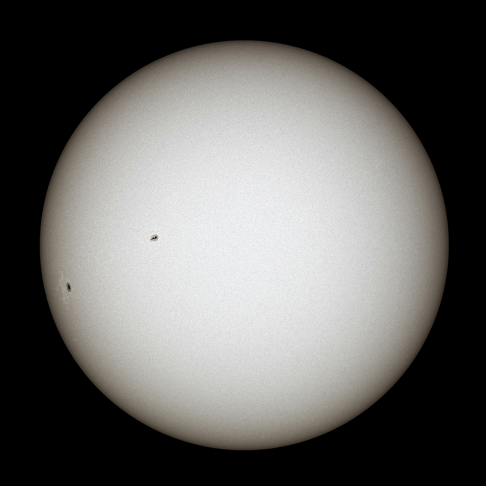{.slide-image-center .nostretch fig-align="center" width="72%"}

:::

::::

::: {.takeaway}
Солнечные нейтрино одновременно проверяют **термоядерные реакции**, **модель Солнца** и **превращения флэйвора в веществе**.
:::

## Светимость

Светимость Солнца равна

$$
L_\odot\simeq 3.83\times10^{26}~\mathrm{Вт}.
$$

Эквивалентная потеря массы составляет

$$
\dot M_\odot=\frac{L_\odot}{c^2}
\simeq 4.3\times10^9~\mathrm{кг\,с^{-1}}.
$$

Это около четырёх миллионов тонн в секунду, но лишь малая доля массы Солнца за всё время его жизни.

Средняя плотность энерговыделения невелика:

$$
\frac{L_\odot}{(4\pi/3)R_\odot^3}
\simeq0.27~\mathrm{Вт\,м^{-3}}.
$$

::: {.small}
Солнце яркое не потому, что каждый кубический метр чрезвычайно мощный, а потому, что объём огромен и горение продолжается миллиарды лет.
:::

## Суммарная реакция

В современном Солнце превращение водорода в гелий можно суммарно записать как

$$
4\,{}^1\mathrm H
\longrightarrow
{}^4\mathrm{He}+2e^++2\nu_e+Q.
$$

По атомным массам

$$
Q\simeq 4m_{\mathrm H}-m_{{}^4\mathrm{He}}
\simeq 26.73~\mathrm{МэВ}.
$$

Часть энергии уносят два нейтрино:

$$
Q_\gamma
=
Q-\langle E_{\nu_1}+E_{\nu_2}\rangle.
$$

Поэтому фотонная светимость и нейтринные потоки связаны, но связь зависит от ветви термоядерного цикла.

# Почему Солнце горит

## Классический барьер

Для двух ядер с зарядами $Z_ae$ и $Z_be$

$$
U_C(r)=\frac{Z_aZ_b\alpha}{r}
\simeq
1.44\,Z_aZ_b~\mathrm{МэВ}
\left(\frac{1~\mathrm{фм}}{r}\right).
$$

В центре Солнца

$$
T_c\sim1.5\times10^7~\mathrm K,
\qquad
k_BT_c\sim1.3~\mathrm{кэВ}.
$$

Следовательно,

$$
k_BT_c\ll U_C(1~\mathrm{фм}).
$$

Классическая частица почти никогда не преодолевает кулоновский барьер.

## Классическая оценка не работает

Вероятность найти протон в нужном хвосте распределения Максвелла была бы порядка

$$
\exp\!\left[-\frac{1.44~\mathrm{МэВ}}{1.29~\mathrm{кэВ}}\right]
\approx e^{-1110}\approx10^{-484}.
$$

Даже при заведомо завышенной геометрической частоте столкновений

$$
\dot N_{\rm geom}\sim4\times10^{64}~\mathrm{с^{-1}}
$$

классическая скорость реакций была бы

$$
\dot N_{\rm class}\sim6\times10^{-420}~\mathrm{с^{-1}}.
$$

::: {.takeaway}
Классически Солнце гореть не может. Солнечный реактор работает благодаря квантовому туннелированию.
:::

## Подбарьерное проникновение

В запрещённой области $U(r)>E$ введём

$$
\kappa(r)=\sqrt{2\mu[U(r)-E]},
$$

где $\mu$ — приведённая масса двух ядер. В приближении ВКБ

$$
P(E)\sim
\exp\!\left[
-2\int_{r_N}^{r_C}\kappa(r)\,dr
\right].
$$

Для кулоновского потенциала получаем фактор Гамова:

$$
P(E)\simeq e^{-2\pi\eta(E)}
=
\exp\!\left[-\sqrt{\frac{E_G}{E}}\right],
$$

$$
E_G=2\mu(\pi\alpha Z_aZ_b)^2.
$$

## Астрофизический $S$-фактор

Сечение реакции удобно представить как

$$
\boxed{
\sigma(E)=\frac{S(E)}{E}
\exp\!\left[-\sqrt{\frac{E_G}{E}}\right]
}.
$$

:::: {.columns}

::: {.column width="50%"}

Экспонента содержит быстро меняющееся кулоновское подавление.

:::

::: {.column width="50%"}

$S(E)$ содержит ядерную физику и обычно меняется с энергией гораздо медленнее.

:::

::::

Эксперимент измеряет $S(E)$ при доступных энергиях. Для солнечных условий его приходится экстраполировать к энергиям, где скорость счёта чрезвычайно мала.

## Температурное усреднение

Скорость реакции на пару частиц равна

$$
\langle\sigma v\rangle
=
\left(\frac{8}{\pi\mu}\right)^{1/2}
\frac{1}{(k_BT)^{3/2}}
\int_0^\infty \sigma(E)E e^{-E/k_BT}\,dE.
$$

Подынтегральная функция содержит два конкурирующих множителя:

$$
\langle\sigma v\rangle
\propto
S(E)
\underbrace{e^{-E/k_BT}}_{\text{тепловой хвост}}
\underbrace{e^{-\sqrt{E_G/E}}}_{\text{туннелирование}}.
$$

Их произведение образует **пик Гамова**, а существенный диапазон энергий — **окно Гамова**.

## Окно Гамова



::: {.small}
При росте $Z_aZ_b$ окно сдвигается к более высоким энергиям: кулоновский барьер становится сильнее.
:::

# Стандартная солнечная модель

## Уравнения структуры

:::: {.panel-tabset .story-tabs}

### Масса

Масса внутри сферы радиуса $r$:

$$
\frac{dM}{dr}=4\pi r^2\rho.
$$

Здесь $\rho(r)$ — плотность вещества, а $M(r)$ — масса всех внутренних слоёв.

### Равновесие

Гидростатическое равновесие:

$$
\frac{dP}{dr}=-\frac{GM(r)\rho(r)}{r^2}.
$$

Градиент давления удерживает вещество от гравитационного коллапса.

### Энергия

Для стационарной модели

$$
\frac{dL}{dr}=4\pi r^2\rho\,\epsilon,
$$

где $\epsilon$ — скорость энерговыделения на единицу массы.

В эволюционной модели добавляются изменение внутренней энергии и работа сжатия.

### Перенос

Температурный градиент записывают как

$$
\frac{dT}{dr}
=
\nabla\frac{T}{P}\frac{dP}{dr},
\qquad
\nabla=\frac{d\ln T}{d\ln P}.
$$

Значение $\nabla$ определяется излучением, теплопроводностью и конвекцией.

::::

## Что замыкает систему

Четырёх дифференциальных уравнений недостаточно. Нужна микрофизика:

$$
\rho=\rho(P,T,\{X_a\}),
$$

$$
\kappa=\kappa(P,T,\{X_a\}),
\qquad
\epsilon=\epsilon(P,T,\{X_a\}).
$$

:::: {.columns}

::: {.column width="50%"}

- уравнение состояния;
- непрозрачность $\kappa$;
- скорости ядерных реакций;

:::

::: {.column width="50%"}

- химический состав $X_a$;
- диффузия элементов;
- модель конвекции.

:::

::::

Модель калибруют так, чтобы в возрасте Солнца получить наблюдаемые $L_\odot$, $R_\odot$ и поверхностное отношение металлов к водороду.

## От модели к нейтрино

Для каждого источника $i$ солнечная модель предсказывает

$$
\Phi_i,
\qquad
f_i(E_\nu),
\qquad
g_i(r),
\qquad
n_e(r).
$$

:::: {.columns}

::: {.column width="58%"}

- $\Phi_i$ — полный поток на Земле;
- $f_i(E_\nu)$ — нормированная форма спектра;
- $g_i(r)$ — распределение мест рождения;
- $n_e(r)$ — электронная плотность для расчёта MSW.

:::

::: {.column width="42%"}

::: {.marginnote style="--note-font-size: 0.65em;"}
**PEANUTS** читает таблицы стандартной солнечной модели, возвращает потоки, спектры и профили рождения, а затем вычисляет распространение нейтрино в Солнце и Земле.
:::

:::

::::

::: {.takeaway}
В задачах к лекции эти величины не вводятся вручную: они извлекаются непосредственно из локальной установки PEANUTS.
:::

## Электронная плотность

:::: {.columns}

::: {.column width="66%"}

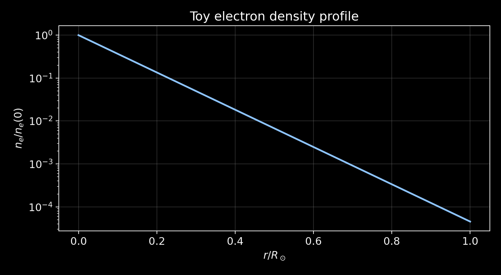{.slide-image-center .nostretch fig-align="center" width="100%"}

:::

::: {.column width="34%"}

Плотность максимальна в центре и падает к поверхности.

Именно $n_e(r)$ задаёт потенциал Вольфенштейна

$$
V_e(r)=\sqrt2G_Fn_e(r).
$$

:::

::::

# Источники солнечных нейтрино

## Протон-протонная цепочка

:::: {.columns}

::: {.column width="30%"}

В современном Солнце pp-цепочка даёт основную часть энергии и нейтринного потока.

Первый шаг

$$
p+p\to d+e^++\nu_e
$$

идёт через слабое взаимодействие и определяет медленный темп горения.

:::

::: {.column width="70%"}

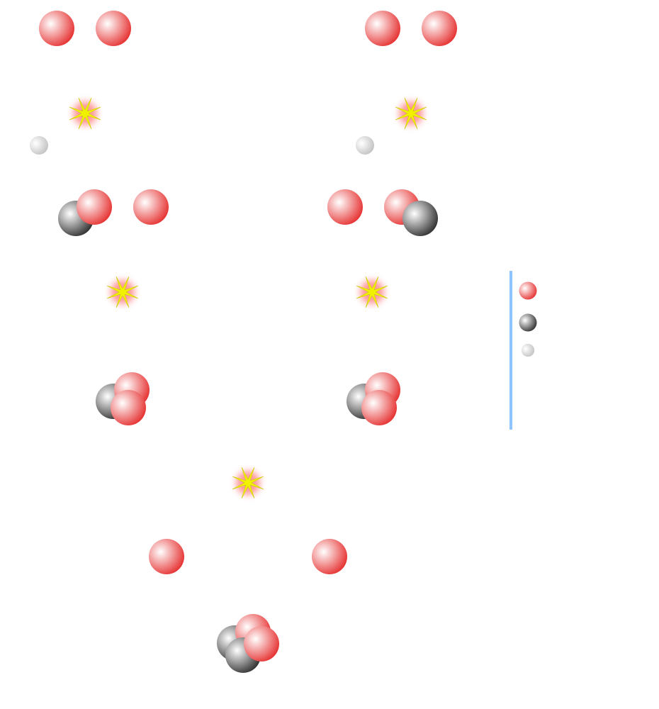{.slide-image-center .nostretch fig-align="center" width="67%"}

:::

::::

## Ветви pp-цепочки

:::: {.panel-tabset .story-tabs}

### pp и pep

Непрерывный pp-спектр:

$$
p+p\to d+e^++\nu_e,
\qquad
E_\nu^{\max}\simeq0.42~\mathrm{МэВ}.
$$

Почти моноэнергетическая pep-линия:

$$
p+e^-+p\to d+\nu_e,
\qquad
E_\nu\simeq1.44~\mathrm{МэВ}.
$$

### pp I

$$
p+d\to{}^3\mathrm{He}+\gamma,
$$

$$
{}^3\mathrm{He}+{}^3\mathrm{He}
\to{}^4\mathrm{He}+2p.
$$

Эта ветвь не содержит $^7$Be- и $^8$B-нейтрино.

### pp II

$$
{}^3\mathrm{He}+{}^4\mathrm{He}
\to{}^7\mathrm{Be}+\gamma,
$$

$$
{}^7\mathrm{Be}+e^-
\to{}^7\mathrm{Li}+\nu_e.
$$

Основные линии:

$$
E_\nu\simeq0.862~\mathrm{МэВ},
\qquad
0.384~\mathrm{МэВ}.
$$

### pp III

$$
{}^7\mathrm{Be}+p\to{}^8\mathrm{B}+\gamma,
$$

$$
{}^8\mathrm{B}\to{}^8\mathrm{Be}^{*}+e^++\nu_e.
$$

Поток мал, но спектр простирается до высоких энергий. Поэтому именно $^8$B-нейтрино доминируют в водных черенковских экспериментах.

### hep

$$
{}^3\mathrm{He}+p
\to{}^4\mathrm{He}+e^++\nu_e.
$$

hep-реакция даёт самые энергичные солнечные нейтрино, но поток чрезвычайно мал.

::::

## CNO-цикл

:::: {.columns}

::: {.column width="64%"}

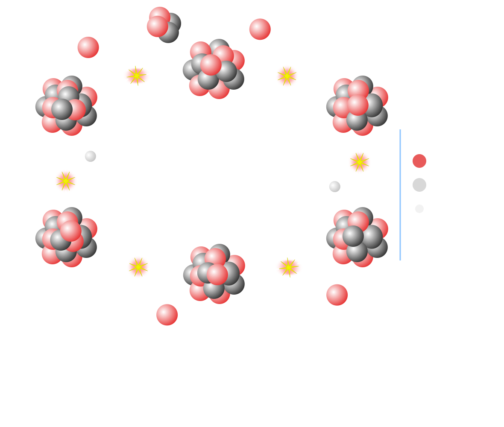{.slide-image-center .nostretch fig-align="center" width="64%"}

:::

::: {.column width="36%"}

Углерод, азот и кислород работают как катализаторы превращения водорода в гелий.

Нейтрино рождаются в $\beta^+$-распадах

$$
{}^{13}\mathrm N,
\quad{}^{15}\mathrm O,
\quad{}^{17}\mathrm F.
$$

:::

::::

::: {.takeaway}
CNO-нейтрино измеряют содержание тяжёлых элементов в ядре Солнца и проверяют проблему солнечной металличности.
:::

## Иерархия потоков

:::: {.columns}

::: {.column width="68%"}

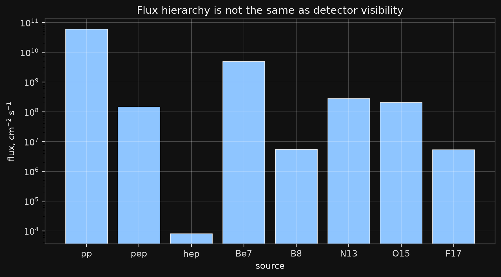{.slide-image-center .nostretch fig-align="center" width="100%"}

:::

::: {.column width="32%"}

Самый большой поток — pp.

Самый важный для высокопороговых детекторов — $^8$B.

Самый высокоэнергичный хвост — hep.

:::

::::

::: {.small}
Числа на рисунке относятся к выбранной стандартной солнечной модели. Для точного анализа нужно явно указывать модель и её состав.
:::

## Спектр из PEANUTS

:::: {.columns}

::: {.column width="69%"}

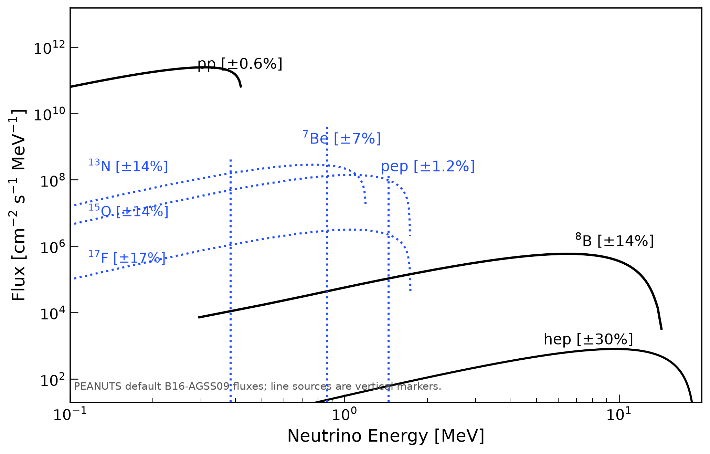{.slide-image-center .nostretch fig-align="center" width="96%"}

:::

::: {.column width="31%"}

Для непрерывного источника

$$
\frac{d\Phi_i}{dE_\nu}
=\Phi_i f_i(E_\nu),
\qquad
\int f_i(E_\nu)dE_\nu=1.
$$

Линейные источники $^7$Be и pep показаны вертикальными линиями с интегральным потоком.

:::

::::

::: {.small}
Рисунок построен скриптом `generate_peanuts_solar_spectrum.py` из таблиц B16-AGSS09, поставляемых с PEANUTS.
:::

## Где рождаются нейтрино

:::: {.columns}

::: {.column width="68%"}

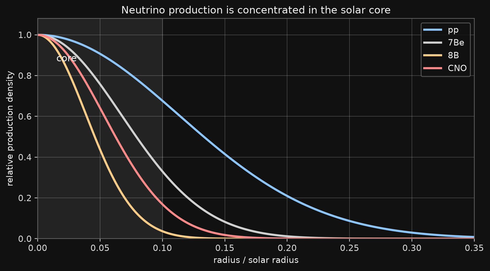{.slide-image-center .nostretch fig-align="center" width="100%"}

:::

::: {.column width="32%"}

Температурно-чувствительные реакции сильнее сосредоточены к центру.

Профиль рождения важен дважды:

1. он проверяет солнечную модель;
2. он задаёт плотность вещества в точке рождения и тем самым эффект MSW.

:::

::::

## Поток не равен числу событий

Для источника $i$ вклад в детектор имеет структуру

$$
\frac{dN_i}{dE_{\rm rec}}
\propto
\int dE_\nu\,
\underbrace{\frac{d\Phi_i}{dE_\nu}}_{\text{Солнце}}
\underbrace{P_{ee}(E_\nu)}_{\text{распространение}}
\underbrace{\frac{d\sigma}{dE_{\rm true}}}_{\text{взаимодействие}}
\underbrace{R(E_{\rm rec}|E_{\rm true})\epsilon(E_{\rm rec})}_{\text{детектор}}.
$$

::: {.takeaway}
Большой низкоэнергетический поток может быть невидим для детектора с высоким порогом.
:::

# Превращение флэйвора

## Потенциал вещества

Когерентное рассеяние вперёд на электронах создаёт для $\nu_e$ дополнительный потенциал

$$
V_e(r)=\sqrt2G_Fn_e(r).
$$

После вычитания несущественного следа двухфлэйворный гамильтониан равен

$$
H_f(r)=
\frac{\Delta m_{21}^2}{4E_\nu}
\begin{pmatrix}
-\cos2\theta_{12} & \sin2\theta_{12}\\
\sin2\theta_{12} & \cos2\theta_{12}
\end{pmatrix}
+
\begin{pmatrix}
V_e(r)&0\\0&0
\end{pmatrix}.
$$

Для антинейтрино $V_e\to-V_e$.

## Смешивание в веществе

Введём

$$
A(E_\nu,r)=\frac{2E_\nu V_e(r)}{\Delta m_{21}^2}.
$$

Тогда

$$
\tan2\theta_m
=
\frac{\sin2\theta_{12}}
{\cos2\theta_{12}-A},
$$

$$
\Delta m_m^2
=
\Delta m_{21}^2
\sqrt{(\cos2\theta_{12}-A)^2+\sin^22\theta_{12}}.
$$

Резонанс соответствует

$$
A=\cos2\theta_{12},
\qquad
\theta_m=\frac{\pi}{4}.
$$

## Адиабатическое прохождение

Если плотность меняется медленно по сравнению с локальной длиной осцилляций, нейтрино остаётся в одном мгновенном собственном состоянии гамильтониана.

После усреднения фаз

$$
P_{ee}^{2\nu}(E_\nu,r)
=
\frac12
+
\frac12\cos2\theta_{12}\cos2\theta_m(E_\nu,r).
$$

Наблюдаемая вероятность дополнительно усредняется по профилю рождения:

$$
\overline P_{ee}(E_\nu)
=
\frac{\int dr\,g_i(r)P_{ee}(E_\nu,r)}
{\int dr\,g_i(r)}.
$$

## Два предела

:::: {.columns}

::: {.column width="50%"}

**Низкие энергии: вакуумное усреднение**

$$
P_{ee}^{\rm low}
\simeq
1-\frac12\sin^22\theta_{12}.
$$

:::

::: {.column width="50%"}

**Высокие энергии: адиабатический MSW**

$$
P_{ee}^{\rm high}
\simeq
\sin^2\theta_{12}.
$$

:::

::::

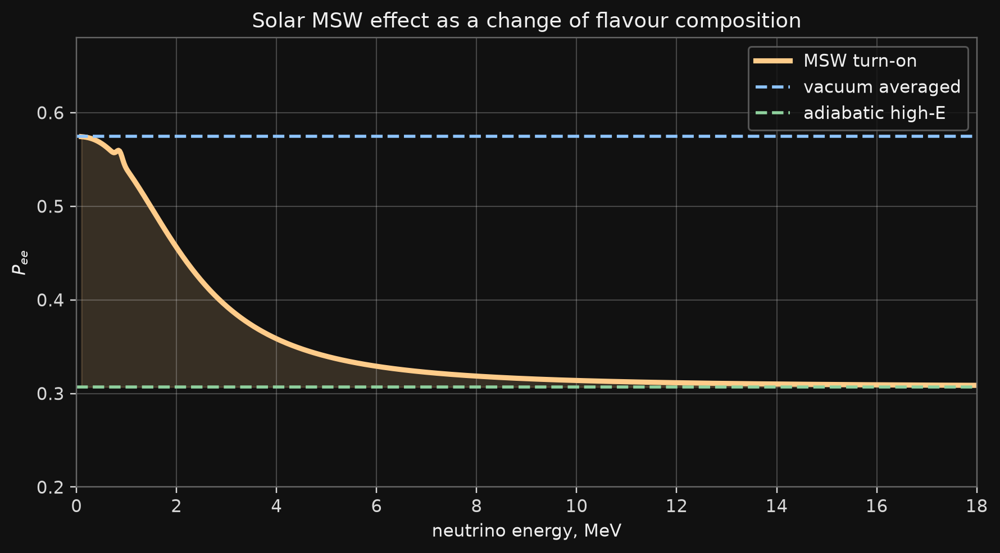{.slide-image-center .nostretch fig-align="center" width="69%"}

## Почему осцилляций не видно

Солнечные нейтрино рождаются

- в протяжённой области;
- с непрерывным спектром;
- на расстоянии около одной астрономической единицы.

Размер источника, разрешение по энергии и разделение волновых пакетов усредняют быстро меняющиеся фазы.

Поэтому детектор получает некогерентную смесь массовых состояний:

$$
P_{ee}
=
\sum_i
P(\nu_e\to\nu_i\text{ на выходе из Солнца})
|U_{ei}|^2.
$$

Мы наблюдаем плавную зависимость $P_{ee}(E_\nu)$, а не осцилляционные полосы.

## День и ночь

Ночью нейтрино проходят через Землю. Земное вещество частично регенерирует электронный флэйвор:

$$
\Delta P_{ee}^{\oplus}
=
P_{ee}^{\rm night}-P_{ee}^{\rm day}.
$$

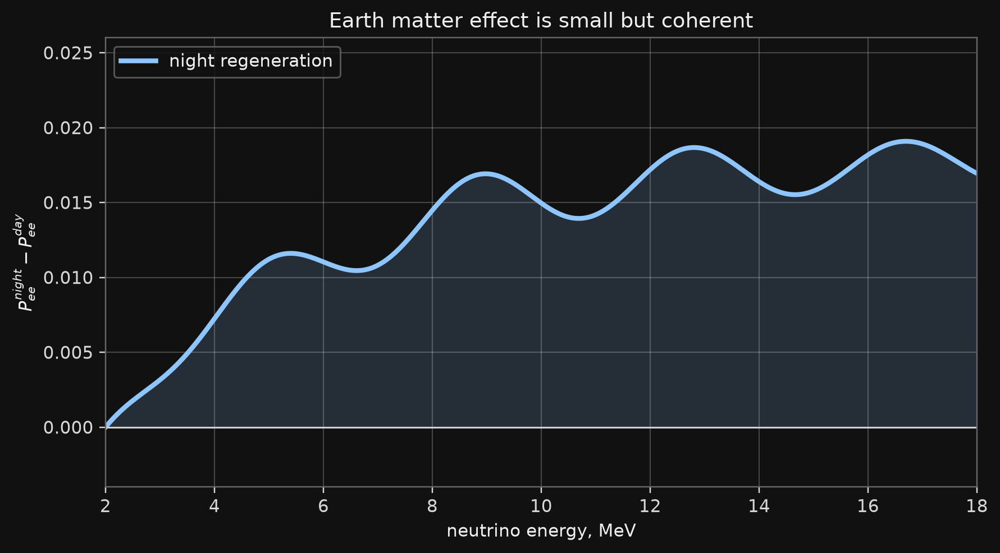{.slide-image-center .nostretch fig-align="center" width="68%"}

::: {.small}
Эффект мал, но его энергетическая и угловая зависимости дают дополнительную чувствительность к $\Delta m_{21}^2$.
:::

# Как регистрируют солнечные нейтрино

## Основные каналы

:::: {.panel-tabset .story-tabs}

### Радиохимия

Нейтрино превращает ядро в радиоактивный изотоп:

$$
\nu_e+{}^{37}\mathrm{Cl}\to{}^{37}\mathrm{Ar}+e^-,
$$

$$
\nu_e+{}^{71}\mathrm{Ga}\to{}^{71}\mathrm{Ge}+e^-.
$$

После длительной экспозиции отдельные атомы извлекают химически и считают их распады.

Измеряется интегральная скорость, но нет направления и энергии каждого события.

### Упругое рассеяние

$$
\nu_\alpha+e^-\to\nu_\alpha+e^-.
$$

Электрон отдачи сохраняет информацию о направлении на Солнце.

$\nu_e$ взаимодействует через CC и NC, а $\nu_{\mu,\tau}$ — только через NC, поэтому

$$
\sigma(\nu_e e)>\sigma(\nu_{\mu,\tau}e).
$$

### Заряженный ток

В тяжёлой воде SNO измерял

$$
\nu_e+d\to p+p+e^-.
$$

Канал чувствителен только к электронному флэйвору и даёт спектральную информацию.

### Нейтральный ток

SNO также измерял

$$
\nu_x+d\to p+n+\nu_x.
$$

Этот канал одинаково чувствителен ко всем активным флэйворам. Он измеряет полный поток $^8$B-нейтрино независимо от превращений флэйвора.

::::

## Сечение $\nu e$

Для нейтрино энергии $E_\nu$ и электрона отдачи с кинетической энергией $T_e$

$$
\frac{d\sigma}{dT_e}
=
\frac{2G_F^2m_e}{\pi}
\left[
g_L^2+g_R^2\left(1-\frac{T_e}{E_\nu}\right)^2
-g_Lg_R\frac{m_eT_e}{E_\nu^2}
\right].
$$

Кинематический предел:

$$
0\le T_e\le
T_e^{\max}
=
\frac{2E_\nu^2}{m_e+2E_\nu}.
$$

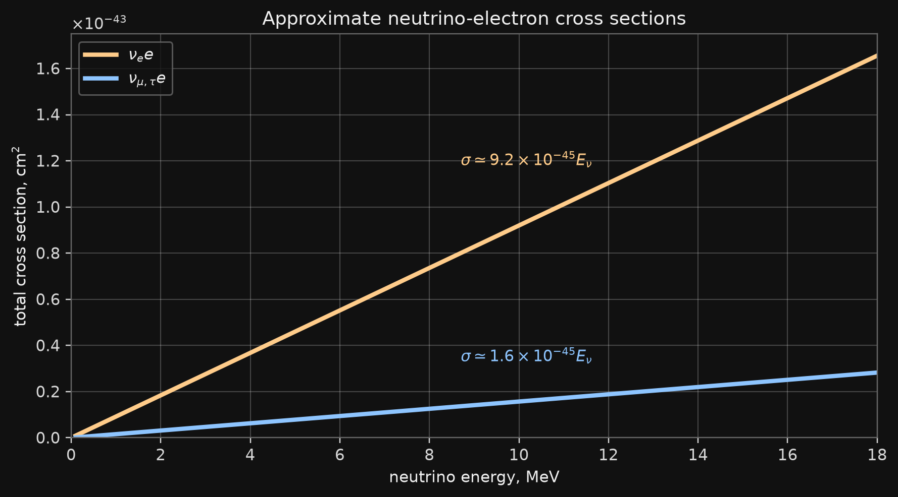{.slide-image-center .nostretch fig-align="center" width="59%"}

## Водный черенковский детектор

Черенковское излучение возникает при

$$
\beta_en>1.
$$

Для воды $n\simeq1.33$, поэтому физический порог равен примерно

$$
T_e^{\rm Ch}
=
m_e\left(\frac{1}{\sqrt{1-1/n^2}}-1\right)
\simeq0.26~\mathrm{МэВ}.
$$

Практический порог анализа выше из-за радиоактивных фонов, разрешения и эффективности отбора.

Направление черенковского конуса позволяет выделить избыток событий, направленных от Солнца.

## От первого дефицита к доказательству

:::: {.panel-tabset .story-tabs}

### Homestake

Хлорный радиохимический эксперимент Р. Дэвиса впервые устойчиво увидел поток меньше предсказанного стандартной солнечной моделью.

Это стало **солнечной нейтринной проблемой**: ошибка модели Солнца, сечений или новая физика нейтрино?

### Галлий

GALLEX/GNO и SAGE снизили порог до pp-области.

Тем самым было показано, что дефицит относится не только к редкому высокоэнергетическому хвосту $^8$B.

### Kamiokande и SK

Kamiokande, а затем Super-Kamiokande зарегистрировали направление электронов отдачи на Солнце и измерили спектр $^8$B-нейтрино в реальном времени.

Солнечное происхождение сигнала стало геометрически очевидным.

### SNO

Сравнение CC, NC и упругого рассеяния показало:

- поток $\nu_e$ уменьшен;
- полный поток активных нейтрино согласуется с солнечной моделью;
- недостающие $\nu_e$ превратились в $\nu_\mu$ и $\nu_\tau$.

### Borexino

Жидкосцинтилляционный Borexino измерил низкоэнергетические компоненты, включая pp, $^7$Be, pep и CNO.

Это превратило солнечную нейтринную физику из задачи «есть дефицит или нет» в спектроскопию отдельных реакций Солнца.

::::

## Экспериментальная карта

  <figure class="detector-card">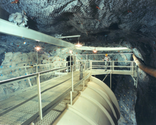<figcaption><strong>Homestake</strong> хлор, интегральный поток</figcaption></figure>
  <figure class="detector-card"><figcaption><strong>SAGE</strong> галлий, pp-область</figcaption></figure>
  <figure class="detector-card">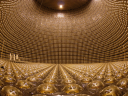<figcaption><strong>Super-Kamiokande</strong> направление и спектр</figcaption></figure>
  <figure class="detector-card">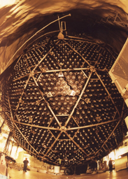<figcaption><strong>SNO</strong> CC + NC + ES</figcaption></figure>
  <figure class="detector-card">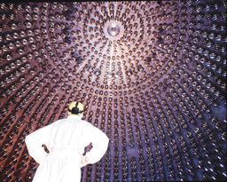<figcaption><strong>Borexino</strong> низкие энергии и CNO</figcaption></figure>

## Логика решения проблемы

Пусть $\Phi_e$ — электронный поток, а $\Phi_{\rm active}$ — сумма активных флэйворов.

:::: {.columns}

::: {.column width="50%"}

Радиохимия и CC измеряют в основном

$$
\Phi_e.
$$

:::

::: {.column width="50%"}

NC в дейтерии измеряет

$$
\Phi_e+\Phi_\mu+\Phi_\tau.
$$

:::

::::

Наблюдение

$$
\Phi_e<\Phi_{\rm active}\simeq\Phi_{\rm SSM}
$$

отделило астрофизику от физики нейтрино: источник даёт ожидаемый полный поток, но его флэйворный состав меняется по пути.

# От потока к данным

## Ожидаемое число событий

Для истинного бина энергии отдачи $[T_j,T_{j+1}]$

$$
\mu_j
=
N_eT_{\rm live}
\int_{T_j}^{T_{j+1}}dT_e
\int dE_\nu\,
\frac{d\Phi_{^8\mathrm B}}{dE_\nu}
\left[
P_{ee}\frac{d\sigma_e}{dT_e}
+(1-P_{ee})\frac{d\sigma_x}{dT_e}
\right].
$$

Для воды массой $M$

$$
N_e=10N_A\frac{M}{18~\mathrm g}.
$$

Множитель 10 — число электронов в молекуле $\mathrm H_2\mathrm O$.

## Ответ детектора

Регистрируемая энергия отличается от истинной:

$$
\mu_k^{\rm rec}
=
\sum_j R_{kj}\,\epsilon_j\,\mu_j+b_k.
$$

:::: {.columns}

::: {.column width="50%"}

- $R_{kj}$ — миграция между бинами;
- $\epsilon_j$ — эффективность;

:::

::: {.column width="50%"}

- $b_k$ — ожидаемый фон;
- порог определяет доступную часть спектра.

:::

::::

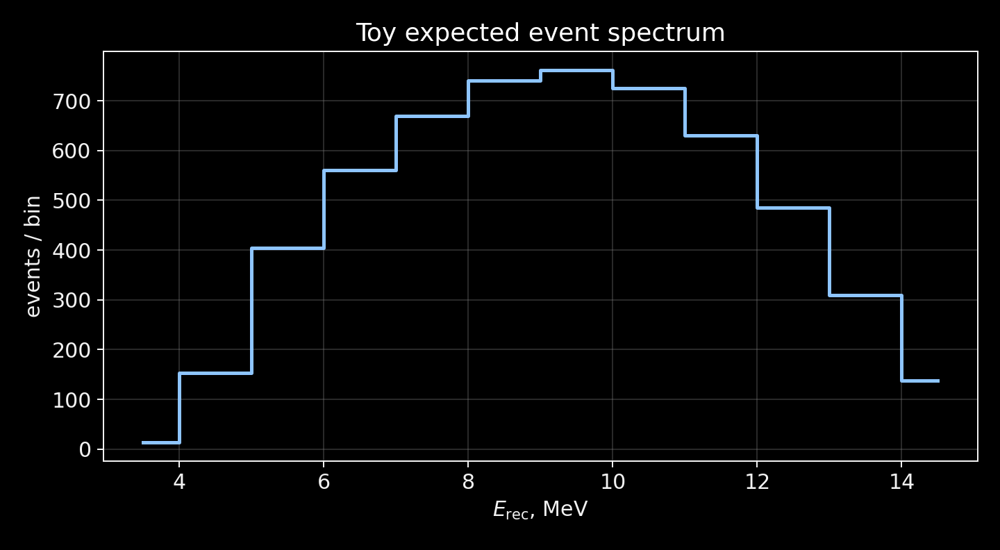{.slide-image-center .nostretch fig-align="center" width="63%"}

## Псевдоэксперимент

Для проверки анализа генерируют

$$
n_j\sim\operatorname{Pois}(\mu_j^{\rm true}).
$$

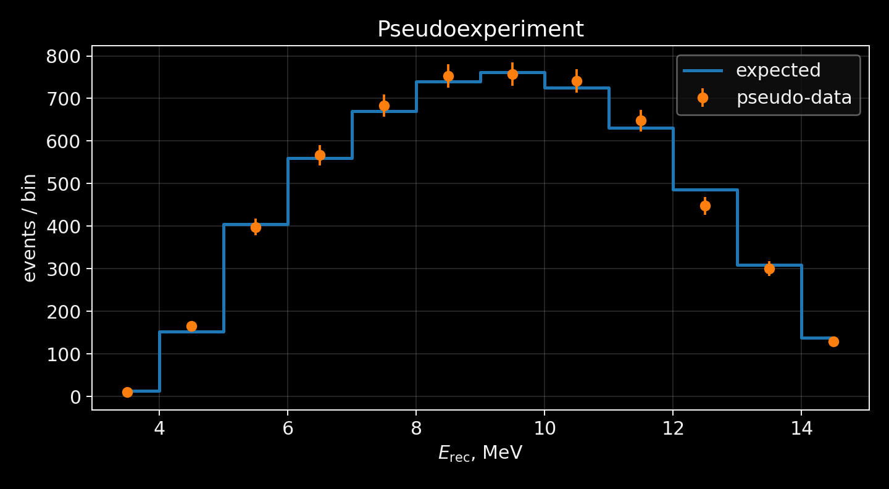{.slide-image-center .nostretch fig-align="center" width="62%"}

Псевдоданные позволяют проверить смещение оценки, покрытие интервалов, устойчивость к порогу и бинированию до анализа настоящих данных.

## Пуассоновская статистика

Для наблюдаемых $n_j$ и ожиданий $\mu_j(\boldsymbol\theta)$

$$
q(\boldsymbol\theta)
=
2\sum_j
\left[
\mu_j-n_j+n_j\ln\frac{n_j}{\mu_j}
\right].
$$

При $n_j=0$ логарифмический член принимается равным нулю.

Параметры могут включать

$$
\sin^2\theta_{12},
\qquad
\Delta m_{21}^2,
\qquad
\alpha_{^8\mathrm B},
\qquad
\text{систематические параметры}.
$$

## Профили и контуры

Для двух параметров

$$
\Delta q(\theta_1,\theta_2)
=
q(\theta_1,\theta_2)-q_{\min}.
$$

Обычные асимптотические уровни:

$$
\Delta q=2.30,
\qquad
6.18
$$

для приблизительных областей $1\sigma$ и $2\sigma$.

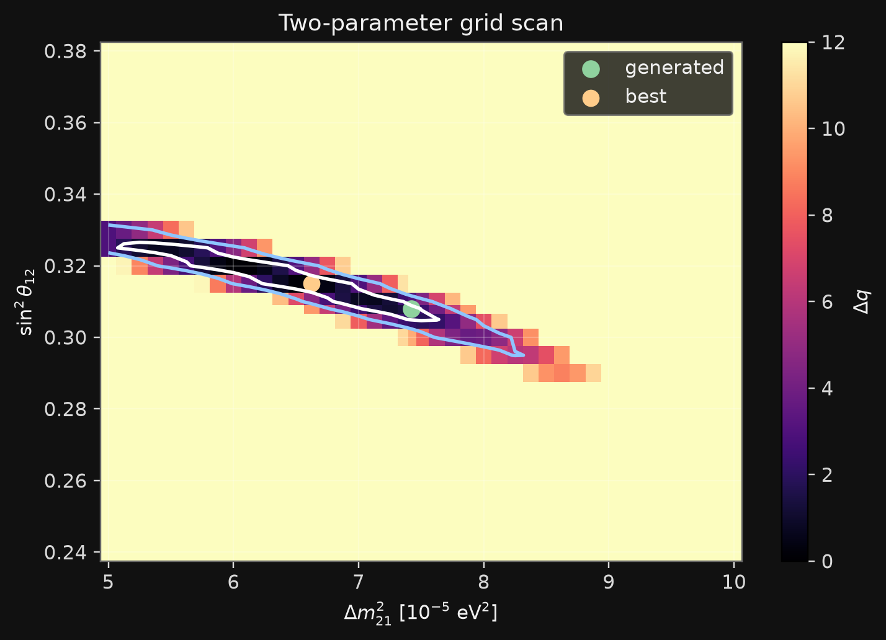{.slide-image-center .nostretch fig-align="center" width="61%"}

Одномерный профиль получается минимизацией по остальным параметрам.

## Что измеряет форма

:::: {.panel-tabset .story-tabs}

### Нормировка

Полное число событий чувствительно к потоку $^8$B, экспозиции, эффективности и средней вероятности выживания.

Если свободна нормировка $\alpha_{^8\mathrm B}$, часть информации о $\sin^2\theta_{12}$ теряется.

### Энергетическая форма

Переход между вакуумным и MSW-режимами изменяет форму $P_{ee}(E_\nu)$, а значит и спектр электронов отдачи.

Эффект частично сглаживается интегрированием по $E_\nu$ и разрешением детектора.

### День — ночь

Земная регенерация особенно полезна для $\Delta m_{21}^2$, поскольку добавляет зависимость от длины пути и профиля плотности Земли.

### Систематика

Порог, энергетическая шкала, разрешение, фон и неопределённость формы $^8$B могут имитировать спектральные изменения.

Их необходимо включать в модель и профилировать.

::::

# Практическая цепочка PEANUTS

## От солнечной модели до фита

$$
\boxed{
\text{PEANUTS: }\Phi_i,\ f_i(E_\nu),\ g_i(r),\ n_e(r)
}
$$

$$
\Downarrow
$$

$$
P_{ee}(E_\nu)
\quad\Longrightarrow\quad
\frac{d\sigma}{dT_e}
\quad\Longrightarrow\quad
\mu_j
\quad\Longrightarrow\quad
n_j
\quad\Longrightarrow\quad
q(\boldsymbol\theta).
$$

::: {.takeaway}
Задачи к лекции воспроизводят всю цепочку: сначала реальные таблицы солнечной модели из PEANUTS, затем спектр, MSW, детектор и статистический фит.
:::

## Что проверить численно

:::: {.panel-tabset .story-tabs}

### Солнце

- потоки восьми источников;
- нормировку непрерывных спектров;
- две линии $^7$Be и линию pep;
- радиальные профили рождения.

### Осцилляции

- $P_{ee}(E_\nu)$ для pp, $^7$Be и $^8$B;
- низко- и высокоэнергетические пределы;
- зависимость от $\sin^2\theta_{12}$ и $\Delta m_{21}^2$;
- земную регенерацию.

### Детектор

- спектр электронов отдачи;
- пороги $3$, $4.5$ и $6~\mathrm{МэВ}$;
- вклад $\nu_e$ и $\nu_{\mu,\tau}$;
- влияние разрешения и эффективности.

### Фит

- пуассоновские псевдоданные;
- минимум $q$;
- одномерные профили;
- двумерные контуры;
- устойчивость к бинированию и порогу.

::::

# Итоги

## Что мы узнали о Солнце

- Энергия Солнца возникает в термоядерных реакциях pp-цепочки и CNO-цикла.
- Квантовое туннелирование определяет скорости реакций при солнечных температурах.
- Нейтринные потоки проверяют температуру, состав и структуру ядра.
- Измерение CNO-компоненты открывает прямой доступ к металличности центральной области.

## Что мы узнали о нейтрино

- Солнечный дефицит не был дефицитом полного активного потока.
- Электронные нейтрино превращаются в $\nu_\mu$ и $\nu_\tau$.
- Энергетическая зависимость $P_{ee}$ демонстрирует переход от вакуумного усреднения к адиабатическому MSW.
- Эффект день — ночь проверяет распространение в веществе Земли.

## Главная формула лекции

$$
\boxed{
\text{данные}
=
\text{солнечная модель}
\otimes
\text{осцилляции}
\otimes
\text{сечение}
\otimes
\text{ответ детектора}
}
$$

Ни один из этих множителей нельзя интерпретировать изолированно.

## Литература и код

- В. А. Наумов, [«Солнечные нейтрино. Астрофизические аспекты»](https://www1.jinr.ru/Pepan_letters/panl_2011_7/05_VNaumov.pdf).
- T. E. Gonzalo, M. Lucente, [PEANUTS: Propagation and Evolution of Active NeUTrinoS](https://arxiv.org/abs/2303.15527).
- [Код PEANUTS](https://github.com/michelelucente/PEANUTS).
- Локальный мини-курс: `solar-neutrino-masterclass`.

::: {.small}
В формулах использованы естественные единицы $\hbar=c=1$, если явно не указаны практические единицы таблиц.
:::
