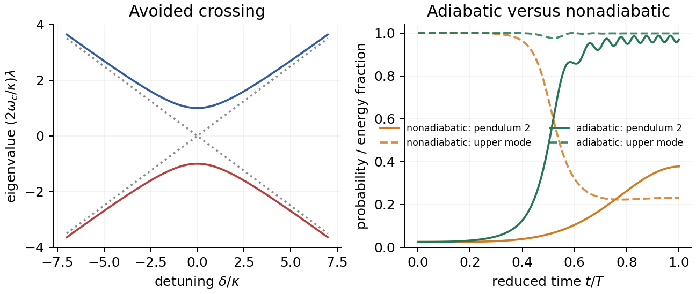

```{=html}
<link rel="stylesheet" href="assets/06_matter_oscillations/matter_oscillations.css">
<script defer src="assets/06_matter_oscillations/matter_oscillations.js"></script>
```

# От формулы к механизму

## Парадокс фиксированного базиса

Высокоэнергетическое солнечное $\nu_e$ рождается почти как $\nu_{2m}$ и при
адиабатическом выходе становится почти чистым вакуумным $\nu_2$.

Но если всё время раскладывать состояние по **вакуумным** модам,

$$
|\psi(x)\rangle=c_1(x)|\nu_1\rangle+c_2(x)|\nu_2\rangle,
$$

то вещество непрерывно создаёт амплитуды переходов в обе стороны. Почему же
на выходе $c_1\simeq0$?

::: {.takeaway}
Нужно увидеть не только перенос амплитуды, но и фазы всех путей, приходящих в один и тот же конечный канал.
:::

## Две картины одной динамики

:::: {.panel-tabset .story-tabs}

### Квантовая

- полный пропагатор в вакуумном массовом базисе;
- амплитуды «выживания» и «перехода»;
- деструктивная интерференция в канале $\nu_1$;
- конструктивная интерференция в канале $\nu_2$.

### Механическая

- две связанные координаты;
- две мгновенные нормальные моды;
- ускорение подвеса или изменение длины как управляющий потенциал;
- адиабатическое превращение одной вакуумной моды в другую.

::::

# Куда пропадает $\nu_1$?

## Парадокс фиксированного базиса

Высокоплотностное $\nu_e\simeq\nu_{2m}$ в вакуумном массовом базисе равно

$$
|\nu_{2m}(x_0)\rangle
=\sin\alpha_0|\nu_1\rangle
+\cos\alpha_0|\nu_2\rangle,
\qquad
\alpha_0=\theta_m(x_0)-\theta.
$$

На выходе адиабатическое состояние почти чистое $|\nu_2\rangle$.

::: {.question}
Как коэффициент при $\nu_1$ стал нулём, если
$H_{12}^{(m)}=H_{21}^{(m)}$?
:::

Ответ состоит из двух взаимно совместимых картин:

1. в мгновенном базисе вращается занятая мода;
2. в фиксированном базисе полные амплитуды интерферируют.

## Сначала: чего не происходит в вакууме

В вакуумном массовом базисе

$$
H_m'(V=0)=\frac12
\begin{pmatrix}-\Delta&0\\0&\Delta\end{pmatrix}.
$$

Поэтому свободные on-shell волны $\nu_1$ и $\nu_2$ **не совершают
постоянных переходов друг в друга**. Каждая набирает свою фазу.

В веществе же

$$
H_{12}^{(m)}=\frac V2\sin2\theta\ne0,
$$

потому что электронный фон не диагонален в вакуумном массовом базисе.

::: {.takeaway}
Dyson-ряд можно рисовать как последовательность вставок
$\nu_1\leftrightarrow\nu_2$, но физична когерентная сумма всех историй —
полный пропагатор.
:::

## Эрмитовость не означает нулевой ток

:::: {.panel-tabset .story-tabs}

### Уравнения амплитуд

Пусть

$$
\psi_m=\binom{c_1}{c_2},
\qquad
i\dot c_1=H_{11}c_1+H_{12}c_2,
\qquad
i\dot c_2=H_{21}c_1+H_{22}c_2.
$$

### Производная $P_1$

$$
\frac d{dx}|c_1|^2
=c_1^*\dot c_1+\dot c_1^*c_1.
$$

Диагональные члены сокращаются, и при $H_{21}=H_{12}^*$:

$$
\boxed{
\frac d{dx}|c_1|^2
=2\operatorname{Im}(H_{12}c_1^*c_2)}.
$$

### Ток вероятности

Определим ток из 1 в 2:

$$
\boxed{
J_{1\to2}
\equiv\frac d{dx}|c_2|^2
=-2\operatorname{Im}(H_{12}c_1^*c_2)}.
$$

Тогда

$$
\frac d{dx}(|c_1|^2+|c_2|^2)=0.
$$

### Что задаёт направление?

Равенство матричных элементов обеспечивает обратимость и сохранение нормы.
Направление мгновенного потока задаёт фаза

$$
\arg(c_2)-\arg(c_1)+\arg H_{12}.
$$

Поэтому симметричная связь вполне совместима с $P_1\downarrow$ и
$P_2\uparrow$ на данном участке траектории.

::::

## Полный пропагатор: где именно интерференция?

:::: {.panel-tabset .story-tabs}

### Определение

В фиксированном массовом базисе

$$
\boxed{
U_m(x,0)=\mathcal T
\exp\!\left[-i\int_0^xH_m(x')dx'\right]}.
$$

Первая конечная амплитуда равна

$$
c_1(x)=U_{11}c_1(0)+U_{12}c_2(0).
$$

### Две полные истории

Назовём

$$
\boxed{d(x)\equiv U_{11}(x,0)c_1(0)},
\qquad
\boxed{f(x)\equiv U_{12}(x,0)c_2(0)}.
$$

$d$ — сумма **всех** историй, начинающихся в $\nu_1$ и заканчивающихся в
$\nu_1$; $f$ — всех историй из начального $\nu_2$ в конечное $\nu_1$.

### Квадрат модуля

$$
\boxed{
P_1=|d+f|^2
=|d|^2+|f|^2+2\operatorname{Re}(df^*)}.
$$

Исчезновение $P_1$ требует не исчезновения каждого пути, а

$$
|d|\simeq|f|,
\qquad
\arg(f/d)\simeq\pi.
$$

### Численный пример

Для профиля готовой анимации на выходе:

$$
|d|=0.48516,
\qquad
|f|=0.48580,
$$

$$
\arg(f/d)=(-1+0.00221)\pi.
$$

В результате

$$
|c_1|=0.00343,
\qquad
\boxed{P_1=1.18\times10^{-5}}.
$$

::::

## Почему отмена точна в адиабатическом пределе

:::: {.panel-tabset .story-tabs}

### Поворот относительно вакуума

Пусть

$$
W(\alpha)=
\begin{pmatrix}\cos\alpha&\sin\alpha\\-\sin\alpha&\cos\alpha\end{pmatrix},
\qquad
\alpha=\theta_m-\theta.
$$

Он переводит мгновенные массовые амплитуды в фиксированные вакуумные:

$$
\psi_m=W(\alpha)b.
$$

### Адиабатический пропагатор

Если переходами между ветвями можно пренебречь,

$$
\boxed{
U_{\rm ad}(x,0)=
W(\alpha_x)
\begin{pmatrix}E_1&0\\0&E_2\end{pmatrix}
W^T(\alpha_0)},
$$

где $|E_1|=|E_2|=1$ — накопленные фазы.

### Начальная верхняя мода

Начальное состояние

$$
\psi_m(0)=W(\alpha_0)e_2
=\binom{\sin\alpha_0}{\cos\alpha_0}.
$$

На выходе в вакуум $\alpha_x=0$, поэтому

$$
U_{\rm ad}(x,0)=
\begin{pmatrix}E_1&0\\0&E_2\end{pmatrix}
W^T(\alpha_0).
$$

### Два вклада в $c_1$

Из первой строки пропагатора:

$$
U_{11}=E_1\cos\alpha_0,
\qquad
U_{12}=-E_1\sin\alpha_0.
$$

Значит,

$$
d=E_1\cos\alpha_0\sin\alpha_0,
$$

$$
f=-E_1\sin\alpha_0\cos\alpha_0.
$$

### Точная отмена

$$
\boxed{c_1=d+f=0}.
$$

Оба вклада несут **одну и ту же динамическую фазу $E_1$**, поэтому их
противофаза не требует случайной настройки длины пути.

::: {.takeaway}
Угол $180^\circ$ возникает из ортогональности вращающегося базиса, а не из
подбора интеграла фазы к специальному значению.
:::

::::

## Исчезновение фиксированной моды — кадр за кадром

<video
  class="slide-video media-width-full"
  style="--media-width: 96%; --media-max-height: 535px;"
  data-autoplay autoplay loop muted playsinline controls preload="metadata"
  aria-label="Деструктивная интерференция полных амплитуд конечной моды ню один"
  src="assets/06_matter_oscillations/msw_mode_cancellation.mp4">
</video>

## Один тонкий слой: волны и фазоры одновременно

<video
  class="slide-video media-width-full"
  style="--media-width: 98%; --media-max-height: 535px;"
  data-autoplay autoplay loop muted playsinline controls preload="metadata"
  aria-label="Интерференция волн и фазоров в тонком резонансном слое"
  src="assets/06_matter_oscillations/msw_thin_layer_interference.mp4">
</video>

## Тонкий резонансный слой — аналитически

:::: {.panel-tabset .story-tabs}

### Матрица слоя

В подходящей фазе картины взаимодействия резонансный слой имеет

$$
\boxed{S(\gamma)=\cos\gamma\,\mathbb I-i\sin\gamma\,\sigma_x}.
$$

Пусть входные амплитуды

$$
c_1=A,
\qquad
c_2=Be^{-i\varepsilon}.
$$

### Канал 1

$$
c_1'=\underbrace{A\cos\gamma}_{\rm survival}
\underbrace{-iBe^{-i\varepsilon}\sin\gamma}_{\rm conversion}.
$$

Конверсионная стрелка отстаёт от первой на

$$
90^\circ+\varepsilon,
$$

поэтому интерференция в канале $\nu_1$ деструктивна.

### Канал 2

$$
c_2'=\underbrace{Be^{-i\varepsilon}\cos\gamma}_{\rm survival}
\underbrace{-iA\sin\gamma}_{\rm conversion}.
$$

Теперь относительный угол равен

$$
90^\circ-\varepsilon,
$$

и интерференция конструктивна.

### Равные входные модули

Для $A=B=1/\sqrt{2}$:

$$
\boxed{P_1=\frac12[1-\sin2\gamma\sin\varepsilon]},
$$

$$
\boxed{P_2=\frac12[1+\sin2\gamma\sin\varepsilon]}.
$$

Один и тот же унитарный слой уменьшает одну проекцию ровно настолько, насколько
увеличивает другую.

::::

## Квантово-полевая формулировка

:::: {.panel-tabset .story-tabs}

### Физический вакуум

Вакуум — основное состояние нейтринных полей. Рождение создаёт когерентное
одночастичное возбуждение массовых полей, если альтернативы неразличимы.

Свободный пропагатор диагонален по массовым полям: постоянного физического
$\nu_1\leftrightarrow\nu_2$ превращения в пустом вакууме нет.

### Среда

Электронный фон добавляет к пропагатору матричную собственную энергию. Её
полюса и собственные векторы определяют моды в веществе
$\nu_{1m},\nu_{2m}$.

В бесстолкновительном ультрарелятивистском пределе уравнение для этих коллективных
амплитуд редуцируется к использованному $2\times2$ уравнению Шрёдингера.

### Dyson-картина

Разложение по степеням взаимодействия содержит любое число вставок среды.
Но отдельная диаграмма не является вероятностью перехода. Сначала суммируются
все комплексные амплитуды, и только затем берётся квадрат модуля.

Именно это не-пертурбативно делает

$$
\mathcal T\exp\!\left[-i\int H_mdx\right].
$$

### Итог

Фраза «$\nu_1$ исчезло» означает только

$$
\langle\nu_1|\psi_{\rm out}\rangle=0.
$$

Ни поле $\nu_1$, ни норма состояния не исчезают. Обращение профиля в
идеальной когерентной системе обратило бы процесс.

::::

# Механическая аналогия

## Сначала явление

Два слабо связанных маятника передают энергию друг другу, если их частоты
достаточно близки. Расстройка частот подавляет передачу. Управляя частотой
одного маятника, можно:

1. войти в резонанс при постоянных параметрах;
2. медленно провести систему через избегаемое пересечение;
3. следовать одной мгновенной нормальной моде.

## Резонанс и подавление — в движении

<video
  class="slide-video media-width-full"
  style="--media-width: 96%; --media-max-height: 535px;"
  data-autoplay autoplay loop muted playsinline controls preload="metadata"
  aria-label="Вакуумные осцилляции, резонанс и подавление в механической модели"
  src="assets/06_matter_oscillations/msw_constant_matter.mp4">
</video>

## Точные уравнения малых колебаний

:::: {.panel-tabset .story-tabs}

### Координаты

Пусть $x_1,x_2$ — малые горизонтальные смещения грузов, а
$q_i=\sqrt{m_i}x_i$ — нормированные на массу координаты.

Тогда

$$
\ddot{\mathbf q}+D(t)\mathbf q=0,
\qquad
\mathbf q=\binom{q_1}{q_2}.
$$

Симметричная матрица $D$ играет роль квадрата частот.

### Одинаковые опоры

Для горизонтальной пружины жёсткости $k$:

$$
D_0=
\begin{pmatrix}
g/L+k/m_1&-\kappa\\
-\kappa&g/L+k/m_2
\end{pmatrix},
$$

где

$$
\kappa=\frac{k}{\sqrt{m_1m_2}}.
$$

Нормальные моды $D_0$ — механические аналоги вакуумных массовых состояний.

### Флэйворные координаты

Возбудить только первый физический маятник — аналог приготовить определённый
флэйвор. Это возбуждение является суперпозицией двух нормальных мод.

Их частоты различны, поэтому относительная фаза меняется и энергия
периодически переходит между маятниками.

### Вещество как диагональный сдвиг

Потенциал вещества должен изменить только один диагональный элемент:

$$
D(t)=D_0+
\begin{pmatrix}u(t)&0\\0&0\end{pmatrix}.
$$

Здесь $u(t)$ — механический аналог флэйвор-селективного потенциала.

::::

## Два способа создать один потенциал

:::: {.panel-tabset .story-tabs}

### Менять длину

Пусть длина первого маятника равна $\ell(t)$. Для горизонтального смещения
$x_1=\ell\vartheta_1$ точное линейное уравнение содержит

$$
\boxed{
\ddot x_1+
\frac{g-\ddot\ell(t)}{\ell(t)}x_1
+\frac{k}{m_1}(x_1-x_2)=0}.
$$

Важно: при быстром управлении нельзя выбросить член $-\ddot\ell/\ell$.

### Ускорять опору

Оставим длину $L$ постоянной, но сообщим первой опоре вертикальное ускорение
$a(t)$ вверх. В сопутствующей системе

$$
g\longrightarrow g+a(t),
$$

и

$$
\boxed{
\ddot x_1+
\frac{g+a(t)}{L}x_1
+\frac{k}{m_1}(x_1-x_2)=0}.
$$

### Точное соответствие

Два линейных уравнения идентичны, если

$$
\boxed{
\frac{g+a(t)}{L}
=\frac{g-\ddot\ell(t)}{\ell(t)}}.
$$

То есть

$$
\boxed{
a(t)=L\frac{g-\ddot\ell(t)}{\ell(t)}-g}.
$$

Это точное соответствие вторых порядков, а не только медленных огибающих.

### Медленный предел

Если $|\ddot\ell|\ll g$,

$$
\boxed{
a(t)\simeq g\left(\frac L{\ell(t)}-1\right)}.
$$

Более короткий маятник эквивалентен ускорению его опоры вверх.

Удобство реализаций разное: постоянную расстройку легко задать длиной, а
постоянное ускорение потребовало бы неограниченного перемещения опоры.

::::

## Проверка эквивалентности двух управлений

<video
  class="slide-video media-width-full"
  style="--media-width: 96%; --media-max-height: 535px;"
  data-autoplay autoplay loop muted playsinline controls preload="metadata"
  aria-label="Сравнение маятника переменной длины и маятника с ускоренной опорой"
  src="assets/06_matter_oscillations/msw_control_equivalence.mp4">
</video>

## От второго порядка к двум амплитудам

:::: {.panel-tabset .story-tabs}

### Быстрый носитель

Выберем опорную частоту $\omega_c$ и представим

$$
\mathbf q(t)=\operatorname{Re}
\left[\boldsymbol\psi(t)e^{-i\omega_ct}\right],
$$

где $\boldsymbol\psi$ меняется медленно по сравнению с периодом маятника.

### Огибающая

При $|\dot\psi|\ll\omega_c|\psi|$ и слабой связи уравнение второго порядка
переходит в

$$
i\dot{\boldsymbol\psi}=H_{\rm mech}(t)\boldsymbol\psi.
$$

После удаления общего фазового сдвига

$$
\boxed{
H_{\rm mech}=\frac1{4\omega_c}
\begin{pmatrix}
\delta(t)&2\kappa\\
2\kappa&-\delta(t)
\end{pmatrix}}.
$$

### Словарь

Сравнение с нейтринным гамильтонианом даёт

$$
\boxed{V(t)\longleftrightarrow\frac{u(t)}{2\omega_c}},
$$

$$
\boxed{\Delta\sin2\theta\longleftrightarrow\frac\kappa{\omega_c}},
$$

$$
\boxed{V-\Delta\cos2\theta
\longleftrightarrow\frac{\delta}{2\omega_c}}.
$$

### Два потенциала

Для ускоренной опоры

$$
\boxed{V_a(t)=\frac{a(t)}{2\omega_cL}},
$$

а для переменной длины

$$
\boxed{
V_\ell(t)=\frac1{2\omega_c}
\left[\frac{g-\ddot\ell(t)}{\ell(t)}-\frac gL\right]}.
$$

Одинаковый $V(t)$ означает одинаковую динамику медленных амплитуд.

::::

## Адиабатическое следование маятника

:::: {.columns}
::: {.column width="48%"}

Нейтрино:

$$
|\nu_{2m}(x)\rangle
\longrightarrow|\nu_2\rangle.
$$

Маятники:

$$
|\text{верхняя нормальная мода}(t)\rangle
\longrightarrow|\text{вакуумная мода 2}\rangle.
$$

Одна мгновенная мода остаётся занятой, но её рисунок движения непрерывно
меняется.

:::
::: {.column width="49%"}

{fig-alt="Избегаемое пересечение и медленный или быстрый проход маятников" width="100%"}

:::
::::

## Куда делась первая нормальная мода?

В конце амплитуда фиксированной вакуумной моды 1 — сумма двух откликов:

$$
q_{\rm mode\,1}^{\rm out}=d_{\rm mech}+f_{\rm mech}.
$$

При адиабатическом проходе они равны по модулю и противоположны по фазе.
Поэтому исчезает **проекция движения** на первую нормальную моду, а не
механическая энергия всей системы.

::: {.takeaway}
Маятники делают видимыми обе картины сразу: мгновенная нормальная мода
вращается, а две составляющие фиксированной моды интерферируют деструктивно.
:::

## Где аналогия перестаёт быть точной

:::: {.panel-tabset .story-tabs}

### Геометрия пружины

Точное соответствие предполагает горизонтальную связь, не меняющуюся при
управлении. Пружина непосредственно между грузами может менять направление и
эффективную жёсткость при разных высотах опор.

### Быстрое управление

Уравнение второго порядка остаётся точным, но редукция к медленной
шрёдингеровской огибающей требует

$$
|\dot\psi|\ll\omega_c|\psi|.
$$

Слишком быстрое управление создаёт контрвращающиеся компоненты.

### Энергия

Квантовая вероятность соответствует норме огибающей. Механическая энергия
маятника лишь приближённо пропорциональна $|\psi_i|^2$ после усреднения по
быстрому периоду; кроме того, привод может совершать работу.

### Область честного утверждения

Механическая модель воспроизводит унитарную двухуровневую структуру,
резонанс и адиабатическое следование. Она не утверждает, что нейтрино —
маленький маятник или что среда буквально ускоряет частицу.

::::

::: {.small}
Модель с медленно меняющейся длиной известна в литературе. Селективно
ускоренная опора здесь полезна как эквивалентная реализация того же
диагонального управления и как способ обсудить работу внешнего привода.
:::

# Итоги: где именно исчезла мода?

## Один ответ в трёх языках

:::: {.columns}
::: {.column width="32%"}

**Мгновенный базис**

Состояние остаётся на одной собственной ветви, а сама ветвь поворачивается.

:::
::: {.column width="32%"}

**Вакуумный массовый базис**

В $c_1$ складываются несколько комплексных амплитуд, взаимно гасящих друг друга.

:::
::: {.column width="32%"}

**Маятники**

Сохраняется мгновенная нормальная мода, хотя её проекции на исходные моды меняются.

:::
::::

::: {.takeaway}
«Исчезновение $\nu_1$» — не потеря частицы и не необратимый процесс. Это обнуление проекции унитарно эволюционирующего состояния на выбранную фиксированную моду.
:::

## Соседние лекции

[Назад: адиабатический MSW](13_matter_adiabatic_msw.html) ·
[Далее: три нейтрино в веществе](15_matter_three_flavors.html)
