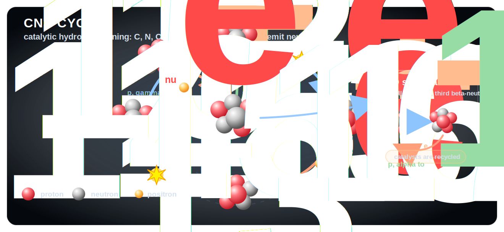
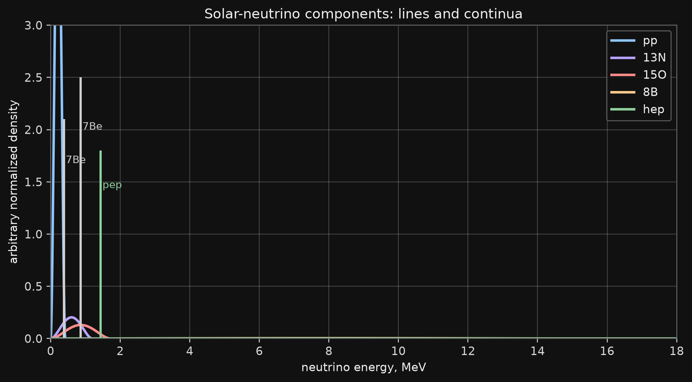
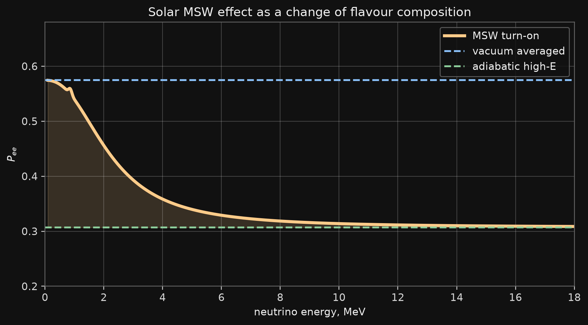
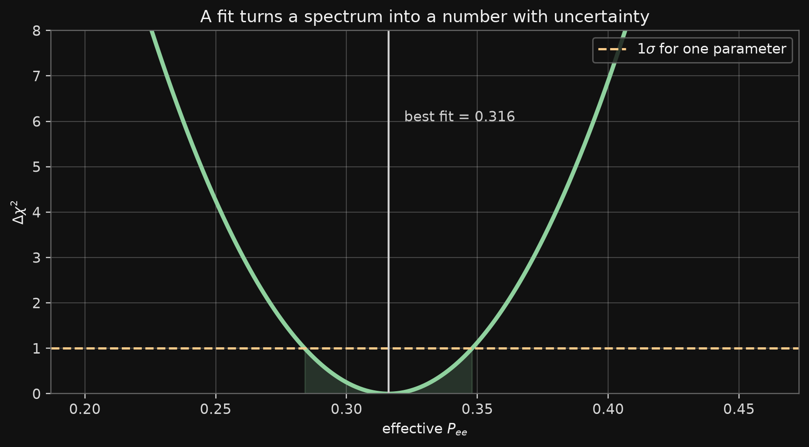

# Aim

## Aim

:::: {.panel-tabset .story-tabs}

### What This Lecture Is For

The masterclass is not a simulation contest. It is a short chain of physical arguments:

$$
\text{solar fusion}
\to
\text{neutrino fluxes}
\to
\text{flavour conversion}
\to
\text{detector events}
\to
\text{statistical inference}.
$$

The working notebooks will be simple. The physics behind the inputs should not be vague.

### Solar Numbers

The present photon luminosity of the Sun is

$$
L_\odot \simeq 3.83\times 10^{26}~\mathrm{J\,s^{-1}}
=3.83\times10^{26}~\mathrm{W}.
$$

The corresponding mass-equivalent loss is

$$
\dot M_\odot \simeq \frac{L_\odot}{c^2}
\simeq 4.3\times10^9~\mathrm{kg\,s^{-1}}.
$$

This is about four million tonnes per second.

### Power Density

The average power density over the whole solar volume is small:

$$
\frac{L_\odot}{(4\pi/3)R_\odot^3}
\simeq 0.27~\mathrm{W\,m^{-3}}.
$$

The core value is much larger, of order

$$
10^2~\mathrm{W\,m^{-3}},
$$

but still not large by terrestrial engineering standards. The Sun is bright because it is enormous and long-lived.

### References

- V. A. Naumov, **Solar Neutrinos. Astrophysical Aspects**, Phys. Part. Nucl. Lett. 8, 1141-1170 (2011).  

  - PDF: <https://www1.jinr.ru/Pepan_letters/panl_2011_7/05_VNaumov.pdf>

- The numerical reference curves used in the masterclass may be generated with PEANUTS:
  - T. E. Gonzalo and M. Lucente, **PEANUTS: Propagation and Evolution of Active NeUTrinoS**, arXiv:2303.15527.
  - code: <https://github.com/michelelucente/PEANUTS>

### What We Need for the Projects

Students will need four physical blocks:

::: {.compact}
- solar source: which reactions produce which neutrinos;
- propagation: how matter changes flavour composition;
- detection: what a water Cherenkov detector is sensitive to;
- inference: how a spectrum becomes a fitted number.
:::

::: {.takeaway}
The goal is not to reproduce a full solar-neutrino analysis. The goal is to know exactly what is simplified.
:::

::::

# Solar Burning

## Solar Burning

:::: {.panel-tabset .story-tabs}

### The Net Reaction

Hydrogen burning in the present Sun is summarized by

$$
4\,{}^1\mathrm{H}
\to
{}^4\mathrm{He}
 + 2e^+ + 2\nu_e + Q.
$$

Using atomic masses,

$$
Q \simeq
\left(4m_{\mathrm H}-m_{{}^4\mathrm{He}}\right)c^2
\simeq 26.73~\mathrm{MeV}.
$$

Neutrinos carry away part of this energy and leave the Sun almost immediately.

### Where the Neutrino Comes From

The formula below is not a decay of a free proton. A free proton cannot decay this way.

In the pp reaction, one proton is converted into a neutron while a bound deuteron is formed:

$$
p+p\to d+e^+ + \nu_e.
$$

At the quark level this is a charged-current weak transition,

$$
u\to d+W^+,
\qquad
W^+\to e^+ + \nu_e.
$$

The photon luminosity probes thermalized energy after transport through the solar plasma.  
Solar neutrinos probe the nuclear reactions much more directly.

### The Classical Barrier Problem

At the solar center,

$$
T_c \sim 1.5\times 10^7~\mathrm{K},
\qquad
kT_c \sim 1.3~\mathrm{keV}.
$$

The Coulomb energy for two protons at nuclear distances is of order MeV, not keV.

::: {.question}
Classically, proton fusion in the solar core is essentially impossible. Why does the Sun burn?
:::

### Quantum Tunneling

For two nuclei with charges $Z_a e$ and $Z_b e$,

$$
U(r)=\frac{Z_aZ_b\alpha}{r}.
$$

The barrier penetration factor has the form

$$
\exp[-2\pi\eta(E)].
$$

For nonrelativistic charged particles,

$$
2\pi\eta(E)=\sqrt{\frac{E_G}{E}},
\qquad
E_G=2\mu c^2(\pi\alpha Z_aZ_b)^2.
$$

The tunneling exponent decreases with energy; the thermal population decreases with energy. The Gamow peak comes from this competition.

### Reaction Rate

For a two-body reaction

$$
a+b\to c+\cdots,
$$

the local rate is

$$
R_{ab}=n_a n_b \langle \sigma_{ab} v\rangle.
$$

The cross section is usually written as

$$
\sigma(E)=\frac{S(E)}{E}\exp[-2\pi\eta(E)].
$$

$S(E)$ is the astrophysical $S$-factor: the slowly varying nuclear-physics part.

### Gamow Exponent

In a thermal plasma the integrand has the schematic form

$$
\exp\left[
-\frac{E}{kT}
-\sqrt{\frac{E_G}{E}}
\right].
$$

Define

$$
\Phi(E)=\frac{E}{kT}+\sqrt{\frac{E_G}{E}}.
$$

Equivalently, for a Coulomb barrier,

$$
\Phi(E)=bE+aE^{-1/2},
\qquad
b=\frac{1}{kT},\quad a=\sqrt{E_G}.
$$

Thus the exponent is a sum of an inverse-energy tunneling penalty and a linear Boltzmann penalty. For a Coulomb barrier the inverse-energy term is specifically proportional to $E^{-1/2}$.

The peak is near

$$
E_0=\left(\frac{E_G(kT)^2}{4}\right)^{1/3}.
$$

This is the quantitative meaning of the Gamow window.

### Gamow Window Applet

```{=html}
<div class="gamow-applet" id="gamow-applet">
  <div class="gamow-controls" aria-label="Choose solar reaction">
    <button type="button" data-reaction="pp" class="active">p + p</button>
    <button type="button" data-reaction="be7p">7Be + p</button>
    <button type="button" data-reaction="n14p">14N + p</button>
  </div>
  <div class="gamow-layout">
    <svg class="gamow-plot" viewBox="0 0 760 430" role="img" aria-label="Gamow window plot">
      <rect class="plot-bg" x="64" y="24" width="650" height="330"></rect>
      <g class="grid"></g>
      <path class="thermal"></path>
      <path class="tunnel"></path>
      <path class="window"></path>
      <line class="peak-line" x1="0" x2="0" y1="24" y2="354"></line>
      <text class="x-label" x="389" y="408">center-of-mass energy, keV</text>
      <text class="y-label" transform="translate(20 225) rotate(-90)">relative factor</text>
      <text class="legend thermal-label" x="495" y="58">thermal tail</text>
      <text class="legend tunnel-label" x="495" y="84">tunneling</text>
      <text class="legend window-label" x="495" y="110">Gamow window</text>
      <g class="axis-labels"></g>
    </svg>
    <div class="gamow-readout">
      <div class="reaction-name"></div>
      <div class="reaction-formula"></div>
      <div class="reaction-values"></div>
      <div class="reaction-note"></div>
    </div>
  </div>
</div>

<script>
(() => {
  const reactions = {
    pp: {
      name: "pp reaction",
      formula: "p + p -> d + e+ + nu_e",
      z1: 1, z2: 1, mu: 0.5, xmax: 35,
      note: "This is the weak first step of the pp chain."
    },
    be7p: {
      name: "8B production",
      formula: "7Be + p -> 8B + gamma",
      z1: 4, z2: 1, mu: 7 / 8, xmax: 70,
      note: "This reaction controls the high-energy 8B neutrino tail."
    },
    n14p: {
      name: "CNO bottleneck",
      formula: "14N + p -> 15O + gamma",
      z1: 7, z2: 1, mu: 14 / 15, xmax: 95,
      note: "This is a key slow reaction in the CNO cycle."
    }
  };

  const kT = 1.30; // keV, solar-core order-of-magnitude
  const EG_COEFF = 978.0; // keV for mu in amu: 2 mu c^2 (pi alpha Z1 Z2)^2
  const ns = "http://www.w3.org/2000/svg";

  function pathFrom(points, xScale, yScale) {
    return points.map((p, i) => `${i === 0 ? "M" : "L"}${xScale(p[0]).toFixed(2)},${yScale(p[1]).toFixed(2)}`).join(" ");
  }

  function initApplet(root) {
    if (!root || root.dataset.ready === "1") return;
    root.dataset.ready = "1";
    const svg = root.querySelector("svg");
    const grid = root.querySelector(".grid");
    const axisLabels = root.querySelector(".axis-labels");
    const paths = {
      thermal: root.querySelector(".thermal"),
      tunnel: root.querySelector(".tunnel"),
      window: root.querySelector(".window")
    };
    const peakLine = root.querySelector(".peak-line");
    const name = root.querySelector(".reaction-name");
    const formula = root.querySelector(".reaction-formula");
    const values = root.querySelector(".reaction-values");
    const note = root.querySelector(".reaction-note");
    const buttons = [...root.querySelectorAll("button[data-reaction]")];

    const x0 = 64, x1 = 714, y0 = 354, y1 = 24;
    const yMin = 1e-5, yMax = 1.4;
    const yScale = y => {
      const v = Math.max(yMin, Math.min(yMax, y));
      const t = (Math.log10(v) - Math.log10(yMin)) / (Math.log10(yMax) - Math.log10(yMin));
      return y0 - t * (y0 - y1);
    };

    function drawGrid(xmax) {
      grid.replaceChildren();
      axisLabels.replaceChildren();
      const xTicks = [0, xmax * 0.25, xmax * 0.5, xmax * 0.75, xmax];
      const yTicks = [1e-4, 1e-3, 1e-2, 1e-1, 1];
      for (const xt of xTicks) {
        const x = x0 + (xt / xmax) * (x1 - x0);
        const line = document.createElementNS(ns, "line");
        line.setAttribute("x1", x); line.setAttribute("x2", x);
        line.setAttribute("y1", y1); line.setAttribute("y2", y0);
        grid.appendChild(line);
        const text = document.createElementNS(ns, "text");
        text.setAttribute("x", x); text.setAttribute("y", 382);
        text.setAttribute("text-anchor", "middle");
        text.textContent = xt.toFixed(xt >= 10 ? 0 : 1);
        axisLabels.appendChild(text);
      }
      for (const yt of yTicks) {
        const y = yScale(yt);
        const line = document.createElementNS(ns, "line");
        line.setAttribute("x1", x0); line.setAttribute("x2", x1);
        line.setAttribute("y1", y); line.setAttribute("y2", y);
        grid.appendChild(line);
        const text = document.createElementNS(ns, "text");
        text.setAttribute("x", 52); text.setAttribute("y", y + 4);
        text.setAttribute("text-anchor", "end");
        text.textContent = yt === 1 ? "1" : `1e${Math.round(Math.log10(yt))}`;
        axisLabels.appendChild(text);
      }
    }

    function render(key) {
      const r = reactions[key];
      const EG = EG_COEFF * r.mu * (r.z1 * r.z2) ** 2;
      const E0 = Math.pow(EG * kT * kT / 4, 1 / 3);
      const xScale = E => x0 + (E / r.xmax) * (x1 - x0);
      const E = Array.from({length: 420}, (_, i) => 0.15 + i * (r.xmax - 0.15) / 419);
      const thermal = E.map(e => Math.exp(-e / kT));
      const tunnel = E.map(e => Math.exp(-Math.sqrt(EG / e)));
      const window = E.map((e, i) => thermal[i] * tunnel[i]);
      const normalize = arr => {
        const m = Math.max(...arr);
        return arr.map(v => v / m);
      };
      const series = {
        thermal: normalize(thermal),
        tunnel: normalize(tunnel),
        window: normalize(window)
      };
      drawGrid(r.xmax);
      paths.thermal.setAttribute("d", pathFrom(E.map((e, i) => [e, series.thermal[i]]), xScale, yScale));
      paths.tunnel.setAttribute("d", pathFrom(E.map((e, i) => [e, series.tunnel[i]]), xScale, yScale));
      paths.window.setAttribute("d", pathFrom(E.map((e, i) => [e, series.window[i]]), xScale, yScale));
      peakLine.setAttribute("x1", xScale(E0));
      peakLine.setAttribute("x2", xScale(E0));
      name.textContent = r.name;
      formula.textContent = r.formula;
      values.innerHTML = `Z1Z2 = ${r.z1 * r.z2}<br>mu = ${r.mu.toFixed(3)} amu<br>E_G = ${EG.toFixed(0)} keV<br>E0 = ${E0.toFixed(1)} keV`;
      note.textContent = r.note;
      buttons.forEach(b => b.classList.toggle("active", b.dataset.reaction === key));
    }

    buttons.forEach(button => button.addEventListener("click", () => render(button.dataset.reaction)));
    render("pp");
  }

  function initAll() {
    document.querySelectorAll(".gamow-applet").forEach(initApplet);
  }

  document.addEventListener("DOMContentLoaded", initAll);
  document.addEventListener("slidechanged", initAll);
})();
</script>
```

::: {.media-caption}
The applet uses $kT=1.30~\mathrm{keV}$ and $E_G=978\,\mu(Z_1Z_2)^2~\mathrm{keV}$ with $\mu$ in atomic mass units. The $^7\mathrm{Be}+p$ peak near 18 keV is the same scale discussed in electron-screening studies of $^8\mathrm{B}$ production.
:::

### Why the Sun Is Stable

The first pp reaction is weak and very slow:

$$
p+p\to d+e^+ + \nu_e.
$$

That slowness is not a defect. It sets the long main-sequence lifetime of the Sun.

The Sun shines because it contains an enormous number of particles, not because each cubic meter is a powerful reactor.

::::

# pp Chain

## pp Chain

:::: {.panel-tabset .story-tabs}

### Cycle Map

{.slide-image-center .nostretch fig-align="center" width="68%"}

::: {.media-caption}
pp-chain branches and approximate branching ratios.
:::

### First Step

The pp chain begins with

$$
p+p\to d+e^+ + \nu_e.
$$

The emitted neutrino has a continuous spectrum with endpoint about

$$
E_\nu^{\max}\simeq 0.42~\mathrm{MeV}.
$$

This is the largest solar-neutrino flux, but not the easiest component for water Cherenkov detectors.

### pep Line

The related three-body reaction is

$$
p+e^-+p\to d+\nu_e.
$$

It produces an almost monoenergetic neutrino:

$$
E_\nu \simeq 1.44~\mathrm{MeV}.
$$

The pep flux is much smaller than pp, but the line is physically clean.

### pp I Branch

After deuterium is produced,

$$
p+d\to {}^3\mathrm{He}+\gamma,
$$

and the pp I branch ends through

$$
{}^3\mathrm{He}+{}^3\mathrm{He}
\to
{}^4\mathrm{He}+2p.
$$

This branch produces pp neutrinos but no high-energy $^8\mathrm{B}$ neutrinos.

### pp II Branch

The chain can proceed through beryllium:

$$
{}^3\mathrm{He}+{}^4\mathrm{He}\to{}^7\mathrm{Be}+\gamma,
$$

followed by electron capture:

$$
{}^7\mathrm{Be}+e^-
\to
{}^7\mathrm{Li}+\nu_e.
$$

The main neutrino lines are approximately

$$
0.862~\mathrm{MeV}, \qquad 0.384~\mathrm{MeV}.
$$

### pp III Branch

The high-energy branch is rare:

$$
{}^7\mathrm{Be}+p\to{}^8\mathrm{B}+\gamma,
$$

then

$$
{}^8\mathrm{B}\to{}^8\mathrm{Be}^{*}+e^+ + \nu_e.
$$

The $^8\mathrm{B}$ flux is small, but its spectrum extends to high energy. This is why it is central for Super-Kamiokande-like measurements.

### hep Tail

The rare reaction

$$
{}^3\mathrm{He}+p\to{}^4\mathrm{He}+e^+ + \nu_e
$$

produces the highest-energy solar neutrinos.

The flux is tiny. The importance is not total rate, but the far high-energy tail.

::::

# CNO Cycle

## CNO Cycle

:::: {.panel-tabset .story-tabs}

### Cycle Map

{.slide-image-center .nostretch fig-align="center" width="70%"}

::: {.media-caption}
CNO catalytic loop and the smaller NO side branch.
:::

### CNO as a Catalyst Cycle

In the CNO cycle, carbon, nitrogen, and oxygen nuclei catalyze hydrogen burning.

The neutrino-producing beta decays are

$$
{}^{13}\mathrm{N}\to{}^{13}\mathrm{C}+e^+ + \nu_e,
$$

$$
{}^{15}\mathrm{O}\to{}^{15}\mathrm{N}+e^+ + \nu_e,
$$

$$
{}^{17}\mathrm{F}\to{}^{17}\mathrm{O}+e^+ + \nu_e.
$$

### Why CNO Matters

For the present Sun, the pp chain dominates the luminosity.

CNO neutrinos are still important because they probe:

::: {.compact}
- the metal abundance in the solar core;
- the temperature dependence of nuclear burning;
- the solar-composition problem in standard solar models.
:::

::: {.takeaway}
CNO neutrinos are a composition probe, not just another low-rate component.
:::

::::

# Solar Model Inputs

## Solar Model Inputs

:::: {.panel-tabset .story-tabs}

### Structure Equations

In Naumov's notation, the stellar-structure equations are

$$
\frac{dM}{dR}=4\pi R^2\rho,
\qquad
\frac{dP}{dR}=-\frac{GM\rho}{R^2},
$$

$$
\frac{dL}{dR}
=
4\pi R^2
\left[
\epsilon\rho
-\rho\frac{d}{dt}\left(\frac{u}{\rho}\right)
+\frac{P}{\rho}\frac{d\rho}{dt}
\right],
\qquad
\frac{dT}{dR}
=
\nabla\frac{T}{P}\frac{dP}{dR}.
$$

Here $M(R)$ is the shell mass, $L(R)$ is the energy flow through radius $R$, $u$ is the internal energy per unit volume, and

$$
\nabla=\frac{d\ln T}{d\ln P}.
$$

### Closure Equations

The four differential equations are not closed until the microphysics is specified:

$$
\rho=\rho(P,T,\{X_a\}),
\qquad
\kappa=\kappa(P,T,\{X_a\}),
\qquad
\epsilon=\epsilon(P,T,\{X_a\}).
$$

They provide the equation of state, opacity, and nuclear energy-generation rate. The pressure is, in general,

$$
P=P_{\rm gas}+P_{\rm rad}+\frac{B^2}{8\pi},
$$

with the magnetic term usually neglected in standard solar models.

### Transport Gradients

The temperature gradient is decomposed as

$$
\nabla
=
\nabla_{\rm rad}
+\nabla_{\rm cond}
+\nabla_{\rm conv}.
$$

For radiative transfer in local thermodynamic equilibrium,

$$
\nabla_{\rm rad}
=
\frac{3}{16\pi a\tilde c G}
\frac{\kappa P}{T^4}
\frac{L}{M}.
$$

Convection starts when the radiative gradient exceeds the adiabatic one:

$$
\nabla_{\rm rad}>
\nabla_{\rm ad},
\qquad
\nabla_{\rm ad}
=
\left(\frac{\partial\ln T}{\partial\ln P}\right)_s.
$$

This is why opacity, composition, and the treatment of convection enter solar-neutrino predictions.

### What Enters the Solar-Neutrino Calculation

For the masterclass we take as input:

::: {.compact}
- total fluxes $\Phi_i$;
- spectral shapes $f_i(E)$;
- radial production distributions;
- electron-density profile $n_e(r)$;
- uncertainties or toy nuisance parameters.
:::

We do not solve the solar model. We use its output.

### Flux Hierarchy

{.slide-image-center .nostretch fig-align="center" width="82%"}

::: {.media-caption}
Reference numbers in the project are pedagogical values. They must be replaced by a selected SSM table for publication-level work.
:::

### Energy Spectrum

{.slide-image-center .nostretch fig-align="center" width="84%"}

::: {.media-caption}
Schematic normalized shapes. The distinction between line and continuum sources matters for both oscillations and detection.
:::

### Radial Production

{.slide-image-center .nostretch fig-align="center" width="82%"}

::: {.media-caption}
High-temperature branches are more centrally concentrated. This matters because matter effects depend on the production density.
:::

### Important Warning

The flux hierarchy is not the detector hierarchy.

The detected spectrum depends on

$$
\Phi_i\,f_i(E)\,P_{ee}(E)\,\sigma(E)\,\epsilon(E).
$$

A huge low-energy flux can be invisible for a detector with a high threshold.

::::

# Oscillations

## Oscillations

:::: {.panel-tabset .story-tabs}

### Vacuum Mixing

In vacuum,

$$
|\nu_\alpha\rangle
=
\sum_i U_{\alpha i}^{*}|\nu_i\rangle.
$$

For solar neutrinos the dominant scale is

$$
\Delta m_{21}^2,
\qquad
\theta_{12}.
$$

The angle $\theta_{13}$ is small but not zero, so a precision treatment is three-flavour.

### Two-Flavour Evolution

For a first controlled model,

$$
i\frac{d}{dx}\nu_f=H_f(x)\nu_f,
\qquad
\nu_f=
\begin{pmatrix}
\nu_e\\
\nu_x
\end{pmatrix}.
$$

The Hamiltonian is

$$
H_f =
\frac{\Delta m^2}{4E}
\begin{pmatrix}
-\cos2\theta & \sin2\theta\\
\sin2\theta & \cos2\theta
\end{pmatrix}
+
\begin{pmatrix}
V_e(x) & 0\\
0 & 0
\end{pmatrix}.
$$

### MSW Formula Derivation

::: {.panel-tabset}

#### Vacuum

Subtracting an irrelevant trace, the two-state vacuum Hamiltonian is

$$
H_{\mathrm{vac}}
=
\frac{\Delta m^2}{4E}
\left(
-\cos2\theta\,\sigma_3
+\sin2\theta\,\sigma_1
\right).
$$

#### Matter

Coherent forward scattering adds

$$
H_{\mathrm{mat}}
=
\begin{pmatrix}
V_e & 0\\
0 & 0
\end{pmatrix},
\qquad
V_e=\sqrt{2}G_F n_e.
$$

After subtracting the trace, the matter term contributes $+V_e\sigma_3/2$.

#### Diagonalize

The effective Hamiltonian is diagonalized by $\theta_m$:

$$
\tan2\theta_m
=
\frac{\Delta m^2\sin2\theta}
{\Delta m^2\cos2\theta-2EV_e}.
$$

The denominator vanishes at the MSW resonance.

#### Limits

For averaged solar oscillations,

$$
P_{ee}^{\mathrm{low}}
\simeq
1-\frac{1}{2}\sin^2 2\theta_{12},
\qquad
P_{ee}^{\mathrm{high}}
\simeq
\sin^2\theta_{12}.
$$

:::

### Matter Potential

The charged-current forward-scattering term is

$$
V_e(x)=\sqrt{2}G_F n_e(x).
$$

Neutral-current terms common to active flavours do not affect two-flavour oscillation probabilities.

The sign of $V_e$ changes for antineutrinos.

### Mixing Angle in Matter

The effective mixing angle satisfies

$$
\tan2\theta_m
=
\frac{\Delta m^2\sin2\theta}
{\Delta m^2\cos2\theta-2EV_e}.
$$

The resonance condition is

$$
2EV_e=\Delta m^2\cos2\theta.
$$

This is the central MSW condition.

### Physical Limits

Low-energy solar neutrinos:

$$
P_{ee}^{\mathrm{low}}
\simeq
1-\frac{1}{2}\sin^2 2\theta_{12}.
$$

High-energy adiabatic MSW limit:

$$
P_{ee}^{\mathrm{high}}
\simeq
\sin^2\theta_{12}.
$$

The data connect these two limits through the transition region.

### MSW Turn-On

{.slide-image-center .nostretch fig-align="center" width="82%"}

::: {.media-caption}
The curve is a pedagogical shape. PEANUTS reference tables can be used in the notebooks for a more realistic three-flavour calculation.
:::

### Three-Flavour Solar Approximation

For many solar-neutrino calculations one can write schematically

$$
P_{ee}^{3\nu}
\simeq
\cos^4\theta_{13}\,
P_{ee}^{2\nu}
\left(n_e\cos^2\theta_{13}\right)
+
\sin^4\theta_{13}.
$$

This is not a new effect independent of MSW. It is the embedding of solar two-state evolution into the three-flavour PMNS framework.

### Decoherence

Solar neutrinos are produced over an extended region and detected after a long baseline.

For most solar-neutrino observables the oscillatory phases are averaged:

$$
P_{ee}
=
\sum_i
P(\nu_e\to\nu_i \text{ at Sun exit})
|U_{ei}|^2.
$$

This is why probabilities, not amplitudes with visible oscillation fringes, appear in the masterclass.

::::

# Earth Matter

## Earth Matter

:::: {.panel-tabset .story-tabs}

### Day and Night

During the day, solar neutrinos reach the detector without crossing the Earth.

At night they can propagate through Earth matter before detection.

This modifies the mass-state mixture projected onto $\nu_e$:

$$
P_{ee}^{\mathrm{night}}(E,\eta)
\ne
P_{ee}^{\mathrm{day}}(E).
$$

$\eta$ denotes the nadir angle.

### Regeneration

The Earth matter correction is usually small:

$$
\Delta P_{ee}^{\oplus}
=
P_{ee}^{\mathrm{night}}-P_{ee}^{\mathrm{day}}.
$$

It is nevertheless coherent and measurable statistically in large detectors.

{.slide-image-center .nostretch fig-align="center" width="78%"}

### Day-Night Asymmetry

A common observable is

$$
A_{\mathrm{DN}}
=
2\frac{N_{\mathrm{night}}-N_{\mathrm{day}}}
{N_{\mathrm{night}}+N_{\mathrm{day}}}.
$$

It is not just a probability measurement. It includes:

::: {.compact}
- solar spectrum;
- detector threshold;
- cross section;
- exposure as a function of nadir angle;
- backgrounds and systematics.
:::

::::

# Detection

## Detection

:::: {.panel-tabset .story-tabs}

### Water Cherenkov Channel

For a Super-Kamiokande-like detector the main solar channel is elastic scattering:

$$
\nu + e^- \to \nu + e^-.
$$

It is directional and sensitive mainly to high-energy solar neutrinos.

$\nu_e$ has charged-current and neutral-current contributions.  
$\nu_\mu$ and $\nu_\tau$ have only neutral-current contributions.

### Elastic Scattering Cross Section

For neutrino-electron scattering, neglecting radiative corrections, the differential cross section has the structure

$$
\frac{d\sigma}{dT}
=
\frac{2G_F^2m_e}{\pi}
\left[
g_L^2
+g_R^2\left(1-\frac{T}{E_\nu}\right)^2
-g_Lg_R\frac{m_eT}{E_\nu^2}
\right].
$$

The coupling constants differ between $\nu_e e$ and $\nu_{\mu,\tau}e$ scattering.

### Weak Couplings

Using $s_W^2=\sin^2\theta_W\simeq0.231$:

| channel | $g_L$ | value | $g_R$ | value |
|---|---:|---:|---:|---:|
| $\nu_e e\to\nu_e e$ | $\frac{1}{2}+s_W^2$ | $0.731$ | $s_W^2$ | $0.231$ |
| $\nu_{\mu,\tau}e\to\nu_{\mu,\tau}e$ | $-\frac{1}{2}+s_W^2$ | $-0.269$ | $s_W^2$ | $0.231$ |

::: {.small}
For antineutrinos the roles of $g_L$ and $g_R$ are interchanged in the recoil-energy dependence.
:::

### Approximate Total Cross Sections

{.slide-image-center .nostretch fig-align="center" width="62%"}

::: {.media-caption}
Linear high-energy approximations in cm$^2$ for solar-neutrino energies. The full recoil spectrum is used only in precision analyses.
:::

### Event Rate

A realistic binned prediction has the form

$$
\mu_i =
N_eT
\int_{E_i}^{E_{i+1}}dE_{\mathrm{rec}}
\int dE_\nu\,
\Phi(E_\nu)
P_{\alpha}(E_\nu)
\frac{d\sigma_\alpha}{dT_e}
R(E_{\mathrm{rec}},T_e)
\epsilon(E_{\mathrm{rec}}).
$$

The masterclass uses a controlled reduction of this expression.

### Masterclass Rate Model

The working approximation is

$$
\mu_i =
A
\int_{E_i}^{E_{i+1}}
dE\,
\Phi_{^8\mathrm{B}}(E)
f_{^8\mathrm{B}}(E)
\left[
P_{ee}(E)\sigma_e(E)
+(1-P_{ee}(E))\sigma_x(E)
\right]
\epsilon(E)
+
b_i.
$$

This is enough for threshold studies, pseudoexperiments, and a first likelihood scan.

It is not a detector Monte Carlo.

::::

# Statistical Inference

## Statistical Inference

:::: {.panel-tabset .story-tabs}

### Pseudoexperiment

For binned expected counts $\mu_i$,

$$
n_i \sim \mathrm{Poisson}(\mu_i).
$$

A fixed random seed gives a reproducible pseudoexperiment for all students.

The point is to separate the true model from one possible observed dataset.

### Poisson Chi-Square

For counting data use

$$
\chi^2
=
2\sum_i
\left[
\mu_i-n_i+n_i\ln\frac{n_i}{\mu_i}
\right].
$$

For $n_i=0$, the logarithmic term is defined as zero.

### Fit Output

{.slide-image-center .nostretch fig-align="center" width="82%"}

::: {.media-caption}
A masterclass result should be a number with an uncertainty, not only a plot.
:::

::::

# Projects

## Projects

:::: {.panel-tabset .story-tabs}

### Two Working Sessions

:::: {.columns}

::: {.column width="50%"}
Session 1:

::: {.compact}
- load tables;
- plot $q_i(r)$ and $4\pi r^2q_i(r)$;
- plot spectra;
- compute no-oscillation events;
- choose the main project question.
:::
:::

::: {.column width="50%"}
Session 2:

::: {.compact}
- add $P_{ee}^{day}$ and $P_{ee}^{night}$;
- update event counts;
- build pseudo-data;
- compute $\Delta\chi^2$;
- write the final formulation.
:::
:::

::::

### Project 1: SK-like and B8

Question:

::: {.question}
How do threshold and cross section make $^8\mathrm{B}$ the dominant visible source in an SK-like detector?
:::

Defense content:

::: {.compact}
- source fraction as a function of threshold;
- visible spectrum $dN/dT_e$;
- oscillation effect;
- fit of the $^8\mathrm{B}$ normalization or $P_{ee}^{eff}$.
:::

### Project 2: Borexino-like

Question:

::: {.question}
Which sources determine the low-energy spectrum, and can $^7\mathrm{Be}$, pep, and CNO be separated?
:::

Defense content:

::: {.compact}
- pp, $^7\mathrm{Be}$, pep, and CNO contributions;
- electron spectrum at low energies;
- pseudoexperiment;
- fit of the $^7\mathrm{Be}$ or CNO scale.
:::

### Project 3: Day-Night

Question:

::: {.question}
What can be extracted from comparing daytime and nighttime spectra?
:::

Defense content:

::: {.compact}
- $P_{ee}^{night}-P_{ee}^{day}$;
- day and night event templates;
- $A_{\mathrm{DN}}$;
- fit of the Earth-effect scale.
:::

### What Must Be Stated Explicitly

Each group must say:

::: {.compact}
- which input came from a solar model or PEANUTS;
- where the teaching detector model begins;
- which parameter is fitted;
- which $\Delta\chi^2$ level is used;
- what must be replaced for a real SK, Borexino, SNO, or JUNO analysis.
:::

::: {.takeaway}
The defense is successful when both the number and the approximation boundaries are visible.
:::

### Final Map

$$
\begin{aligned}
\text{Sun}
&:
\text{sources}\to\text{radius}\to\text{spectra},\\
\text{oscillations}
&:
\text{MSW}\to\text{Earth}\to P_{ee},\\
\text{project}
&:
\text{events}\to\chi^2\to\text{defensible conclusion}.
\end{aligned}
$$

The notebooks should be simple because the physical objects have already been defined.

::::
