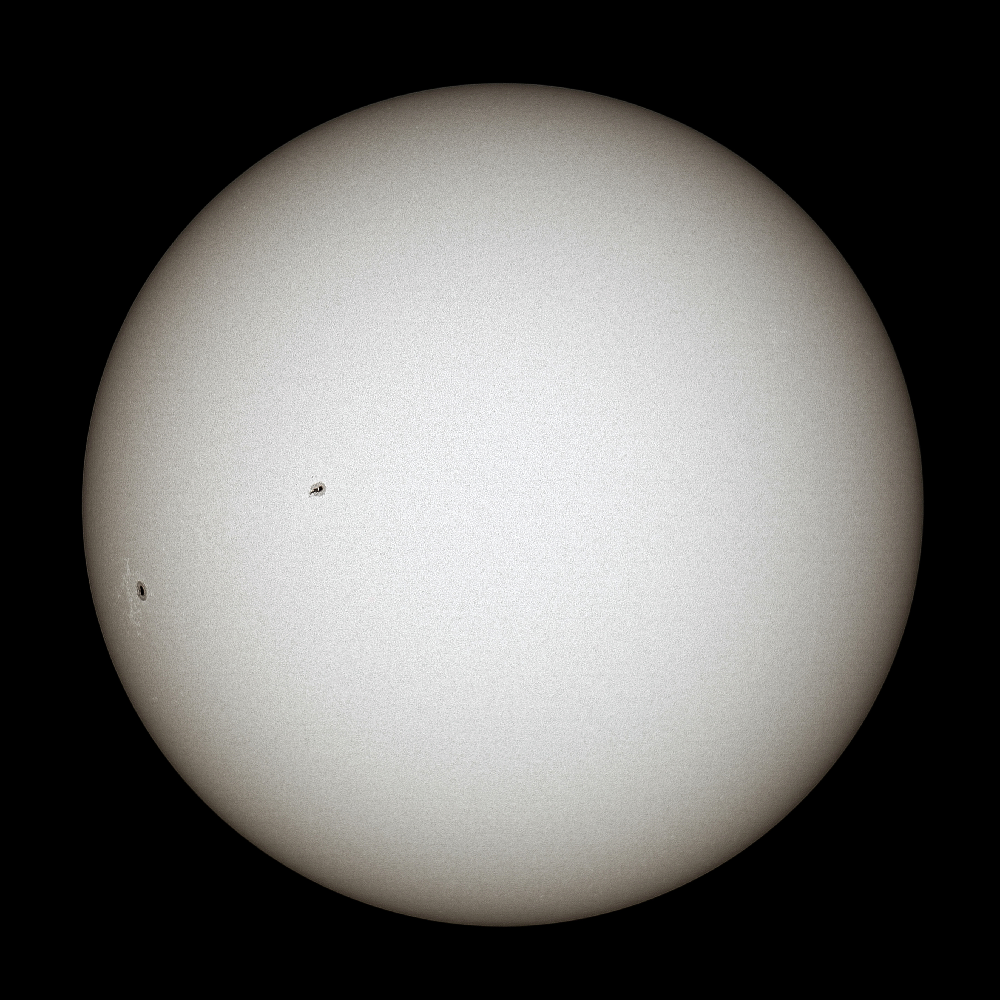
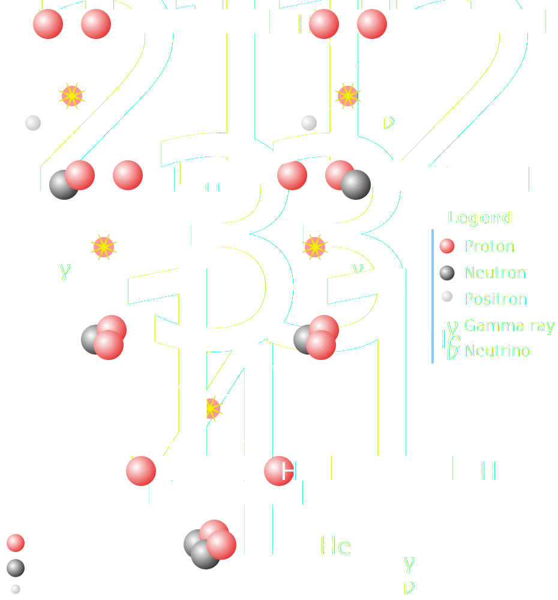
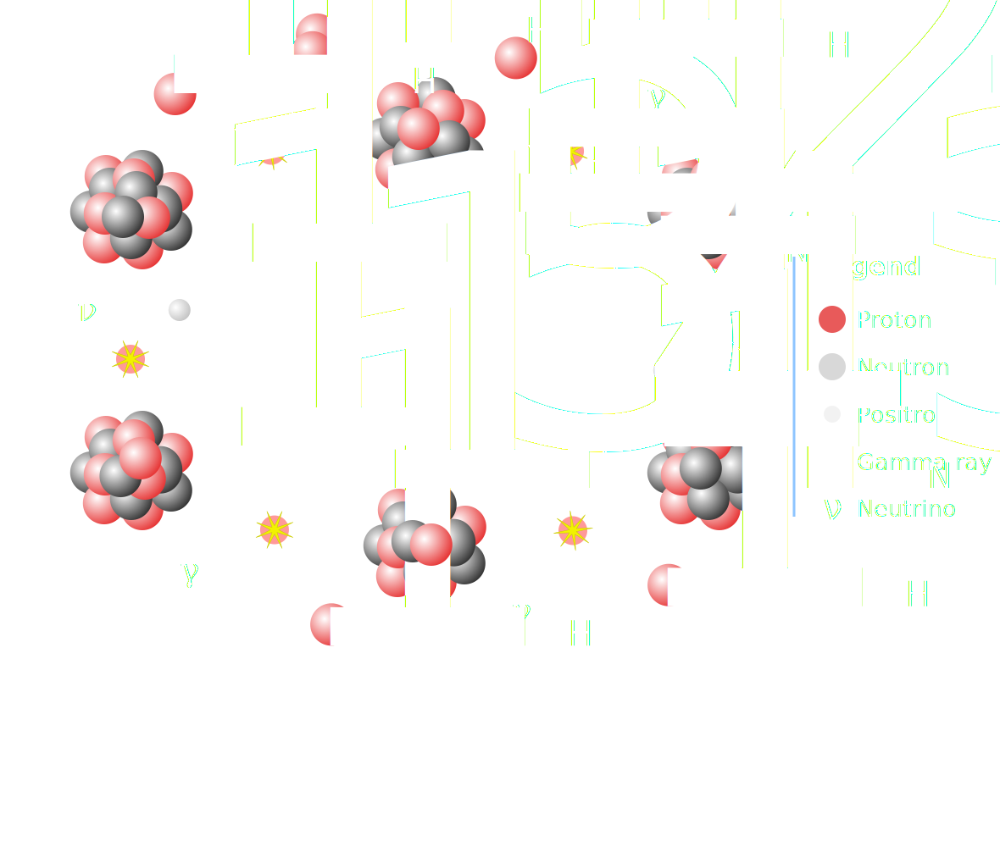
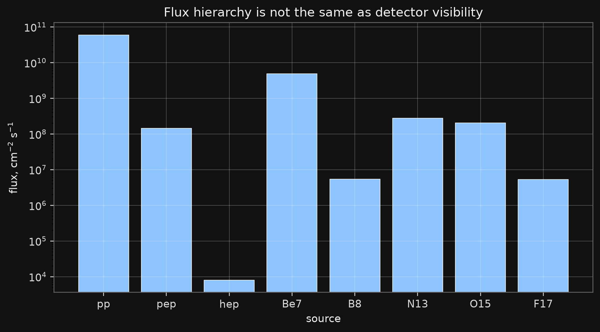
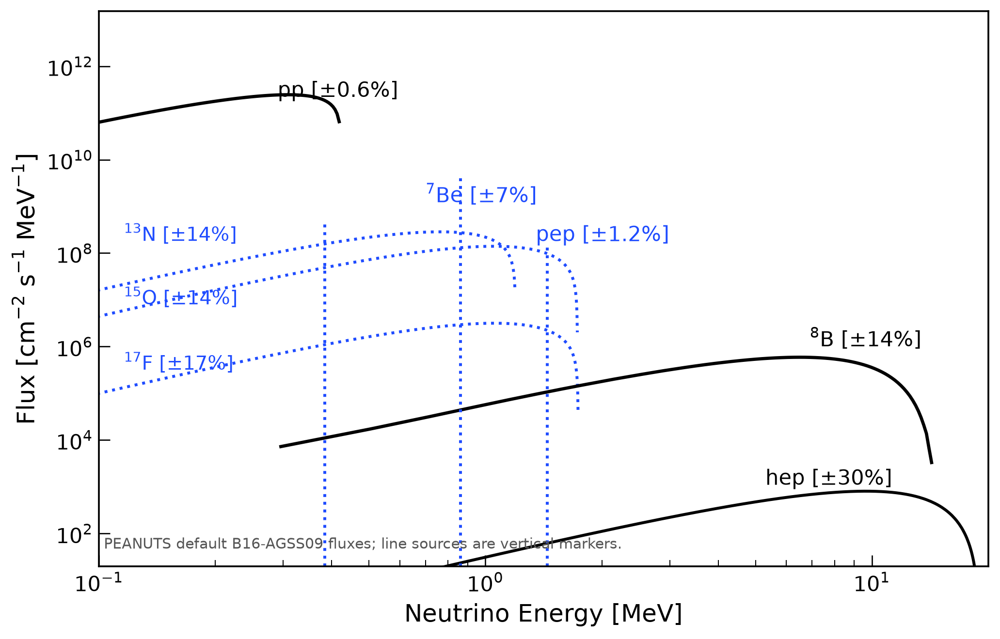
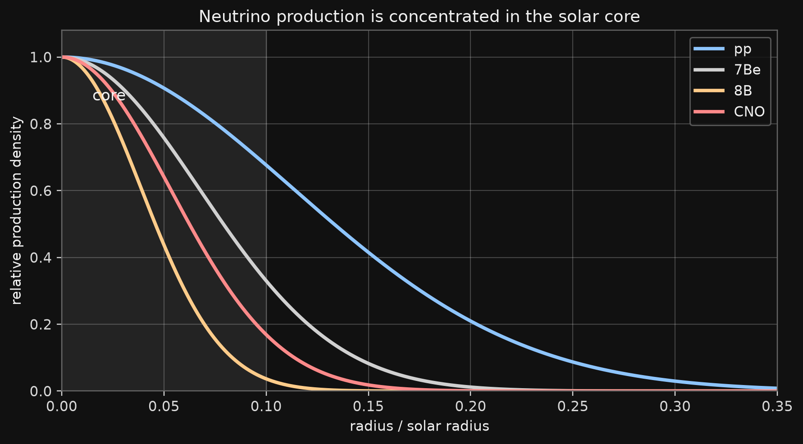

# What we cover in this lecture

:::: {.columns}

::: {.column width=60%}

- energy production mechanisms

- neutrino production and fluxes

- neutrino oscillations in vacuum and matter

- neutrino interactions in a detector

- statistical inference

- convention: $\hbar=c=1$; SI factors are restored only for quoted engineering numbers.

:::

::: {.column width=40%}

{fig-align="center" width="100%"}
:::

::::

## Luminosity

:::: {.columns}

::: {.column width="50%"}

- The present photon luminosity of the Sun is
$$
L_\odot \simeq 3.83\times 10^{26}~\mathrm{J\,s^{-1}}
=3.83\times10^{26}~\mathrm{W}.
$$

  - In natural units, mass and energy have the same units.

  - Restoring SI units only for the kg/s conversion gives
  $$
  \dot M_\odot^{\rm SI}
  \simeq 4.3\times10^9~\mathrm{kg\,s^{-1}}.
  $$

  - This is about four million tonnes per second.
:::

::: {.column width="50%"}

{.slide-image-center .nostretch fig-align="center" width="68%"}

:::

::::


# Why the Sun Burns

## Nuclear Fusion

- Start with two protons approaching each other.

- The strong force acts only at nuclear distances, $r\sim (1-2)~\mathrm{fm}$.

- In natural units the Coulomb repulsion energy is
$$
U_C(r)
=
\frac{\alpha}{r}.
$$

- Numerically, when $r$ is quoted in fm,

$$
U_C(r)
\simeq
1.44~\mathrm{MeV}\left(\frac{1~\mathrm{fm}}{r}\right).
$$

## Classical Barrier

- At the solar center:

$$
T_c \sim 1.5\times 10^7~\mathrm{K},
\qquad
kT_c \sim 1.3\,~\mathrm{keV}.
$$

- The thermal energy scale is tiny:
$$
k_BT_c \approx 1.3~\mathrm{keV}
\ll
U_C(1~\mathrm{fm}) \approx 1.44~\mathrm{MeV}.
$$

- Even the mean kinetic energy, $(3/2)k_BT_c\approx 1.9~\mathrm{keV}$, is far below the barrier.

## Maxwell Tail

- A purely classical proton must come from the extreme Maxwell tail:
$$
\exp\!\left[-\frac{E_C}{k_BT_c}\right]
=
\exp\!\left[-\frac{1.44~\mathrm{MeV}}{1.29~\mathrm{keV}}\right]
\approx
\exp(-1110)
\approx
10^{-484}.
$$

## Classical Failure

- With deliberately generous core numbers, the geometric collision rate is enormous:

$$
\dot N_{\rm geom}\sim 4\times10^{64}\ \mathrm{s^{-1}}.
$$

- The classical over-the-barrier penalty is the Maxwell tail:

$$
\dot N_{\rm class}
\sim
\dot N_{\rm geom}\,10^{-484}
\sim
6\times10^{-420}\ \mathrm{s^{-1}}.
$$

- Even assigning $30~\mathrm{MeV}$ to every successful encounter gives

$$
P_{\rm class}\sim3\times10^{-431}\ \mathrm{W}.
$$

## Classical Failure

- The observed solar photon luminosity is
$$
L_\odot^{\rm obs}
\simeq
3.83\times10^{26}~\mathrm{W}.
$$

- Thus
$$
\frac{P_{\rm class}}{L_\odot^{\rm obs}}
\sim
8\times10^{-458}.
$$

- Classical burning gives no Sun.

- The Sun shines because fusion is a quantum tunneling problem.

## The Net Reaction

- Hydrogen burning in the present Sun is summarized by

$$
4\,{}^1\mathrm{H}
\to
{}^4\mathrm{He}
 + 2e^+ + 2\nu_e + Q.
$$

- Using atomic masses as rest energies,

$$
Q \simeq
4m_{\mathrm H}-m_{{}^4\mathrm{He}}
\simeq 26.73~\mathrm{MeV}.
$$

- Neutrinos carry away part of this energy and leave the Sun.

## Why the Sun Is Stable

- The first pp reaction is weak and very slow:

$$
p+p\to d+e^+ + \nu_e.
$$

- That slowness is not a defect. It sets the long main-sequence lifetime of the Sun.

- Later steps are mostly strong or electromagnetic and are much faster.

- The Sun is a thermostat: if the core heats up, fusion increases, pressure rises, the core expands, and it cools.

- By the way, if there is no neutrino:
  - No Sun.
  - No Life.

# Tunneling and Thermal Averaging

## Coulomb Barrier

- For two nuclei with charges $Z_a e$ and $Z_b e$,

$$
U(r)=\frac{Z_aZ_b\alpha}{r}.
$$

- Classically, a particle with energy $E<U(r)$ cannot enter the nuclear region.

- Quantum mechanically, the wave function continues under the barrier and is exponentially suppressed.

## WKB Probability

- For the relative coordinate of two nuclei, use the one-dimensional radial WKB estimate.

- In the forbidden region, $U(r)>E$, define

$$
\kappa(r)
=
\sqrt{2\mu\,[U(r)-E]} .
$$

- The wave amplitude decreases as

$$
\psi(r)\propto
\exp\!\left[-\int \kappa(r)\,dr\right].
$$

## WKB Probability

- Therefore the probability contains the square of this exponential:

$$
P(E)
\sim
\exp\!\left[
-2
\int_{r_N}^{r_C}
\sqrt{2\mu\,[U(r)-E]}\,dr
\right].
$$

- Here $\mu$ is the reduced mass, $r_N$ is a nuclear radius, and $r_C$ is the outer turning point.

## Gamow Factor

- For $r_N\ll r_C$, the WKB integral gives the Gamow factor:

$$
P(E)\simeq \exp[-2\pi\eta(E)].
$$

- Indeed,

$$
2I
\simeq
2
\sqrt{2\mu E}\,r_C\,\frac{\pi}{2}
=
2\pi\eta(E).
$$

- For nonrelativistic charged particles, $v=\sqrt{2E/\mu}$ and

$$
2\pi\eta(E)
=
\frac{2\pi Z_aZ_b\alpha}{v}
=
\sqrt{\frac{E_G}{E}},
\qquad
E_G
=
2\mu(\pi\alpha Z_aZ_b)^2.
$$

## Thermal Averaging

- Thermal averaging:

$$
\langle\sigma v\rangle
=
\left(\frac{8}{\pi\mu}\right)^{1/2}
\frac{1}{(kT)^{3/2}}
\int_0^\infty \sigma(E)\,E\,e^{-E/kT}\,dE .
$$

- For charged particles,

$$
\sigma(E)=
\frac{S(E)}{E}
\exp\!\left[-\sqrt{\frac{E_G}{E}}\right].
$$

## Thermal Averaging

- This leads to the Gamow peak and the Gamow window:

$$
\langle\sigma v\rangle
\propto  S(E)\exp\!\left[-\frac{E}{kT}-\sqrt{\frac{E_G}{E}}\right].
$$


## Gamow Window Applet

```{=html}
<div class="gamow-applet" id="gamow-applet">
  <div class="gamow-controls" aria-label="Choose solar reaction">
    <button type="button" data-reaction="pp" class="active">p + p</button>
    <button type="button" data-reaction="be7p">7Be + p</button>
    <button type="button" data-reaction="n14p">14N + p</button>
  </div>
  <div class="gamow-layout">
    <svg class="gamow-plot" viewBox="0 0 760 430" role="img" aria-label="Gamow window plot">
      <rect class="plot-bg" x="64" y="24" width="650" height="330"></rect>
      <g class="grid"></g>
      <path class="thermal"></path>
      <path class="tunnel"></path>
      <path class="window"></path>
      <line class="peak-line" x1="0" x2="0" y1="24" y2="354"></line>
      <text class="x-label" x="389" y="408">center-of-mass energy, keV</text>
      <text class="y-label" transform="translate(20 225) rotate(-90)">relative factor</text>
      <text class="legend thermal-label" x="495" y="58">thermal tail</text>
      <text class="legend tunnel-label" x="495" y="84">tunneling</text>
      <text class="legend window-label" x="495" y="110">Gamow window</text>
      <g class="axis-labels"></g>
    </svg>
    <div class="gamow-readout">
      <div class="reaction-name"></div>
      <div class="reaction-formula"></div>
      <div class="reaction-values"></div>
      <div class="reaction-note"></div>
      <div class="gamow-assumption">
        Uses $kT=1.30~\mathrm{keV}$ and
        $E_G=978\,\mu(Z_1Z_2)^2~\mathrm{keV}$, with $\mu$ in atomic mass units.
        The ${}^7\mathrm{Be}+p$ peak is near $18~\mathrm{keV}$.
      </div>
    </div>
  </div>
</div>

<script>
(() => {
  const reactions = {
    pp: {
      name: "pp reaction",
      formula: "p + p -> d + e+ + nu_e",
      z1: 1, z2: 1, mu: 0.5, xmax: 35,
      note: "This is the weak first step of the pp chain."
    },
    be7p: {
      name: "8B production",
      formula: "7Be + p -> 8B + gamma",
      z1: 4, z2: 1, mu: 7 / 8, xmax: 70,
      note: "This reaction controls the high-energy 8B neutrino tail."
    },
    n14p: {
      name: "CNO bottleneck",
      formula: "14N + p -> 15O + gamma",
      z1: 7, z2: 1, mu: 14 / 15, xmax: 95,
      note: "This is a key slow reaction in the CNO cycle."
    }
  };

  const kT = 1.30; // keV, solar-core order-of-magnitude
  const EG_COEFF = 978.0; // keV for mu in amu, after converting amu to energy
  const ns = "http://www.w3.org/2000/svg";

  function pathFrom(points, xScale, yScale) {
    return points.map((p, i) => `${i === 0 ? "M" : "L"}${xScale(p[0]).toFixed(2)},${yScale(p[1]).toFixed(2)}`).join(" ");
  }

  function initApplet(root) {
    if (!root || root.dataset.ready === "1") return;
    root.dataset.ready = "1";
    const svg = root.querySelector("svg");
    const grid = root.querySelector(".grid");
    const axisLabels = root.querySelector(".axis-labels");
    const paths = {
      thermal: root.querySelector(".thermal"),
      tunnel: root.querySelector(".tunnel"),
      window: root.querySelector(".window")
    };
    const peakLine = root.querySelector(".peak-line");
    const name = root.querySelector(".reaction-name");
    const formula = root.querySelector(".reaction-formula");
    const values = root.querySelector(".reaction-values");
    const note = root.querySelector(".reaction-note");
    const buttons = [...root.querySelectorAll("button[data-reaction]")];

    const x0 = 64, x1 = 714, y0 = 354, y1 = 24;
    const yMin = 1e-10, yMax = 1.4;
    const yScale = y => {
      const v = Math.max(yMin, Math.min(yMax, y));
      const t = (Math.log10(v) - Math.log10(yMin)) / (Math.log10(yMax) - Math.log10(yMin));
      return y0 - t * (y0 - y1);
    };

    function drawGrid(xmax) {
      grid.replaceChildren();
      axisLabels.replaceChildren();
      const xTicks = [0, xmax * 0.25, xmax * 0.5, xmax * 0.75, xmax];
      const yTicks = [1e-10, 1e-8, 1e-6, 1e-4, 1e-2, 1];
      for (const xt of xTicks) {
        const x = x0 + (xt / xmax) * (x1 - x0);
        const line = document.createElementNS(ns, "line");
        line.setAttribute("x1", x); line.setAttribute("x2", x);
        line.setAttribute("y1", y1); line.setAttribute("y2", y0);
        grid.appendChild(line);
        const text = document.createElementNS(ns, "text");
        text.setAttribute("x", x); text.setAttribute("y", 382);
        text.setAttribute("text-anchor", "middle");
        text.textContent = xt.toFixed(xt >= 10 ? 0 : 1);
        axisLabels.appendChild(text);
      }
      for (const yt of yTicks) {
        const y = yScale(yt);
        const line = document.createElementNS(ns, "line");
        line.setAttribute("x1", x0); line.setAttribute("x2", x1);
        line.setAttribute("y1", y); line.setAttribute("y2", y);
        grid.appendChild(line);
        const text = document.createElementNS(ns, "text");
        text.setAttribute("x", 52); text.setAttribute("y", y + 4);
        text.setAttribute("text-anchor", "end");
        text.textContent = yt === 1 ? "1" : `1e${Math.round(Math.log10(yt))}`;
        axisLabels.appendChild(text);
      }
    }

    function render(key) {
      const r = reactions[key];
      const EG = EG_COEFF * r.mu * (r.z1 * r.z2) ** 2;
      const E0 = Math.pow(EG * kT * kT / 4, 1 / 3);
      const xScale = E => x0 + (E / r.xmax) * (x1 - x0);
      const E = Array.from({length: 420}, (_, i) => 0.15 + i * (r.xmax - 0.15) / 419);
      const thermal = E.map(e => Math.exp(-e / kT));
      const tunnel = E.map(e => Math.exp(-Math.sqrt(EG / e)));
      const window = E.map((e, i) => thermal[i] * tunnel[i]);
      const normalize = arr => {
        const m = Math.max(...arr);
        return arr.map(v => v / m);
      };
      const series = {
        thermal: normalize(thermal),
        tunnel: normalize(tunnel),
        window: normalize(window)
      };
      drawGrid(r.xmax);
      paths.thermal.setAttribute("d", pathFrom(E.map((e, i) => [e, series.thermal[i]]), xScale, yScale));
      paths.tunnel.setAttribute("d", pathFrom(E.map((e, i) => [e, series.tunnel[i]]), xScale, yScale));
      paths.window.setAttribute("d", pathFrom(E.map((e, i) => [e, series.window[i]]), xScale, yScale));
      peakLine.setAttribute("x1", xScale(E0));
      peakLine.setAttribute("x2", xScale(E0));
      name.textContent = r.name;
      formula.textContent = r.formula;
      values.innerHTML = `Z1Z2 = ${r.z1 * r.z2}<br>mu = ${r.mu.toFixed(3)} amu<br>E_G = ${EG.toFixed(0)} keV<br>E0 = ${E0.toFixed(1)} keV`;
      note.textContent = r.note;
      buttons.forEach(b => b.classList.toggle("active", b.dataset.reaction === key));
    }

    buttons.forEach(button => button.addEventListener("click", () => render(button.dataset.reaction)));
    render("pp");
  }

  function initAll() {
    document.querySelectorAll(".gamow-applet").forEach(initApplet);
  }

  document.addEventListener("DOMContentLoaded", initAll);
  document.addEventListener("slidechanged", initAll);
})();
</script>
```


# Solar Neutrino Sources

## pp Chain
:::: {.columns }

::: {.column width=30%}

- In the present Sun, the pp chain is the main hydrogen-burning cycle and the dominant source of solar luminosity.
:::


::: {.column width=70%}
{.slide-image-center .nostretch fig-align="center" width="70%"}
:::

::::

## CNO Cycle

{.slide-image-center .nostretch fig-align="center" width="65%"}

::: {.media-caption}
CNO catalytic loop and the smaller NO side branch.
:::

## Why CNO Matters

For the present Sun, the pp chain dominates the luminosity.

CNO neutrinos are still important because they probe:

::: {.compact}
- the metal abundance in the solar core;
- the temperature dependence of nuclear burning;
- the solar-composition problem in standard solar models.
:::

::: {.takeaway}
CNO neutrinos are a composition probe, not just another low-rate component.
:::

## Flux Hierarchy

:::: {.columns}

::: {.column width=60%}

{.slide-image-center .nostretch fig-align="center" width="100%"}

:::

::: {.column width=40%}

Reference numbers in the project are pedagogical values. They must be replaced by a selected SSM table for publication-level work.
:::

::::

## Solar Neutrino Spectrum

:::: {.columns}

::: {.column width=60%}

{.slide-image-center .nostretch fig-align="center" width="100%"}

:::

::: {.column width=40%}

The masterclass uses generated tables. This plot is built from fluxes and normalized spectral shapes.
:::

::::

## Radial Production

:::: {.columns}

::: {.column width=60%}

{.slide-image-center .nostretch fig-align="center" width="100%"}

:::

::: {.column width=40%}

High-temperature branches are more centrally concentrated. This matters because matter effects depend on the production density.
:::

::::

## Important Warning

The flux hierarchy is not the detector hierarchy.

The detected spectrum depends on

$$
\frac{d\Phi_i}{dE}\,P_{ee}(E)\,\sigma(E)\,\epsilon(E).
$$

A huge low-energy flux can be invisible for a detector with a high threshold.


# Flavor Conversion

## Lepton Mixing

- Flavour states are not mass states.

$$
\begin{pmatrix}
|\nu_e\rangle\\
|\nu_\mu\rangle
\end{pmatrix}
=
\begin{pmatrix}
\cos\theta & \sin\theta\\
-\sin\theta & \cos\theta
\end{pmatrix}
\begin{pmatrix}
|\nu_1\rangle\\
|\nu_2\rangle
\end{pmatrix}.
$$

- Equivalently,

$$
|\nu_e\rangle=\cos\theta\,|\nu_1\rangle+\sin\theta\,|\nu_2\rangle,
\qquad
|\nu_\mu\rangle=-\sin\theta\,|\nu_1\rangle+\cos\theta\,|\nu_2\rangle.
$$

- The angle $\theta$ measures how different the weak-interaction basis is from the propagation basis.

## Probability

:::: {.columns}

::: {.column width="45%"}


**Phase**

$$
E_i\simeq p+\frac{m_i^2}{2E},
\qquad
\Delta\phi
=
\frac{\Delta m^2 L}{2E}.
$$

$$
\frac{\Delta m^2L}{4E}
=
1.267\,
\frac{\Delta m^2[\mathrm{eV}^2]\,L[\mathrm{km}]}
{E[\mathrm{GeV}]}.
$$

**Two-flavour probabilities**

$$
P_{ee}
=
1-\sin^2 2\theta\,
\sin^2\!\left(\frac{\Delta m^2L}{4E}\right),
$$

$$
P_{e\mu}
=
\sin^2 2\theta\,
\sin^2\!\left(\frac{\Delta m^2L}{4E}\right).
$$


:::

::: {.column width="55%"}

```{=html}
<svg viewBox="0 0 760 300" role="img" aria-label="Two-flavour oscillation probability as a function of L over E" style="width:100%;height:auto;">
  <rect x="38" y="18" width="704" height="252" rx="10" fill="#101010" stroke="#555"/>
  <line x1="70" y1="240" x2="720" y2="240" stroke="#bdbdbd" stroke-width="2"/>
  <line x1="70" y1="40" x2="70" y2="240" stroke="#bdbdbd" stroke-width="2"/>
  <g stroke="rgba(255,255,255,.18)" stroke-width="1">
    <line x1="70" y1="140" x2="720" y2="140"/>
    <line x1="232.5" y1="40" x2="232.5" y2="240"/>
    <line x1="395" y1="40" x2="395" y2="240"/>
    <line x1="557.5" y1="40" x2="557.5" y2="240"/>
    <line x1="720" y1="40" x2="720" y2="240"/>
  </g>
  <path d="M70 40 C100 40 121 209 151 209 S203 40 232.5 40 S284 209 314 209 S366 40 395 40 S447 209 476 209 S528 40 557.5 40 S609 209 639 209 S690 40 720 40" fill="none" stroke="#8ec5ff" stroke-width="4"/>
  <path d="M70 240 C100 240 121 71 151 71 S203 240 232.5 240 S284 71 314 71 S366 240 395 240 S447 71 476 71 S528 240 557.5 240 S609 71 639 71 S690 240 720 240" fill="none" stroke="#ffcc8a" stroke-width="4"/>
  <g fill="#ddd" font-family="DejaVu Sans, sans-serif" font-size="18">
    <text x="43" y="245">0</text>
    <text x="32" y="146">0.5</text>
    <text x="43" y="46">1</text>
    <text x="63" y="266">0</text>
    <text x="221" y="266">π</text>
    <text x="381" y="266">2π</text>
    <text x="544" y="266">3π</text>
    <text x="704" y="266">4π</text>
    <text x="260" y="292">phase ∝ Δm² L / E</text>
    <text x="545" y="70" fill="#8ec5ff">Pee</text>
    <text x="545" y="100" fill="#ffcc8a">Peμ</text>
  </g>
</svg>
```

:::

::::

## Why Matter Matters

:::: {.columns}

::: {.column width="50%"}

```{=html}
<svg viewBox="0 0 360 430" role="img" aria-label="Electron neutrino charged-current forward scattering through W exchange" style="width:52%;height:auto;display:block;margin:0 auto;">
  <rect x="48" y="18" width="264" height="350" fill="#ffffff" stroke="#cfcfcf" stroke-width="3"/>
  <defs>
    <marker id="matter-arrow-e" markerWidth="9" markerHeight="7" refX="8" refY="3.5" orient="auto" markerUnits="strokeWidth">
      <path d="M0,0 L9,3.5 L0,7 Z" fill="#000000"/>
    </marker>
  </defs>
  <g transform="translate(0,-12)">
  <g stroke="#000000" stroke-width="3.2" fill="none" stroke-linecap="square">
    <line x1="100" y1="78" x2="180" y2="156"/>
    <line x1="180" y1="156" x2="260" y2="78"/>
    <line x1="100" y1="332" x2="180" y2="254"/>
    <line x1="180" y1="254" x2="260" y2="332"/>
  </g>
  <g stroke="#000000" stroke-width="3.2" fill="none" stroke-linecap="square" marker-end="url(#matter-arrow-e)">
    <line x1="132" y1="109" x2="150" y2="126"/>
    <line x1="210" y1="126" x2="228" y2="109"/>
    <line x1="132" y1="301" x2="150" y2="284"/>
    <line x1="210" y1="284" x2="228" y2="301"/>
  </g>
  <path d="M180 156 C168 163 192 170 180 177 C168 184 192 191 180 198 C168 205 192 212 180 219 C168 226 192 233 180 240 C168 247 192 254 180 254" fill="none" stroke="#000000" stroke-width="3.2"/>
  <g fill="#000000">
    <circle cx="180" cy="156" r="4.2"/>
    <circle cx="180" cy="254" r="4.2"/>
  </g>
  <g fill="#000000" font-family="DejaVu Serif, STIXGeneral, serif" font-size="30" font-style="italic">
    <text x="68" y="62">ν<tspan baseline-shift="sub" font-size="70%">e</tspan></text>
    <text x="256" y="62">e<tspan baseline-shift="super" font-size="70%">−</tspan></text>
    <text x="62" y="356">e<tspan baseline-shift="super" font-size="70%">−</tspan></text>
    <text x="252" y="356">ν<tspan baseline-shift="sub" font-size="70%">e</tspan></text>
  </g>
  <g fill="#000000" font-family="DejaVu Serif, STIXGeneral, serif" font-size="34" font-style="italic">
    <text x="198" y="218">W</text>
  </g>
  </g>
</svg>
```

:::

::: {.column width="50%"}

```{=html}
<svg viewBox="0 0 360 430" role="img" aria-label="Muon neutrino charged-current W exchange crossed out in electron matter" style="width:52%;height:auto;display:block;margin:0 auto;">
  <rect x="48" y="18" width="264" height="350" fill="#ffffff" stroke="#cfcfcf" stroke-width="3"/>
  <defs>
    <marker id="matter-arrow-mu" markerWidth="9" markerHeight="7" refX="8" refY="3.5" orient="auto" markerUnits="strokeWidth">
      <path d="M0,0 L9,3.5 L0,7 Z" fill="#000000"/>
    </marker>
  </defs>
  <g transform="translate(0,-12)">
  <g stroke="#000000" stroke-width="3.2" fill="none" stroke-linecap="square">
    <line x1="100" y1="78" x2="180" y2="156"/>
    <line x1="180" y1="156" x2="260" y2="78"/>
    <line x1="100" y1="332" x2="180" y2="254"/>
    <line x1="180" y1="254" x2="260" y2="332"/>
  </g>
  <g stroke="#000000" stroke-width="3.2" fill="none" stroke-linecap="square" marker-end="url(#matter-arrow-mu)">
    <line x1="132" y1="109" x2="150" y2="126"/>
    <line x1="210" y1="126" x2="228" y2="109"/>
    <line x1="132" y1="301" x2="150" y2="284"/>
    <line x1="210" y1="284" x2="228" y2="301"/>
  </g>
  <path d="M180 156 C168 163 192 170 180 177 C168 184 192 191 180 198 C168 205 192 212 180 219 C168 226 192 233 180 240 C168 247 192 254 180 254" fill="none" stroke="#000000" stroke-width="3.2"/>
  <g fill="#000000">
    <circle cx="180" cy="156" r="4.2"/>
    <circle cx="180" cy="254" r="4.2"/>
  </g>
  <g fill="#000000" font-family="DejaVu Serif, STIXGeneral, serif" font-size="30" font-style="italic">
    <text x="68" y="62">ν<tspan baseline-shift="sub" font-size="70%">μ</tspan></text>
    <text x="256" y="62">e<tspan baseline-shift="super" font-size="70%">−</tspan></text>
    <text x="62" y="356">e<tspan baseline-shift="super" font-size="70%">−</tspan></text>
    <text x="252" y="356">ν<tspan baseline-shift="sub" font-size="70%">μ</tspan></text>
  </g>
  <g fill="#000000" font-family="DejaVu Serif, STIXGeneral, serif" font-size="34" font-style="italic">
    <text x="198" y="218">W</text>
  </g>
  <g stroke="#ff5f5f" stroke-width="22" stroke-linecap="round" opacity="0.34">
    <line x1="64" y1="42" x2="296" y2="344"/>
    <line x1="296" y1="42" x2="64" y2="344"/>
  </g>
  </g>
</svg>
```

:::

::::

Only $\nu_e$ has the extra charged-current coherent forward scattering on electrons. This is the origin of the flavour-dependent matter potential.

## Matter Potential


**Forward scattering**

$$
\nu_e+e^-\to\nu_e+e^- .
$$

**Effective interaction**

$$
\mathcal{H}_{\rm CC}^{\rm eff}
=
\frac{G_F}{\sqrt2}
\left[\bar\nu_e\gamma_\mu(1-\gamma_5)\nu_e\right]
\left[\bar e\gamma^\mu(1-\gamma_5)e\right].
$$

**Effective potential**

$$
V_e(x) = \frac{\langle\mathrm{matter}|\mathcal{H}_{\rm CC}^{\rm eff}|\mathrm{matter}\rangle}{\langle\mathrm{matter}|\mathrm{matter}\rangle}
$$

## Matter Potential


**Wolfenstein potential**

$$
V_e(x)=\sqrt{2}\,G_F\,n_e(x).
$$

**Add it to the Hamiltonian**

$$
H_f(x)
=
H_{\rm vac}
+
\begin{pmatrix}
V_e(x) & 0\\
0 & 0
\end{pmatrix}.
$$

- Neutral-current terms common to active flavours add only an irrelevant identity term.

- For antineutrinos, $V_e\to -V_e$.


## Schroedinger Equation

- In the flavour basis,

$$
i\frac{d}{dx}
\begin{pmatrix}
\nu_e\\
\nu_x
\end{pmatrix}
=
H_f(x)
\begin{pmatrix}
\nu_e\\
\nu_x
\end{pmatrix}.
$$

- After subtracting an irrelevant trace,

$$
H_f(x)
=
\frac{\Delta m^2}{4E}
\begin{pmatrix}
-\cos2\theta & \sin2\theta\\
\sin2\theta & \cos2\theta
\end{pmatrix}
+
\begin{pmatrix}
V_e(x) & 0\\
0 & 0
\end{pmatrix}.
$$

- For constant density, $H_f$ is a constant $2\times2$ matrix.

## Diagonalization

- Define matter eigenstates by a rotation:

$$
\nu_f=U(\theta_m)\nu_m,
\qquad
U(\theta_m)=
\begin{pmatrix}
\cos\theta_m & \sin\theta_m\\
-\sin\theta_m & \cos\theta_m
\end{pmatrix}.
$$

- Choose $\theta_m$ so that

$$
U^\dagger(\theta_m)H_fU(\theta_m)
=
\begin{pmatrix}
\lambda_- & 0\\
0 & \lambda_+
\end{pmatrix}.
$$

## Eigenvalues

- The required angle is

$$
\tan2\theta_m
=
\frac{\Delta m^2\sin2\theta}
{\Delta m^2\cos2\theta-2EV_e}.
$$

- The effective mass splitting is

$$
\Delta m_m^2
=
\Delta m^2
\sqrt{
\left(\cos2\theta-\frac{2EV_e}{\Delta m^2}\right)^2
+
\sin^2 2\theta
}.
$$

- After subtracting the trace $\lambda_\pm=\pm\frac{\Delta m_m^2}{4E}$.

## Matter Eigenstates

- In matter,

$$
|\nu_e\rangle
=
\cos\theta_m|\nu_1^m\rangle
+
\sin\theta_m|\nu_2^m\rangle .
$$

$$
|\nu_\mu\rangle
=
-\sin\theta_m|\nu_1^m\rangle
+
\cos\theta_m|\nu_2^m\rangle .
$$

## Matter Probability

- For constant density, the vacuum formula keeps its form:

$$
P_{ee}^{\rm matter}
=
1-\sin^2 2\theta_m\,
\sin^2\!\left(
\frac{\Delta m_m^2 L}{4E}
\right).
$$

- The appearance probability is

$$
P_{ex}^{\rm matter}=1-P_{ee}^{\rm matter}.
$$

- In the Sun the density changes, so this is a local guide, not the final solar formula.

## Limits: Vacuum and High Density

- Vacuum limit:

$$
V_e\to0:
\qquad
\theta_m\to\theta,
\qquad
\Delta m_m^2\to\Delta m^2.
$$

- High-density solar limit:

$$
2EV_e\gg\Delta m^2:
\qquad
\theta_m\to\frac{\pi}{2}.
$$

- If the evolution is adiabatic, a produced $\nu_e$ tracks a matter eigenstate into $\nu_2$ in vacuum:

$$
P_{ee}^{\rm high}
\simeq
|\langle\nu_e|\nu_2\rangle|^2
=
\sin^2\theta.
$$

## Limits: MSW Resonance

- The matter mixing becomes maximal when

$$
2EV_e=\Delta m^2\cos2\theta,
\qquad
\theta_m=\frac{\pi}{4}.
$$

- Equivalently,

$$
E_{\rm res}
=
\frac{\Delta m^2\cos2\theta}
{2\sqrt{2}G_F n_e}.
$$

- At resonance the level splitting is minimal and flavour conversion can be large if the evolution is adiabatic.

## Decoherence

- Solar neutrinos are produced over an extended region and detected after a long baseline.

- The oscillatory phases are usually averaged by source size, energy resolution, and wave-packet separation.

- For solar observables one therefore uses probabilities for exiting the Sun in mass eigenstates:

$$
P_{ee}
=
\sum_i
P(\nu_e\to\nu_i \text{ at Sun exit})
|U_{ei}|^2.
$$

- This is why the masterclass uses smooth survival probabilities rather than visible vacuum fringes.


# Detection and Fit

## Water Cherenkov Channel

For a Super-Kamiokande-like detector the main solar channel is elastic scattering:

$$
\nu + e^- \to \nu + e^-.
$$

- It is directional and sensitive mainly to high-energy solar neutrinos.

- $\nu_e$ has charged-current and neutral-current contributions.

- $\nu_\mu$ and $\nu_\tau$ have only neutral-current contributions.

## Water Cherenkov Channel

- Cherenkov photons are emitted only if the recoil electron satisfies

$$
\beta_e n > 1.
$$

- For water, $n\simeq1.33$, so

$$
T_e^{\rm Ch}
=
m_e\left(\frac{1}{\sqrt{1-1/n^2}}-1\right)
\simeq
0.26~\mathrm{MeV}.
$$

- The analysis threshold is much higher, at the MeV scale, because of backgrounds and detector response.

## Event Rate

- The expected count in a true recoil-energy bin is

$$
\mu_j
=
N_eT_{\rm live}
\int_{T_j}^{T_{j+1}}dT_e
\int dE_\nu\,
\frac{d\Phi_{^8\mathrm{B}}}{dE_\nu}
\left[
P_{ee}(E_\nu)\frac{d\sigma_e(E_\nu,T_e)}{dT_e}
+
\left(1-P_{ee}(E_\nu)\right)
\frac{d\sigma_x(E_\nu,T_e)}{dT_e}
\right]
$$


- where $\frac{d\Phi_{^8\mathrm{B}}}{dE_\nu}$ is $^8\mathrm{B}$ spectral flux at Earth, in
$\mathrm{cm^{-2}\,s^{-1}\,MeV^{-1}}$

- and for a water detector with mass $M$, the number of target electrons reads:

$$
N_e
=
10\,N_A\,\frac{M}{18~\mathrm{g}}
$$


## Statistical Fit Model

- For the live example, compress the event-rate integral into visible recoil-energy bins:

$$
\mu_j(\sin^2\theta_{12},\Delta m^2_{21})
=
\mathcal N
\int_{T_j}^{T_{j+1}}dT_e
\int dE_\nu\,
\frac{d\Phi_{^8\mathrm{B}}}{dE_\nu}
\left[
P_{ee}(E_\nu)\frac{d\sigma_e}{dT_e}
+
\left(1-P_{ee}(E_\nu)\right)
\frac{d\sigma_x}{dT_e}
\right].
$$

- The normalization $\mathcal N=N_eT_{\rm live}$ is fixed; only
  $\sin^2\theta_{12}$ and $\Delta m^2_{21}$ are fitted.

## Statistical Fit Model

- For the lecture-level demonstration, use the adiabatic two-flavour solar probability:

$$
P_{ee}(E)
=
\frac{1}{2}
+
\frac{1}{2}\cos2\theta_{12}\cos2\theta_m(E),
\qquad
\cos2\theta_m
=
\frac{\cos2\theta_{12}-A}{\sqrt{(\cos2\theta_{12}-A)^2+\sin^22\theta_{12}}},
$$

$$
A(E)=\frac{2EV_e}{\Delta m^2_{21}},
\qquad
V_e=\sqrt2\,G_Fn_e.
$$

- In the interactive, $n_e$ is fixed to a representative $^8\mathrm{B}$ production density.
  The $\Delta m^2_{21}$ sensitivity comes from the energy-dependent MSW transition.

## Likelihood and Profiles

- Pseudo-data are generated bin by bin:

$$
n_j\sim\mathrm{Pois}\left(\mu_j^{\rm true}\right).
$$

- For each trial point,

$$
\ell(\sin^2\theta_{12},\Delta m^2_{21})
=
\sum_j
\left[
n_j\ln\mu_j-\mu_j
\right]
+\mathrm{const}.
$$

- Plot the likelihood-ratio statistic

$$
q(\sin^2\theta_{12},\Delta m^2_{21})
=
-2\left(\ell-\ell_{\max}\right).
$$

## Likelihood and Profiles

- Two-parameter contours use $q=2.30$ and $q=6.18$ as the usual
  $1\sigma$ and $2\sigma$ guides. One-dimensional errors come from profiles:

$$
q_{\rm p}(\sin^2\theta_{12})
=
\min_{\Delta m^2_{21}}q,
\qquad
q_{\rm p}(\Delta m^2_{21})
=
\min_{\sin^2\theta_{12}}q.
$$

## Interactive Fit: Solar Parameters

::: {.solar-fit-widget}
```{ojs}
//| echo: false

solarFitEventsInput = Inputs.range([5000, 120000], {value: 60000, step: 1000, label: "N₀"})
solarFitS12TrueInput = Inputs.range([0.20, 0.42], {value: 0.307, step: 0.002, label: "true sin²θ₁₂"})
solarFitDmTrueInput = Inputs.range([5.0, 10.0], {value: 7.42, step: 0.05, label: "true Δm²₂₁"})
solarFitNBinsInput = Inputs.range([8, 28], {value: 18, step: 1, label: "bins"})
solarFitThresholdInput = Inputs.range([3.0, 7.0], {value: 3.0, step: 0.25, label: "Tₑ,min [MeV]"})
solarFitRegenerateInput = Inputs.button("new pseudo-data", {value: 0, reduce: () => Date.now()})

solarFitEvents = Generators.input(solarFitEventsInput)
solarFitS12True = Generators.input(solarFitS12TrueInput)
solarFitDmTrue = Generators.input(solarFitDmTrueInput)
solarFitNBins = Generators.input(solarFitNBinsInput)
solarFitThreshold = Generators.input(solarFitThresholdInput)
solarFitRegenerate = Generators.input(solarFitRegenerateInput)

solarFitB8Rows = FileAttachment("../data/b8_spectrum.csv").csv({typed: true})
solarFitCrossRows = FileAttachment("../data/masterclass1/nu_electron_recoil_cross_sections.csv").csv({typed: true})

solarFitB8Table = solarFitB8Rows
  .map(row => ({E: Number(row.E_MeV), shape: Number(row.shape)}))
  .sort((a, b) => a.E - b.E)

solarFitB8ShapeAt = E => {
  if (E < solarFitB8Table[0].E || E > solarFitB8Table[solarFitB8Table.length - 1].E) return 0;
  let lo = 0;
  let hi = solarFitB8Table.length - 1;
  while (hi - lo > 1) {
    const mid = Math.floor((lo + hi) / 2);
    if (solarFitB8Table[mid].E <= E) lo = mid;
    else hi = mid;
  }
  const a = solarFitB8Table[lo];
  const b = solarFitB8Table[hi];
  const f = (E - a.E) / Math.max(b.E - a.E, 1e-12);
  return a.shape + f * (b.shape - a.shape);
}

solarFitTGrid = Array.from({length: solarFitNBins}, (_, i) => {
  const low = solarFitThreshold;
  const high = 14.0;
  const t1 = low + i * (high - low) / solarFitNBins;
  const t2 = low + (i + 1) * (high - low) / solarFitNBins;
  return {i, t1, t2, t: 0.5 * (t1 + t2), groups: new Map()};
})

solarFitBinWeights = {
  const dE = 0.05;
  const dT = 0.10;
  const tLow = solarFitTGrid[0].t1;
  const tHigh = solarFitTGrid[solarFitTGrid.length - 1].t2;
  for (const row of solarFitCrossRows) {
    const E = Number(row.E_MeV);
    const T = Number(row.T_e_MeV);
    if (E < 0.05 || E > 16.0) continue;
    if (T + 0.5 * dT <= tLow || T - 0.5 * dT >= tHigh) continue;
    const shape = solarFitB8ShapeAt(E);
    if (!(shape > 0)) continue;
    const dsE = Number(row.dsigma_nue_cm2_per_MeV);
    const dsX = Number(row.dsigma_nux_cm2_per_MeV);
    if (!(dsE > 0) && !(dsX > 0)) continue;
    const cellLow = Math.max(tLow, T - 0.5 * dT);
    const cellHigh = Math.min(tHigh, T + 0.5 * dT);
    if (cellHigh <= cellLow) continue;
    const firstBin = Math.max(0, Math.floor((cellLow - tLow) / (tHigh - tLow) * solarFitTGrid.length));
    const lastBin = Math.min(
      solarFitTGrid.length - 1,
      Math.floor((cellHigh - 1e-12 - tLow) / (tHigh - tLow) * solarFitTGrid.length)
    );
    for (let ibin = firstBin; ibin <= lastBin; ++ibin) {
      const bin = solarFitTGrid[ibin];
      const overlap = Math.max(0, Math.min(cellHigh, bin.t2) - Math.max(cellLow, bin.t1));
      if (!(overlap > 0)) continue;
      const key = E.toFixed(2);
      const group = bin.groups.get(key) ?? {E, sigmaE: 0, sigmaX: 0};
      group.sigmaE += shape * dsE * dE * overlap;
      group.sigmaX += shape * dsX * dE * overlap;
      bin.groups.set(key, group);
    }
  }
  return solarFitTGrid.map(bin => ({
    i: bin.i,
    t1: bin.t1,
    t2: bin.t2,
    t: bin.t,
    weights: Array.from(bin.groups.values())
  }));
}

solarFitPee = (Emev, s12, dmMicro) => {
  const gfEv = 1.1663787e-23;
  const cmToEvInv = 5.067730716e4;
  const cmMinus3ToEv3 = 1 / Math.pow(cmToEvInv, 3);
  const neCore = 6.0e25;
  const ve = Math.SQRT2 * gfEv * neCore * cmMinus3ToEv3;
  const dm2 = dmMicro * 1e-5;
  const c2 = 1 - 2 * s12;
  const s22 = 4 * s12 * (1 - s12);
  const a = 2 * Emev * 1e6 * ve / dm2;
  const cos2ThetaM = (c2 - a) / Math.sqrt((c2 - a) * (c2 - a) + s22);
  return Math.min(0.98, Math.max(0.02, 0.5 + 0.5 * c2 * cos2ThetaM));
}

solarFitExpectedRaw = (s12, dmMicro) => solarFitBinWeights.map(bin => {
  let mu = 0;
  for (const row of bin.weights) {
    const pee = solarFitPee(row.E, s12, dmMicro);
    mu += pee * row.sigmaE + (1 - pee) * row.sigmaX;
  }
  return mu;
})

solarFitNoOscRaw = solarFitBinWeights.map(bin =>
  bin.weights.reduce((sum, row) => sum + row.sigmaE, 0)
)

solarFitNoOscTotalRaw = solarFitNoOscRaw.reduce((sum, x) => sum + x, 0)

solarFitExpected = (s12, dmMicro) => {
  const raw = solarFitExpectedRaw(s12, dmMicro);
  const scale = solarFitEvents / Math.max(solarFitNoOscTotalRaw, 1e-300);
  return raw.map(x => x * scale);
}

solarFitNoOscExpected = solarFitNoOscRaw.map(x => x * solarFitEvents / Math.max(solarFitNoOscTotalRaw, 1e-300))

solarFitRandn = () => {
  const u1 = Math.max(Math.random(), 1e-12);
  const u2 = Math.random();
  return Math.sqrt(-2 * Math.log(u1)) * Math.cos(2 * Math.PI * u2);
}

solarFitPoisson = lambda => {
  if (lambda <= 0) return 0;
  if (lambda > 80) return Math.max(0, Math.round(lambda + Math.sqrt(lambda) * solarFitRandn()));
  const limit = Math.exp(-lambda);
  let k = 0;
  let product = 1;
  do {
    ++k;
    product *= Math.random();
  } while (product > limit);
  return k - 1;
}

solarFitData = {
  solarFitRegenerate;
  const mu = solarFitExpected(solarFitS12True, solarFitDmTrue);
  return solarFitBinWeights.map((bin, i) => ({
    ...bin,
    n: solarFitPoisson(mu[i]),
    muTrue: mu[i],
    muNoOsc: solarFitNoOscExpected[i]
  }));
}

solarFitLogLike = (s12, dmMicro) => {
  const mu = solarFitExpected(s12, dmMicro);
  let ll = 0;
  for (let i = 0; i < solarFitData.length; ++i) {
    const lambda = Math.max(mu[i], 1e-12);
    ll += solarFitData[i].n * Math.log(lambda) - lambda;
  }
  return ll;
}

solarFitS12Grid = Array.from({length: 61}, (_, i) => 0.20 + i * (0.42 - 0.20) / 60)
solarFitDmGrid = Array.from({length: 61}, (_, i) => 5.0 + i * (10.0 - 5.0) / 60)

solarFitResult = {
  const rows = [];
  let best = {s12: 0, dm: 0, ll: -Infinity};
  for (let ia = 0; ia < solarFitS12Grid.length; ++ia) {
    const s12 = solarFitS12Grid[ia];
    for (let id = 0; id < solarFitDmGrid.length; ++id) {
      const dm = solarFitDmGrid[id];
      const ll = solarFitLogLike(s12, dm);
      rows.push({ia, id, s12, dm, ll});
      if (ll > best.ll) best = {s12, dm, ll};
    }
  }
  const profileS12 = solarFitS12Grid.map(s12 => ({s12, q: Infinity}));
  const profileDm = solarFitDmGrid.map(dm => ({dm, q: Infinity}));
  for (const row of rows) {
    row.q = -2 * (row.ll - best.ll);
    row.like = Math.exp(-0.5 * Math.min(row.q, 16));
    row.qClip = Math.min(row.q, 9);
    profileS12[row.ia].q = Math.min(profileS12[row.ia].q, row.q);
    profileDm[row.id].q = Math.min(profileDm[row.id].q, row.q);
  }
  return {rows, best, profileS12, profileDm};
}

solarFitRegion68 = solarFitResult.rows.filter(row => row.q <= 2.30)
solarFitRegion95 = solarFitResult.rows.filter(row => row.q <= 6.18)
solarFitBestExpected = solarFitExpected(solarFitResult.best.s12, solarFitResult.best.dm)
solarFitSpectrumRows = solarFitData.map((row, i) => ({...row, muBest: solarFitBestExpected[i]}))
solarFitObservedTotal = solarFitData.reduce((sum, row) => sum + row.n, 0)
solarFitTrueTotal = solarFitData.reduce((sum, row) => sum + row.muTrue, 0)
solarFitProfileS12Rows = solarFitResult.profileS12.map(row => ({...row, qPlot: Math.min(row.q, 8)}))
solarFitProfileDmRows = solarFitResult.profileDm.map(row => ({...row, qPlot: Math.min(row.q, 8)}))

solarFitPlotStyle = ({
  background: "#111111",
  color: "#f0f0f0",
  fontSize: "13px"
})

solarFitMapPlot = Plot.plot({
  width: 560,
  height: 350,
  marginLeft: 62,
  marginBottom: 44,
  style: solarFitPlotStyle,
  x: {label: "Δm²₂₁ [10⁻⁵ eV²]", domain: [5.0, 10.0], grid: true},
  y: {label: "sin²θ₁₂", domain: [0.20, 0.42], grid: true},
  color: {scheme: "magma", domain: [0, 1]},
  marks: [
    Plot.dot(solarFitResult.rows, {x: "dm", y: "s12", fill: "like", r: 2.6}),
    Plot.dot(solarFitRegion95, {x: "dm", y: "s12", fill: "#ffffff", fillOpacity: 0.16, r: 3.1}),
    Plot.dot(solarFitRegion68, {x: "dm", y: "s12", fill: "#ffffff", fillOpacity: 0.55, r: 3.4}),
    Plot.dot([{dm: solarFitDmTrue, s12: solarFitS12True}], {x: "dm", y: "s12", r: 7, fill: "#5ee08c", stroke: "#111", strokeWidth: 1.2}),
    Plot.dot([{dm: solarFitResult.best.dm, s12: solarFitResult.best.s12}], {x: "dm", y: "s12", r: 7, fill: "#ffcc8a", stroke: "#111", strokeWidth: 1.2})
  ]
})

solarFitSpectrumPlot = Plot.plot({
  width: 540,
  height: 198,
  marginLeft: 58,
  marginBottom: 34,
  style: solarFitPlotStyle,
  x: {label: "recoil electron kinetic energy [MeV]", domain: [solarFitThreshold, 14], grid: true},
  y: {label: "events/bin", grid: true},
  marks: [
    Plot.rectY(solarFitSpectrumRows, {x1: "t1", x2: "t2", y: "n", fill: "#d9d9d9", fillOpacity: 0.72}),
    Plot.line(solarFitSpectrumRows, {x: "t", y: "muNoOsc", stroke: "#8ec5ff", strokeWidth: 2.0, strokeDasharray: "6,4"}),
    Plot.line(solarFitSpectrumRows, {x: "t", y: "muTrue", stroke: "#5ee08c", strokeWidth: 2.3, strokeDasharray: "4,4"}),
    Plot.line(solarFitSpectrumRows, {x: "t", y: "muBest", stroke: "#ffcc8a", strokeWidth: 2.8})
  ]
})

solarFitProfileS12Plot = Plot.plot({
  width: 264,
  height: 166,
  marginLeft: 48,
  marginBottom: 32,
  style: solarFitPlotStyle,
  x: {label: "sin²θ₁₂", domain: [0.20, 0.42], grid: true},
  y: {label: "qₚ", domain: [0, 8], grid: true},
  marks: [
    Plot.line(solarFitProfileS12Rows, {x: "s12", y: "qPlot", stroke: "#ffcc8a", strokeWidth: 2.6}),
    Plot.ruleY([1], {stroke: "#cccccc", strokeDasharray: "5,5"}),
    Plot.ruleX([solarFitS12True], {stroke: "#5ee08c", strokeDasharray: "4,4"}),
    Plot.ruleX([solarFitResult.best.s12], {stroke: "#ffcc8a"})
  ]
})

solarFitProfileDmPlot = Plot.plot({
  width: 264,
  height: 166,
  marginLeft: 48,
  marginBottom: 32,
  style: solarFitPlotStyle,
  x: {label: "Δm²₂₁ [10⁻⁵ eV²]", domain: [5.0, 10.0], grid: true},
  y: {label: "qₚ", domain: [0, 8], grid: true},
  marks: [
    Plot.line(solarFitProfileDmRows, {x: "dm", y: "qPlot", stroke: "#8ec5ff", strokeWidth: 2.6}),
    Plot.ruleY([1], {stroke: "#cccccc", strokeDasharray: "5,5"}),
    Plot.ruleX([solarFitDmTrue], {stroke: "#5ee08c", strokeDasharray: "4,4"}),
    Plot.ruleX([solarFitResult.best.dm], {stroke: "#ffcc8a"})
  ]
})

html`
<style>
.solar-fit-widget .observablehq,
.solar-fit-widget .observablehq--inspect {
  color: #f2f2f2;
}
.solar-fit-controls {
  display: grid;
  grid-template-columns: repeat(2, minmax(0, 1fr));
  gap: 0.26rem 0.72rem;
  align-items: center;
  margin: 0.02rem 0 0.28rem;
}
.solar-fit-controls form,
.solar-fit-controls label {
  margin: 0 !important;
  width: 100%;
}
.solar-fit-controls label {
  display: grid !important;
  grid-template-columns: minmax(4.8rem, 0.75fr) 7.8rem minmax(9rem, 1.35fr);
  gap: 0.34rem;
  align-items: center;
  font-size: 0.58em;
  line-height: 1.12;
  white-space: nowrap;
}
.solar-fit-controls input[type="range"] {
  min-width: 0;
  width: 100%;
}
.solar-fit-controls input[type="number"] {
  min-width: 7.8rem !important;
  width: 7.8rem !important;
  color: #111111 !important;
  -webkit-text-fill-color: #111111 !important;
  background: #ffffff !important;
  opacity: 1 !important;
  font-size: 0.78em !important;
  font-weight: 700;
  padding: 0.08rem 0.18rem;
}
.solar-fit-controls button {
  color: #111111 !important;
  -webkit-text-fill-color: #111111 !important;
  background: #ffffff !important;
  font-size: 0.74em;
  font-weight: 700;
  padding: 0.16rem 0.52rem;
}
.solar-fit-control {
  min-width: 0;
}
.solar-fit-action {
  justify-self: start;
}
.solar-fit-layout {
  display: grid;
  grid-template-columns: minmax(0, 1.02fr) minmax(0, 0.98fr);
  gap: 0.35rem;
  align-items: start;
}
.solar-fit-right {
  display: flex;
  flex-direction: column;
  gap: 0.16rem;
}
.solar-fit-profiles {
  display: grid;
  grid-template-columns: 1fr 1fr;
  gap: 0.12rem;
}
.solar-fit-summary {
  display: flex;
  flex-wrap: wrap;
  gap: 0.36rem 0.85rem;
  color: #d8d8d8;
  font-size: 0.50em;
  line-height: 1.1;
  margin-top: 0.16rem;
}
.solar-fit-summary b {
  color: #f8f8f8;
}
</style>
<div class="solar-fit-controls">
  <div class="solar-fit-control">${solarFitEventsInput}</div>
  <div class="solar-fit-control">${solarFitS12TrueInput}</div>
  <div class="solar-fit-control">${solarFitDmTrueInput}</div>
  <div class="solar-fit-control">${solarFitNBinsInput}</div>
  <div class="solar-fit-control">${solarFitThresholdInput}</div>
  <div class="solar-fit-action">${solarFitRegenerateInput}</div>
</div>
<div class="solar-fit-layout">
  <div>${solarFitMapPlot}</div>
  <div class="solar-fit-right">
    ${solarFitSpectrumPlot}
    <div class="solar-fit-profiles">
      ${solarFitProfileS12Plot}
      ${solarFitProfileDmPlot}
    </div>
  </div>
</div>
<div class="solar-fit-summary">
  <span><b>green</b>: generated point</span>
  <span><b>orange</b>: best fit</span>
  <span><b>white</b>: q≤2.30 and q≤6.18</span>
  <span>Nobs=${solarFitObservedTotal}</span>
  <span>E[N]=${solarFitTrueTotal.toFixed(0)}</span>
  <span>Tₑ,min=${solarFitThreshold.toFixed(2)} MeV</span>
  <span>best sin²θ₁₂=${solarFitResult.best.s12.toFixed(3)}</span>
  <span>best Δm²₂₁=${solarFitResult.best.dm.toFixed(2)}×10⁻⁵ eV²</span>
</div>
`
```
:::

::: {.media-caption}
The live plot uses the same ingredients as the event-rate formula: the $^8\mathrm{B}$ spectrum, the
$\nu e$ differential cross sections, the matter survival probability, and a Poisson likelihood.
:::


# Project Map

## Two Working Sessions

:::: {.columns}

::: {.column width="50%"}
Session 1:

::: {.compact}
- load tables;
- plot $q_i(r)$ and $4\pi r^2q_i(r)$;
- plot spectra;
- compute no-oscillation events;
- choose the main project question.
:::
:::

::: {.column width="50%"}
Session 2:

::: {.compact}
- add $P_{ee}^{day}$ and $P_{ee}^{night}$;
- update event counts;
- build pseudo-data;
- compute $\Delta\chi^2$;
- write the final formulation.
:::
:::

::::

## Integrated Project

Question:

::: {.question}
How do solar sources, detector threshold, oscillations, and a fit combine into an SK-like solar-neutrino measurement?
:::

The project has one chain:

::: {.compact}
- source fluxes and spectra;
- SK-like electron-recoil spectrum;
- MSW survival probability and day-night templates;
- pseudo-data and a likelihood or $\chi^2$ fit.
:::

## Final Map

$$
\begin{aligned}
\text{Sun}
&:
\text{sources}\to\text{radius}\to\text{spectra},\\
\text{oscillations}
&:
\text{MSW}\to\text{Earth}\to P_{ee},\\
\text{project}
&:
\text{events}\to\chi^2\to\text{defensible conclusion}.
\end{aligned}
$$

The notebooks should be simple because the physical objects have already been defined.
