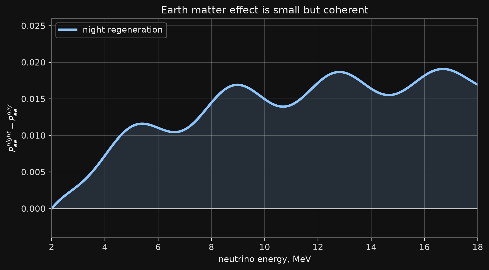
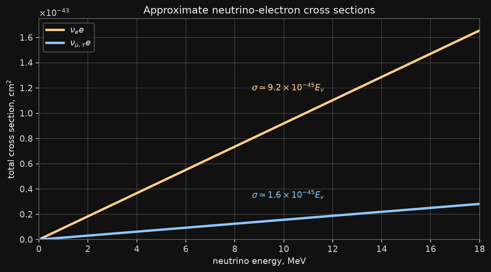

# Appendix Map


Material moved out of the one-hour lecture: derivations, detailed branches, and technical formulas.

All analytic formulas use natural units, $\hbar=c=1$. Practical table units are stated explicitly where they are used.


# Aim of this lecture

## Power Density

- The average power density over the whole solar volume is small:
$$
\frac{L_\odot}{(4\pi/3)R_\odot^3}
\simeq 0.27~\mathrm{W\,m^{-3}}.
$$

- The core value is much larger, of order
$$
10^2~\mathrm{W\,m^{-3}},
$$

but still not large by terrestrial engineering standards. The Sun is bright because it is enormous and long-lived.

## References

- V. A. Naumov, **Solar Neutrinos. Astrophysical Aspects**, Phys. Part. Nucl. Lett. 8, 1141-1170 (2011).

  - PDF: <https://www1.jinr.ru/Pepan_letters/panl_2011_7/05_VNaumov.pdf>

- The numerical reference curves used in the masterclass may be generated with PEANUTS:
  - T. E. Gonzalo and M. Lucente, **PEANUTS: Propagation and Evolution of Active NeUTrinoS**, arXiv:2303.15527.
  - code: <https://github.com/michelelucente/PEANUTS>


# The Sun Is a Quantum Machine

## Rate Estimate

- Use deliberately generous core numbers:

  - proton density: $n_p\sim 10^{32}~\mathrm{m}^{-3}$;

  - effective core volume: $V_{\rm core}\sim 10^{25}~\mathrm{m}^{3}$;

  - geometric nuclear area: $\sigma_{\rm geom}\sim\pi(1~\mathrm{fm})^2\sim 10^{-30}~\mathrm{m}^{2}$;

  - relative velocity: $v\sim 8\times 10^5~\mathrm{m\,s^{-1}}$.

## Collision Luminosity

- The corresponding proton-proton collision luminosity is enormous:
$$
\mathcal{L}_{pp}
=
\frac{1}{2}n_p^2V_{\rm core}v
\sim
4\times 10^{94}~\mathrm{m^{-2}\,s^{-1}},
$$

$$
\dot N_{\rm geom}
=
\mathcal{L}_{pp}\sigma_{\rm geom}
\sim
4\times 10^{64}~\mathrm{s^{-1}}.
$$

## Classical Rate

- Requiring classical over-the-barrier motion destroys the rate:
$$
\dot N_{\rm class}
\sim
\dot N_{\rm geom}\,10^{-484}
\sim
6\times 10^{-420}~\mathrm{s^{-1}}.
$$


# Quantum Tunneling

## WKB Integral

- For a Coulomb barrier,

$$
U(r)=\frac{A}{r},
\qquad
A=Z_aZ_b\alpha,
\qquad
r_C=\frac{Z_aZ_b\alpha}{E}.
$$

- The WKB action in the exponent is

$$
I(E)
=
\int_{r_N}^{r_C}
\sqrt{2\mu\left(\frac{A}{r}-E\right)}\,dr .
$$

- Since $A=Er_C$,

$$
I(E)
=
\sqrt{2\mu E}\,r_C
\int_{x_N}^{1}
\sqrt{\frac{1}{x}-1}\,dx,
\qquad
x=\frac{r}{r_C}.
$$

## Integral Evaluation

:::: {.columns}

::: {.column width="45%"}

- Put $x=\sin^2\theta$:

$$
dx=2\sin\theta\cos\theta\,d\theta,
\qquad
\sqrt{\frac{1}{x}-1}=\cot\theta .
$$

- Then

$$
\int\sqrt{\frac{1}{x}-1}\,dx
=
\int 2\cos^2\theta\,d\theta
=
\theta+\frac{1}{2}\sin 2\theta .
$$

:::

::: {.column width="45%"}

- With $\theta_N=\arcsin\sqrt{x_N}$,

$$
\int_{x_N}^{1}
\sqrt{\frac{1}{x}-1}\,dx
=
\frac{\pi}{2}
-\theta_N
-\frac{1}{2}\sin 2\theta_N .
$$

- For nuclear distances $r_N\ll r_C$, $x_N\ll1$, so the leading term is $\pi/2$.

:::

::::

## Cross Section Form

- The cross section is usually written as

$$
\sigma(E)
=
\frac{S(E)}{E}
\exp\!\left[-\sqrt{\frac{E_G}{E}}\right].
$$

- $S(E)$ is the astrophysical $S$-factor: the slowly varying nuclear-physics part.

- The fast energy dependence is mostly the tunneling factor.


# Thermal Averaging

## Reaction Rate

- For a two-body reaction $a+b\to c+\cdots$, the local rate is

$$
R_{ab}
=
\frac{n_an_b}{1+\delta_{ab}}
\langle\sigma v\rangle .
$$

- The factor $1+\delta_{ab}$ avoids double counting identical pairs, for example $p+p$.

- The thermal average is

$$
\langle\sigma v\rangle
=
\left(\frac{8}{\pi\mu}\right)^{1/2}
\frac{1}{(kT)^{3/2}}
\int_0^\infty \sigma(E)\,E\,e^{-E/kT}\,dE.
$$

## Thermal Integrand

- Insert the charged-particle cross section:

$$
\sigma(E)
=
\frac{S(E)}{E}
\exp\!\left[-\sqrt{\frac{E_G}{E}}\right].
$$

- If $S(E)$ varies slowly, the essential energy dependence is

$$
S(E)
\exp\!\left[
-\frac{E}{kT}
-\sqrt{\frac{E_G}{E}}
\right].
$$

- The first term is the Boltzmann penalty. The second term is the tunneling penalty.

## Gamow Exponent

- Define

$$
\Phi(E)
=
\frac{E}{kT}
+
\sqrt{\frac{E_G}{E}}.
$$

- The integrand is proportional to $\exp[-\Phi(E)]$.

- The maximum occurs near

$$
E_0
=
\left(
\frac{E_G(kT)^2}{4}
\right)^{1/3}.
$$

- This energy is much larger than $kT$, but much smaller than the MeV Coulomb barrier.

## Gamow Window

- The reaction does not occur at one energy.

- The useful energy range is the Gamow window around $E_0$.

- A standard estimate of its width is

$$
\Delta
\simeq
4\sqrt{\frac{E_0 kT}{3}}.
$$

- The window moves to higher energy for larger $Z_aZ_b$ and for higher temperature.


# Thermonuclear Reactions

## Energy Balance

- The energy released per complete pp-chain cycle is fixed mainly by nuclear masses.

- The photon luminosity is powered by the part that remains in the plasma:

$$
Q_\gamma
\simeq
26.73~\mathrm{MeV}
-
\langle E_{\nu_1}+E_{\nu_2}\rangle .
$$

- The neutrino subtraction depends on the branch: pp, pep, $^7\mathrm{Be}$, $^8\mathrm{B}$, or hep.

- This is why solar luminosity and solar neutrino fluxes are tightly linked but not identical observables.

## Scale

- The average solar power density is small:

$$
\frac{L_\odot}{(4\pi/3)R_\odot^3}
\simeq
0.27~\mathrm{W\,m^{-3}}.
$$

- The core value is larger, but still modest on human engineering scales.

- The Sun shines because it contains an enormous number of particles, not because each cubic meter is a powerful reactor.


# pp Chain

## Cycle Map

The pp chain is the main hydrogen-burning cycle in the present Sun.

{.slide-image-center .nostretch fig-align="center" width="50%"}

## First Step

The pp chain begins with

$$
p+p\to d+e^+ + \nu_e.
$$

The emitted neutrino has a continuous spectrum with endpoint about

$$
E_\nu^{\max}\simeq 0.42~\mathrm{MeV}.
$$

This is the largest solar-neutrino flux, but not the easiest component for water Cherenkov detectors.

## pep Line

The related three-body reaction is

$$
p+e^-+p\to d+\nu_e.
$$

It produces an almost monoenergetic neutrino:

$$
E_\nu \simeq 1.44~\mathrm{MeV}.
$$

The pep flux is much smaller than pp, but the line is physically clean.

## pp I Branch

After deuterium is produced,

$$
p+d\to {}^3\mathrm{He}+\gamma,
$$

and the pp I branch ends through

$$
{}^3\mathrm{He}+{}^3\mathrm{He}
\to
{}^4\mathrm{He}+2p.
$$

This branch produces pp neutrinos but no high-energy $^8\mathrm{B}$ neutrinos.

## pp II Branch

The chain can proceed through beryllium:

$$
{}^3\mathrm{He}+{}^4\mathrm{He}\to{}^7\mathrm{Be}+\gamma,
$$

followed by electron capture:

$$
{}^7\mathrm{Be}+e^-
\to
{}^7\mathrm{Li}+\nu_e.
$$

The main neutrino lines are approximately

$$
0.862~\mathrm{MeV}, \qquad 0.384~\mathrm{MeV}.
$$

## pp III Branch

The high-energy branch is rare:

$$
{}^7\mathrm{Be}+p\to{}^8\mathrm{B}+\gamma,
$$

then

$$
{}^8\mathrm{B}\to{}^8\mathrm{Be}^{*}+e^+ + \nu_e.
$$

The $^8\mathrm{B}$ flux is small, but its spectrum extends to high energy. This is why it is central for Super-Kamiokande-like measurements.

## hep Tail

The rare reaction

$$
{}^3\mathrm{He}+p\to{}^4\mathrm{He}+e^+ + \nu_e
$$

produces the highest-energy solar neutrinos.

The flux is tiny. The importance is not total rate, but the far high-energy tail.


# CNO Cycle

## Cycle Map

{.slide-image-center .nostretch fig-align="center" width="65%"}

::: {.media-caption}
CNO catalytic loop and the smaller NO side branch.
:::

## CNO as a Catalyst Cycle

In the CNO cycle, carbon, nitrogen, and oxygen nuclei catalyze hydrogen burning.

The neutrino-producing beta decays are

$$
{}^{13}\mathrm{N}\to{}^{13}\mathrm{C}+e^+ + \nu_e,
$$

$$
{}^{15}\mathrm{O}\to{}^{15}\mathrm{N}+e^+ + \nu_e,
$$

$$
{}^{17}\mathrm{F}\to{}^{17}\mathrm{O}+e^+ + \nu_e.
$$


# Solar Model Inputs

## Structure Equations

In Naumov's notation, the stellar-structure equations are

$$
\frac{dM}{dR}=4\pi R^2\rho,
\qquad
\frac{dP}{dR}=-\frac{GM\rho}{R^2},
$$

$$
\frac{dL}{dR}
=
4\pi R^2
\left[
\epsilon\rho
-\rho\frac{d}{dt}\left(\frac{u}{\rho}\right)
+\frac{P}{\rho}\frac{d\rho}{dt}
\right],
\qquad
\frac{dT}{dR}
=
\nabla\frac{T}{P}\frac{dP}{dR}.
$$

Here $M(R)$ is the shell mass, $L(R)$ is the energy flow through radius $R$, $u$ is the internal energy per unit volume, and

$$
\nabla=\frac{d\ln T}{d\ln P}.
$$

## Closure Equations

The four differential equations are not closed until the microphysics is specified:

$$
\rho=\rho(P,T,\{X_a\}),
\qquad
\kappa=\kappa(P,T,\{X_a\}),
\qquad
\epsilon=\epsilon(P,T,\{X_a\}).
$$

They provide the equation of state, opacity, and nuclear energy-generation rate. The pressure is, in general,

$$
P=P_{\rm gas}+P_{\rm rad}+\frac{B^2}{8\pi},
$$

with the magnetic term usually neglected in standard solar models.

## Transport Gradients

The temperature gradient is decomposed as

$$
\nabla
=
\nabla_{\rm rad}
+\nabla_{\rm cond}
+\nabla_{\rm conv}.
$$

For radiative transfer in local thermodynamic equilibrium, in natural units,

$$
\nabla_{\rm rad}
=
\frac{3}{16\pi aG}
\frac{\kappa P}{T^4}
\frac{L}{M}.
$$

Convection starts when the radiative gradient exceeds the adiabatic one:

$$
\nabla_{\rm rad}>
\nabla_{\rm ad},
\qquad
\nabla_{\rm ad}
=
\left(\frac{\partial\ln T}{\partial\ln P}\right)_s.
$$

This is why opacity, composition, and the treatment of convection enter solar-neutrino predictions.

## What Enters the Solar-Neutrino Calculation

For the masterclass we take as input:

::: {.compact}
- total fluxes $\Phi_i$;
- spectral shapes $f_i(E)$;
- radial production distributions;
- electron-density profile $n_e(r)$;
- uncertainties or toy nuisance parameters.
:::

We do not solve the solar model. We use its output.


# Vacuum Oscillations

## Time Evolution

:::: {.columns}

::: {.column width=50%}
- Prepare a neutrino as $|\nu_e\rangle$ at $t=0$:

$$
|\nu(0)\rangle
=
\cos\theta\,|\nu_1\rangle
+
\sin\theta\,|\nu_2\rangle.
$$

- In vacuum each mass state evolves with its own phase:

$$
|\nu(t)\rangle
=
\cos\theta\,e^{-iE_1t}|\nu_1\rangle
+
\sin\theta\,e^{-iE_2t}|\nu_2\rangle.
$$

:::

::: {.column width=50%}

- The survival amplitude is

$$
A_{ee}(t)
=
\langle\nu_e|\nu(t)\rangle
=
\cos^2\theta\,e^{-iE_1t}
+
\sin^2\theta\,e^{-iE_2t}.
$$

- The transition amplitude is

$$
A_{e\mu}(t)
=
\langle\nu_\mu|\nu(t)\rangle
=
\sin\theta\cos\theta
\left(e^{-iE_2t}-e^{-iE_1t}\right).
$$

:::

::::

## Three Flavours

- In the full theory,

$$
|\nu_\alpha\rangle
=
\sum_{i=1}^3 U_{\alpha i}^{*}|\nu_i\rangle,
\qquad
\alpha=e,\mu,\tau.
$$

- The PMNS matrix is described by three angles and one CP phase:

$$
U_{\rm PMNS}
=
R_{23}(\theta_{23})\,
U_{13}(\theta_{13},\delta_{\rm CP})\,
R_{12}(\theta_{12}).
$$

- For solar neutrinos the dominant vacuum scale is $\Delta m_{21}^2$ with angle $\theta_{12}$; $\theta_{13}$ gives a small but important correction:

$$
P_{ee}^{3\nu}
\simeq
\cos^4\theta_{13}\,P_{ee}^{2\nu}
+
\sin^4\theta_{13}.
$$

## 3x3 Matrix

With $c_{ij}\equiv\cos\theta_{ij}$ and $s_{ij}\equiv\sin\theta_{ij}$,

$$
\small
U_{\rm PMNS}
=
\begin{pmatrix}
1&0&0\\
0&c_{23}&s_{23}\\
0&-s_{23}&c_{23}
\end{pmatrix}
\begin{pmatrix}
c_{13}&0&s_{13}e^{-i\delta_{\rm CP}}\\
0&1&0\\
-s_{13}e^{i\delta_{\rm CP}}&0&c_{13}
\end{pmatrix}
\begin{pmatrix}
c_{12}&s_{12}&0\\
-s_{12}&c_{12}&0\\
0&0&1
\end{pmatrix}.
$$

- Majorana phases are omitted; they do not affect oscillation probabilities.
- Solar neutrinos mainly probe $\theta_{12}$ and $\Delta m_{21}^2$, with a controlled $\theta_{13}$ correction.


# Flavor Change in Matter

## Vacuum Matrix

:::: {.columns}

::: {.column width="42%"}


**Vacuum mixing in matrix form**

$$
\nu_f=
\begin{pmatrix}
\nu_e\\
\nu_x
\end{pmatrix},
\qquad
\nu_f=U(\theta)\nu_m.
$$

$$
U(\theta)
=
\begin{pmatrix}
\cos\theta & \sin\theta\\
-\sin\theta & \cos\theta
\end{pmatrix}.
$$


:::

::: {.column width="58%"}


**Hamiltonian**

$$
i\frac{d}{dt}\nu_f
=
H_{\rm vac}\nu_f,
\qquad
H_{\rm vac}
=
U
\begin{pmatrix}
\frac{m_1^2}{2E} & 0\\
0 & \frac{m_2^2}{2E}
\end{pmatrix}
U^\dagger.
$$

**After subtracting an irrelevant trace**

$$
H_{\rm vac}
=
\frac{\Delta m^2}{4E}
\begin{pmatrix}
-\cos2\theta & \sin2\theta\\
\sin2\theta & \cos2\theta
\end{pmatrix}.
$$


:::

::::

## The Schroedinger equation

:::: {.columns}

::: {.columns width=50%}
- Sum up vacuum and matter Hamiltonians:
$$
i\frac{d}{dt}\begin{pmatrix} \nu_e\\ \nu_\mu \end{pmatrix}
=
\begin{pmatrix}
-\frac{\Delta m^2}{4E}\cos2\theta +V_e(x) & \frac{\Delta m^2}{4E}\sin2\theta\\
\frac{\Delta m^2}{4E}\sin2\theta & \frac{\Delta m^2}{4E}\cos2\theta
\end{pmatrix}
\begin{pmatrix} \nu_e\\ \nu_\mu \end{pmatrix}
\equiv H_f(x)\begin{pmatrix} \nu_e\\ \nu_\mu \end{pmatrix}.
$$
- How to solve it?
:::


::::

## Diagonalization

- Introduce a $2\times 2$ matrix $U(\theta_m)=\begin{pmatrix}\cos\theta_m& \sin\theta_m\\ -\sin\theta_m & \cos\theta_m\end{pmatrix}$ and a new **matter** states:
$$
\nu_f
=
U(\theta_m)\,\nu_m.
$$
- Multiply the Schroediner equation by $U^\dagger(\theta_m)$ from the left and by $U(\theta_m)$ from the right (assume $n_e(x)=\mathrm{const}$):
$$
i\frac{d}{dt}\nu_m = U^\dagger(\theta_m) H_f(x)U(\theta_m)\nu_m \equiv H_m(x)\nu_m
$$
- Choose $U(\theta_m)$ to make $H_m(x)$ diagonal.

## Eigenstates

- Vacuum and matter states:

$$
|\nu_e\rangle
=
\cos\theta_m|\nu_1^m\rangle
+
\sin\theta_m|\nu_2^m\rangle.
$$

- Vacuum and matter mixing angles:

$$
\tan2\theta_m
=
\frac{\Delta m^2\sin2\theta}
{\Delta m^2\cos2\theta-2EV_e}.
$$

- Vacuum and matter mass splittings:

$$
\Delta m_m^2
=
\Delta m^2
\sqrt{
\left(\cos2\theta-\frac{2EV_e}{\Delta m^2}\right)^2
+
\sin^2 2\theta
}.
$$

- After subtracting the trace, the eigenvalues are

$$
\lambda_\pm
=
\pm\frac{\Delta m_m^2}{4E}.
$$

## Probability

- In constant-density matter the vacuum formula survives with vacuum quantities replaced by matter quantities:

$$
P_{ee}^{\rm matter}
=
1-\sin^2 2\theta_m\,
\sin^2\!\left(
\frac{\Delta m_m^2 L}{4E}
\right).
$$

- The appearance probability is

$$
P_{ex}^{\rm matter}
=
1-P_{ee}^{\rm matter}.
$$

- For varying density one evolves through layers, or uses adiabatic following when the density changes slowly.

## Variable Density

:::: {.columns}

::: {.column width="47%"}

::: {.formula-compact}

- In the Sun the density changes with radius:

$$
H_f(R)
=
H_{\rm vac}
+
\begin{pmatrix}
V_e(R)&0\\
0&0
\end{pmatrix}.
$$

- Define instantaneous matter eigenstates:

$$
H_f(R)|\nu_i^m(R)\rangle
=
\lambda_i(R)|\nu_i^m(R)\rangle.
$$

- Adiabatic evolution means

$$
\left|\frac{d\theta_m}{dR}\right|
\ll
|\lambda_2-\lambda_1|
=
\frac{\Delta m_m^2(R)}{2E}.
$$

:::

:::

::: {.column width="53%"}

```{=html}
<svg viewBox="0 0 760 330" role="img" aria-label="Matter eigenvalue levels as a function of solar radius" style="width:100%;height:auto;">
  <rect x="44" y="22" width="690" height="268" rx="10" fill="#101010" stroke="#555"/>
  <line x1="86" y1="260" x2="700" y2="260" stroke="#cfcfcf" stroke-width="2"/>
  <line x1="86" y1="48" x2="86" y2="260" stroke="#cfcfcf" stroke-width="2"/>
  <line x1="360" y1="45" x2="360" y2="260" stroke="#8fd19e" stroke-width="2" stroke-dasharray="8 8"/>
  <path d="M90 64 C205 68 295 106 352 145 C420 190 535 214 700 224" fill="none" stroke="#8ec5ff" stroke-width="4"/>
  <path d="M90 254 C205 249 295 210 352 176 C420 130 535 104 700 94" fill="none" stroke="#ffcc8a" stroke-width="4"/>
  <path d="M90 64 C230 90 300 125 360 160 C440 205 560 232 700 254" fill="none" stroke="#777" stroke-width="2" stroke-dasharray="5 6" opacity=".75"/>
  <path d="M90 254 C230 228 300 195 360 160 C440 115 560 88 700 64" fill="none" stroke="#777" stroke-width="2" stroke-dasharray="5 6" opacity=".75"/>
  <g fill="#ddd" font-family="DejaVu Sans, sans-serif" font-size="18">
    <text x="74" y="282">0</text>
    <text x="684" y="282">1</text>
    <text x="322" y="318">R / R☉</text>
    <text x="18" y="162" transform="rotate(-90 18 162)">eigenvalue</text>
    <text x="292" y="42" fill="#8fd19e">MSW resonance</text>
    <text x="110" y="92" fill="#8ec5ff">ν₂ᵐ</text>
    <text x="110" y="242" fill="#ffcc8a">ν₁ᵐ</text>
    <text x="560" y="78">vacuum side</text>
    <text x="105" y="305">core</text>
  </g>
</svg>
```

:::

::::


# Earth Matter

## Day and Night

During the day, solar neutrinos reach the detector without crossing the Earth.

At night they can propagate through Earth matter before detection.

This modifies the mass-state mixture projected onto $\nu_e$:

$$
P_{ee}^{\mathrm{night}}(E,\eta)
\ne
P_{ee}^{\mathrm{day}}(E).
$$

$\eta$ denotes the nadir angle.

## Regeneration

The Earth matter correction is usually small:

$$
\Delta P_{ee}^{\oplus}
=
P_{ee}^{\mathrm{night}}-P_{ee}^{\mathrm{day}}.
$$

It is nevertheless coherent and measurable statistically in large detectors.

{.slide-image-center .nostretch fig-align="center" width="78%"}

## Day-Night Asymmetry

A common observable is

$$
A_{\mathrm{DN}}
=
2\frac{N_{\mathrm{night}}-N_{\mathrm{day}}}
{N_{\mathrm{night}}+N_{\mathrm{day}}}.
$$

It is not just a probability measurement. It includes:

::: {.compact}
- solar spectrum;
- detector threshold;
- cross section;
- exposure as a function of nadir angle;
- backgrounds and systematics.
:::


# Detection

## Elastic Scattering Cross Section

For neutrino-electron scattering, neglecting radiative corrections, the differential cross section has the structure

$$
\frac{d\sigma}{dT}
=
\frac{2G_F^2m_e}{\pi}
\left[
g_L^2
+g_R^2\left(1-\frac{T}{E_\nu}\right)^2
-g_Lg_R\frac{m_eT}{E_\nu^2}
\right].
$$

The coupling constants differ between $\nu_e e$ and $\nu_{\mu,\tau}e$ scattering.

## Weak Couplings

Using $s_W^2=\sin^2\theta_W\simeq0.231$:

| channel | $g_L$ | value | $g_R$ | value |
|---|---:|---:|---:|---:|
| $\nu_e e\to\nu_e e$ | $\frac{1}{2}+s_W^2$ | $0.731$ | $s_W^2$ | $0.231$ |
| $\nu_{\mu,\tau}e\to\nu_{\mu,\tau}e$ | $-\frac{1}{2}+s_W^2$ | $-0.269$ | $s_W^2$ | $0.231$ |

::: {.small}
For antineutrinos the roles of $g_L$ and $g_R$ are interchanged in the recoil-energy dependence.
:::

## Approximate Total Cross Sections

{.slide-image-center .nostretch fig-align="center" width="62%"}

::: {.media-caption}
Linear high-energy approximations in cm$^2$ for solar-neutrino energies. The full recoil spectrum is used only in precision analyses.
:::


# Statistical Inference

## Pseudoexperiment

For binned expected counts $\mu_i$,

$$
n_i \sim \mathrm{Poisson}(\mu_i).
$$

A fixed random seed gives a reproducible pseudoexperiment for all students.

The point is to separate the true model from one possible observed dataset.

## Poisson Chi-Square

For counting data use

$$
\chi^2
=
2\sum_i
\left[
\mu_i-n_i+n_i\ln\frac{n_i}{\mu_i}
\right].
$$

For $n_i=0$, the logarithmic term is defined as zero.


# Projects

## Project Parts

The work can be divided internally:

::: {.compact}
- **sources:** radial profiles, spectra, and visible source fractions;
- **detector:** cross sections, threshold, and SK-like response;
- **oscillations:** $P_{ee}^{day}$, $P_{ee}^{night}$, and Earth regeneration;
- **statistics:** pseudo-data, $\Delta\chi^2$, interval or contour.
:::

The defense is one presentation, not three independent projects.

## Possible Results

Choose a focused result:

::: {.compact}
- fraction of $^8\mathrm{B}$ events above threshold;
- best-fit $^8\mathrm{B}$ normalization;
- effective $P_{ee}$ in the visible spectrum;
- day-night asymmetry $A_{\mathrm{DN}}$;
- sensitivity to an Earth-effect scale $\alpha_\oplus$.
:::

## What Must Be Stated Explicitly

The project defense must say:

::: {.compact}
- which input came from a solar model or PEANUTS;
- where the teaching detector model begins;
- which parameter is fitted;
- which $\Delta\chi^2$ level is used;
- what must be replaced for a real SK, SNO, or JUNO analysis.
:::

::: {.takeaway}
The defense is successful when both the number and the approximation boundaries are visible.
:::
