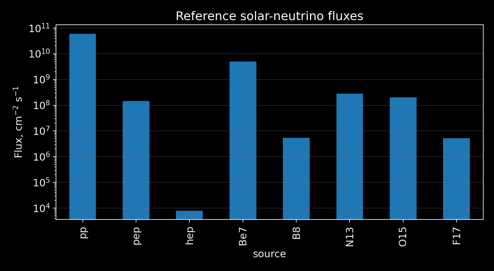
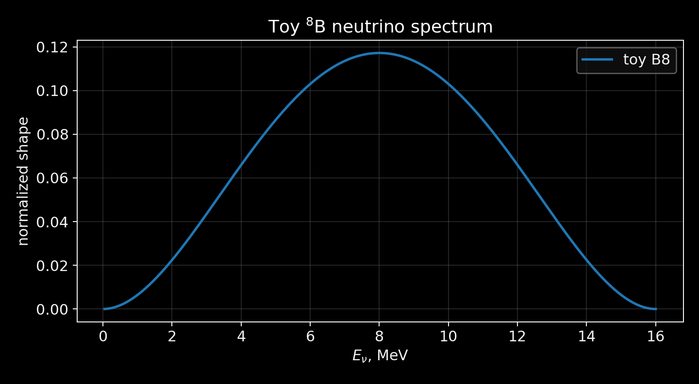
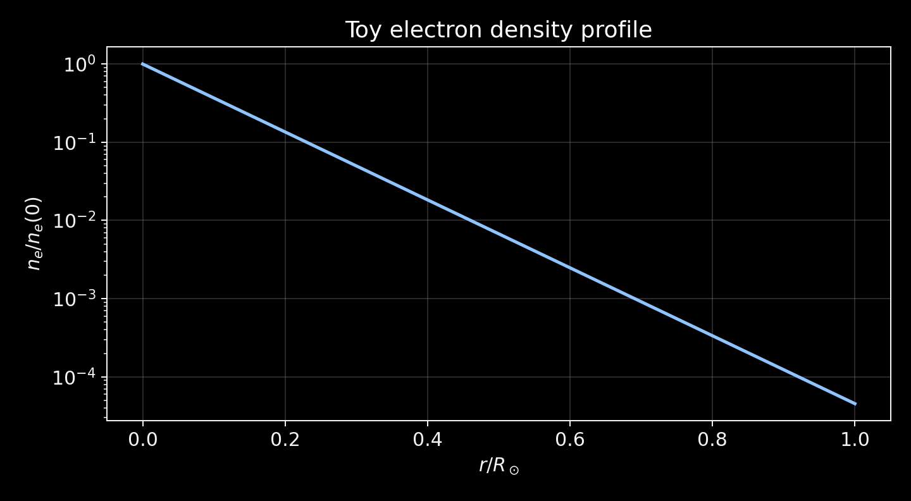

# Orientation

## Lesson Goal

By the end of the lesson, students should understand:

::: {.compact}
- which reactions in the Sun produce neutrinos;
- which fluxes and spectra are used as input data;
- why we do not build a full solar model in this masterclass;
- what first numerical result each team should produce.
:::

::: {.takeaway}
Today we build a careful input for oscillation and detector code, not a model of the Sun.
:::

## Masterclass Structure

::: {.timing}
::: {.time}
Lesson 1
:::
::: {}
The Sun as a neutrino source: fluxes, spectra, density profile.
:::
::: {.time}
Lesson 2
:::
::: {}
MSW oscillations, a toy Super-Kamiokande-like detector, pseudoexperiment, fit.
:::
::: {.time}
Lesson 3
:::
::: {}
Team mini-project defense: plots, numerical result, report.
:::
:::

## What Students Build

::: {.flow}
::: {}
solar inputs
:::
::: {}
spectra and fluxes
:::
::: {}
MSW $P_{ee}(E)$
:::
::: {}
event spectrum
:::
::: {}
fit result
:::
:::

At each step, it is important to separate physics from toy approximations.

## Team Work

Three-team option:

::: {.compact}
- **Team A:** solar sources and flux hierarchy.
- **Team B:** $^{8}\mathrm{B}$-spectrum and normalization.
- **Team C:** toy electron density profile for MSW.
:::

Two-team option:

::: {.compact}
- **Team A:** Sun + MSW inputs.
- **Team B:** spectra + detector inputs.
:::

## Main Chain

$$
\text{solar reactions}
\to
\Phi_\alpha(E)
\to
P_{ee}(E)
\to
N_i^{\rm expected}
\to
n_i^{\rm observed}
\to
\chi^2
$$

::: {.question}
What is the minimum input needed to go from the Sun to an event count?
:::

## Why Not a Full Solar Model

::: {.toy}
In this masterclass, we do not solve the Standard Solar Model. Fluxes, spectra, and toy profiles are taken as input data.
:::

A full calculation requires:

::: {.compact}
- equation of state;
- opacity tables;
- nuclear reaction rates;
- composition evolution;
- calibration to solar luminosity and radius.
:::

# Solar Model

## The Sun as a Stationary Source

The Sun can be treated as an almost stationary thermonuclear source.

Neutrinos are not produced "somewhere in the Sun"; they are produced in specific reactions:

::: {.compact}
- pp-chain;
- CNO-cycle;
- rare high-energy branches.
:::

For detector analysis, both total fluxes and energy spectra matter.

## Structure Equations

$$
\frac{dP}{dr}=-\frac{Gm(r)\rho(r)}{r^2},
$$

$$
\frac{dm}{dr}=4\pi r^2\rho(r),
$$

$$
\frac{dL}{dr}=4\pi r^2\rho(r)\epsilon(r),
$$

$$
\frac{dT}{dr}=\nabla(r)\frac{T}{P}\frac{dP}{dr}.
$$

## What Is Hidden in the Full Problem

Even this compact system is not closed without:

::: {.compact}
- $P(\rho,T,X_i)$: equation of state;
- opacity $\kappa(\rho,T,X_i)$;
- nuclear rates for the pp-chain and CNO;
- transport model: radiative and convective regions;
- initial composition and time evolution.
:::

::: {.takeaway}
For this masterclass, the solar model enters as a table of inputs, not as a stellar-evolution integration problem.
:::

# Neutrino Sources

## pp-Chain

The main energy source of the Sun:

$$
4p \to {}^4\mathrm{He}+2e^+ + 2\nu_e + Q.
$$

Neutrinos appear in separate branches:

::: {.compact}
- pp continuum;
- pep line;
- $^{7}\mathrm{Be}$ electron-capture lines;
- $^{8}\mathrm{B}$ high-energy continuum;
- hep rare high-energy tail.
:::

## CNO-Cycle

The CNO-cycle is important as a probe of the solar-core composition.

Neutrinos are produced in beta decays:

$$
{}^{13}\mathrm{N},\quad
{}^{15}\mathrm{O},\quad
{}^{17}\mathrm{F}.
$$

The energies are on the MeV scale, and the fluxes are much smaller than the pp flux.

## Source Table

| Source | Reaction | Spectrum type | Characteristic energy |
|---|---|---|---|
| pp | $p+p\to d+e^++\nu_e$ | continuum | low energy |
| pep | $p+e^-+p\to d+\nu_e$ | line | 1.44 MeV |
| $^{7}\mathrm{Be}$ | electron capture | lines | 0.862 MeV, 0.384 MeV |
| $^{8}\mathrm{B}$ | beta decay | continuum | high-energy tail |
| hep | rare reaction | continuum | very high tail |
| CNO | $^{13}\mathrm{N}, ^{15}\mathrm{O}, ^{17}\mathrm{F}$ | continuum | MeV scale |

## Line vs Continuum

Line sources:

::: {.compact}
- pep;
- $^{7}\mathrm{Be}$.
:::

Continuum sources:

::: {.compact}
- pp;
- $^{8}\mathrm{B}$;
- hep;
- CNO beta decays.
:::

Detector response turns even a line input into a reconstructed-energy distribution.

# Input Fluxes

## Reference Flux Table

File:

```text
data/solar_fluxes_reference.csv
```

Columns:

```text
source,flux_cm2_s,kind,comment
```

::: {.toy}
These are classroom reference values. For publication-level accuracy, the table must be checked against a chosen modern SSM table.
:::

## Code: Load Fluxes

```python
import pandas as pd
import matplotlib.pyplot as plt

fluxes = pd.read_csv("../data/solar_fluxes_reference.csv")
fluxes
```

Full version:

```text
notebooks/01_solar_fluxes_and_spectra.ipynb
src/solar_neutrino/fluxes.py
```

## Flux Plot

{width="78%" .slide-image-center fig-alt="Solar neutrino fluxes on logarithmic scale"}

::: {.media-caption}
A logarithmic scale is needed because pp and hep differ by almost seven orders of magnitude.
:::

## Code: Make the Plot

```python
ax = fluxes.plot.bar(x="source", y="flux_cm2_s",
                     logy=True, legend=False)
ax.set_ylabel(r"Flux, cm$^{-2}$ s$^{-1}$")
ax.set_xlabel("source")
plt.tight_layout()
```

## Interpreting the Hierarchy

Why the pp flux is huge:

::: {.compact}
- the pp-chain is the dominant solar energy-production channel;
- each completed chain gives two neutrinos;
- low-energy reactions are the most frequent.
:::

Why the $^{8}\mathrm{B}$ flux is small:

::: {.compact}
- it is a rare branch of the pp-chain;
- it requires higher energies in the solar core;
- nevertheless, this high-energy tail is clearly visible in water Cherenkov detectors.
:::

## $^{7}\mathrm{Be}$ Lines

File:

```text
data/be7_lines.csv
```

| $E_\nu$, MeV | branching fraction |
|---:|---:|
| 0.384 | 0.103 |
| 0.862 | 0.897 |

These values are used as pedagogical reference values.

## $^{8}\mathrm{B}$ Spectrum

The lesson uses a beta-like toy shape:

$$
f(E)\propto E^2(E_{\max}-E)^2,
\qquad
E_{\max}\approx 16~\mathrm{MeV}.
$$

Normalization:

$$
\int f(E)\,dE=1.
$$

::: {.toy}
This is not an official tabulated $^{8}\mathrm{B}$ spectrum.
:::

## Code: Spectrum Helper

```python
from solar_neutrino.spectra import (
    load_b8_spectrum,
    normalize_spectrum,
    interpolate_spectrum,
)

E, shape = load_b8_spectrum("../data/b8_spectrum.csv")
shape = normalize_spectrum(E, shape)
b8_spectrum = interpolate_spectrum(E, shape)
```

## $^{8}\mathrm{B}$ Spectrum Plot

{width="74%" .slide-image-center fig-alt="Toy B8 neutrino spectrum"}

::: {.media-caption}
The shape is useful for exercises, but a precision analysis needs an external tabulated spectrum.
:::

## Solar Density as an MSW Input

The MSW effect depends on the electron density:

$$
V_e(x)=\sqrt{2}G_F n_e(x).
$$

For lesson 1, a toy profile is sufficient:

$$
n_e(r)=n_0\exp(-r/r_0).
$$

File:

```text
data/electron_density_profile_toy.csv
```

## Code: Density Profile

```python
import pandas as pd
import matplotlib.pyplot as plt

density = pd.read_csv("../data/electron_density_profile_toy.csv")
ax = density.plot(x="r_over_Rsun", y="ne_normalized",
                  legend=False)
ax.set_xlabel(r"$r/R_\odot$")
ax.set_ylabel(r"$n_e/n_e(0)$")
```

## Density Profile Plot

{width="72%" .slide-image-center fig-alt="Toy electron density profile"}

::: {.media-caption}
The profile is needed to discuss the MSW resonance condition in the next lesson.
:::

# Team Work

## Team Split

Teams work with the same base code:

```text
src/solar_neutrino/
notebooks/
data/
```

Each team prepares:

::: {.compact}
- one checked plot;
- one physics explanation;
- one file or function for lesson 2.
:::

## Team A: Solar Sources

Tasks:

::: {.compact}
1. Check the flux table.
2. Plot the fluxes.
3. Explain why the pp flux is huge and the $^{8}\mathrm{B}$ flux is small.
4. Prepare an input file with the selected source for further modeling.
5. State which energy range is important for a water Cherenkov detector.
:::

## Team B: Spectra

Tasks:

::: {.compact}
1. Load or generate a toy $^{8}\mathrm{B}$ spectrum.
2. Normalize the spectrum to unity.
3. Plot $\Phi(E)$.
4. Prepare the function `b8_spectrum(E)`.
5. Mark exactly what is a toy approximation.
:::

## Team C: Solar Profile

Tasks:

::: {.compact}
1. Use the toy electron-density profile.
2. Plot $n_e(r)$.
3. Find the region where an MSW resonance is possible for MeV neutrinos.
4. Prepare the density file for lesson 2.
:::

## If There Are Two Teams

Team A:

::: {.compact}
- flux table;
- flux hierarchy;
- density profile;
- MSW input.
:::

Team B:

::: {.compact}
- $^{8}\mathrm{B}$ spectrum;
- normalization;
- detector energy range;
- spectrum function.
:::

# Checkpoint

## Input to the Oscillation Code

Minimum set:

::: {.compact}
- $E_\nu$-grid;
- source spectrum $\Phi(E)$;
- oscillation parameters $\theta_{12}$, $\Delta m^2_{21}$;
- electron density $n_e(r)$ or effective production density.
:::

## Input to the Detector Code

Minimum set:

::: {.compact}
- flux normalization;
- survival probability $P_{ee}(E)$;
- cross-section model;
- efficiency and threshold;
- exposure;
- background model for the advanced task.
:::

## Output of Lesson 1

After the lesson, each team should have:

::: {.compact}
- a working notebook with a flux, spectrum, or profile plot;
- a checked input file or function;
- one short physics conclusion;
- a list of toy assumptions.
:::

## Transition to MSW

We know what is produced in the Sun.

Next question:

::: {.question}
With what probability does a solar $\nu_e$ reach the detector as a $\nu_e$?
:::

Answering this requires flavor-state evolution in matter.
