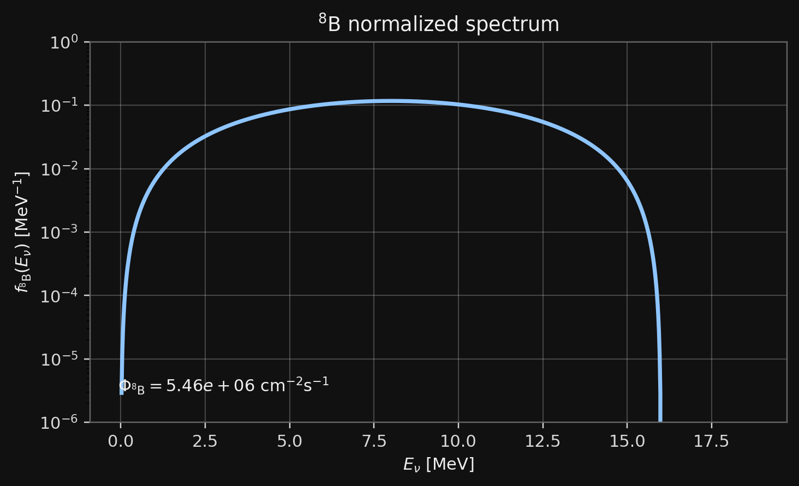
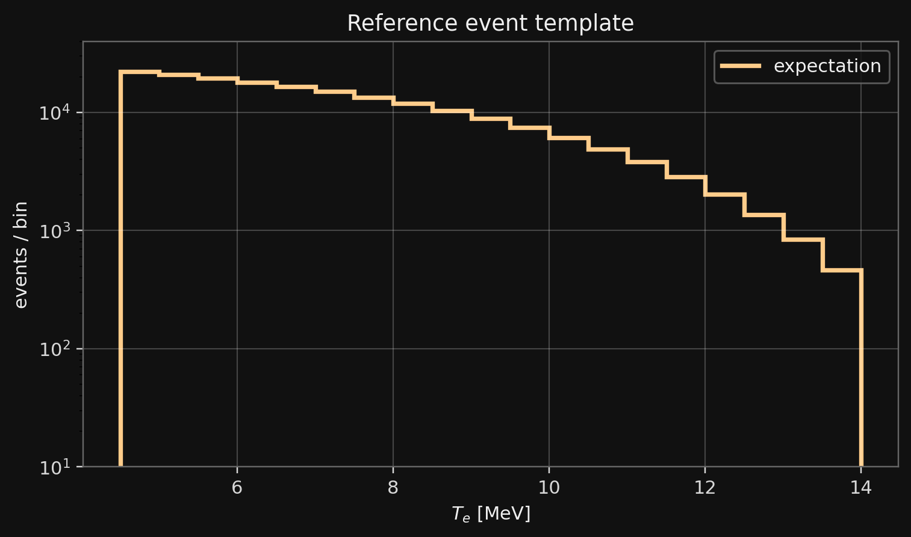
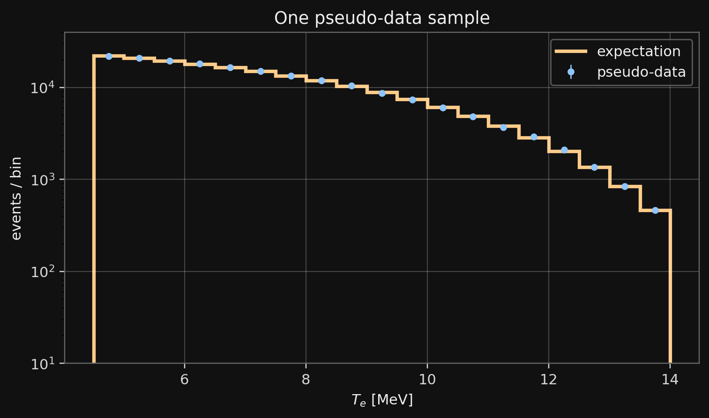
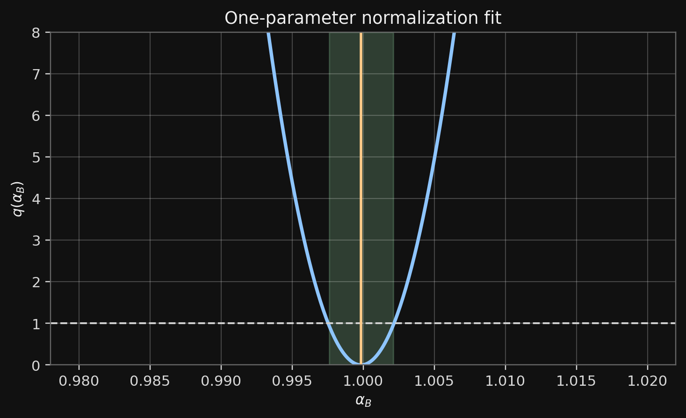

# Tasks

## Goal for This Session

Build the first quantitative model for an SK-like solar-neutrino measurement:

$$
{}^8\mathrm{B}\ \nu_e
\to
\nu e\ \mathrm{scattering}
\to
e^-_{\rm recoil}.
$$

Today we compute:

::: {.compact}
- expected event counts in recoil-electron energy bins;
- pseudo-data from those expected counts;
- a one-parameter fit of the $^8\mathrm{B}$ flux normalization.
:::

## Fit Parameter

Use one free parameter:

$$
\Phi_{^8\mathrm{B}}
\to
\alpha_B\,\Phi_{^8\mathrm{B}}.
$$

The first-session fit is

$$
\alpha_B = 1
\quad\hbox{for the reference input flux.}
$$

Oscillations are not fitted today:

$$
P_{ee}=1.
$$

## Main Output

The notebook must produce:

::: {.compact}
- $^8\mathrm{B}$ neutrino spectrum;
- SK-like recoil spectrum $dN/dT_e$;
- event total above a chosen threshold;
- pseudo-data in the same bins;
- $\hat\alpha_B$ and a one-dimensional interval from $q(\alpha_B)$.
:::

# Inputs

## Project Page

:::: {.columns}

::: {.column width=34%}
{fig-align="center" width="95%"}
:::

::: {.column width=66%}

Project page:

```{=html}
<div style="font-family: monospace; font-size: 0.70em; line-height: 1.25;">
https://neutrinohit.github.io/neutrinophysics/<br>
solar-neutrino-masterclass/
</div>
```

Tables used today:

```text
data/masterclass1/solar_fluxes.csv
data/masterclass1/energy_spectra.csv
data/masterclass1/nu_electron_recoil_cross_sections.csv
```

:::

::::

## Load the Tables

From the web page:

```python
import numpy as np
import pandas as pd

BASE = "https://neutrinohit.github.io/neutrinophysics/solar-neutrino-masterclass"

fluxes = pd.read_csv(f"{BASE}/data/masterclass1/solar_fluxes.csv")
spectra = pd.read_csv(f"{BASE}/data/masterclass1/energy_spectra.csv")
xs = pd.read_csv(f"{BASE}/data/masterclass1/nu_electron_recoil_cross_sections.csv")
```

For a local notebook, replace `BASE` by the local project directory.

## Select $^8\mathrm{B}$

```python
phi_b8 = float(
    fluxes.loc[fluxes["source"] == "B8", "flux_cm2_s"].iloc[0]
)

b8 = spectra.loc[spectra["source"] == "B8"].copy()
b8 = b8.sort_values("E_MeV")
```

Here

$$
\Phi_{^8\mathrm{B}}=\int dE_\nu\,\frac{d\Phi_{^8\mathrm{B}}}{dE_\nu},
\qquad
\frac{d\Phi_{^8\mathrm{B}}}{dE_\nu}
=
\Phi_{^8\mathrm{B}} f_{^8\mathrm{B}}(E_\nu).
$$

The table column `spectrum_per_MeV` is $f_{^8\mathrm{B}}(E_\nu)$.

Expected check:

```text
Phi_B8 = 5.460000e+06 cm^-2 s^-1
```

## Check the Spectrum

:::: {.columns}

::: {.column width=54%}

Check the normalization:

```python
norm = np.trapezoid(b8["spectrum_per_MeV"], b8["E_MeV"])
print(norm)
```

Expected output:

```text
1.000000000000
```

Plot:

```python
ax = b8.plot(
    x="E_MeV",
    y="spectrum_per_MeV",
    logy=True,
    legend=False
)
ax.set_xlabel(r"$E_\nu$ [MeV]")
ax.set_ylabel(r"$f_{^8\mathrm{B}}(E_\nu)$ [MeV$^{-1}$]")
```

:::

::: {.column width=46%}
{fig-align="center" width="100%"}
:::

::::

# Event Model

## Target Electrons

For water,

$$
N_e
=
10 N_A\frac{M_{\rm water}}{18~\mathrm{g}}.
$$

For an exposure written as $M_{\rm water}T_{\rm live}$,

$$
N_eT_{\rm live}
=
10N_A\frac{M_{\rm water}}{18~\mathrm{g}}T_{\rm live}.
$$

The CSV units are practical units: flux in $\mathrm{cm^{-2}s^{-1}}$, cross section in $\mathrm{cm^2\,MeV^{-1}}$.

## Target Electrons

Use in the example:

```python
N_A = 6.02214076e23
seconds_per_year = 365.25 * 24 * 3600

mass_g = 100.0e9          # 100 kton water
T_live = seconds_per_year # one year
N_e = 10.0 * N_A * mass_g / 18.0
```

Expected check:

```text
N_e = 3.345634e+34
```

## Binned Prediction

For recoil-energy bin $j$,

$$
\mu_j(\alpha_B)
=
\alpha_B\,N_eT_{\rm live}
\int_{T_j}^{T_{j+1}}dT_e
\int dE_\nu\,
\Phi_{^8\mathrm{B}}f_{^8\mathrm{B}}(E_\nu)
\frac{d\sigma_{\nu_e e}(E_\nu,T_e)}{dT_e}.
$$

Today:

$$
\mu_j(\alpha_B)=\alpha_B\,m_j.
$$

The fixed template $m_j$ is the reference prediction for $\alpha_B=1$.

## Cross-Section Table

Required columns:

```text
E_MeV
T_e_MeV
dsigma_nue_cm2_per_MeV
```

Use interpolation for the $^8\mathrm{B}$ spectral shape:

```python
shape = np.interp(
    xs["E_MeV"],
    b8["E_MeV"],
    b8["spectrum_per_MeV"],
    left=0.0,
    right=0.0,
)

xs = xs.assign(dphi_dE=phi_b8 * shape)
```

Expected checks:

```text
cross-section grid = 188 x 181
dE = 0.100267 MeV, dT = 0.100000 MeV
```

## Tabular Integral

For each table row $(E_\nu^a,T_e^b)$, define a weight

$$
w_{ab} =
N_eT_{\rm live}
\Phi_{^8\mathrm{B}}f_{^8\mathrm{B}}(E_\nu^a)
\frac{d\sigma_{\nu_e e}(E_\nu^a,T_e^b)}{dT_e}
\Delta E_\nu\Delta T_e .
$$

Then the prediction in recoil bin $j$ is

$$
m_j
\simeq
\sum_{a,b:\,T_e^b\in [T_j,T_{j+1})} w_{ab}.
$$

First compute row weights. Then assign rows to recoil-energy bins.

## Event Template

```python
E_grid = np.sort(xs["E_MeV"].unique())
T_grid = np.sort(xs["T_e_MeV"].unique())
dE = np.median(np.diff(E_grid))
dT = np.median(np.diff(T_grid))
```

## Event Template

```python
Tmin, Tmax, bin_width = 4.5, 14.0, 0.5
edges = np.arange(Tmin, Tmax + 0.5 * bin_width, bin_width)
nbins = len(edges) - 1
bin_id = np.digitize(xs["T_e_MeV"], edges) - 1

valid = (0 <= bin_id) & (bin_id < nbins)
integrand = (
    N_e * T_live
    * xs["dphi_dE"]
    * xs["dsigma_nue_cm2_per_MeV"]
    * dE * dT
)

m = np.bincount(bin_id[valid], weights=integrand[valid], minlength=nbins)
centers = 0.5 * (edges[:-1] + edges[1:])
```

## Plot the Prediction

:::: {.columns}

::: {.column width=48%}

```python
import matplotlib.pyplot as plt

plt.stairs(m, edges)
plt.xlabel(r"$T_e$ [MeV]")
plt.ylabel("expected events / bin")
plt.yscale("log")
plt.show()
```

Expected first bins:

```text
T_low  T_high  events
4.5    5.0     22174.6
5.0    5.5     20898.3
5.5    6.0     19528.7
```

:::

::: {.column width=52%}
{fig-align="center" width="100%"}
:::

::::

Useful checks:

:::: {.columns}

::: {.column width=48%}

- $m_j\ge 0$;
- $\sum_j m_j$ decreases when $T_{\min}$ increases;

:::

::: {.column width=48%}
- changing `nbins` should not change $\sum_j m_j$ much.
:::
::::

# Pseudo-Data and Fit

## Generate Pseudo-Data

:::: {.columns}

::: {.column width=48%}

Choose a true normalization:

$$
\alpha_B^{\rm true}=1.
$$

Generate counts:

```python
rng = np.random.default_rng(12345)
alpha_true = 1.0
n = rng.poisson(alpha_true * m)
print(m.sum(), n.sum())
```

Plot data and expectation in the same bins.

Expected output for this seed:

```text
186693.543 186665
```

:::

::: {.column width=52%}
{fig-align="center" width="100%"}
:::

::::

## Likelihood

For Poisson bins,

$$
\ell(\alpha_B)
=
\sum_j
\left[
n_j\ln\mu_j(\alpha_B)-\mu_j(\alpha_B)
\right]
+\mathrm{const}.
$$

Use

$$
q(\alpha_B)
=
-2\left[\ell(\alpha_B)-\ell(\hat\alpha_B)\right].
$$

For one fitted parameter, the usual $1\sigma$ interval is given by

$$
q(\alpha_B)=1.
$$

Equivalently, the one-dimensional $1\sigma$ contour is

$$
q(\alpha_B)\le 1.
$$

## Grid Fit

```python
alphas = np.linspace(0.98, 1.02, 401)
mu = alphas[:, None] * m[None, :]
mu = np.maximum(mu, 1e-300)

ll = np.sum(n[None, :] * np.log(mu) - mu, axis=1)
q = -2.0 * (ll - ll.max())

alpha_hat = alphas[np.argmax(ll)]
print(alpha_hat)
```

Plot $q(\alpha_B)$ and mark $q=1$.

Expected output:

```text
alpha_hat = 0.9998
q <= 1 interval: 0.99760 ... 1.00210
```

{fig-align="center" width="62%"}

## Analytic Check

Because this first model is linear,

$$
\mu_j(\alpha_B)=\alpha_B m_j,
$$

the maximum-likelihood estimator is

$$
\hat\alpha_B
=
\frac{\sum_j n_j}{\sum_j m_j}.
$$

Use this as a check of the grid fit:

```python
alpha_hat_check = n.sum() / m.sum()
print(alpha_hat, alpha_hat_check)
```

Expected output:

```text
0.9998 0.999847
```

# What to Study

## Threshold Sensitivity

Repeat the fit for several thresholds:

$$
T_{\min}=3,\ 4.5,\ 6~\mathrm{MeV}.
$$

For each threshold report:

::: {.compact}
- total expected events $\sum_j m_j$;
- best fit $\hat\alpha_B$;
- approximate $1\sigma$ interval;
- whether the result is stable against binning changes.
:::

## Threshold Sensitivity

Expected reference table for 100 kton year:

```text
Tmin [MeV]  bins  expected events  stat. scale
3.0         22    259784.969       0.001962
4.5         19    186693.543       0.002314
6.0         16    124092.018       0.002839
```

## Numerical Stability

Change:

::: {.compact}
- number of recoil-energy bins;
- upper endpoint $T_{\max}$;
- threshold $T_{\min}$;
- random seed for pseudo-data.
:::

The fitted value moves because the pseudo-data change. The expected uncertainty should scale roughly as

$$
\sigma_{\alpha_B}\sim\frac{1}{\sqrt{\sum_j m_j}}.
$$

# Homework

## Computational Part

Submit a notebook with:

::: {.compact}
1. Plot of $f_{^8\mathrm{B}}(E_\nu)$ and $d\Phi_{^8\mathrm{B}}/dE_\nu$.
2. SK-like recoil spectrum $m_j$ for $T_{\min}=4.5~\mathrm{MeV}$.
3. Table of total expected events for $T_{\min}=3,\ 4.5,\ 6~\mathrm{MeV}$.
4. One pseudo-data sample.
5. Fit of $\alpha_B$: $\hat\alpha_B$, $q(\alpha_B)$, and the $1\sigma$ interval.
6. A short check comparing the grid fit with $\hat\alpha_B=\sum n_j/\sum m_j$.
:::

## Theory Part

Study the Gamow window for:

$$
p+p,\qquad
{}^3\mathrm{He}+{}^4\mathrm{He},\qquad
{}^7\mathrm{Be}+p.
$$

For each reaction estimate $E_0$ at a solar-core temperature and compare the scales.

## Theory Part

Study the astrophysical $S$-factor.

Choose one solar reaction and summarize:

::: {.compact}
- which experimental measurements exist;
- what energy range they cover;
- how far the extrapolation to solar energies is;
- what dominates the uncertainty.
:::

The result should be a short critical note, not a list of references.

## Advanced Part

Derive or verify the $\nu e$ differential cross section from QFT:

$$
\nu_\ell + e^- \to \nu_\ell + e^-.
$$

Answer explicitly:

::: {.question}
Why is the $\nu_e e$ cross section larger than the $\nu_\mu e$ and $\nu_\tau e$ cross sections?
:::

## Optional Extensions

Good extensions after the first session:

::: {.compact}
- expected sensitivity to $\alpha_B$ as a function of threshold;
- binning stability of the event integral;
- comparison of $\nu_e e$ and $\nu_x e$ event templates;
- compute the expected event contribution of each solar-neutrino source as a function of the recoil-electron threshold.
:::
