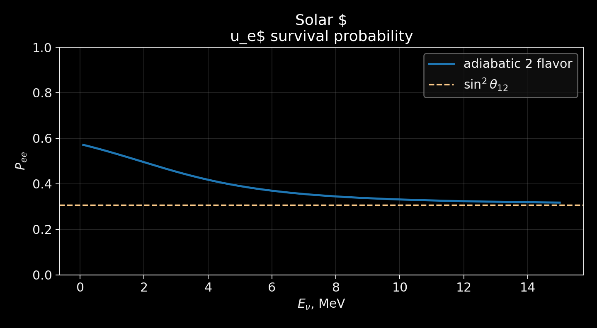
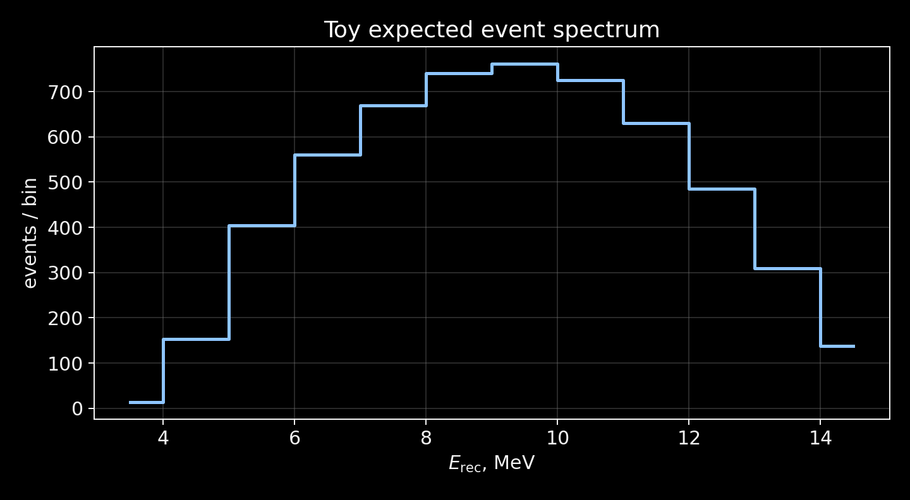
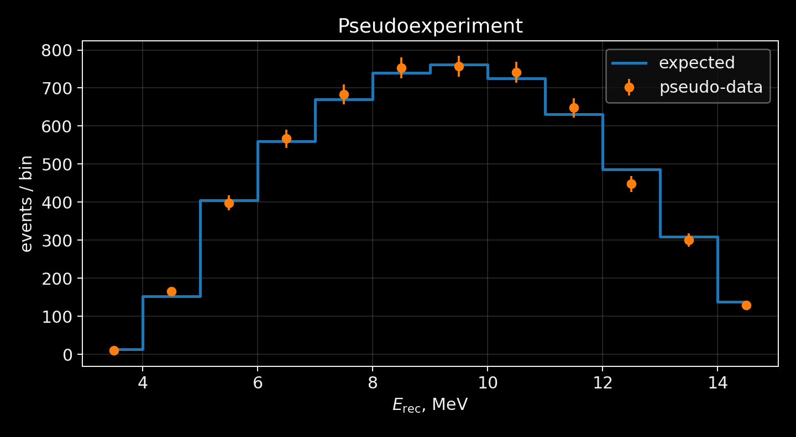
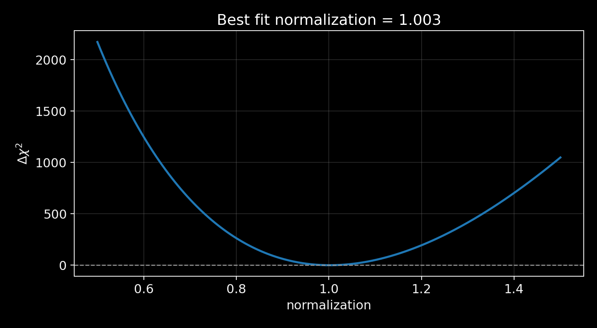
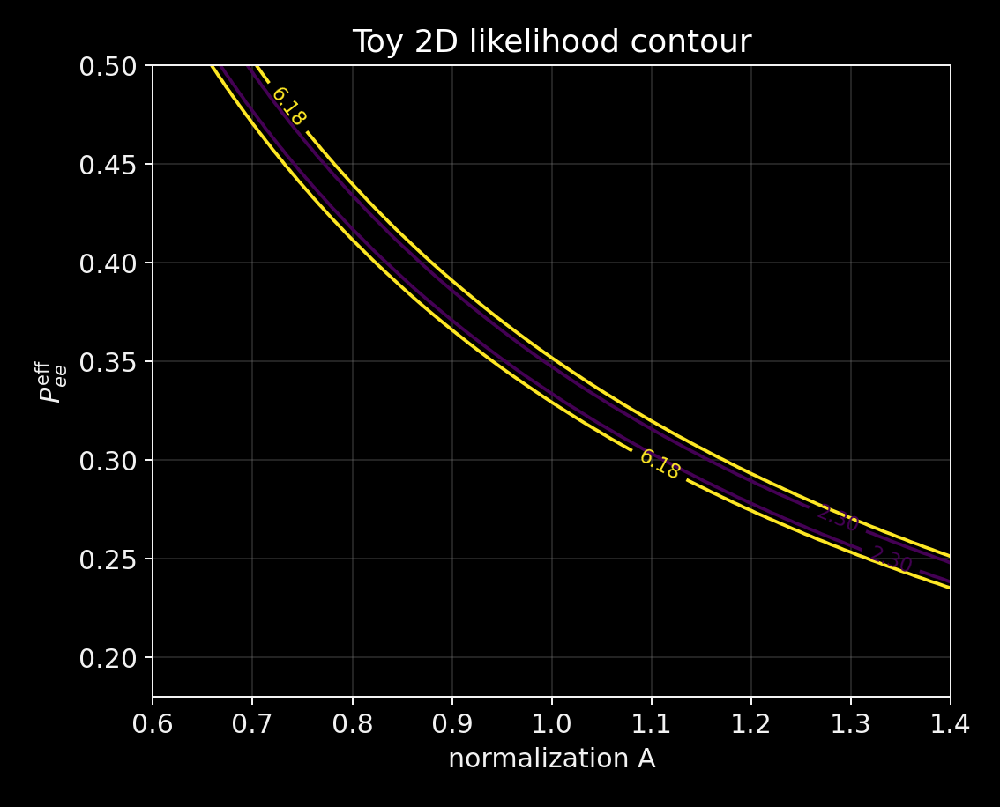

# Ориентация

## Что уже есть

После занятия 1 у нас есть:

::: {.compact}
- таблица потоков;
- toy \(^{8}\mathrm{B}\)-spectrum;
- toy electron density profile;
- energy grid for numerical work.
:::

Теперь нужно получить ожидаемый спектр событий.

## Цель занятия 2

Построить цепочку:

$$
\Phi_{^{8}\mathrm{B}}(E)
\to
P_{ee}(E)
\to
\mu_i
\to
n_i
\to
\chi^2(\theta).
$$

Итоговый обязательный результат:

::: {.compact}
- best-fit normalization;
- best-fit effective \(P_{ee}\);
- 1D confidence interval или 2D contour.
:::

# MSW

## Flavor evolution equation

Двухфлейворная эволюция:

$$
i\frac{d}{dx}\nu_f = H_f(x)\nu_f.
$$

Flavor basis:

$$
\nu_f =
\begin{pmatrix}
\nu_e\\
\nu_x
\end{pmatrix},
\qquad
\nu_x \approx \nu_\mu,\nu_\tau.
$$

## Vacuum Hamiltonian

$$
H_{\rm vac} =
\frac{\Delta m^2}{4E}
\begin{pmatrix}
-\cos2\theta & \sin2\theta \\
\sin2\theta & \cos2\theta
\end{pmatrix}.
$$

Для solar sector:

$$
\theta\approx\theta_{12},
\qquad
\Delta m^2\approx\Delta m^2_{21}.
$$

## Matter potential

Электронные нейтрино имеют дополнительный coherent forward scattering term:

$$
V_e(x)=\sqrt{2}G_F n_e(x).
$$

Для \(\nu_x\) общий neutral-current вклад сокращается в двухфлейворном описании.

## Full two-flavor Hamiltonian

$$
H_f =
\frac{\Delta m^2}{4E}
\begin{pmatrix}
-\cos2\theta & \sin2\theta \\
\sin2\theta & \cos2\theta
\end{pmatrix}
+
\begin{pmatrix}
V_e(x) & 0 \\
0 & 0
\end{pmatrix}.
$$

Единицы в `src/solar_neutrino/oscillations.py`:

::: {.compact}
- \(E\) in MeV;
- \(n_e\) in cm\(^{-3}\);
- \(V_e\) in eV.
:::

## Matter mixing angle

$$
\tan 2\theta_m =
\frac{\Delta m^2\sin2\theta}
{\Delta m^2\cos2\theta - 2EV_e}.
$$

Matter modifies the effective mixing angle, not the vacuum parameters themselves.

## Resonance condition

$$
2EV_e=\Delta m^2\cos2\theta.
$$

При этом:

$$
\theta_m = \frac{\pi}{4}.
$$

Для разных \(E_\nu\) resonance occurs at different electron densities.

## Physical interpretation

::: {.compact}
- Low-energy solar neutrinos: closer to vacuum averaged regime.
- High-energy \(^{8}\mathrm{B}\) neutrinos: MSW-dominated regime.
- При хорошей адиабатичности high-energy limit:
:::

$$
P_{ee}\sim \sin^2\theta_{12}.
$$

## Low-energy limit

Для vacuum averaged two-flavor oscillations:

$$
P_{ee}^{\rm low}
\simeq
1-\frac{1}{2}\sin^2 2\theta_{12}.
$$

Для \(\sin^2\theta_{12}\approx 0.31\):

$$
P_{ee}^{\rm low}\approx 0.57.
$$

## High-energy MSW limit

В адиабатическом high-density limit:

$$
P_{ee}^{\rm high}
\simeq
\sin^2\theta_{12}.
$$

Численно:

$$
P_{ee}^{\rm high}\approx 0.31.
$$

## Код: Hamiltonian

```python
import numpy as np

def hamiltonian_2flavor(E, ne, dm2, theta):
    # E in MeV, ne in cm^-3, result in eV
    c2 = np.cos(2 * theta)
    s2 = np.sin(2 * theta)
    E_eV = E * 1.0e6
    vacuum = dm2 / (4 * E_eV) * np.array(
        [[-c2, s2], [s2, c2]], dtype=complex
    )
    matter = np.array([[matter_potential(ne), 0], [0, 0]], dtype=complex)
    return vacuum + matter
```

## Код: survival probability grid

```python
import numpy as np
from solar_neutrino.oscillations import (
    OscillationParameters,
    compute_survival_probability_grid,
)

params = OscillationParameters()
E_grid = np.linspace(0.1, 15.0, 200)
Pee = compute_survival_probability_grid(E_grid, params)
```

## График \(P_{ee}(E)\)

{width="74%" .slide-image-center fig-alt="Two-flavor adiabatic survival probability"}

::: {.media-caption}
Используется adiabatic two-flavor toy approximation. Это учебный baseline, не полный глобальный solar fit.
:::

## Что достигает Земли

Детектор видит не исходный поток \(\nu_e\), а смесь flavor states:

$$
\Phi_e(E) = \Phi_{\rm source}(E)P_{ee}(E),
$$

$$
\Phi_x(E) = \Phi_{\rm source}(E)\left[1-P_{ee}(E)\right].
$$

В water Cherenkov detector \(\nu_x e\)-scattering тоже дает вклад, но меньший.

# Detector

## Detector sees events, not flux

Измеряемая величина:

::: {.compact}
- reconstructed energy;
- event count in bins;
- angular and timing cuts;
- backgrounds;
- systematic uncertainties.
:::

На мастер-классе оставляем только essentials.

## \(\nu e\)-scattering

Основной канал для SK-like solar analysis:

$$
\nu + e^- \to \nu + e^-.
$$

\(\nu_e\) имеет charged-current + neutral-current contribution.

\(\nu_{\mu,\tau}\) имеет только neutral-current contribution.

## Почему toy SK-like detector

::: {.toy}
Мы не делаем full Super-Kamiokande Monte Carlo. Detector response здесь нужен, чтобы увидеть переход от flux к event spectrum.
:::

Реальный анализ потребовал бы:

::: {.compact}
- detector calibration;
- backgrounds;
- fiducial volume;
- angular response;
- covariance matrices.
:::

## Учебная rate formula

$$
N_i =
N_e T
\int_{E_i}^{E_{i+1}} dE_{\rm rec}
\int dE_\nu\,
\Phi(E_\nu)
P_{ee}(E_\nu)
\frac{d\sigma}{dT_e}
R(E_{\rm rec},T_e)
\epsilon(E_{\rm rec}).
$$

## Упрощенная формула

Для базового кода:

$$
N_i =
A
\int_{E_i}^{E_{i+1}} dE\,
\Phi_{^{8}\mathrm{B}}(E)
P_{ee}(E)
\sigma(E)
\epsilon(E).
$$

Здесь \(A\) включает exposure, число электронов и перевод единиц.

## Toy cross-section

```python
def toy_cross_section(E):
    return E
```

В package:

```python
from solar_neutrino.cross_sections import (
    nu_e_elastic_toy,
    nu_mu_elastic_toy,
)
```

::: {.toy}
Сечения пропорциональны энергии и заданы в arbitrary units.
:::

## Efficiency

```python
def detector_efficiency(E):
    return 1 / (1 + np.exp(-(E - 4.5) / 0.4))
```

Порог около 4.5 MeV задает, какая часть \(^{8}\mathrm{B}\)-spectrum реально участвует в анализе.

## Energy resolution

```python
def energy_resolution_sigma(E):
    return 0.15 * np.sqrt(E)
```

Смысл:

::: {.compact}
- true electron energy не равна reconstructed energy;
- узкие features размываются;
- bins становятся correlated in real detector response.
:::

## Expected event spectrum

```python
from solar_neutrino.detector import efficiency, expected_events
from solar_neutrino.cross_sections import nu_e_elastic_toy

expected = expected_events(
    E_bins,
    flux=flux_centers,
    pee=pee_centers,
    cross_section=nu_e_elastic_toy(E_centers) * efficiency(E_centers),
    exposure=exposure,
)
```

## График expected spectrum

{width="74%" .slide-image-center fig-alt="Expected event spectrum"}

::: {.media-caption}
Форма определяется product: spectrum \(\times\) survival probability \(\times\) cross-section \(\times\) efficiency.
:::

## Background model

Минимально:

$$
\mu_i = s_i + b_i.
$$

В базовой задаче можно взять:

::: {.compact}
- \(b_i=0\);
- constant background;
- exponential background для threshold region.
:::

Advanced task: проверить, как best fit меняется при добавлении фона.

# Pseudoexperiment

## Псевдоданные

```python
import numpy as np

rng = np.random.default_rng(12345)
observed = rng.poisson(expected)
```

В package:

```python
from solar_neutrino.pseudoexperiment import generate_poisson_data
```

## Expected vs observed

{width="76%" .slide-image-center fig-alt="Expected and pseudo-observed events"}

::: {.media-caption}
Разброс между точками и template является Poisson fluctuation.
:::

## Poisson chi-square

$$
\chi^2(\theta)=
2\sum_i
\left[
\mu_i(\theta)-n_i+n_i\ln\frac{n_i}{\mu_i(\theta)}
\right].
$$

Для \(n_i=0\) логарифмический член берется равным нулю:

$$
n_i\ln(n_i/\mu_i)\to 0.
$$

## Fit normalization

```python
from solar_neutrino.fit import scan_normalization, find_best_fit

norm_grid = np.linspace(0.5, 1.5, 301)
scan = scan_normalization(observed, template, norm_grid)
best = find_best_fit(scan)
```

Результат:

```text
best-fit normalization
```

## \(\chi^2\)-scan

{width="74%" .slide-image-center fig-alt="One-dimensional chi-square scan"}

::: {.media-caption}
Для одного параметра \(\Delta\chi^2=1\) дает approximate 68% interval.
:::

## Fit effective \(P_{ee}\)

Можно заменить energy-dependent \(P_{ee}(E)\) на один параметр:

$$
\mu_i(P_{ee}^{\rm eff}) =
A \int_i dE\,\Phi(E)\,P_{ee}^{\rm eff}\sigma(E)\epsilon(E).
$$

Это грубая, но полезная проверка detector/statistics pipeline.

## Optional 2D scan

Для сильных студентов:

$$
\sin^2\theta_{12}
\quad\text{and}\quad
\Delta m^2_{21}.
$$

Или более простой 2D scan:

$$
A
\quad\text{and}\quad
P_{ee}^{\rm eff}.
$$

## Contour

{width="62%" .slide-image-center fig-alt="Two-parameter contour"}

::: {.media-caption}
Контур показывает degeneracy between normalization and effective survival probability in a toy model.
:::

# Работа команд

## Команда A: MSW

Задания:

::: {.compact}
1. Построить \(P_{ee}(E)\).
2. Показать low-energy и high-energy limits.
3. Изменить \(\theta_{12}\) и показать влияние на график.
4. Подготовить один слайд с физическим выводом.
:::

## Команда B: detector response

Задания:

::: {.compact}
1. Взять \(^{8}\mathrm{B}\)-spectrum.
2. Применить \(P_{ee}(E)\).
3. Применить toy cross-section and efficiency.
4. Получить expected spectrum.
5. Исследовать влияние energy threshold.
:::

## Команда C: pseudoexperiment/statistics

Задания:

::: {.compact}
1. Сгенерировать псевдоданные.
2. Реализовать Poisson chi-square.
3. Найти best fit.
4. Построить contour.
5. Проверить влияние exposure или background.
:::

## Если команд две

Команда A:

::: {.compact}
- Sun inputs;
- MSW survival probability;
- physical interpretation.
:::

Команда B:

::: {.compact}
- detector response;
- pseudoexperiment;
- fit and confidence interval.
:::

# Сверка

## Checkpoint

К концу занятия 2 должны быть готовы:

::: {.compact}
- \(P_{ee}(E)\) plot;
- expected event spectrum;
- pseudo-data plot;
- \(\chi^2\)-scan или contour;
- численный best fit.
:::

## Что подготовить к защите

Каждая команда выбирает один главный результат:

::: {.compact}
- главный график;
- формула, которая объясняет график;
- короткий фрагмент кода;
- toy assumptions;
- следующий шаг к realistic analysis.
:::

## Переход к занятию 3

На защите важно не количество графиков, а связность:

$$
\text{physics question}
\to
\text{model}
\to
\text{code}
\to
\text{plot}
\to
\text{numerical result}
\to
\text{limitations}.
$$
