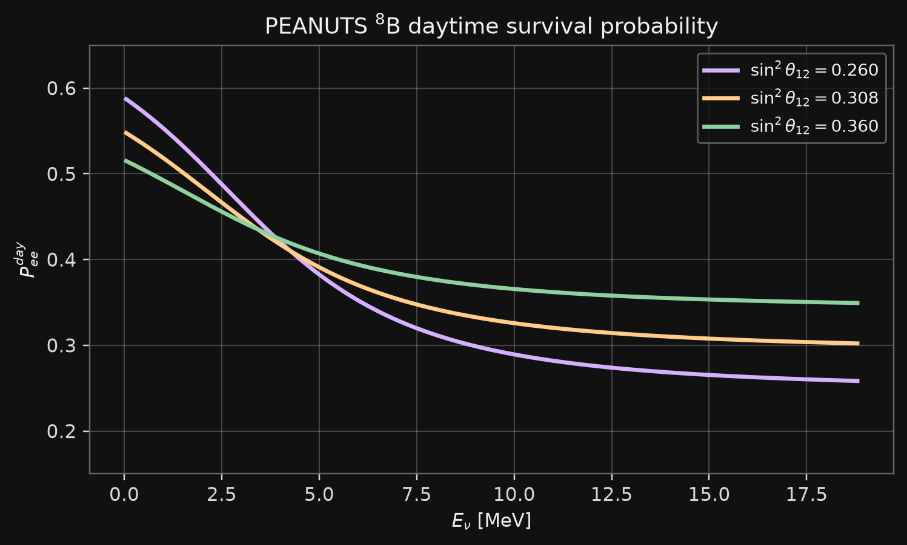
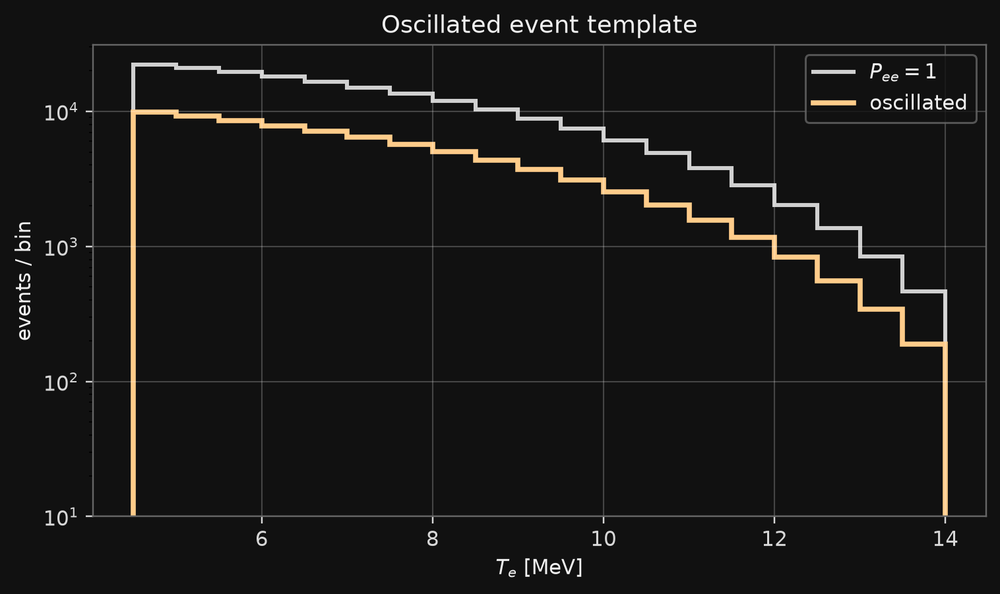
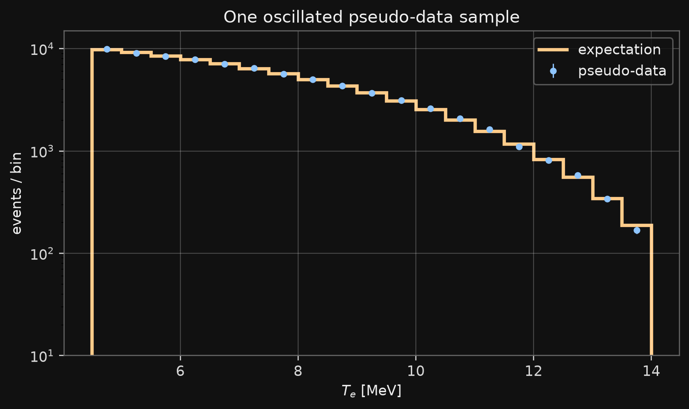
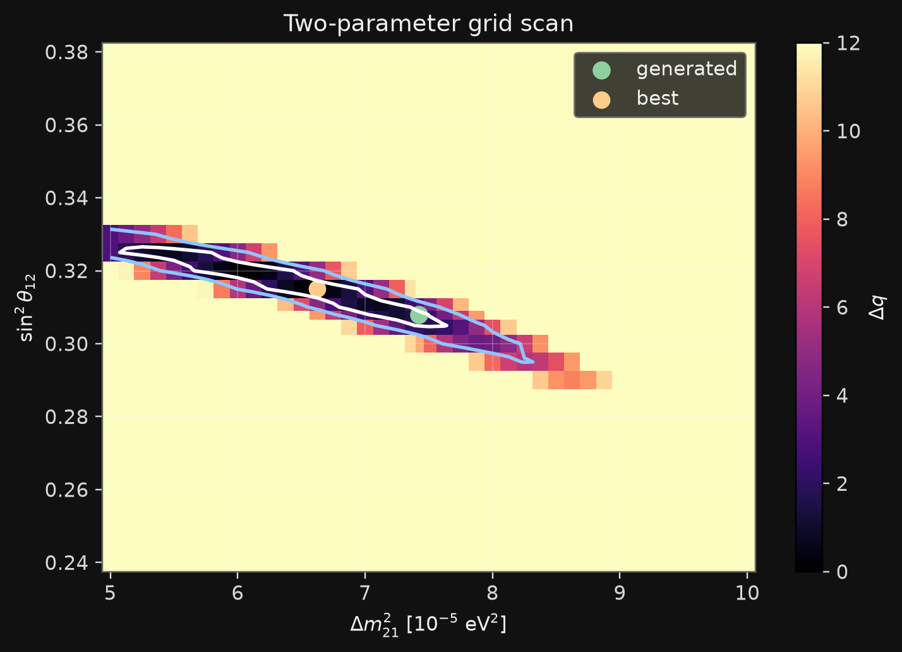
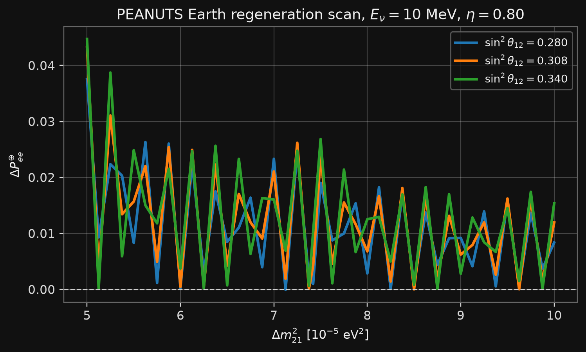

# Tasks

## Goal for This Session

Masterclass 1 built the no-oscillation chain:

$$
\Phi_{^8\mathrm{B}} f_{^8\mathrm{B}}(E_\nu)
\to
\frac{dN}{dT_e}.
$$

Today we add oscillations and fit two parameters:

$$
\Phi_{^8\mathrm{B}} f_{^8\mathrm{B}}(E_\nu)
\to
P_{ee}(E_\nu)
\to
\mu_j(\theta)
\to
n_j
\to
q(\theta).
$$

## Fit Parameters

Use

$$
\theta
=
\left(
\sin^2\theta_{12},
\Delta m^2_{21}
\right).
$$

The main fit keeps the $^8\mathrm{B}$ normalization fixed:

$$
\alpha_B=1.
$$

The floating-normalization case is a homework extension.

## Main Output

The notebook must produce:

::: {.compact}
- $P_{ee}^{day}(E_\nu)$ for several parameter points;
- oscillated SK-like recoil spectrum;
- pseudo-data in recoil-energy bins;
- best-fit point in $(\sin^2\theta_{12},\Delta m^2_{21})$;
- 2D contour and 1D profile checks.
:::

# Inputs

## Project Page

:::: {.columns}

::: {.column width=34%}
{fig-align="center" width="95%"}
:::

::: {.column width=66%}

Project page:

```{=html}
<div style="font-family: monospace; font-size: 0.70em; line-height: 1.25;">
https://neutrinohit.github.io/neutrinophysics/<br>
solar-neutrino-masterclass/
</div>
```

Tables used today:

```text
data/masterclass2/solar_fluxes.csv
data/masterclass2/energy_spectra.csv
data/masterclass2/nu_electron_recoil_cross_sections.csv
data/masterclass2/oscillation_probabilities_grid.csv
data/masterclass2/earth_regeneration_grid.csv
data/masterclass2/earth_regeneration_parameter_scan.csv
```

:::

::::

## Load the Tables

```python
import numpy as np
import pandas as pd

BASE = "https://neutrinohit.github.io/neutrinophysics/solar-neutrino-masterclass"

fluxes = pd.read_csv(f"{BASE}/data/masterclass2/solar_fluxes.csv")
spectra = pd.read_csv(f"{BASE}/data/masterclass2/energy_spectra.csv")
xs = pd.read_csv(f"{BASE}/data/masterclass2/nu_electron_recoil_cross_sections.csv")
osc = pd.read_csv(f"{BASE}/data/masterclass2/oscillation_probabilities_grid.csv")
earth = pd.read_csv(f"{BASE}/data/masterclass2/earth_regeneration_grid.csv")
earth_scan = pd.read_csv(f"{BASE}/data/masterclass2/earth_regeneration_parameter_scan.csv")
```

The same archive is also available as:

```text
data/masterclass2/masterclass2_data.zip
```

## PEANUTS Grids

The oscillation tables are not analytic approximations.

They were generated with PEANUTS for $^8\mathrm{B}$ neutrinos:

::: {.compact}
- `oscillation_probabilities_grid.csv`: $P_{ee}^{day}(E_\nu;\sin^2\theta_{12},\Delta m^2_{21})$;
- `earth_regeneration_grid.csv`: $P_{ee}^{night}(E_\nu,\eta)-P_{ee}^{day}(E_\nu)$ at reference parameters;
- `earth_regeneration_parameter_scan.csv`: the same Earth correction at selected $E_\nu$ and $\eta$ values while scanning $(\sin^2\theta_{12},\Delta m^2_{21})$;
:::

The day-night material is optional today.

Details are in the lecture appendix:

```{=html}
<a href="00_solar_neutrino_physics_appendix.html#/earth-matter">Earth Matter appendix</a>
```

## Grid Check

Required columns:

```text
E_MeV
sin2theta12
dm21_eV2
Pee_day
```

Expected checks:

```python
print(len(osc), len(earth), len(earth_scan))
print(osc["sin2theta12"].min(), osc["sin2theta12"].max())
print(osc["dm21_eV2"].min(), osc["dm21_eV2"].max())
```

```text
236880 1504 18900
0.24 0.38
5.0e-05 0.0001
```

# Oscillation Model

## Daytime Survival Probability

Use the PEANUTS table as a function:

$$
P_{ee}^{day}
=
P_{ee}^{day}
\left(
E_\nu;\sin^2\theta_{12},\Delta m^2_{21}
\right).
$$

{fig-align="center" width="68%"}

## Select a Parameter Point

Reference point:

$$
\sin^2\theta_{12}=0.308,
\qquad
\Delta m^2_{21}=7.42\times10^{-5}\ \mathrm{eV^2}.
$$

```python
sin2_ref = 0.308
dm21_ref = 7.42e-5

pee_ref_table = osc[
    np.isclose(osc["sin2theta12"], sin2_ref)
    & np.isclose(osc["dm21_eV2"], dm21_ref)
].sort_values("E_MeV")
```

## Interpolate $P_{ee}$

The cross-section table is rectangular in $(E_\nu,T_e)$.

Interpolate $P_{ee}$ onto the same $E_\nu$ rows:

```python
pee = np.interp(
    xs["E_MeV"],
    pee_ref_table["E_MeV"],
    pee_ref_table["Pee_day"],
    left=pee_ref_table["Pee_day"].iloc[0],
    right=pee_ref_table["Pee_day"].iloc[-1],
)
```

Check:

```python
print(pee.min(), pee.max())
```

## Effective Cross Section

The detector sees recoil electrons.

For each row $(E_\nu,T_e)$ use

$$
\frac{d\sigma_{\mathrm{eff}}}{dT_e}
=
P_{ee}\frac{d\sigma_{\nu_e e}}{dT_e}
+
(1-P_{ee})\frac{d\sigma_{\nu_x e}}{dT_e}.
$$

Here $\nu_x$ means $\nu_\mu$ or $\nu_\tau$.

The $\nu_e e$ cross section is larger because it has both charged-current and neutral-current contributions.
The coupling constants are summarized in the appendix:

```{=html}
<a href="00_solar_neutrino_physics_appendix.html#/elastic-scattering-cross-section">Elastic Scattering Cross Section</a>
```

# Event Rate

## Prediction Formula

For recoil-energy bin $j$,

$$
\mu_j(\theta)
=
N_eT_{\rm live}
\int_{T_j}^{T_{j+1}} dT_e
\int dE_\nu\,
\Phi_{^8\mathrm{B}}f_{^8\mathrm{B}}(E_\nu)
\frac{d\sigma_{\mathrm{eff}}}{dT_e}.
$$

In the table calculation, this is again a sum of row weights.

## Build the Template

```python
phi_b8 = float(fluxes.loc[fluxes["source"] == "B8", "flux_cm2_s"].iloc[0])
b8 = spectra.loc[spectra["source"] == "B8"].sort_values("E_MeV")

shape = np.interp(xs["E_MeV"], b8["E_MeV"], b8["spectrum_per_MeV"], left=0.0, right=0.0)
xs = xs.assign(dphi_dE=phi_b8 * shape)

effective_xs = (
    pee * xs["dsigma_nue_cm2_per_MeV"]
    + (1.0 - pee) * xs["dsigma_nux_cm2_per_MeV"]
)
```

## Bin the Template

```python
N_A = 6.02214076e23
seconds_per_year = 365.25 * 24 * 3600
N_e = 10.0 * N_A * 100.0e9 / 18.0
T_live = seconds_per_year

E_grid = np.sort(xs["E_MeV"].unique())
T_grid = np.sort(xs["T_e_MeV"].unique())
dE = np.median(np.diff(E_grid))
dT = np.median(np.diff(T_grid))

edges = np.arange(4.5, 14.0 + 0.25, 0.5)
bin_id = np.digitize(xs["T_e_MeV"], edges) - 1
valid = (0 <= bin_id) & (bin_id < len(edges) - 1)
```

## Bin the Template

```python
weights = (
    N_e * T_live
    * xs["dphi_dE"]
    * effective_xs
    * dE * dT
)

m = np.bincount(
    bin_id[valid],
    weights=weights[valid],
    minlength=len(edges) - 1,
)
```

## Prediction Function

Use one function for every parameter point:

```python
def prediction_from_pee(pee):
    effective_xs = (
        pee * xs["dsigma_nue_cm2_per_MeV"]
        + (1.0 - pee) * xs["dsigma_nux_cm2_per_MeV"]
    )
    weights = (
        N_e * T_live
        * xs["dphi_dE"]
        * effective_xs
        * dE * dT
    )
    return np.bincount(
        bin_id[valid],
        weights=weights[valid],
        minlength=len(edges) - 1,
    )

m = prediction_from_pee(pee)
m_noosc = prediction_from_pee(np.ones_like(pee))
```

## Template Checks

Expected checks:

```text
no-oscillation total = 186693.543
oscillated expected total = 80130.365
```

## Plot the Template

:::: {.columns}

::: {.column width=45%}

The oscillated spectrum is lower than the no-oscillation spectrum, but not simply by a constant factor.

That shape difference is what the fit uses.

Expected first bins:

```text
4.5 5.0 9863.1
5.0 5.5 9211.5
5.5 6.0 8534.9
```

:::

::: {.column width=55%}
{fig-align="center" width="100%"}
:::

::::

# Pseudo-Data

## Generate Pseudo-Data

Generate counts in the same bins:

```python
rng = np.random.default_rng(24680)
n = rng.poisson(m)
print(m.sum(), n.sum())
```

Expected output:

```text
80130.365 79968
```

:::: {.columns}

::: {.column width=46%}

Use the same binning for data and prediction.

Do not rebin after generating pseudo-data.

:::

::: {.column width=54%}
{fig-align="center" width="100%"}
:::

::::

# Fit

## Poisson Statistic

For a parameter point $\theta$ compute $\mu_j(\theta)$.

Use

$$
q(\theta)
=
2\sum_j
\left[
\mu_j(\theta)-n_j
+
n_j\ln\frac{n_j}{\mu_j(\theta)}
\right].
$$

Then subtract the minimum:

$$
\Delta q(\theta)=q(\theta)-q_{\min}.
$$

```python
def poisson_q(n, mu):
    mu = np.maximum(mu, 1e-300)
    terms = mu.copy()
    mask = n > 0
    terms[mask] = mu[mask] - n[mask] + n[mask] * np.log(n[mask] / mu[mask])
    return 2.0 * np.sum(terms)
```

## Grid Scan

Loop over the PEANUTS grid:

```python
scan_rows = []

for sin2 in np.sort(osc["sin2theta12"].unique()):
    for dm21 in np.sort(osc["dm21_eV2"].unique()):
        table = osc[
            np.isclose(osc["sin2theta12"], sin2)
            & np.isclose(osc["dm21_eV2"], dm21)
        ].sort_values("E_MeV")

        pee = np.interp(xs["E_MeV"], table["E_MeV"], table["Pee_day"])
        mu = prediction_from_pee(pee)
        q = poisson_q(n, mu)
        scan_rows.append((sin2, dm21, q))
```

## Best Fit

```python
scan = pd.DataFrame(scan_rows, columns=["sin2theta12", "dm21_eV2", "q"])
scan["Delta_q"] = scan["q"] - scan["q"].min()

best = scan.loc[scan["q"].idxmin()]
print(best)
```

Expected output for the supplied pseudo-data:

```text
best sin2theta12 = 0.31500
best dm21 = 6.625000e-05 eV^2
```

The generated point is still

$$
\sin^2\theta_{12}=0.308,
\qquad
\Delta m^2_{21}=7.42\times10^{-5}\ \mathrm{eV^2}.
$$

## Two-Dimensional Contour

For two fitted parameters, draw:

$$
\Delta q = 2.30,
\qquad
\Delta q = 6.18.
$$

{fig-align="center" width="58%"}

For the supplied pseudo-data, the approximate $68\%$ grid range is:

```text
sin2theta12 = 0.305 ... 0.325
dm21_1e5   = 5.12 ... 7.62
```

## One-Dimensional Profiles

A 1D profile is not a slice.

For $\sin^2\theta_{12}$:

$$
\Delta q_{\rm prof}(\sin^2\theta_{12})
=
\min_{\Delta m^2_{21}}
\Delta q(\sin^2\theta_{12},\Delta m^2_{21}).
$$

For $\Delta m^2_{21}$:

$$
\Delta q_{\rm prof}(\Delta m^2_{21})
=
\min_{\sin^2\theta_{12}}
\Delta q(\sin^2\theta_{12},\Delta m^2_{21}).
$$

Use $\Delta q_{\rm prof}=1$ for the usual one-parameter interval.

# Day-Night Optional

## Earth Regeneration Table

If time permits, inspect:

```text
data/masterclass2/earth_regeneration_grid.csv
```

It contains PEANUTS values of

$$
\Delta P_{ee}^{\oplus}(E_\nu,\eta)
=
P_{ee}^{night}(E_\nu,\eta)
-
P_{ee}^{day}(E_\nu)
$$

at the reference oscillation parameters.

The explanation is in:

```{=html}
<a href="00_solar_neutrino_physics_appendix.html#/earth-matter">Earth Matter appendix</a>
```

## Why a Fixed Reference Table?

The fixed-reference table is for the shape of the effect:

$$
\Delta P_{ee}^{\oplus}(E_\nu,\eta)
\quad\hbox{as a function of energy and nadir angle.}
$$

It answers:

::: {.compact}
- where the Earth effect is large;
- how it changes with neutrino energy;
- which nadir angles matter.
:::

It does not answer parameter sensitivity.

## Parameter Scan

For parameter sensitivity use:

```text
data/masterclass2/earth_regeneration_parameter_scan.csv
```

This table scans

$$
\Delta P_{ee}^{\oplus}
\left(E_\nu,\eta;\sin^2\theta_{12},\Delta m^2_{21}\right)
$$

at selected energies and nadir angles.

{fig-align="center" width="62%"}

## Parameter-Scan Check

Example:

```python
view = earth_scan[
    np.isclose(earth_scan["E_MeV"], 10.0)
    & np.isclose(earth_scan["eta_rad"], 0.80)
]

for sin2, group in view.groupby("sin2theta12"):
    if np.any(np.isclose(sin2, [0.28, 0.308, 0.34])):
        plt.plot(group["dm21_1e5_eV2"], group["delta_Pee_earth"], label=sin2)
```

Use this table to ask whether a day-night measurement helps $\Delta m^2_{21}$.

## Day-Night Check

Plot the Earth correction for several nadir angles:

```python
for eta, group in earth.groupby("eta_rad"):
    plt.plot(group["E_MeV"], group["delta_Pee_earth"], label=f"eta={eta:.2f}")

plt.axhline(0.0, color="black", lw=0.8)
plt.xlabel(r"$E_\nu$ [MeV]")
plt.ylabel(r"$\Delta P_{ee}^{\oplus}$")
plt.legend()
plt.show()
```

This is not required for the main two-parameter fit.

# Homework

## Computational Part

Finish the notebook:

::: {.compact}
- reproduce the oscillated event spectrum;
- generate one pseudo-data sample;
- scan $(\sin^2\theta_{12},\Delta m^2_{21})$;
- draw the 2D contour;
- draw both 1D profiles;
:::

## Fit Checks

Repeat the fit for:

::: {.compact}
- a lower threshold, $T_{\min}=3~\mathrm{MeV}$;
- a higher threshold, $T_{\min}=6~\mathrm{MeV}$;
- a coarser and a finer recoil-energy binning.
:::

Report which change matters most.


## Day-Night Extension

Use `earth_regeneration_parameter_scan.csv` to study:

::: {.compact}
- the size of $\Delta P_{ee}^{\oplus}$;
- its dependence on $\Delta m^2_{21}$;
- whether the effect is larger at some energies or nadir angles;
- whether adding a day-night observable would improve the fit.
:::

## Theory Part

Prepare short answers:

::: {.compact}
- why the high-energy solar limit gives $P_{ee}\simeq \sin^2\theta_{12}$;
- why SK-like data are sensitive to $\sin^2\theta_{12}$;
- why $\Delta m^2_{21}$ is harder without day-night information;
- what Earth regeneration means physically.
:::
